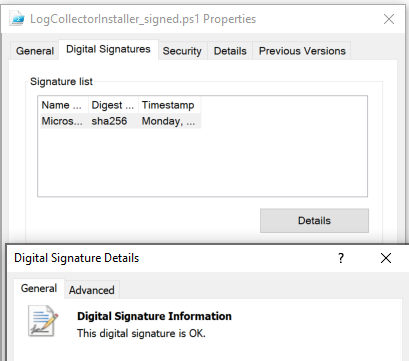
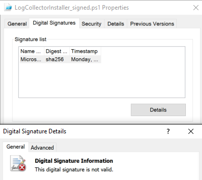

# Configure automatic log upload using on-premises Docker on Windows

You can configure automatic log upload for continuous reports in Defender for Cloud Apps using a Docker on Windows.

## Prerequisites

- **Architecture specifications**:

    |Specification  |Description  |
    |---------|---------|
    |**Operating system**     |  One of the following:  <li> Windows 10 (Fall creators update) <li> Windows Server version 1709+ (SAC) <li> Windows Server 2019 (LTSC)       |
    |**Disk space**     |    250 GB     |
    |**CPU cores**     |    2     |
    |**CPU architecture**     |  Intel 64 and AMD 64       |
    |**RAM**     |    4 GB     |

    For a list of supported Docker architectures, see [Docker installation documentation](https://docs.docker.com/engine/install/).

- **Set your firewall** as needed. For more information, see [Network requirements](network-requirements.md#log-collector).

- **Virtualization** on the operating system must be enabled with Hyper-V.

> [!IMPORTANT]
>
> * Enterprise customers with more than 250 users or more than $10 million USD in annual revenue require a paid subscription to use Docker Desktop for Windows. For more information, see [Docker subscription overview](https://docs.docker.com/subscription/).
> * A user must be signed in for Docker to collect logs. We recommend advising your Docker users to disconnect without signing out.
> * Docker for Windows is not officially supported in VMWare virtualization scenarios.
> * Docker for Windows is not officially supported in nested virtualization scenarios. If you still plan to use nested virtualization, refer to [Docker's official guide](https://docs.docker.com/docker-for-windows/troubleshoot/#running-docker-desktop-in-nested-virtualization-scenarios).
> * For information about additional configuration and implementation considerations for Docker for Windows, see [Install Docker Desktop on Windows](https://docs.docker.com/desktop/windows/install/).


## Remove an existing log collector

If you have an existing log collector and want to remove it before deploying it again, or if you simply want to remove it, run the following commands:

```console
docker stop <collector_name>
docker rm <collector_name>
```

## Log collector performance

The log collector can successfully handle log capacity of up to 50 GB per hour. The main bottlenecks in the log collection process are:

* Network bandwidth - Your network bandwidth determines the log upload speed.

* I/O performance of the virtual machine - Determines the speed at which logs are written to the log collector's disk. The log collector has a built-in safety mechanism that monitors the rate at which logs arrive and compares it to the upload rate. In cases of congestion, the log collector starts to drop log files. If your setup typically exceeds 50 GB per hour, it's recommended that you split the traffic between multiple log collectors.

## Step 1 – Web portal configuration

Use the following steps to define your data sources and link them to a log collector. A single log collector can handle multiple data sources.

1. In the Microsoft Defender portal, select **Settings** > **Cloud Apps** > **Cloud Discovery** > **Automatic log upload** > **Data sources** tab.

1. For each firewall or proxy from which you want to upload logs, create a matching data source:

    1. Select **+Add data source**.  

        

    1. **Name** your proxy or firewall.  

        

    1. Select the appliance from the **Source** list. If you select **Custom log format** to work with a network appliance that isn't listed, see [Working with the custom log parser](custom-log-parser.md) for configuration instructions.

    1. Compare your log with the sample of the expected log format. If your log file format doesn't match this sample, you should add your data source as **Other**.

    1. Set the **Receiver type** to either **FTP**, **FTPS**, **Syslog – UDP**, or **Syslog – TCP**, or **Syslog – TLS**.

        > [!NOTE]
        > Integrating with secure transfer protocols (FTPS and Syslog – TLS) often requires additional settings for your firewall/proxy.

    1. Repeat this process for each firewall and proxy whose logs can be used to detect traffic on your network. We recommend that you set up a dedicated data source per network device to enable you to:

        * Monitor the status of each device separately, for investigation purposes.
        * Explore Shadow IT Discovery per device, if each device is used by a different user segment.

1. At the top of the page, select the **Log collectors** tab and then select **Add log collector**.

1. In the **Create log collector** dialog:

    1. In the **Name** field, enter a meaningful name for your log collector.

    1. Give the log collector a **name** and enter the **Host IP address** (private IP address) of the machine you'll use to deploy the Docker. The host IP address can be replaced with the machine name, if there's a DNS server (or equivalent) that will resolve the host name.

    1. Select all **Data sources** that you want to connect to the collector, and select **Update** to save the configuration.

        Further deployment information appears in the **Next steps** section, including a command you'll use later to import the collector configuration. If you selected Syslog, this information also includes data about which port the Syslog listener is listening on.

    1. Use the  **Copy** button to copy the command to the clipboard and save it to a separate location.

    1. Use the  **Export** button to export the expected data source configuration. This configuration describes how you should set the log export in your appliances.

For users sending log data via FTP for the first time, we recommend changing the password for the FTP user. For more information, see [Changing the FTP password](log-collector-advanced-management.md#change-the-ftp-password).


## Step 2 – On-premises deployment of your machine

The following steps describe the deployment in Windows. The deployment steps for other platforms are slightly different.

1. Open a PowerShell terminal as an administrator on your Windows machine.

1. Run the following command to download the Windows Docker installer PowerShell script file: 

    ```powershell
    Invoke-WebRequest https://adaprodconsole.blob.core.windows.net/public-files/LogCollectorInstaller.ps1 -OutFile (Join-Path $Env:Temp LogCollectorInstaller.ps1)
    ```

    To validate that the installer is signed by Microsoft, see [Validate installer signature](#optional---validate-installer-signature).

1. To enable PowerShell script execution, run:

    ```powershell
    Set-ExecutionPolicy RemoteSigned`
    ```

1. To install the Docker client on your machine, run: 

    ```powershell
    & (Join-Path $Env:Temp LogCollectorInstaller.ps1)`
    ```

    The machine automatically restarts after you run the command.

1. When the machine is up and running again, run the same command again:

    ```powershell
    & (Join-Path $Env:Temp LogCollectorInstaller.ps1)`
    ```

1. Run the Docker installer, selecting to use WSL 2 instead of Hyper-V.

    After the installation is completed, the machine automatically restarts again.

1. After the restart is completed, open the Docker client and accept the Docker subscription agreement.

1. If the WSL2 installation isn't completed, a message shows to indicate that the WSL 2 Linux kernel is installed using a separate MSI update package. 

1. Complete the installation by downloading the package. For more information, see [Download the Linux kernel update package](/windows/wsl/install-manual).

1. Open the Docker Desktop client again and make sure that it has started.

1. Open a command prompt as an administrator and enter the run command you'd copied earlier from the portal in [Step 1 – Web portal configuration](#step-1--web-portal-configuration). 

    If you need to configure a proxy, add the proxy IP address and port number. For example, if your proxy details are 172.31.255.255:8080, your updated run command is:

    ```console
    (echo db3a7c73eb7e91a0db53566c50bab7ed3a755607d90bb348c875825a7d1b2fce) | docker run --name MyLogCollector -p 21:21 -p 20000-20099:20000-20099 -e "PUBLICIP='10.255.255.255'" -e "PROXY=172.31.255.255:8080" -e "CONSOLE=mod244533.us.portal.cloudappsecurity.com" -e "COLLECTOR=MyLogCollector" --security-opt apparmor:unconfined --cap-add=SYS_ADMIN --restart unless-stopped -a stdin -i mcr.microsoft.com/mcas/logcollector starter
    ```

1. To verify that the collector is running properly, run:

    ```bash
    docker logs <collector_name>
    ```

    You should see the message: **Finished successfully!** For example:

    

## Step 3 - On-premises configuration of your network appliances

Configure your network firewalls and proxies to periodically export logs to the dedicated Syslog port of the FTP directory according to the directions in the dialog. For example:

```console
BlueCoat_HQ - Destination path: \<<machine_name>>\BlueCoat_HQ\
```

## Step 4 - Verify the successful deployment in the portal

Check the collector status in the **log collector** table and make sure the status is **Connected**. If it's **Created**, it's possible the log collector connection and parsing haven't completed.

:::image type="content" source="media/collector-status-connected.png" alt-text="Verify that the collector status is Connected." lightbox="media/collector-status-connected.png":::

You can also go to the **Governance log** and verify that logs are being periodically uploaded to the portal.

Alternatively, you can check the log collector status from within the docker container using the following commands:

1. Sign in to the container:

    ```bash
    docker exec -it <Container Name> bash
    ```

1. Verify the log collector status:

    ```bash
    collector_status -p
    ```

If you have problems during deployment, see [Troubleshooting cloud discovery](troubleshooting-cloud-discovery.md).

## Optional - Create custom continuous reports

Verify that the logs are being uploaded to Defender for Cloud Apps and that reports are generated. After verification, create custom reports. You can create custom discovery reports based on Microsoft Entra user groups. For example, if you want to see the cloud use of your marketing department, import the marketing group using the import user group feature. Then create a custom report for this group. You can also customize a report based on IP address tag or IP address ranges.

1. In the Microsoft Defender portal, select **Settings** > **Cloud Apps** > **Cloud Discovery** > **Continuous reports**.

1. Select the **Create report** button and fill in the fields.

1. Under the **Filters** you can filter the data by data source, by [imported user group](user-groups.md), or by [IP address tags and ranges](ip-tags.md).

    >[!NOTE]
    >When applying filters on continuous reports, the selection will be included, not excluded. For example, if you apply a filter on a certain user group, only that user group will be included in the report.

    

## Optional - Validate installer signature

To make sure that the docker installer is signed by Microsoft:

1. Right-click on the file and select **Properties**.
1. Select **Digital Signatures** and make sure that it says **This digital signature is OK**.
1. Make sure that **Microsoft Corporation** is listed as the sole entry under **Name of signer**.

    

    If the digital signature isn't valid, it will say **This digital signature is not valid**:

    

## Next steps

> [!div class="nextstepaction"]
> [Modify the log collector FTP configuration](log-collector-advanced-management.md)

[!INCLUDE [Open support ticket](includes/support.md)]
