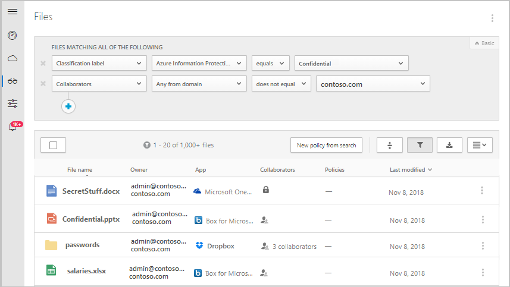
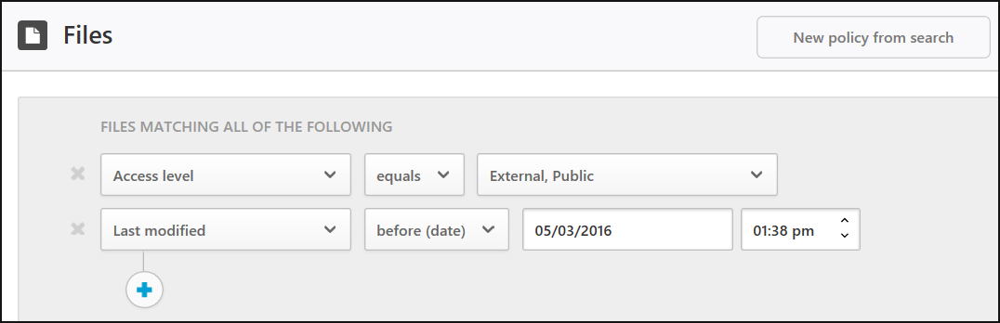
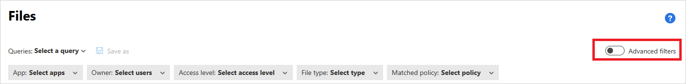
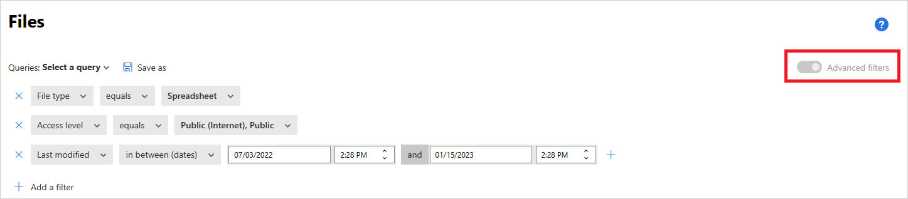
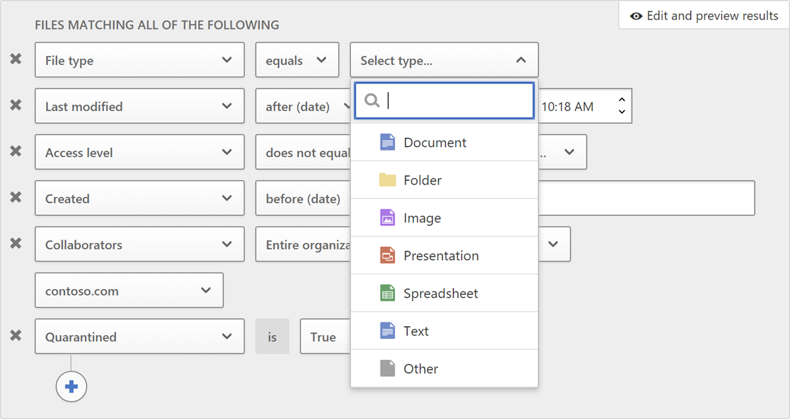
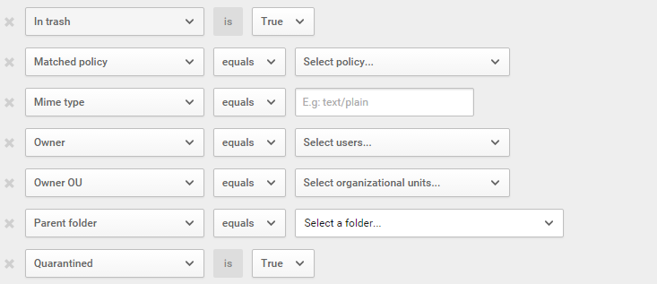
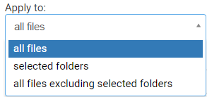
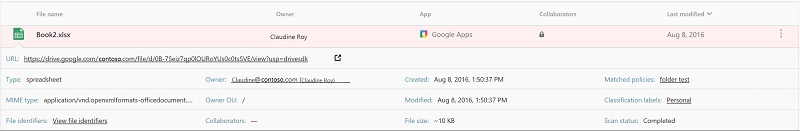

# File filters in Microsoft Defender for Cloud Apps

[!INCLUDE [Banner for top of topics](includes/banner.md)]

To provide data protection, Microsoft Defender for Cloud Apps gives you visibility into all the files from your connected apps. After you connect Microsoft Defender for Cloud Apps to an app using the App connector, Microsoft Defender for Cloud Apps scans all the files, for example all the files stored in OneDrive and Salesforce. Then, Defender for Cloud Apps rescans each file every time it's modified – the modification can be to content, metadata, or sharing permissions. Scanning times depend on the number of files stored in your app. You can also use the **Files** page to filter files to investigate what kind of data is saved in your cloud apps.

> [!NOTE]
> File monitoring should be enabled in Settings. In the Microsoft 365 Defender portal, select **Settings**. Then choose **Cloud Apps**. Under **Information Protection**, select **Files**. Select **Enable file monitoring** and then select **Save**.  
> If there are no active file policies, then seven days after the last file page engagement time file monitoring will become disabled.  
> If there are no active file policies, then 35 days after the last file page engagement time Defender for Cloud Apps will begin deleting the data that Defender for Cloud Apps maintains about these stored files.
> Starting Aug 20 2023, the filter 'last modified before (days) will be deprecated. Instead, we recommend the utilization of "file before (date) and continue the investigating by fixed date, you can also use 'manual' investigation by "modified before (date)" - in "policy page" or "files page". 

## File filter examples

For example, use the **Files** page to secure externally shared files labeled as **Confidential**, as follows:

After you connect an app to Defender for Cloud Apps, integrate with Microsoft Purview Information Protection. Then, in the **Files** page, filter for files labeled **Confidential** and exclude your domain in the **Collaborators** filter. If you see that there are confidential files shared outside your organization, you can create a file policy to detect them. You can apply automatic governance actions to these files, such as **Remove external collaborators** and **Send policy-match digest to file owner** to prevent data loss to your organization.

Here's another example of how you can use the **Files** page. Make sure you no one in your organization is publicly or externally sharing files that haven't been modified in the last six months:

Connect an app to Defender for Cloud Apps and go to the **Files** page. Filter for files whose access level is **External** or **Public** and set the **Last modified** date to six months ago. Create a file policy that detects these stale public files by selecting **New policy from search**. Apply automatic governance actions to them, such as **Remove external users**, to prevent data loss to your organization.

The basic filter provides you with great tools to get started filtering your files.

To drill down into more specific files, you can expand the basic filter by selecting **Advanced filters**.

## File filters

Defender for Cloud Apps can monitor any file type based on more than 20 metadata filters (for example, access level, file type).

The Defender for Cloud Apps built in DLP engines perform content inspection by extracting text from common file types. Some of the included file types are PDF, Office files, RTF, HTML, and code files.

Below is a list of the file filters that can be applied. To provide you with a powerful tool for policy creation, most filters support multiple values and a *NOT*.

> [!NOTE]
> When using the file policy filters, **Contains**  will search only for **full words** – separated by commas, dots, hyphens or spaces to search.
>
> - Spaces or hyphens between words function like *OR*. For example, if you search for **malware** **virus** it will find all files with either malware or virus in the name, so it will find both *malware-virus.exe* and *virus.exe*.
> - If you want to search for a string, enclose the words in quotation marks. This functions like *AND*. For example, if you search for **"malware"** **"virus"**, it will find *virus_malware_file.exe* but it will not find *malwarevirusfile.exe* and it will not find *malware.exe*. However, it will search for the exact string. If you search for **"malware virus"**, it will not find **"virus"** or **"virus_malware"**.
>
> **Equals** will search only for the complete string. For example, if you search for **malware.exe** it will find *malware.exe* but not *malware.exe.txt*.

- **Access level** – Sharing access level; public, external, internal, or private.  

  - **Internal** - Any files within the Internal domains you set in [General setup](General-setup.md).
  - **External** - Any files saved in locations that aren't within the internal domains you set.
  - **Shared** - Files that have a sharing level above private. Shared includes:
    - Internal sharing - Files shared within your internal domains.
    - External sharing - Files shared in domains that aren't listed in your internal domains.
    - Public with a link - Files that can be shared with anyone via a link.
    - Public - Files that can be found by searching the Internet.

      > [!NOTE]
      > Files shared into your connected storage apps by external users are handled as follows by Defender for Cloud Apps:
      >
      > - **OneDrive:** OneDrive assigns an internal user as the owner of any file placed into your OneDrive by an external user. Because these files are then considered owned by your organization, Defender for Cloud Apps scans these files and applies policies as it does to any other file in your OneDrive.
      > - **Google Drive:** Google Drive considers these as being owned by the external user, and because of legal restrictions on files and data that your organization does not own, Defender for Cloud Apps does not have access to these files.
      > - **Box:** Because Box considers externally owned files to be private information, Box Global Admins cannot see the content of the files. For this reason, Defender for Cloud Apps does not have access to these files.
      > - **Dropbox:** Because Dropbox considers externally owned files to be private information, Dropbox Global Admins cannot see the content of the files. For this reason, Defender for Cloud Apps does not have access to these files.

- **App** – Search only for files within these apps.

- **Collaborators** – Include/exclude specific collaborators or groups.

  - **Any from domain** – If any user from this domain has direct access to the file.

      >[!NOTE]
      >
      > - This filter does not support files that were shared with a group, only with specific users.
      > - For SharePoint and OneDrive, the filter doesn't support files shared with a specific user through a shared link.

  - **Entire organization** – If the entire organization has access to the file.

  - **Groups** – If a specific group has access to the file. Groups can be imported from Active Directory, cloud apps or manually created in the service.

  - **Users** – Certain set of users that may have access to the file.

- **Created** – File creation time. The filter supports before/after dates and a date range.

- **Extension** – Focus on specific file extensions. For example, all files that are executables (*.exe).

    >[!NOTE]
    >
    > - This filter is case sensitive.
    > - Use the OR clause to apply the filter on more than a single capitalization variation.

- **File ID** – Search for specific file IDs. File ID is an advanced feature that allows you to track certain high-value files without a dependency on owner, location, or name.

- **File name** – File name or sub string of the name as defined in the cloud app. For example, all files with a password in their name.

- **Sensitivity label** - Search for files with specific labels set. Labels are either:
  - **Microsoft Purview Information Protection** - Requires integration with Microsoft Purview Information Protection.
  - **Defender for Cloud Apps** - Provides more insight into the files it scans. For each file scanned by Defender for Cloud Apps DLP, you can know if inspection was blocked because the file is encrypted or corrupted. For example, you can set up policies to alert and quarantine password-protected files that are shared externally.
    - **Azure RMS encrypted** – Files whose content wasn't inspected because they have an Azure RMS encryption set.
    - **Password encrypted** – Files whose content wasn't inspected because they're password protected by the user.
    - **Corrupt file** – Files whose content wasn't inspected because their contents couldn't be read.

- **File type** – Defender for Cloud Apps scans the file to determine whether the true file type matches the MIME type received (see table) from the service. This scan is for files that are relevant for data scan (documents, images, presentations, spreadsheets, text, and zip/archive files). The filter works per file/folder type. For example, *All folders that are ...* or *All spreadsheet files that are...*

    | MIME type | File type |
    |--|--|
    | - application/vnd.openxmlformats-officedocument.wordprocessingml.document - application/vnd.ms-word.document.macroEnabled.12 - application/msword - application/vnd.oasis.opendocument.text - application/vnd.stardivision.writer - application/vnd.stardivision.writer-global - application/vnd.sun.xml.writer - application/vnd.stardivision.math - application/vnd.stardivision.chart - application/x-starwriter - application/x-stardraw - application/x-starmath - application/x-starchart - application/vnd.google-apps.document - application/vnd.google-apps.kix - application/pdf - application/x-pdf - application/vnd.box.webdoc - application/vnd.box.boxnote - application/vnd.jive.document - text/rtf - application/rtf | Document |
    | - application/vnd.oasis.opendocument.image - application/vnd.google-apps.photo - **starts with:** image/ | Image |
    | - application/vnd.openxmlformats-officedocument.presentationml.presentation - application/vnd.ms-powerpoint.template.macroEnabled.12 - application/mspowerpoint - application/powerpoint - application/vnd.ms-powerpoint - application/x-mspowerpoint - application/mspowerpoint - application/vnd.ms-powerpoint - application/vnd.oasis.opendocument.presentation - application/vnd.sun.xml.impress - application/vnd.stardivision.impress - application/x-starimpress - application/vnd.google-apps.presentation | Presentation |
    | - application/vnd.openxmlformats-officedocument.spreadsheetml.sheet - application/vnd.ms-excel.sheet.macroEnabled.12 - application/excel - application/vnd.ms-excel - application/x-excel - application/x-msexcel - application/vnd.oasis.opendocument.spreadsheet - application/vnd.sun.xml.calc - application/vnd.stardivision.calc - application/x-starcalc - application/vnd.google-apps.spreadsheet | Spreadsheet |
    | - **starts with:** text/ | Text |
    | All other file MIME types | Other |

    

- **In trash** – Exclude/include files in the trash folder. These files may still be shared and pose a risk.

    

- **Last modified** – File modification time. The filter supports before and after dates, date range, and relative time expressions. For example, all files that weren't modified in the last six months.

- **Matched policy** - Files that are matched by an active Defender for Cloud Apps policy.

- **MIME type** – File MIME type check. It accepts free text.

- **Owner** -Include/exclude specific file owners. For example, track all files shared by *rogue_employee_#100*.

- **Owner OU** – Include or exclude file owners that belong to certain organizational units. For example, all public files except files shared by *EMEA_marketing*. Applies only to files stored in Google Drive.

- **Parent folder** – Include or exclude a specific folder (doesn't apply to subfolders). For example, all publicly shared files except for files in this folder.

    > [!NOTE]
    > Defender for Cloud Apps only detects new SharePoint and OneDrive folders after some file activity has been performed in them.

- **Quarantined** – If the file quarantined by the service. For example, show me all files that are quarantined.

When creating a policy, you can also set it to run on specific files by setting the **Apply to** filter. Filter to either **all files**, **selected folders** (subfolders included), or **all files excluding selected folders**. Then select the files or folders that are relevant.

## Authorizing files

After Defender for Cloud Apps has identified files as posing a malware or DLP risk, we recommend you investigate the files. If you determine the files are safe, you can authorize them. Authorizing a file removes it from the malware detection report and suppresses future matches on this file.

### To authorize files

1. In the Microsoft 365 Defender portal, under **Cloud Apps**, select **Policies** -> **Policy management**. Select the **Information protection** tab.
1. In the list of policies, on the row in which the policy that triggered the investigation appears, in the **Count** column, select the **matches** link.

    > [!TIP]
    > You can filter the list of policies by type. The following table lists, per risk type, which filter type to use:
    >
    > | Risk type | Filter type |
    > | --- | --- |
    > | DLP | File policy |
    > | Malware | Malware detection policy |

1. In the list of matched files, on the row in which the file under investigation appears, select the ✓ to **Authorize**.

## Working with the File drawer

You can view more information about each file, by selecting the file itself in the file log. Selecting it opens the **File drawer** that provides the following additional actions you can take on the file:

- **URL** - Takes you to the file location.
- **File identifiers** - Opens a pop-up with raw data details about the file including file ID and encryption keys when they are available.
- **Owner** - View the user page for the owner of this file.
- **Matched policies** - See a list of policies the file matched.
- **Sensitivity labels** - View the list of sensitivity labels from Microsoft Purview Information Protection found in this file. You can then filter by all files matching this label.

The fields in the File drawer provide contextual links to additional files and drill downs you may want to perform from the drawer directly. For example, if you move your cursor next to the **Owner** field, you can use the "add to filter" icon  to add the owner immediately to the filter of the current page. You can also use the settings cog icon  that pops up to arrive directly at the settings page necessary to modify the configuration of one of the fields, such as **Sensitivity labels**.

For a list of governance actions available, see [File governance actions](governance-actions.md#file-governance-actions).

## Next steps

> [!div class="nextstepaction"]
> [Best practices for protecting your organization](best-practices.md)

[!INCLUDE [Open support ticket](includes/support.md)]
