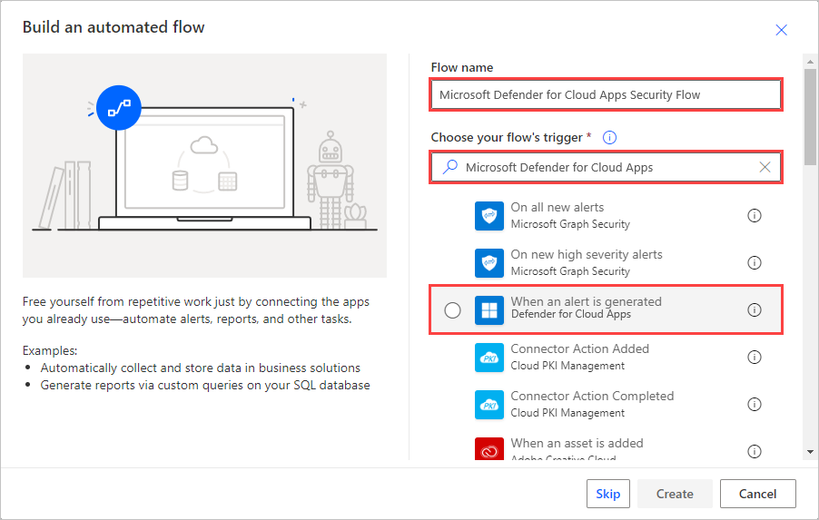
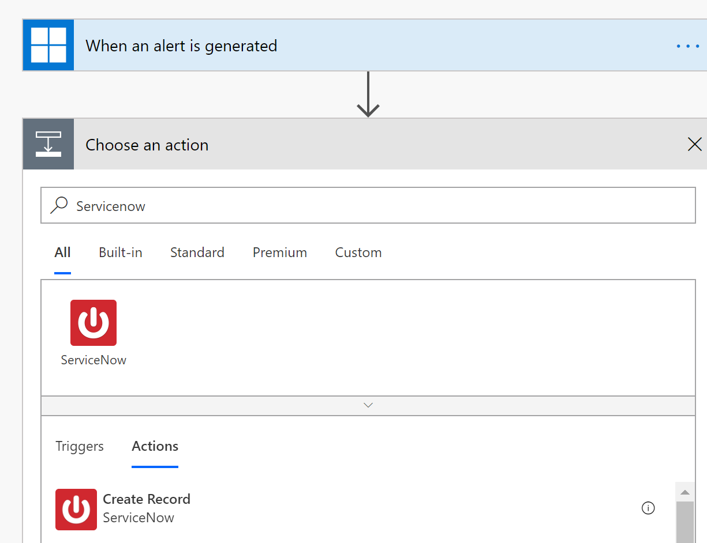
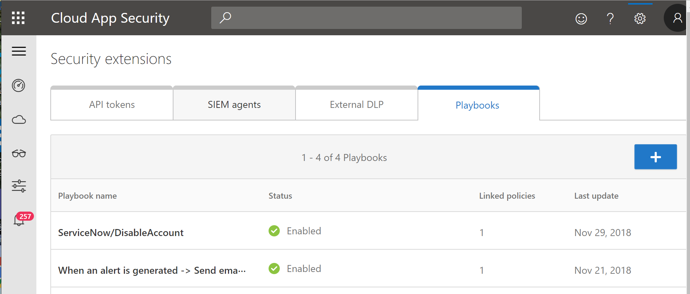

---
# required metadata

title: Integrate Flow with Cloud App Security to get custom alert automation
description: This article provides information about how to get custom alert automation by integrating Flow with Cloud App Security.
keywords:
author: ShlomoSagir-MS
ms.author: shsagir
manager:shsagir
ms.date: 6/18/2019
ms.topic: conceptual
ms.collection: M365-security-compliance
ms.prod:
ms.service: cloud-app-security
ms.technology:
ms.assetid: 344f92e2-6b3b-46db-bfd0-3b1016e0bc34

# optional metadata

#ROBOTS:
#audience:
#ms.devlang:
ms.reviewer: reutam
ms.suite: ems
#ms.tgt_pltfrm:
#ms.custom:

---

# Integrate with Flow for custom alert automation

*Applies to: Microsoft Cloud App Security*

Cloud App Security integrates with [Microsoft Flow](https://docs.microsoft.com/flow/getting-started) to provide custom alert automation and orchestration playbooks. By using the [ecosystem of connectors](https://docs.microsoft.com/connectors/) available in Microsoft Flow, you can automate the triggering of playbooks when Cloud App Security generates alerts. For example, automatically create an issue in ticketing systems using [ServiceNow connector](https://docs.microsoft.com/connectors/service-now/) or send an approval email to execute a custom governance action when an alert is triggered in Cloud App Security.  

## Prerequisites 

 - You must have a valid [Microsoft Flow plan](https://flow.microsoft.com/en-us/pricing)

## How it works

On its own, Cloud App Security provides predefined governance options such as suspend user or make file private when defining policies. By creating a playbook in Microsoft Flow using Cloud App Security connector, you can create workflows to enable customized governance options for your policies. After the playbook is created in Flow, simply associate it with a policy in Cloud App Security to send alerts to Flow. Microsoft Flow offers several connectors and conditions to create a customized workflow for your organization. 

The [Cloud App Security connector](https://docs.microsoft.com/connectors/cloudappsecurity/) in Flow supports automated trigger and actions. Flow is triggered automatically when Cloud App Security generates an alert. Actions include changing the alert status in Cloud App Security. 

## How to create playbooks with Microsoft Flow

1. [Create an API token](api-tokens.md) in Cloud App Security. 

2. Navigate to the [Microsoft Flow portal](https://flow.microsoft.com) and choose [**Create a new flow from scratch**](https://docs.microsoft.com/flow/get-started-logic-flow). 

3. In search connectors and triggers, type **Cloud App Security** and select **When an alert is generated**.

   

4. Under **Authentication settings**, paste the API token from step 1. 

5. Define the workflow that should be triggered when a policy in Cloud App Security generates an alert. You can add an action, logical condition, switch case conditions or loops and save the playbook. 

   

6. In the Cloud App Security portal, go to **Policies** and in the row of the policy whose alerts you want to forward to Flow, click the three dots and select **Settings**. 
7. Under **Alerts**, select **Send Alerts to Flow** and choose the name of playbook from the dropdown menu.  

   

8. Cloud App Security playbooks that you’ve authored or are granted access to can be seen in the **Security extensions** screen. 

  
   
 
 

## Next steps 
[Control cloud apps with policies](control-cloud-apps-with-policies.md)   

[Premier customers can also create a new support request directly in the Premier Portal.](https://premier.microsoft.com/)  
