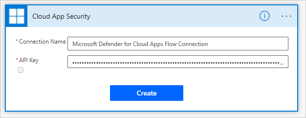

# Integrate with Microsoft Power Automate for custom alert automation

[!INCLUDE [Banner for top of topics](includes/banner.md)]

Cloud App Security integrates with [Microsoft Power Automate](/power-automate/getting-started) to provide custom alert automation and orchestration playbooks. By using the [connectors](/connectors/) available in Power Automate, you can automate the triggering of playbooks when Cloud App Security generates alerts. For example, automatically create an issue in ticketing systems using [ServiceNow connector](/connectors/service-now/) or send an approval email to execute a custom governance action when an alert is triggered in Cloud App Security.

## Prerequisites

- You must have a valid [Microsoft Power Automate plan](https://flow.microsoft.com/pricing/)

## How it works

On its own, Cloud App Security provides predefined governance options such as suspend a user or make a file private when defining policies. By creating a playbook in Power Automate using a Cloud App Security connector, you can create workflows to enable customized governance options for your policies. After the playbook is created in Power Automate, it will be automatically synchronized to Cloud App Security. Then associate it with a policy in Cloud App Security to send alerts to Power Automate. Microsoft Power Automate offers several connectors and conditions to create a customized workflow for your organization.

The [Cloud App Security connector](/connectors/cloudappsecurity/) in Power Automate supports automated triggers and actions. Power Automate is triggered automatically when Cloud App Security generates an alert. Actions include changing the alert status in Cloud App Security.

## Create Power Automate playbooks for Cloud App Security

1. [Create an API token](api-authentication.md) in Cloud App Security.

1. Navigate to the [Power Automate portal](https://flow.microsoft.com/), select **My flows**, select **New flow**, and in the drop-down, under **Build your own from blank**, select **Automated cloud flow**.

    

1. Provide a name for the flow, and in **Choose your flow's trigger**, type **Cloud App Security** and select **When an alert is generated**.

    

1. Under **Authentication settings**, paste the API token from step 1. Give your connection a name and select **Create**.

    

1. Now create the playbook according to your requirements. Select **+New step** to define the workflow that should be triggered when a policy in Cloud App Security generates an alert. You can add an action, logical condition, switch case conditions, or loops and save the playbook. In this example, we'll be adding a [ServiceNow connector](/connectors/service-now/).

    

1. Continue to configure your playbook. The playbook will be automatically synchronized with Cloud App Security. For more information about creating playbooks in Power Automate, see [Create a cloud flow in Power Automate](/power-automate/get-started-logic-flow).
1. In the [Cloud App Security portal](https://portal.cloudappsecurity.com/), go to **Policies**. In the row of the policy whose alerts you want to forward to Power Automate, select the three dots and then select **Edit Policy**.
1. Under **Alerts**, select **Send Alerts to Power Automate** and choose the name of the playbook you created earlier from the drop-down menu.

    

1. Cloud App Security playbooks that you've authored or are granted access to can be seen by going to **Settings** -> **Security extensions**.

    

## Related videos

> [!div class="nextstepaction"]
> [Automation and integration with Power Automate webinar](webinars.md#on-demand-webinars)

## Next steps

> [!div class="nextstepaction"]
> [Control cloud apps with policies](control-cloud-apps-with-policies.md)

[!INCLUDE [Open support ticket](includes/support.md)]

## Learn more

- Try our interactive guide: [Automate alerts management with Microsoft Power Automate and Cloud App Security](https://mslearn.cloudguides.com/guides/Automate%20alerts%20management%20with%20Microsoft%20Power%20Automate%20and%20Cloud%20App%20Security)
