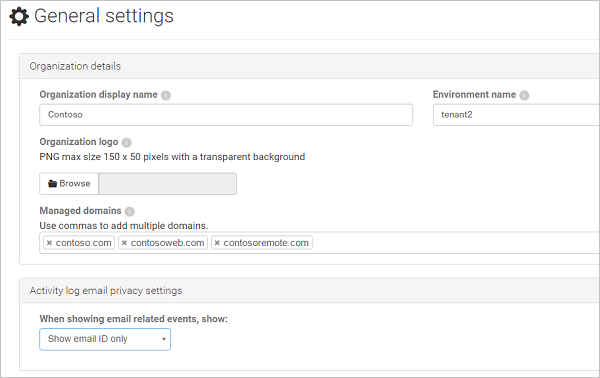

---
# required metadata

title: Provide your organization's settings in Cloud App Security portal for best results | Microsoft Docs
description: This article explains how to provide information about your organization in Cloud App Security.
keywords:
author: rkarlin
ms.author: rkarlin
manager: mbaldwin
ms.date: 7/30/2017
ms.topic: get-started-article
ms.prod:
ms.service: cloud-app-security
ms.technology:
ms.assetid: 2e7e57b0-db54-4d75-896c-4700dd9abe48

# optional metadata

#ROBOTS:
#audience:
#ms.devlang:
ms.reviewer: reutam
ms.suite: ems
#ms.tgt_pltfrm:
#ms.custom:

---

# Basic set up
The following procedure gives you instructions for customizing the Cloud App Security portal.

## Prerequisites 
For portal access it is necessary to add the following IP addresses to your Firewall's whitelist to provide access for the Cloud App Security portal:  
  
- 104.42.231.28  
  
> [!NOTE]  
>  To get updates when URLs and IP addresses are changed, subscribe to the RSS as explained in: [Office 365 URLs and IP address ranges](https://support.office.com/article/Office-365-URLs-and-IP-address-ranges-8548a211-3fe7-47cb-abb1-355ea5aa88a2).  
  
## Set up the portal  
  
1.  In the Cloud App Security portal, in the menu bar, click the settings icon  and select **General settings** to configure the following:  
     
       
  
3.  Under **Organization details**, it is important that you provide an **Organization display name** for your organization. It will be displayed on emails and web pages sent from the system.  
  
4. Provide an **Environment name** (tenant). This is especially important if you manage multiple tenants.  
  
4. It is also possible to provide a **Logo** that will be displayed in email notifications sent from the system and on web pages sent from the system. The logo should be a png file with a maximum size of 150 x 50 pixels on a transparent background.  

4.  Make sure you add a list of your **Managed domains**. This is a crucial step because Cloud App Security uses the managed domains to determine which users are internal, which are external, and where files should and shouldn't be shared. This is used for reports as well as alerts.  
> [!NOTE] 
> - Users in domains that are not configured as internal will be marked as external and will not be scanned for activities or files.

5. If you are integrating with Azure Information Protection integration, see [Azure Information Protection Integration](azip-integration.md) for information. 
  
  
6.  If at any point you want to back up your portal settings, this screen enables you to do that. Click **Export portal settings** to create a json file of all your portal settings, including policy rules, user groups and IP address ranges.  
  
       

> [!NOTE] 
> If you use ExpressRoute, Cloud App Security is deployed in Azure and fully integrated with [ExpressRoute](https://azure.microsoft.com/documentation/articles/expressroute-introduction/). All interactions with the Cloud App Security apps and traffic sent to Cloud App Security, including upload of discovery logs, is routed via ExpressRoute **public peering** for improved latency, performance and security. There are no configuration steps required from the customer side.  
    For more information about  Public Peering, see [ExpressRoute circuits and routing domains](https://azure.microsoft.com/documentation/articles/expressroute-circuit-peerings/).  
    
## See Also  
[Set up Cloud Discovery](set-up-cloud-discovery.md)   
[For technical support, please visit the Cloud App Security assisted support page.](http://support.microsoft.com/oas/default.aspx?prid=16031)   
[Premier customers can also choose Cloud App Security directly from the Premier Portal.](https://premier.microsoft.com/)  
  
  