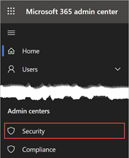
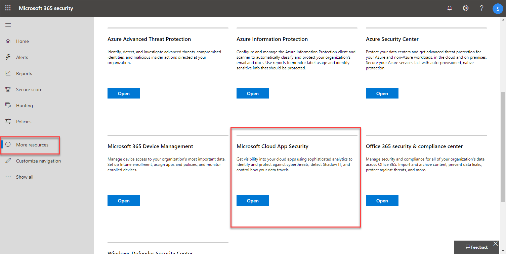

---
# required metadata

title: Deploy Cloud App Security
description: This quickstart outlines the process for getting Cloud App Security up and running so you have cloud app use, insight, and control.
author: shsagir
ms.author: shsagir
manager: shsagir
ms.date: 9/9/2019
ms.topic: quickstart
ms.collection: M365-security-compliance
ms.service: cloud-app-security

# optional metadata

#ROBOTS:
#audience:
#ms.devlang:
ms.reviewer: reutam
ms.suite: ems
#ms.tgt_pltfrm:
ms.custom: seodec18
---

# Quickstart: Get started with Microsoft Cloud App Security

*Applies to: Microsoft Cloud App Security*

This quickstart provides you with steps for getting up and running with Cloud App Security. Microsoft Cloud App Security can help you take advantage of the benefits of cloud applications while maintaining control of your corporate resources. It works by improving visibility of cloud activity and helping to increase the protection of corporate data. In this article, we walk you through the steps you take to set up and work with Microsoft Cloud App Security.

Your organization must have a license to use Cloud App Security. For pricing details, see the [Cloud App Security licensing datasheet](https://aka.ms/mcaslicensing).

>[!NOTE]
>You don't need an Office 365 license to use Cloud App Security.

## Prerequisites

- Your organization must have a license to use Cloud App Security. For pricing details, see the [Cloud App Security licensing datasheet](https://aka.ms/mcaslicensing).

     For tenant activation support, see [Contact Office 365 for business support - Admin Help](https://support.office.com/article/Contact-Office-365-for-business-support-Admin-Help-32a17ca7-6fa0-4870-8a8d-e25ba4ccfd4b).
- After you have a license for Cloud App Security, you'll receive an email with activation information and a link to the Cloud App Security portal.

- To set up Cloud App Security, you must be a Global Administrator, a Compliance Administrator, or a Security Reader in Azure Active Directory or Office 365. It's important to understand that a user who is assigned an admin role will have the same permissions across all of the cloud apps that your organization has subscribed to. This is regardless of whether you assign the role in the Microsoft 365 admin center, or in the Azure classic portal, or by using the Azure AD module for [Windows PowerShell](https://technet.microsoft.com/library/mt736914.aspx). For more information, see [Assigning admin roles in Office 365](https://support.office.com/article/Assigning-admin-roles-in-Office-365-eac4d046-1afd-4f1a-85fc-8219c79e1504) and [Assigning administrator roles in Azure Active Directory](https://azure.microsoft.com/documentation/articles/active-directory-assign-admin-roles/).

- To run the Cloud App Security portal, use Internet Explorer 11, Microsoft Edge (latest), Google Chrome (latest), Mozilla Firefox (latest), or Apple Safari (latest).

## To access the portal

To access the Cloud App Security portal, go to [https://portal.cloudappsecurity.com](https://portal.cloudappsecurity.com). You can also access the portal through the **Microsoft 365 admin center**, as follows:

1. In the Microsoft 365 admin center, click the **App launcher** icon , and then select **Security**.

    

1. In the Microsoft 365 security page, click **More resources**, and then select **Cloud App Security**.

    

## Step 1. [Set instant visibility, protection, and governance actions for your apps](enable-instant-visibility-protection-and-governance-actions-for-your-apps.md)

Required task: Connect apps

1. From the settings cog, select   **App connectors**.
1. Click the plus sign to add an app and select an app.
1. Follow the configuration steps to connect the app.

**Why connect an app?**
After you connect an app, you can gain deeper visibility so you can investigate activities, files, and accounts for the apps in your cloud environment.

## Step 2. [Control cloud apps with policies](control-cloud-apps-with-policies.md)

Required task: Create policies

### To create policies

1. Go to **Control** > **Templates**.
1. Select a policy template from the list, and then choose (+) **Create policy**.
1. Customize the policy (select filters, actions, and other settings), and then choose **Create**.
1. On the **Policies** tab, choose the policy to see the relevant matches (activities, files, alerts).
 Tip: To cover all your cloud environment security scenarios, create a policy for each **risk category**.

### How can policies help your organization?

You can use policies to help you monitor trends, see security threats, and generate customized reports and alerts. With policies, you can create governance actions, and set data loss prevention and file-sharing controls.

## Step 3. [Set up Cloud Discovery](set-up-cloud-discovery.md)

Required task: Enable Cloud App Security to view your cloud app use

1. [Integrate with Microsoft Defender ATP](wdatp-integration.md) to automatically enable Cloud App Security to monitor your Windows 10 devices inside and outside your corporation.
1. If you use [Zscaler, integrate](zscaler-integration.md) it with Cloud App Security.
1. To achieve full coverage, create a continuous Cloud Discovery report

   1. From the settings cog, select   **Cloud Discovery settings**.
   1. Choose **Automatic log upload**.
   1. On the **Data sources** tab, add your sources.
   1. On the **Log collectors** tab, configure the log collector.

### To create a snapshot Cloud Discovery report

 Go to **Discover** > **Snapshot report** and follow the steps shown.

### Why should you configure Cloud Discovery reports?

Having visibility into shadow IT in your organization is critical.
After your logs are analyzed, you can easily find which cloud apps are being used, by which people, and on which devices.

## Step 4. [Personalize your experience](mail-settings.md)

Recommended task: Add your organization details

### To enter email settings

1. From the settings cog, select **Mail settings**.
1. Under **Email sender identity**, enter your email addresses and display name.
1. Under **Email design**, upload your organization's email template.

### To set admin notifications

1. In the navigation bar, choose your user name, and then go to **User settings**.
1. Under **Notifications**, configure the methods you want to set for system notifications.
1. Choose **Save**.

### To customize the score metrics

1. From the settings cog, select **Cloud Discovery settings**.
1. From the settings cog, select **Cloud Discovery settings**.
1. Under **Score metrics**, configure the importance of various risk values.
1. Choose **Save**.

Now the risk scores given to discovered apps are configured precisely according to your organization needs and priorities.

### Why personalize your environment?

Some features work best when they're customized to your needs.
Provide a better experience for your users with your own email templates. Decide what notifications you receive and customize your risk score metric to fit your organization’s preferences.

## Step 5. [Organize the data according to your needs](ip-tags.md)

Recommended task: Configure important settings

### To create IP address tags

1. From the settings cog, select **Cloud Discovery settings**.
1. From the settings cog, select **IP address ranges**.
1. Click the plus sign to add an IP address range.
1. Enter the IP range **details**, **location**, **tags**, and **category**.
1. Choose **Create**.

   Now you can use IP tags when you create policies, and when you filter and create continuous reports.

### To create continuous reports

1. From the settings cog, **Cloud Discovery settings**.
1. Under **Continuous reports**, choose **Create report**.
1. Follow the configuration steps.
1. Choose **Create**.

Now you can view discovered data based on your own preferences, such as business units or IP ranges.

### To add domains

1. From the settings cog, select **Settings**.
1. Under **Organization details**, add your organization's internal domains.
1. Choose **Save**.

### Why should you configure these settings?

These settings help give you better control of features in the console. With IP tags, it's easier to create policies that fit your needs, to accurately filter data, and more. Use Data views to group your data into logical categories.

## Next Steps

Set policies [Control cloud apps with policies](control-cloud-apps-with-policies.md).

[Premier customers can also create a new support request directly in the Premier Portal.](https://premier.microsoft.com/).
