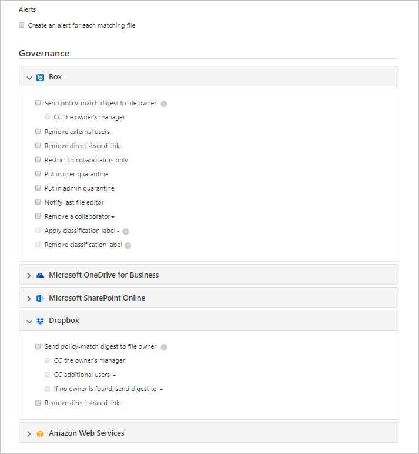
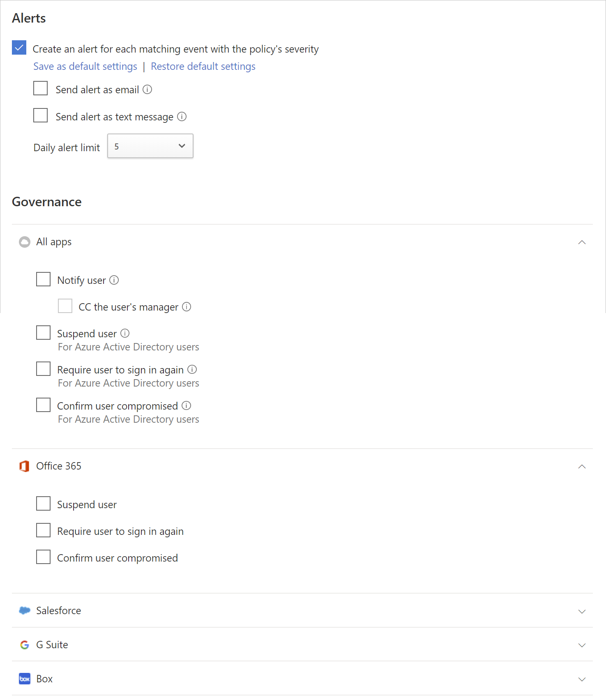

---
# required metadata

title: Governance actions to control connected apps - Cloud App Security | Microsoft Docs
description: This article lists and describes all the governance actions that can be taken in Cloud App Security and the log messages that track them.
keywords:
author: shsagir
ms.author: shsagir
manager: shsagir
ms.date: 12/03/2019
ms.topic: conceptual
ms.collection: M365-security-compliance
ms.prod:
ms.service: cloud-app-security
ms.technology:

# optional metadata

#ROBOTS:
#audience:
#ms.devlang:
ms.reviewer: reutam
ms.suite: ems
#ms.tgt_pltfrm:
ms.custom: seodec18

---
# Governing connected apps

*Applies to: Microsoft Cloud App Security*

Governance enables you to control what your users do, in real time, across apps. For connected apps, you can apply governance actions to files or activities. Governance actions are integrated actions you can run on files or activities directly from Microsoft Cloud App Security. Governance actions control what your users do, in real time, across connected apps.

> [!NOTE]
> When Microsoft Cloud App Security attempts to run a governance action on a file but fails because the file is locked, it will automatically retry the governance action.

## File governance actions

The following governance actions can be taken for connected apps either on a specific file, user or from a specific policy.

- **Notifications:**

  - **Alerts** – Alerts can be triggered in the system and propagated via email and text message, based on severity level.

  - **User email notification** – Email messages can be customized and will be sent to all violating file owners.

  - **Notify specific users** – Specific list of email addresses that will receive these notifications.

  - **Notify last file editor** – Send notifications to the last person who modified the file.

- **Governance actions in apps** - Granular actions can be enforced per app, specific actions vary depending on app terminology.

  - **Labeling**
    - **Apply label** - Ability to add an Azure Information Protection classification label.
    - **Remove label** - Ability to remove an Azure Information Protection classification label.
  - **Change sharing**

    - **Remove public sharing** – Allow access only to named collaborators, for example: Remove public access for G Suite and Remove direct shared link for Box.

    - **Remove external users** – Allow access only to company users.

    - **Make private** – Only Site Admins can access the file, all shares are removed.

    - **Remove a collaborator** – Remove a specific collaborator from the file.

    - **Reduce public access** - Set Publicly available files to be available only with a shared link. (Google)

    - **Expire shared link** - Ability to set an experation date for a shared link after which it will no longer be active. (Box)

    - **Change sharing link access level** - Ability to change the access level of the shared link between company only, collaborators only, and public. (Box)

  - **Quarantine**

    - **Put in user quarantine** – Allow self-service by moving the file to a user-controlled quarantine folder

    - **Put in admin quarantine** – File is moved to quarantine in the admin drive, and the admin has to approve it.

  - **Inherit permissions from parent** - This governance action enables you to remove specific permissions set for a file or folder in Office 365. Then revert to whatever permissions are set for the parent folder.

  - **Trash** – Move the file to the trash folder. (Box, Dropbox, Google Drive, OneDrive, SharePoint)

   

## Activity governance actions

- **Notifications**

  - **Alerts** – Alerts can be triggered in the system and propagated via email and text message, based on severity level.

  - **User email notification** – Email messages can be customized and will be sent to all violating file owners.

  - **Notify additional users** – Specific list of email addresses that will receive these notifications.

- **Governance actions in apps** - Granular actions can be enforced per app, specific actions vary depending on app terminology.

  - **Suspend user** – Suspend the user from the application.
    > [!NOTE]
    > If your Azure Active Directory (Azure AD) is set to automatically sync with the users in your Active Directory on-premises environment the settings in the on-premises environment will override the Azure AD settings and this governance action will be reverted.

  - **Require user to sign in again** – Signs the user out and requires them to sign in again.

  - **Confirm user compromised** - Set the user's risk level to high. This causes the relevant policy actions defined in Azure AD to be enforced. For more information How Azure AD works with risk levels, see [How does Azure AD use my risk feedback](https://docs.microsoft.com/azure/active-directory/identity-protection/howto-identity-protection-risk-feedback#how-does-azure-ad-use-my-risk-feedback).

  

## Governance conflicts

After creating multiple policies, a situation may arise in which the governance actions in multiple policies overlap. In this case, Cloud App Security will process the governance actions as follows:

### Conflicts between policies

- If two policies contain actions that are contained on in each other (for example, **Remove external shares** is included in **Make private**), Cloud App Security will resolve the conflict and the stronger action will be enforced.
- If the actions are unrelated (for example, **Notify owner** and **Make private**). Both actions will take place.
- If the actions conflict (for example **Change owner to user A** and **Change owner to user B**), different results may result from every match. It's important to change your policies to prevent conflicts because they may result in unwanted changes in the drive that will be hard to detect.

### Conflicts in user sync

- If your Azure AD is set to automatically sync with the users in your Active Directory on-premises environment, the settings in the on-premises environment will override the Azure AD settings and this governance action will be reverted.

## Governance log

The Governance log provides a status record of each task that you set Cloud App Security to run, including both manual and automatic tasks. These tasks include those you set in policies, governance actions that you set on files and users, and any other action you set Cloud App Security to take. The Governance log also provides information about the success or failure of these actions. You can choose to retry or revert some of the governance actions from the Governance log.

The following table is the full list of actions the Cloud App Security portal enables you to take. These actions are enabled in various places throughout the console as described in the **Location** column. Each governance action taken is listed in the Governance Log.
For information about how governance actions are treated when there are policy conflicts, see [Policy Conflicts](control-cloud-apps-with-policies.md).

| Location | Target object type | Governance action |Description| Related connectors|
|-------------------|---------|-----|--------|-------|
|Accounts |File |Remove user's collaborations | Remove all the collaborations of a specific user for any files - good for people leaving the company. |Box, G Suite|
|Accounts | Account | Unsuspend user |Unsuspends the user |G Suite, Box, Office, Salesforce|
|Accounts | Account |Account settings | Takes you to the account settings page in the specific app (for example, inside Salesforce). | All apps -One Drive and SharePoint settings are configured from within Office. |
|Accounts |File |Transfer all files ownership | On an account, you transfer one user's files to all be owned by a new person you select. The previous owner becomes an editor and can no longer change sharing settings. The new owner will receive an email notification about the change of ownership. | G Suite|
|Accounts, Activity policy | Account | Suspend user| Sets user to have no access and no ability to sign in. If they're logged in when you set this action, they're immediately locked out. |G Suite, Box, Office, Salesforce|
|Activity policy, Accounts | Account |Require user to sign in again|Revokes all refresh tokens and session cookies issues to applications by the user. This action will prevent access to any of the organization's data and will force the user to sign into all applications again.| G Suite, Office|
|Activity policy, Accounts | Account |Confirm user compromised|Set the user's risk level to high. This causes the relevant policy actions defined in Azure AD to be enforced. | Office |
|Activity policy, Accounts | Account | Revoke admin privileges |Revokes privileges for an admin account. For example, setting an activity policy that revokes admin privileges after 10 failed login attempts. | G Suite|
|App dashboard > App permissions |Permissions|Unban app| In Google and Salesforce: remove the banning from the app and allow users to give permissions to the third-party app with their Google or Salesforce. In Office 365: restores the permissions of the third-party app’s to Office. |G Suite, Salesforce, Office |
|App dashboard > App permissions |Permissions| Disable app permissions | Revoke a third-party app's permissions to Google, Salesforce, or Office. This is a one-time action that will occur on all existing permissions, but won't prevent future connections.|G Suite, Salesforce, Office |
|App dashboard > App permissions |Permissions| Enable app permissions |Grant a third-party app's permissions to Google, Salesforce, or Office. This is a one-time action that will occur on all existing permissions, but won't prevent future connections.|G Suite, Salesforce, Office |
|App dashboard > App permissions |Permissions| Ban app | In Google and Salesforce: revoke a third-party app's permissions to Google or Salesforce and ban it from receiving permissions in the future. In Office 365: doesn’t allow the permission of third-party apps to access Office, but doesn’t revoke them. |G Suite, Salesforce, Office |
|App dashboard > App permissions |Permissions|Revoke app|Revoke a third-party app's permissions to Google or Salesforce. This is a one-time action that will occur on all existing permissions, but won't prevent future connections. | G Suite, Salesforce|
|App dashboard > App permissions | Account | Revoke user from app|You can revoke specific users when clicking on the number under Users. The screen will display the specific users and you can use the X to delete permissions for any user.| G Suite, Salesforce|
|Discover > Discovered Apps/IP addresses/Users| Cloud Discovery | Export discovery data | Creates a CSV from the discovery data. | Discovery |
|File policy|File |Trash|Moves the file in the user's trash.| Box, Dropbox, Google Drive, OneDrive, SharePoint |
|File Policy|File | Notify last file editor |Sends an email to notify the last person who edited the file that it violates a policy. |G Suite, Box|
|File Policy|File |Notify file owner|Sends an email to the file owner, when a file violates a policy. In Dropbox, if no owner is associated with a file, the notification will be sent to the specific user you set. | All apps |
|File Policy, Activity Policy | File, Activity | Notify specific users |Sends an email to notify specific users about a file that violates a policy.| All apps |
|File policy and Activity policy | File, Activity |Notify user|Sends an email to users to notify them that something they did or a file they own violates a policy. You can add a custom notification to let them know what the violation was. |All |
|File policy and Files|File | Remove editors' ability to share|In Google Drive, the default editor permissions of a file allow sharing as well. This governance action restricts this option and restricts file sharing to the owner.| G Suite|
|File policy and Files|File | [Put in admin quarantine](use-case-admin-quarantine.md) |Removes any permissions from the file and moves the file to a quarantine folder in a location for the admin. This action enables the admin to review the file and remove it.| Office 365 SharePoint, OneDrive for Business, Box|
|File policy and Files|File | Apply classification label|Applies an Azure Information Protection classification label to files automatically based on the conditions set in the policy.| Box, One Drive, G Suite, SharePoint |
|File policy and Files|File | Remove classification label | Removes an Azure Information Protection classification label from files automatically based on the conditions set in the policy. You can remove labels only if they do not include protection, and they were applied from within Cloud App Security, not labels applied directly in Information Protection.| Box, One Drive, G Suite, SharePoint |
|File policy, Activity policy, Alerts | App |Require users to sign in again| You can require users to sign in again to all Office 365 and Azure AD apps as a quick and effective remediation for suspicious user activity alerts and compromised accounts. You can find the new governance in the policy settings and the alert pages, next to the Suspend user option. | Office 365, Azure AD |
|Files |File |Restore from user quarantine |Restores a user from being quarantined. |Box |
|Files |File | Grant read permissions to myself| Grants read permissions for the file for yourself so you can access the file and understand if it has a violation or not.| G Suite|
|Files |File | Allow editors to share | In Google Drive, the default editor permission of a file allows sharing as well. This governance action is the opposite of Remove editor’s ability to share and enables the editor to share the file. | G Suite|
|Files |File | Protect | Protect a file with Azure Information Protection by applying an organization template. | Office 365 (SharePoint and OneDrive) |
|Files |File | Revoke read permissions form myself | Revokes read permissions for the file for yourself, useful after granting yourself permission to understand if a file has a violation or not.| G Suite|
|Files, File policy|File | Transfer file ownership | Changes the owner - in the policy you choose a specific owner. | G Suite|
|Files, File policy|File | Reduce public access|This action enables you to set publicly available files to be available only with a shared link.| G Suite|
|Files, File policy|File | Remove a collaborator | Removes a specific collaborator from a file. | G Suite, Box, One Drive, SharePoint|
|Files, File policy|File | Make private| Only Site Admins can access the file, all shares are removed. | G Suite, One Drive, SharePoint |
|Files, File policy|File | Remove external users | Removes all external collaborators - outside the domains configured as internal in Settings. |G Suite, Box, One Drive, SharePoint|
|Files, File policy|File |Grant read permission to domain|Grants read permissions for the file to the specified domain for your entire domain or a specific domain. This action is useful if you want to remove public access after granting access to the domain of people who need to work on it.| G Suite|
|Files, File policy|File | Put in user quarantine | Removes all permissions from the file and moves the file to a quarantine folder under the user's root drive. This action allows the user to review the file and move it. If it's manually moved back, the file sharing isn't restored. | Box, One Drive, SharePoint |
|Files|File|Expire shared link| Set an expiration date for a shared link after which it will no longer be active.|Box|
|Files|File|Change sharing link access level|Changes the access level of the shared link between company only, collaborators only, and public.| Box|
|Files, File policy|File | Remove public access| If a file was yours and you put it in public access, it becomes accessible to anyone else configured with access to the file (depending on what kind of access the file had). | G Suite|
|Files, File policy|File |Remove direct shared link| Removes a link that is created for the file that is public but only shared with specific people.|Box |
|Settings> Cloud discovery settings| Cloud Discovery | Recalculate Cloud Discovery scores |Recalculates the scores in the Cloud app catalog after a score metric change.| Discovery |
|Settings> Cloud discovery settings > Manage data views| Cloud Discovery | Create custom Cloud Discovery filter data view|Creates a new data view for a more granular view of the discovery results. For example, specific IP ranges. | Discovery |
|Settings> Cloud discovery settings > Delete data| Cloud Discovery | Delete Cloud Discovery data |Deletes all the data collected from discovery sources.| Discovery |
|Settings> Cloud discovery settings > Upload logs manually/Upload logs automatically | Cloud Discovery | Parse Cloud Discovery data| Notification that all the log data was parsed. | Discovery |

## Next steps

> [!div class="nextstepaction"]
> [Daily activities to protect your cloud environment](daily-activities-to-protect-your-cloud-environment.md)

[!INCLUDE [Open support ticket](includes/support.md)]
