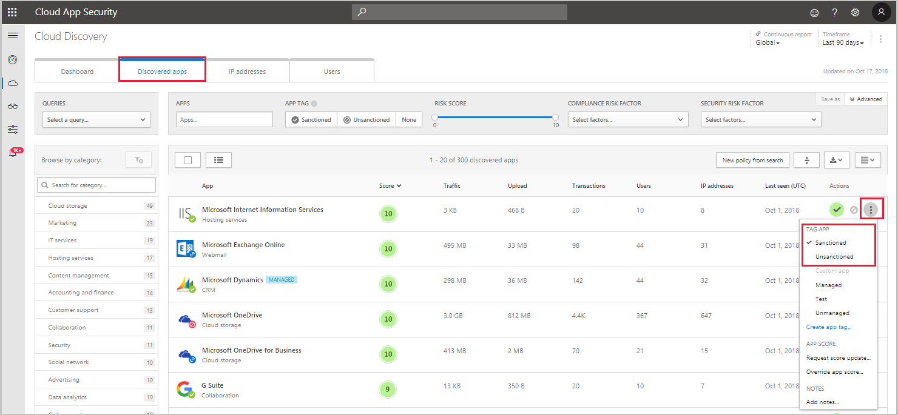

---
# required metadata

title: Blocking discovered apps - Cloud App Security | Microsoft Docs
description: This article describes the procedure for exporting block scripts for discovered apps.
keywords:
author: shsagir
ms.author: shsagir
manager: shsagir
ms.date: 12/12/2019
ms.topic: conceptual
ms.collection: M365-security-compliance
ms.prod:
ms.service: cloud-app-security
ms.technology:

# optional metadata

#ROBOTS:
#audience:
#ms.devlang:
ms.reviewer: reutam
ms.suite: ems
#ms.tgt_pltfrm:
ms.custom: seodec18

---
# Govern discovered apps

*Applies to: Microsoft Cloud App Security*

After you've reviewed the list of discovered apps in your environment, you can secure your environment by approving safe apps (**Sanctioned**) or prohibiting unwanted apps (**Unsanctioned**) in the following ways.

##  Sanctioning/unsanctioning an app

You can unsanction a specific risky app by clicking the three dots at the end of the row. Then select **Unsanction**. Unsanctioning an app doesn't block use, but enables you to more easily monitor its use with the Cloud Discovery filters. You can then notify users of the unsanctioned app and suggest an alternative safe app for their use.

If you have a list of apps you want to sanction or unsanction, use the checkbox to select the apps you want to manage, then select the action.

To query a list of unsanctioned apps, you can [generate a block script using the Cloud App Security APIs](https://us.portal.cloudappsecurity.com/api-docs/#generate-block-script).

> [!NOTE]
> If your tenant uses Microsoft Defender Advanced Threat Protection (ATP), Zscaler NSS, or iboss, any app you mark as unsanctioned is automatically blocked by Cloud App Security, and the following sections regarding creating blocking scripts are unnecessary. For more information, see [Integrate with Microsoft Defender ATP](wdatp-integration.md), [Integrate with Zscaler](zscaler-integration.md), and [Integrate with iboss](iboss-integration.md) respectively.

## Export a block script to govern discovered apps

Cloud App Security enables you to block access to unsanctioned apps by using your existing on-prem security appliances. You can generate a dedicated block script and import it to your appliance. This solution doesn't require redirection of all of the organization's web traffic to a proxy.

1. In the Cloud Discovery dashboard, tag any apps you want to block as **Unsanctioned**.

    

2. In the title bar, click on the three dots and select **Generate block script...**.

    

3. In **Generate block script**, select the appliance you want to generate the block script for.

    

4. Then, click the Generate script button to create a block script for all your unsanctioned apps. By default, the file will be named with the date on which it was exported and the appliance type you selected. *2017-02-19_CAS_Fortigate_block_script.txt* would be an example file name

   

5. Import the file created to your appliance.

## Next steps

> [!div class="nextstepaction"]
> [Daily activities to protect your cloud environment](daily-activities-to-protect-your-cloud-environment.md)

[!INCLUDE [Open support ticket](includes/support.md)]
