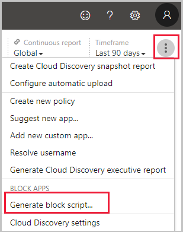
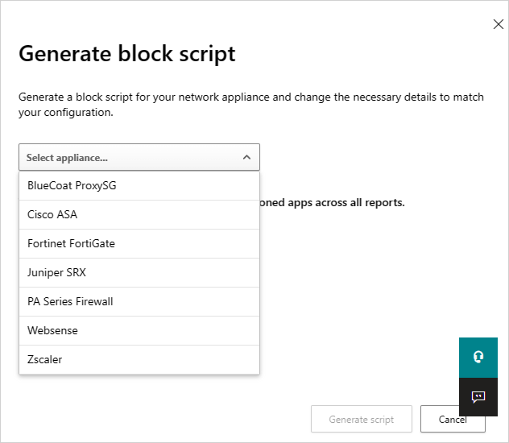
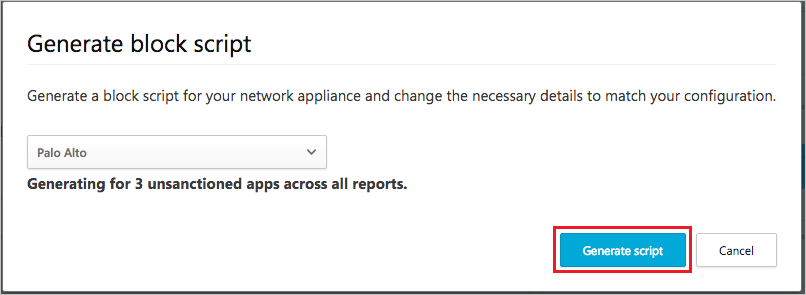

# Govern discovered apps

[!INCLUDE [Banner for top of topics](includes/banner.md)]

After you've reviewed the list of discovered apps in your environment, you can secure your environment by approving safe apps (**Sanctioned**) or prohibiting unwanted apps (**Unsanctioned**) in the following ways.

## Sanctioning/unsanctioning an app

You can mark a specific risky app as unsanctioned by clicking the three dots at the end of the row. Then select **Unsanctioned**. Unsanctioning an app doesn't block use, but enables you to more easily monitor its use with the Cloud Discovery filters. You can then notify users of the unsanctioned app and suggest an alternative safe app for their use, or [generate a block script using the Defender for Cloud Apps APIs](api-discovery-script.md) to block all unsanctioned apps.

  :::image type="content" source="media/tag-as-unsanctioned.png" alt-text="Tag as unsanctioned." lightbox="media/tag-as-unsanctioned.png":::

## Blocking apps with built-in streams

If your tenant uses Microsoft Defender for Endpoint, once you mark an app as unsanctioned, it's automatically blocked. Moreover, you can scope blocking to specific device groups. Also, with Defender for Endpoint you can monitor applications and use the "warn and educate" capabilities. For more information, see [Govern discovered apps using Microsoft Defender for Endpoint](mde-govern.md).

Otherwise, if your tenant uses Zscaler NSS, iboss, Corrata, Menlo, or Open Systems, you can still enjoy seamless blocking capabilities when an app is unsanctioned, but you can't scope by device groups or use the "warn and educate" feature. For more information, see [Integrate with Zscaler](zscaler-integration.md), [Integrate with iboss](iboss-integration.md), [Integrate with Corrata](Corrata-integration.md), [Integrate with Menlo](menlo-integration.md) and [Integrate with Open Systems](open-systems-integration.md).

## Block apps by exporting a block script

Defender for Cloud Apps enables you to block access to unsanctioned apps by using your existing on-premises security appliances. You can generate a dedicated block script and import it to your appliance. This solution doesn't require redirection of all of the organization's web traffic to a proxy.

1. In the Cloud Discovery dashboard, tag any apps you want to block as **Unsanctioned**.

    :::image type="content" source="media/tag-as-unsanctioned.png" alt-text="Tag as unsanctioned." lightbox="media/tag-as-unsanctioned.png":::

2. In the title bar, select **Actions** and then select **Generate block script...**.

    

3. In **Generate block script**, select the appliance you want to generate the block script for.

    

4. Then select the Generate script button to create a block script for all your unsanctioned apps. By default, the file will be named with the date on which it was exported and the appliance type you selected. *2017-02-19_CAS_Fortigate_block_script.txt* would be an example file name.

   

5. Import the file created to your appliance.

## Blocking unsupported streams

If your tenant doesn't use any of the streams above, you can still export a list of all the domains of all unsanctioned apps and configure your third-party non-supported appliance to block those domains.

In the **Discovered apps** page, filter all *Unsanctioned* apps and then use the export capability to export all the domains.

## Non-blockable applications

To prevent users from accidentally blocking business-critical services and causing downtime, the following services cannot be blocked using Defender for Cloud Apps, via the UI or policies:

- Microsoft Defender for Cloud Apps
- Microsoft Defender Security Center
- Microsoft 365 Security Center
- Microsoft Defender for Identity
- Microsoft Azure Information Protection
- Microsoft Entra Permissions Management
- Microsoft Conditional Access Application Control
- Microsoft Secure Score
- Microsoft 365 compliance center
- Microsoft Intune
- Microsoft Support
- Microsoft AD FS Help
- Microsoft Support
- Microsoft Online Services

## Governance conflicts

If there's a conflict between [manual governance actions](#sanctioningunsanctioning-an-app) and [governance set by policy](cloud-discovery-policies.md), the last operation applied will take precedence.

## Next steps

> [!div class="nextstepaction"]
> [Best practices for protecting your organization](best-practices.md)

[!INCLUDE [Open support ticket](includes/support.md)]
