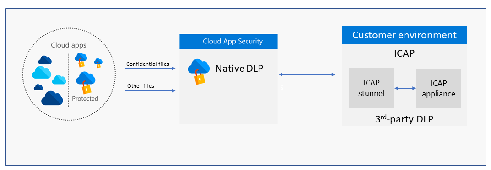
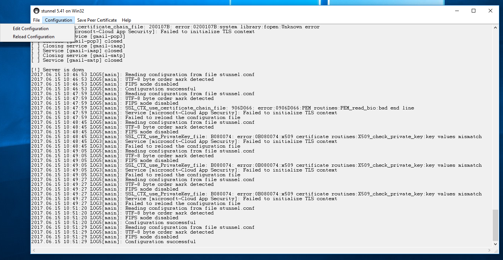
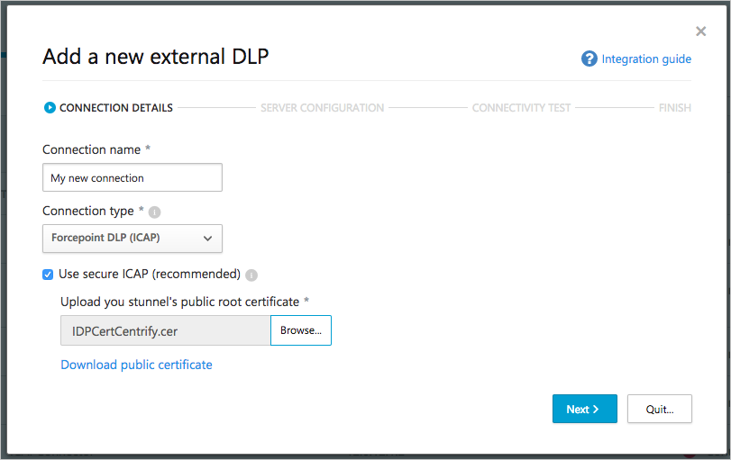
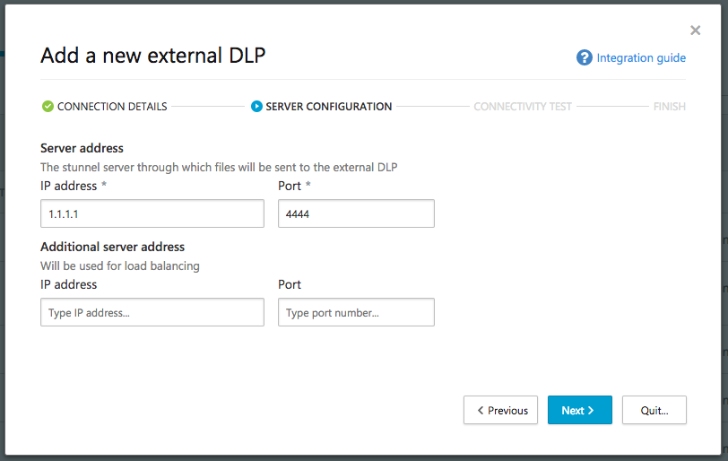
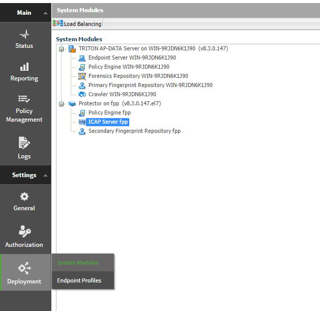
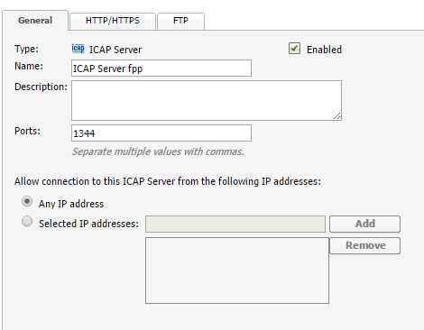
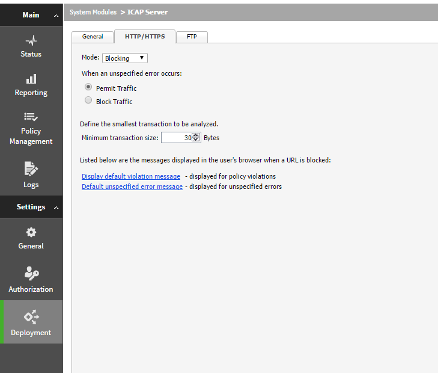

---
# required metadata

title: Cloud App Security external DLP integration over secure ICAP | Microsoft Docs
description: This topic provides the steps necessary for configuring the ICAP connection in Cloud App Security and the stunnel setup.
keywords:
author: rkarlin
ms.author: rkarlin
manager: mbaldwin
ms.date: 6/26/2017
ms.topic: article
ms.prod:
ms.service: cloud-app-security
ms.technology:
ms.assetid: 9656f6c6-7dd4-4c4c-a0eb-f22afce78071

# optional metadata

#ROBOTS:
#audience:
#ms.devlang:
ms.reviewer: reutam
ms.suite: ems
#ms.tgt_pltfrm:
#ms.custom:

---

# External DLP integration

> [!NOTE] 
> This feature is in preview.

Cloud App Security can integrate with existing DLP solutions to extend these controls to the cloud while preserving a consistent and unified policy across on-premises and cloud activities. The platform exports easy-to-use interfaces including REST API and ICAP, enabling integration with content classification systems such as Symantec Data Loss Prevention (formerly Vontu Data Loss Prevention) or Forcepoint DLP. 

Integration is accomplished by leveraging the standard ICAP protocol,an http-like protocol described in [RFC 3507](https://tools.ietf.org/html/rfc3507). In order to secure ICAP for transmission of your data, it is required to set up a secure SSL tunnel (stunnel) between your DLP solution and Cloud App Security. The stunnel setup provides TLS encryption functionality to your data as it travels between your DLP server and Cloud App Security. 

This guide provides the steps necessary for configuring the ICAP connection in Cloud App Security and the stunnel setup to secure communication through it.

## Architecture
Cloud App Security scans your cloud environment and based on your file policy configuration decides whether to scan the file using the internal DLP engine or the external DLP. If external DLP scan is applied, the file is sent over the secure tunnel to the customer environment where it is relayed to the ICAP appliance for the DLP verdict: allowed/blocked. Responses are sent back to Cloud App Security over the stunnel where it is used by the policy to determine subsequent actions such as notifications, quarantine and sharing control.

Since Cloud App Security runs in Azure, a deployment in Azure will yield improved performance. However, other options including other Clouds and On-Premises deployment are supported. Deploying in other environments may result in degraded performance due to higher latency and lower throughput. The ICAP server and stunnel must be deployed together on the same network to make sure the traffic is encrypted.

## Prerequisites
In order for Cloud App Security to send data through your stunnel to your ICAP server, open your DMZ firewall to the external IP addresses used by Cloud App Security with a dynamic source port number. 

1.	Source addresses: Refer to [Connect apps, under Prerequisites](enable-instant-visibility-protection-and-governance-actions-for-your-apps.md#prerequisites)
2.	Source TCP port: Dynamic
3.	Destination address(es): one or two IP address of the stunnel connected to the external ICAP server that you will configure in the next steps
4.	Destination TCP port: As defined in your network

## STEP 1:  Set up ICAP server

Set up an ICAP server, taking note of the port number and make sure that you set **Mode** to **Blocking**. Blocking mode sets the ICAP server to relay the classification verdict back to Cloud App Security.

Refer to your External DLP product documentation for instructions on how to accomplish this. As an example, see [Appendix A: Forcepoint ICAP server setup](#forcepoint).

## STEP 2:  Set up your stunnel server 

In this step you will set up the stunnel connected to your ICAP server. 

>[!NOTE]
> While highly recommended, this step is optional and can be skipped on test workloads. 

### Install stunnel on a server

**Prerequisites**

- **A server** - either a Windows Server or a Linux server based on a major distribution.

Refer to the [stunnel website](https://www.stunnel.org/index.html) for details about the types of servers that support stunnel installation. If you are using Linux, you can use your Linux distribution manager to install it.

#### Install stunnel on Windows

1. [Download the latest Windows Server installation](https://www.stunnel.org/downloads.html) (this should work on any recent Windows Server edition).
(default installation)

2. During installation, do not create a new self-signed certificate, you will create a certificate in a later step.

3. Click **Start server after installation**.

4. Create a certificate in one of the following ways:

   -	Use your certificate management server to create an SSL certificate on your ICAP server, and then copy the keys to the server you prepared for the stunnel installation.
   -	Or, on the stunnel server, use the following OpenSSL commands to generate a private key and a self-signed certificate. Replace these variables:
       -	**key.pem** with the name of your private key
       -	**cert.pem** with the name of your certificate
       -	**stunnel-key** with the name of the newly created key

5. Under your stunnel installation path, open the config directory. By default it is: 
        c:\Program Files (x86)\stunnel\config\
6. Run the command line with admin permissions: 
       `..\bin\openssl.exe genrsa -out ey.pem 2048 `
      
     ` ..\bin\openssl.exe  req -new -x509 -config ".\openssl.cnf" -key key.pem -out .\cert.pem -days 1095`

8. Concatenate the cert.pem and key.pem and save them to the file: `cat cert.pem key.pem >> stunnel-key.pem`

9. [Download the public key](https://adaprodconsole.blob.core.windows.net/icap/publicCert.pem) and save it in this location **C:\Program Files (x86)\stunnel\config\CAfile.pem**.

10. Add the following rules to open the port in the Windows firewall:

        rem Open TCP Port 11344 inbound and outbound
        netsh advfirewall firewall add rule name="Secure ICAP TCP Port 11344" dir=in action=allow protocol=TCP localport=11344
        netsh advfirewall firewall add rule name=" Secure ICAP Port 11344" dir=out action=allow protocol=TCP localport=11344

11. Run: `c:\Program Files (x86)\stunnel\bin\stunnel.exe` to open the stunnel application. 

12. Click **Configuration** and then **Edit configuration**.

   
 
13. Open the file and paste the following server configuration lines, where **DLP Server IP** is the IP address of your ICAP server, **stunnel-key** is the key that you created in the previous step, and **CAfile** is the public certificate of the Cloud App Security stunnel client. Also, delete any example text that is in place (in the example it displays Gmail text) and cop the following into the file:

        [microsoft-Cloud App Security]
        accept = 0.0.0.0:11344
        connect = **ICAP Server IP**:1344
        cert = C:\Program Files (x86)\stunnel\config\**stunnel-key**.pem
        CAfile = C:\Program Files (x86)\stunnel\config\**CAfile**.pem
        TIMEOUTclose = 0

12. Save the file and then click **Reload configuration**.

13. To validate that everything is running as expected, from a command prompt, run: 
`netstat -nao  | findstr 11344`
 

#### Install stunnel on Ubuntu

The following example is based on an Ubuntu server installation, when signed in as root user - for other servers use parallel commands. 

On the prepared server, download and install the latest version of stunnel by running the following command on your Ubuntu server which will install both stunnel and OpenSSL:

    apt-get update
    apt-get install openssl -y
	apt-get install stunnel4 -y
Verify that stunnel is installed by running the following command from a console. You should get the version number and a list of configuration options:

	stunnel-version

### Generate certificates

The ICAP server and Cloud App Security use a private key and public certificate for server encryption and authentication across the stunnel. 
Make sure you create the private key without a pass phrase so that stunnel can run as a background service. Also, set the permission on the files to **readable** for the stunnel owner and to **none** for everyone else.

You can create the certificates in one of the following ways:
-	Use your certificate management server to create an SSL certificate on your ICAP server, and then copy the keys to the server you prepared for the stunnel installation. 
-	Or, on the stunnel server, use the following OpenSSL commands to generate a private key and a self-signed certificate. 
Replace these variables:
    - **“key.pem”** with the name of your private key
    - **“cert.pem”** with the name of your certificate
    - **“stunnel-key”** with the name of the newly created key
       
            openssl genrsa -out key.pem 2048
            openssl req -new -x509 -key key.pem -out cert.pem -days 1095
            cat key.pem cert.pem >> /etc/ssl/private/stunnel-key.pem

### Download the Cloud App Security stunnel client public key

Download the public key from this location: https://adaprodconsole.blob.core.windows.net/icap/publicCert.pem
and save it in this location: 
**/etc/ssl/certs/CAfile.pem**

### Configure stunnel 

The stunnel configuration is set in the stunnel.conf file.

1. Create the stunnel.conf file in the following directory: **vim /etc/stunnel/stunnel.conf**

3.	Open the file and paste the following server configuration lines, where **DLP Server IP** is the IP address of your ICAP server, **stunnel-key** is the key that you created in the previous step, and **CAfile** is the public certificate of the Cloud App Security stunnel client:

        [microsoft-Cloud App Security]
         accept = 0.0.0.0:11344
         connect = **ICAP Server IP**:1344
          cert = /etc/ssl/private/**stunnel-key**.pem
          CAfile = /etc/ssl/certs/**CAfile**.pem
          TIMEOUTclose = 1

> [!NOTE] 
> By default the stunnel port number is set to 11344. You can change it to another port if necessary, but be sure to make note of the new port number - you will be required to enter it in the next step.

### Update your IP table
Update your IP address table with the following route rule:
   
    iptables -I INPUT -p tcp --dport 11344 -j ACCEPT

To make the update to your IP table persistent use the following commands:

     sudo apt-get install iptables-persistent
     sudo /sbin/iptables-save > /etc/iptables/rules.v4
 

### Run stunnel
1.	On your stunnel server, run the following:

        vim /etc/default/stunnel4

2.	Change the variable ENABLED to 1:

        ENABLED=1

3.	Restart the service for the configuration to take effect:

        /etc/init.d/stunnel4 restart

4.	Run the following commands to verify that the stunnel is running properly:

        ps -A | grep stunnel

    and that it is listening on the port listed:

        netstat -anp | grep 11344

5. Make sure that the network in which the stunnel server was deployed matches the network prerequisites as mentioned earlier. This is required in order to allow incoming connections from Cloud App Security to successfully reach the server.

If the process is still not running, refer to the [stunnel documentation](https://www.stunnel.org/docs.html) to troubleshoot.

## STEP 3:  Connect to Cloud App Security

1. In Cloud App Security, under **Settings** select **Security extensions** and select the **External DLP** tab.

2. Click on the plus to add a new connection. 

3. In the **Add  new external DLP** wizard, provide a **Connection name** (for example My Forcepoint connector) that will be used to identify the connector.

4. Select the **Connection type**:
    - **Symantec Vontu** – select this to use the customized integration for Vontu DLP appliances
    - **Forcepoint DLP** – select this to use the customized integration for Forcepoint DLP appliances
    - **Generic ICAP – REQMOD** - for other DLP appliances that use [Request Modification](https://tools.ietf.org/html/rfc3507)
    - **Generic ICAP – RESPMOD** - for other DLP appliances that use [Response Modification](https://tools.ietf.org/html/rfc3507)
    

4. Browse to select the public root CA of your stunnel to use to connect to your stunnel, and click **Next**.

   > [!NOTE]
   > It is highly recommended to check the **Use secure ICAP** box to set up an encrypted stunnel gateway. If, for testing purposes or if you don't have an stunnel server, you can uncheck this to integrate directly with your DLP server. 

5. In the **Server configuration** screen, provide the **IP address** and **Port** of the stunnel server that you set up in Step 2. For load balancing purposes you can configure the **IP address** and **Port** of an additional server. The provided IP addresses should be the external static IP addresses of your servers.

   
6. Click **Next**. Cloud App Security will test connectivity to the server you configured. If you receive an error, review the instructions and network settings. After it is successfully connected, you can click **Quit**.

7. Now, to direct traffic to this external DLP server, when you create a **File policy**, under **Content inspection method**, select the connection you just created. Read more about [creating a File policy](data-protection-policies.md).

## Appendix A: ForcePoint ICAP server setup 

In ForcePoint, set your appliance using the following steps:

1.	In your DLP appliance, go to **Deployment** > **System Modules**. 

    

2.	In the **General** tab, make sure **ICAP Server** is **Enabled** and the default **Port** is set to **1344**. 
Also, under **Allow connection to this ICAP Server from the following IP addresses**, select **Any IP address**.
 
    

3.	In the HTTP/HTTPS tab, make sure to set **Mode** to **Blocking**.
 
    
 

