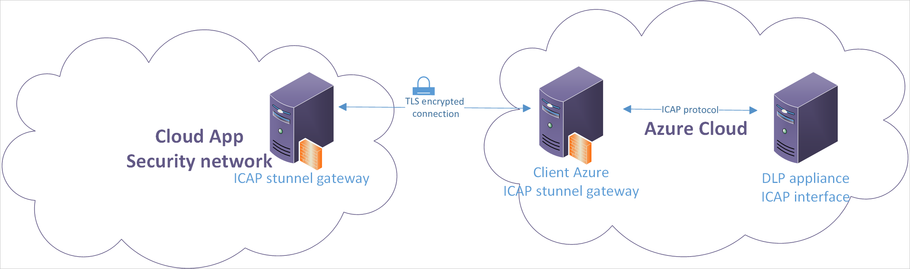

---
# required metadata

title: Cloud App Security third-party DLP integration over secure ICAP | Microsoft Docs
description: This topic provides the steps necessary for configuring the ICAP connection in Cloud App Security and the stunnel setup.
keywords:
author: rkarlin
ms.author: rkarlin
manager: mbaldwin
ms.date: 6/1/2017
ms.topic: article
ms.prod:
ms.service: cloud-app-security
ms.technology:
ms.assetid: 9656f6c6-7dd4-4c4c-a0eb-f22afce78071

# optional metadata

#ROBOTS:
#audience:
#ms.devlang:
ms.reviewer: reutam
ms.suite: ems
#ms.tgt_pltfrm:
#ms.custom:

---

# Integrating Cloud App Security with third-party DLP solutions

Cloud App Security is a cloud access security broker, delivering visibility, governance and protection for SaaS applications. The Cloud App Security platform extends the boundaries of enterprise security into the cloud, allowing organizations to secure data, gain actionable intelligence into cloud application usage and detect suspicious activities, without painful network configuration or endpoint changes.  
The solution can integrate with existing on-premises controls to extend these controls to the cloud while preserving a consistent and unified policy across on-premises and cloud activities. The platform exports easy-to-use interfaces including REST API and ICAP, enabling integration with content classification, DLP (data leakage protection) systems such as Symantec Data Loss Prevention (formerly Vontu Data Loss Prevention) or RSA Data Loss Prevention. This article provides a highlevel overview of the integration with 3rd party DLP services with a focus on Symantec Vontu DLP. 

## Deployment

App connector deployment is an out-of-band, non-intrusive configuration that takes only a few minutes per application to set up. The organization’s SaaS administrator logs into the Cloud App Security console and authorizes Cloud App Security as a 1st-party/3rd-party application with access to private APIs. This allows Cloud App Security to collect user identity and activity information including login/logout, location, duration, uploads, downloads, sharing privileges, and to be able to scan files stored in the cloud.   

### Integration with on-premises systems

The Cloud App Security cloud access security platform extends an organization’s existing investment in security solutions to the cloud. Specifically, in the case of DLP, an organization’s on-premises DLP system already manages a complex set of rules customized for the organization’s compliance requirements. Instead of redefining the rule set inside Cloud App Security, the DLP integration option allows an organization to extend on-premises DLP to the cloud, managing DLP policies in one centralized location. To enable such integration scenarios, the Cloud App Security policy engine was designed from the ground up to be extensible and support additional classification and processing engines.

## Symantec Deployment Guide 
The supported Symantec DLP versions are 11.X+.  
The customer deploys a detection server in the same Azure data center where his Cloud App Security tenant resides. The detection server syncs with the enforce server through a dedicated IPSec tunnel.  
 
### Detection server installation

The detection server used by Cloud App Security is a standard Network Prevent for Web server. There are several configuration options that should be changed during installation: 
- Disable Trial Mode  
- Change the **Ignore Responses Smaller Than** value to 1 under **Response Filtering**.  
- Add **application/** to the **Inspect Content Type** list under **Response Filtering**.  
 
### Policy configuration

Cloud App Security seamlessly supports all detection rule types included with Symantec DLP, so there is no need to alter existing rules. However, there is a configuration change that must be applied to all existing and new policies to enable full integration. This change is the addition of a specific response rule to all policies.  
Add the configuration change to your Vontu: 
1. Create a new response rule of the **Automated Response** type  
2. Under Actions, select **Block HTTP/HTTPS** and click **Add Action**. 
3. The rule name and rejection message are not relevant 

Adding the rule to the existing policies: 

1. Edit the policy.
2. Click on the **Response** tab. 
3. Select the response rule created above and add it.

This rule must be added to all existing policies.  

### Notes and limitations: 
- DLP rules in the server must be configured with “Block” for the policy to trigger, any other result is ignored. 
- The file information which triggered the violation can be investigated in Cloud App Security. While the details of the violation itself and cause are presented in Symantec UI. 
- Cloud App Security cannot enforce a specific DLP policy, all polices are checked 
- Communication with the detection server is via ICAP which is an unencrypted protocol. Additional layer of protection can be added via Stunnel.  
  
### Admin experience 

#### Security Extension Configuration 

Configuration of the DLP connector is performed via a support ticket. Once the configuration is complete, the connector can be viewed from Settings->Security Extensions->External DLP providers.  
 
 
#### Policy setup 

The image below depicts a file policy which detects sensitive files which are publicly shared on One Drive. All public files are sent to Symantec for inspection to determine whether the file is sensitive or not. 
 
 
#### DLP Violations 

Violations appear in MCAS as any other file policy violations both as a policy report and as an alert (if configured). The print screen below depicts a file policy with two file violations. The policy scans the files via Symantec integration. 
Microsoft Cloud App Security 3rd Party DLP 
 
 
 
 
# Third-party DLP integration over secure ICAP 
Cloud App Security allows you to leverage existing investments in third-party classification systems such as Symantec Vontu and ForcePoint Data Loss Prevention (DLP), and enables you to scan the contents of cloud applications using existing deployments running in your environment. This is accomplished by leveraging the standard ICAP protocol.
ICAP is an http-like protocol described in [RFC 3507](https://tools.ietf.org/html/rfc3507). In order to secure ICAP for transmission of your DLP data, it is recommended that you set up a secure SSL tunnel, or stunnel, between your DLP solution and Cloud App Security. The stunnel setup provides TLS encryption functionality to your DLP data as it passes between your DLP server and Cloud App Security. 
This guide provides the steps necessary for configuring the ICAP connection in Cloud App Security and the stunnel setup to secure communication through it.

Follow these steps to get up and running:
1.	Set up ForcePoint Protector ICAP
2.	Set up stunnel
3.	Connect to Cloud App Security

## Architecture
Since Cloud App Security runs in Azure, a deployment in Azure will yield improved performance. However, other options including other Clouds and On-Premises deployment are supported. Deploying in other environments may result in degraded performance due to higher latency and lower throughput. The ICAP server and stunnel should be deployed together on the same network to make sure the traffic is encrypted.

## Prerequisites
In order for CAS to be able to reach the ICAP server, you need to open the following IP addresses and ports and make the proper adjustments to your network configuration, by opening the Firewall to the CAS external IP address with a dynamic port. 
By default the port number is set to 11344. You can change this to another port if necessary, but be sure to update the support ticket you create in the next step with this information.
1.	Source addresses: 
Refer to [Connect apps, under Prerequisites](enable-instant-visibility-protection-and-governance-actions-for-your-apps.md#prerequisites)
2.	Source TCP port: 
Dynamic
3.	Destination address(es): 
IPs of the stunnel  connected to the ForcePoint ICAP server(s) that you will configure in the next steps
4.	Destination TCP port:
As defined in your network

## STEP 1:  Set up ForcePoint DLP ICAP integration
1.	In your ForcePoint appliance, go to **Deployment** > **System Modules**. 

2.	In the **General** tab, make sure **ICAP Server** is **Enabled** and the default **Port** is set to **1344**. 
Also, under **Allow connection to this ICAP Server from the following IP addresses**, select **Any IP address**.
 

3.	In the HTTP/HTTPS tab, make sure to set **Mode** to **Blocking**.
 
 
 
## STEP 2:  Set up stunnel

### Prerequisite

**A server** - either Linux based on a major distribution, or Windows Server. 
Refer to the stunnel website for details about the types of servers that support stunnel installation. If you are using Linux, you can use your Linux distribution manager to install it. This guide provides instructions that are appropriate for installation on an Ubuntu server, when signed in as root user. 

### Install stunnel

On the prepared server, download and install the latest version of stunnel by running the following command on your Ubuntu server which will install both stunnel and OpenSSL:

    sudo -i
    sudo apt-get update
    sudo apt-get install openssl -y
	sudo apt-get install stunnel4 -y
Verify that stunnel is installed by running the following command from a console. You should get the version number and a list of configuration options:

	stunnel-version

### Generate certificates

The DLP server and Cloud App Security use the private key and public certificate for server encryption and authentication across the stunnel. 
Make sure you create the private key without a pass phrase so that stunnel can run as a background service. Also, set the permission on the files to **readable** for the stunnel owner and to **none** for everyone else.
You can create the certificates on one of the following ways:
-	Use your certificate management server to create an SSL certificate on your DLP server, and then copy the keys to the server you prepared for the stunnel installation. 
-	Or, on the stunnel server, use the following OpenSSL commands to generate a private key and a self-signed certificate. 
Replace these variables:
    - “key.pem” with the name of your private key
    - “cert.pem” with the name of your certificate
    - “stunnel-key” with the name of the newly created key
       
        openssl genrsa -out key.pem 2048
        openssl req -new -x509 -key key.pem -out cert.pem -days 1095
        cat key.pem cert.pem >> /etc/ssl/private/stunnel-key.pem

### Download the Cloud App Security stunnel client public key

Download the public key from this location: https://adaprodconsole.blob.core.windows.net/icap/publicCert.pem
And save it in this location: 
**/etc/ssl/certs/<CAfile>.pem**

### Configure stunnel
1.	stunnel gets its configuration settings from the stunnel.conf file, found in <stunnel_dir>/tools.
2.	First, create the stunnel.conf file here: 
**vim /etc/stunnel/stunnel.conf**
3.	Open the file and paste in the following server configuration lines, where **DLP Server IP** is the IP address of your DLP server, **stunnel-key** is the key you created in the previous step, and **CAfile** is the public certificate of the Cloud App Security stunnel client:

    [microsoft-cas]
    accept = 0.0.0.0:11344
    connect = <DLP Server IP>:1344
    cert = /etc/ssl/private/<stunnel-key>.pem
    CAfile = /etc/ssl/certs/<CAfile>.pem
    TIMEOUTclose = 1

> [!NOTE] 
> By default the port number is set to 11344. You can change this to another port if necessary, but be sure to update the support ticket you create in the next step with this information.

### Update your IP table
Update your IP address table with the following route rule:
    iptables -I INPUT -p tcp --dport 11344 -j ACCEPT 

### Run stunnel
1.	On your DLP server, run the following:

    vim /etc/default/stunnel4

2.	Change the variable ENABLED to 1:

ENABLED=1

3.	Restart the service for the configuration to take effect:

    /etc/init.d/stunnel4 restart

4.	Run the following commands to verify that the stunnel is running properly:

    ps -A | grep stunnel

and that it is listening on the port listed:

    netstat -anp | grep 11344

5.	If the process is still not running, refer to the [stunnel documentation](https://www.stunnel.org/docs.html) to troubleshoot.

## STEP 3:  Connect to Cloud App Security
Open a support ticket with Cloud App Security and include:
- The IP address and port number of the server on which you installed stunnel.
- The public certificate of the root CA that created the private key.
- If the certificate was generated by OpenSSL commands, send the cert.pem (the certificate) instead of the root CA.
