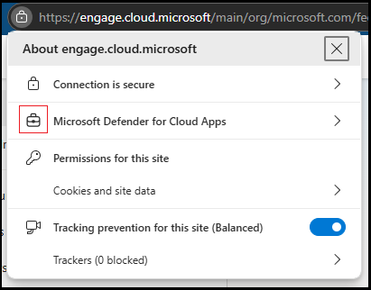

# In-browser protection with Microsoft Edge for Business (Preview)

Defender for Cloud Apps users who use Microsoft Edge for Business and are subject to session policies are protected directly from within the browser. In-browser protection reduces the need for proxies, improving both security and productivity.

Protected users experience a smooth experience with their cloud apps, without latency or app compatibility issues, and with a higher level of security protection.

## In-browser protection requirements

To use in-browser protection, users must be in their browser's work profile. 

Microsoft Edge profiles allow users to split browsing data into separate profiles, where the data that belongs to each profile is kept separate from the other profiles. For example, when users have different profiles for personal browsing and work, their personal favorites and history aren't synchronized with their work profile.

When users have separate profiles, their work browser (Microsoft Edge for Business) and personal browser (Microsoft Edge) have separate caches and storage locations, and information remains separate.

To use in-browser protection, users must also have the following environmental requirements in place:

|Requirement  |Description  |
|---------|---------|
|**Operating systems**     |   Windows 10 or 11, macOS      |
|**Identity platform**     | Microsoft Entra ID        |
|**Microsoft Edge for Business versions**     |   The last 2 stable versions (for example, if the newest Edge is 126, in-browser protection works for v126 and v125).   See [Microsoft Edge releases](https://learn.microsoft.com/deployedge/microsoft-edge-release-schedule#microsoft-edge-releases)     |
|**Supported session policies**     | - Block\Monitor of file download (all files\sensitive files)  - Block\Monitor file upload (all files\sensitive files)  - Block\Monitor copy\cut\paste  - Block\Monitor print  - Block\Monitor malware upload  - Block\Monitor malware download    Users that are served by multiple policies, including at least one policy that's *not* supported by Microsoft Edge for Business, their sessions are always served by the reverse proxy.   Policies defined in the Microsoft Entra ID portal are also always served by reverse proxy.   |

All other scenarios are served automatically with the standard reverse proxy technology, including user sessions from browsers that don't support in-browser protection, or for policies not supported by in-browser protection.

For instance, these scenarios are served by the reverse proxy:
- Google Chrome users
- Microsoft Edge users who are scoped to a protect file download policy
- Microsoft Edge users on Android devices
- Users in apps that use the OKTA authentication method
- Microsoft Edge users in InPrivate mode
- Microsoft Edge users with older browser versions
- B2B guest users
- Session is scoped to conditional access policy defined in Entra ID portal

## User experience with in-browser protection

To confirm that in-browser protection is active, users need to click on the “lock” icon in the browser's address bar and look for the “suitcase” symbol in the form that appears. The symbol indicates that the session is protected by Defender for Cloud Apps. For example:

Also, the `.mcas.ms` suffix doesn't appear in the browser address bar with in-browser protection, as it does with standard Conditional Access app control, and developer tools are turned off with in-browser protection.

### Work profile enforcement for in-browser protection

To access a work resource in *contoso.com* with in-browser protection, users must sign in with their *username@contoso.com* profile. If users try to access the work resource from outside the work profile, they're prompted to switch to the work profile or create one if it doesn't exist. Users can also choose to continue with their current profile, in which case they're served by the [reverse proxy architecture](proxy-intro-aad.md).

If the user decides to create a new work profile, they're prompted with the **Allow my organization to manage my device** option. In such cases, users don't need to select this option to create the work profile or benefit from in-browser protection.

For more information, see [Microsoft Edge for Business](/deployedge/microsoft-edge-for-business) and [How to add new profiles to Microsoft Edge](https://www.microsoft.com/en-us/edge/learning-center/how-to-add-new-profiles).

## Configure in-browser protection settings

In-browser protection with Microsoft Edge for Business is turned on by default. Admins can turn the integration off and on, and can configure a prompt for non-Edge users to switch to Microsoft Edge for enhanced performance and security.

**To configure in-browser protection settings:**

1. In the Microsoft Defender portal, select **Settings > Cloud Apps > Conditional Access App Control > Edge for Business protection**.

1. Configure the following settings as needed:

    - Toggle the **Turn on Edge for Business protection** option **Off** or **On**.
    - Select to **Notify users in non-Edge browsers to use Microsoft Edge for Business for better performance and security**.

        If you selected to notify non-Edge users, select to either use the default message or customize your own message.

1. Select **Save** when you're done to save your changes.

## Working with Microsoft Purview and Endpoint data loss prevention

If the same exact context and action are configured for both Defender for Cloud Apps policies and a Microsoft Purview Endpoint data loss prevention policy (DLP), the Endpoint DLP policy is applied.

For example, if you have an Endpoint DLP policy that blocks a file upload to Salesforce, and you also have a Defender for Cloud Apps policy that monitors file uploads to Salesforce, the Endpoint DLP policy is applied.

For more information, see [Learn about data loss prevention](/purview/dlp-learn-about-dlp).

## Enforce Edge in-browser when accessing business apps
Administrators who understand the power of Edge in-browser protection, can require their users to use Edge when accessing corporate resources. 
A primary reason is security, since the barrier to circumventing session controls using Edge is much higher than with reverse proxy technology.

Admin experience   
The feature is controlled through the following settings:   
M365 Defender > Settings > Cloud Apps > Edge for Business protection > Enforce usage of Edge for business   

The following options are available:   
- Do not enforce (default)   
- Allow access only from Edge   
- Enforce access from Edge when possible

Admins have the option to apply policies on all devices or only on unmanaged devices.

**Allow access only from Edge** means that access to the business application, scoped to session policies, can only be obtained via the Edge browser.

**Enforce access from Edge when possible** means that users should use Edge to access the application if their context permits, but if not, they may use a different browser to access the protected application.

For example: 
If a user is subject to a policy that does not align with in-browser protection capabilities (such as, 'Protect file upon download'), OR 
the Operating System is incompatible (for instance, Android). 
In that scenario, because the user lacks control over the context, they may opt to use a different browser. 
If the policies applicable to him allow it and the operating system is compatible (Windows 10, 11, macOS), then he is required to utilize Edge. 

## Related content

For more information, see [Microsoft Defender for Cloud Apps Conditional Access app control](proxy-intro-aad.md).
