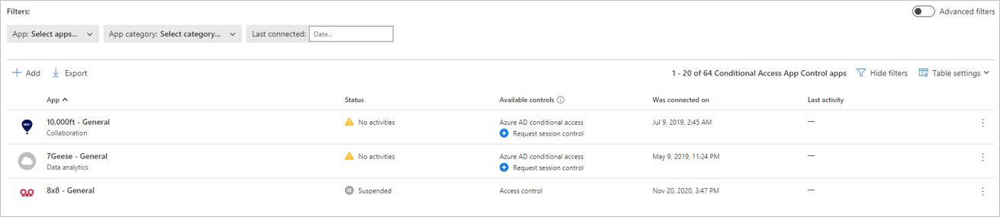

## Add the app manually and install certificates, if necessary

Applications in the app catalog are automatically populated into the table under Connected Apps. Check that the app you want to deploy is recognized by navigating there.

1. In the menu bar of Defender for Cloud Apps, select the settings cog , and select the **Conditional Access App Control** tab to access a table of applications that can be configured with access and session policies.

    

1. Select the **App: Select apps…** dropdown menu to filter and search for the app you want to deploy.

    

1. If you don't see the app there, you'll have to manually add it.

### How to manually add an unidentified app

1. In the banner, select **View new apps**.

    

1. In the list of new apps, for each app that you're onboarding, select the **+** sign, and then select **Add**.

    > [!NOTE]
    > If an app does not appear in the Defender for Cloud Apps app catalog, it will appear in the dialog under unidentified apps along with the login URL. When you click the + sign for these apps, you can onboard the application as a custom app.

    

### To add domains for an app

Associating the correct domains to an app allows Defender for Cloud Apps to enforce policies and audit activities.

For example, if you've configured a policy that blocks downloading files for an associated domain, file downloads by the app from that domain will be blocked. However, file downloads by the app from domains not associated with the app won't be blocked and the action won't be audited in the activity log.
> [!NOTE]
> Defender for Cloud Apps still adds a suffix to domains not associated with the app to ensure a seamless user experience.

1. From within the app, on the Defender for Cloud Apps admin toolbar, select **Discovered domains**.
    > [!NOTE]
    > The admin toolbar is only visible to users with permissions to onboard or maintenance apps.
1. In the Discovered domains panel, make a note of domain names or export the list as a .csv file.
    > [!NOTE]
    > The panel displays a list of discovered domains that are not associated in the app. The domain names are fully qualified.
1. Go to Defender for Cloud Apps, in the menu bar, select the settings cog  and select **Conditional Access App Control**.
1. In the list of apps, on the row in which the app you're deploying appears, choose the three dots at the end of the row, and then under **APP DETAILS**, choose **Edit**.
    > [!TIP]
    > To view the list of domains configured in the app, select **View app domains**.
1. In **User-defined domains**, enter all the domains you want to associate with this app, and then select **Save**.
    > [!NOTE]
    > You can use the * wildcard character as a placeholder for any character. When adding domains, decide whether you want to add specific domains (`sub1.contoso.com`,`sub2.contoso.com`) or multiple domains (`*.contoso.com`).

### Install root certificates

1. Repeat the following steps to install the **Current CA** and **Next CA** self-signed root certificates.
    1. Select the certificate.
    1. Select **Open**, and when prompted select **Open** again.
    1. Select **Install certificate**.
    1. Choose either **Current User** or **Local Machine**.
    1. Select **Place all certificates in the following store** and then select **Browse**.
    1. Select **Trusted Root Certificate Authorities** and then select **OK**.
    1. Select **Finish**.

    > [!NOTE]
    > For the certificates to be recognized, once you have installed the certificate, you must restart the browser and go to the same page.<!-- You'll see a check-mark by the certificates links confirmation they are installed.-->

1. Select **Continue**.
1. Check that the application is available in the table.

    

## Verify that the app is working correctly

To verify that the application is being proxied, first perform either a hard sign-out of browsers associated with the application or open a new browser with incognito mode.

Open the application and perform the following checks:

- Check that the URL contains the `.mcas` suffix
- Visit all pages within the app that are part of a user's work process and verify that the pages render correctly.
- Verify that the behavior and functionality of the app isn't adversely affected by performing common actions such as downloading and uploading files.
- Review the list of domains associated with the app. For more information, see [Add the domains for the app](#add-domains).

If you encounter errors or issues, use the admin toolbar to gather resources such as `.har` files and recorded sessions for filing a support ticket. For more information, see [link]().

## Enable the app for use in your organization

Once you're ready to enable the app for use in your organization's production environment, do the following steps.

1. In Defender for Cloud Apps, select the settings cog , and then select **Conditional Access App Control**.
1. In the list of apps, on the row in which the app you're deploying appears, choose the three dots at the end of the row, and then choose **Edit app**.
1. Select **Use with Conditional Access App Control** and then select **Save**.

    
