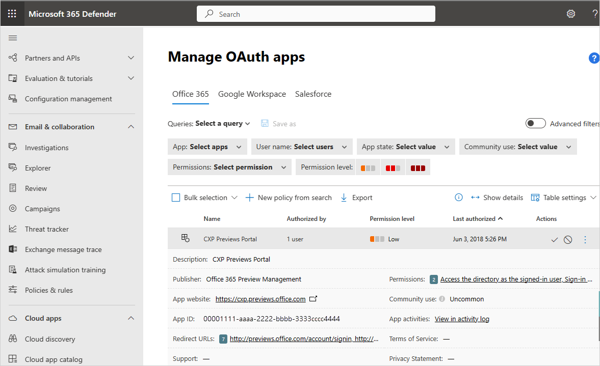

---
# required metadata

title: Investigate risky OAuth apps - Cloud App Security | Microsoft Docs
description: This article provides information on how to investigate risky OAuth apps in Cloud App Security.
keywords:
author: rkarlin
ms.author: rkarlin
manager: barbkess
ms.date: 04/08/2019
ms.topic: tutorial
ms.collection: M365-security-compliance
ms.prod:
ms.service: cloud-app-security
ms.technology:
ms.assetid: 4118681e-362f-4b10-aa08-39691aa7800a

# optional metadata

#ROBOTS:
#audience:
#ms.devlang:
ms.reviewer: reutam
ms.suite: ems
#ms.tgt_pltfrm:
ms.custom: seodec18

---
# Tutorial: Investigate risky OAuth apps

*Applies to: Microsoft Cloud App Security*

OAuth is an open standard for token-based authentication and authorization. OAuth enables a user's account information to be used by third-party services, without exposing the user's password. OAuth acts as an intermediary on behalf of the user, providing the service with an access token that authorizes specific account information to be shared. 

For example, an app that analyses the user’s calendar and gives him advice on how to become more productive needs access to the user’s calendar. Instead of providing the user’s credentials, OAuth enables the app to get access to the data based only on a token, which is generated when the user provides consent to a page as can be seen in the below picture.

  

Many third-party apps that might be installed by business users in your organization, request permission to access user information and data and sign in on behalf of the user in other cloud apps. When users install these apps, they often click **accept** without closely reviewing the details in the prompt, including granting permissions to the app. Accepting third-party app permissions is a potential security risk to your organization.

For example, the following OAuth app consent page might look legitimate to the average user, however, “Google APIs Explorer” shouldn't need to request permissions from Google itself. So this indicates that the app might be a phishing attempt, not related to Google at all.

  

As a security admin, you need visibility and control over the apps in your environment and that includes the permissions they have. You need the ability to prevent use of apps that require permission to resources you wish to revoke. Therefore, Microsoft Cloud App Security provides you with the ability to investigate and monitor the app permissions your users granted. This article is dedicated to helping you investigate the OAuth apps in your organization, and focus on the apps that are more likely to be suspicious. 

Our recommended approach is to investigate the apps by using the abilities and information provided in the Cloud App Security portal to filter out apps with a low chance of being risky, and focus on the suspicious apps. 

## How to detect risky OAuth apps

Detecting a risky OAuth app can be accomplished using: 

- **Alerts**: React to an alert triggered by an existing policy. 
- **Hunting**: Search for a risky app among all the available apps, without concrete suspicion of a risk. 

### Detect risky apps using alerts

You can set policies to automatically send you notifications when an OAuth app meets certain criteria. For example, you can set a policy to automatically notify you when an app is detected that requires high permissions and was authorized by more than 50 users. For further details on creating OAuth policies, see [OAuth app policies](app-permission-policy.md).

### Detect risky apps by hunting

1.	In the portal, go to **Investigate** and then **OAuth apps**. Use the filters and queries to review what's happening in your environment:

    - Set the filter to **Permission level high severity** and **Community use not common**. Using this filter, you can focus on apps that are potentially very risky, where users may have underestimated the risk.
    - Under **Permissions** select all the options that are particularly risky in a specific context. For example, you can select all the filters that provide permission to email access, such as **Full access to all mailboxes** and then review the list of apps to make sure that they all really need mail-related access. This can help you investigate within a specific context, and find apps that seem legitimate, but contain unnecessary permissions. These apps are more likely to be risky. 
    
       
 
    - Select the saved query **Apps authorized by external users**. Using this filter, you can find apps that might not be aligned with your company’s security standards.
2.	After you review your apps, you can focus on the apps in the queries that seem legitimate but might actually be risky. Use the filters to find them:
    - Filter for apps that are **Authorized by a small number of users**. If you focus on these apps, you can look for risky apps that were authorized by a compromised user.
    - Apps that have permissions that don’t match the app’s purpose, for example, a clock app with full access to all mailboxes.
3. Click on each app to open the app drawer, and check to see if the app has a suspicious name, publisher, or website.
1. Look at the list of apps and target apps that have a date under **Last authorized** that isn't recent. These apps may no longer be required. 

    

## How to investigate

After you determine that an app is suspicious and you want to investigate it, we recommend the following key principles for efficient investigation: 

- The more common and used an app is, either by your organization or online, the more likely it is to be safe.
- An app should require only permissions that are related to the app's purpose. If that’s not the case, the app might be risky. 
- Apps that require high privileges or admin consent are more likely to be risky. 

1. Click on the app to open the app drawer and click the link under **Related activities**. This opens the Activity log page filtered for activities performed by the app. Keep in mind that some apps perform activities that are registered as having been performed by a user. These activities are automatically filtered out of the results in the Activity log. For further investigation using the activity log, see [Activity log](activity-filters.md). 
4. If an app seems suspicions, we recommended that you investigate the app’s name and publisher in different app stores. Focus on following apps, which might be suspicions: 
    - Apps with a low number of downloads.
    - Apps with a low rating or score or bad comments.
    - Apps with a suspicious publisher or website.
    - Apps whose last update is not recent. This might indicate an app that is no longer supported. 
    - Apps that have irrelevant permissions. This might indicate that an app is risky. 
5. If the app is still suspicious, you can research the app name, publisher, and URL online. 

## How to remediate 

After you determine that an OAuth app is risky, Cloud App Security provides the following remediation options: 

- **Manual remediation**: 
You can easily [ban revoke an app from the OAuth apps page](manage-app-permissions.md#ban-or-approve-an-app)

- **Automatic remediation**: You can create a policy that [automatically revokes an app or revokes a specific user from an app](app-permission-policy.md).

 
## Next steps
[Daily activities to protect your cloud environment](daily-activities-to-protect-your-cloud-environment.md) 

[Premier customers can also create a new support request directly in the Premier Portal.](https://premier.microsoft.com/) 
 
