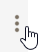
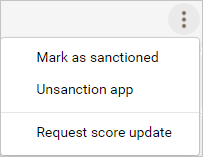
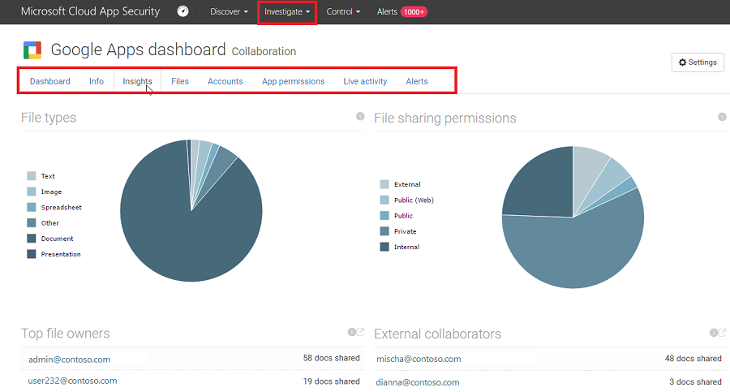
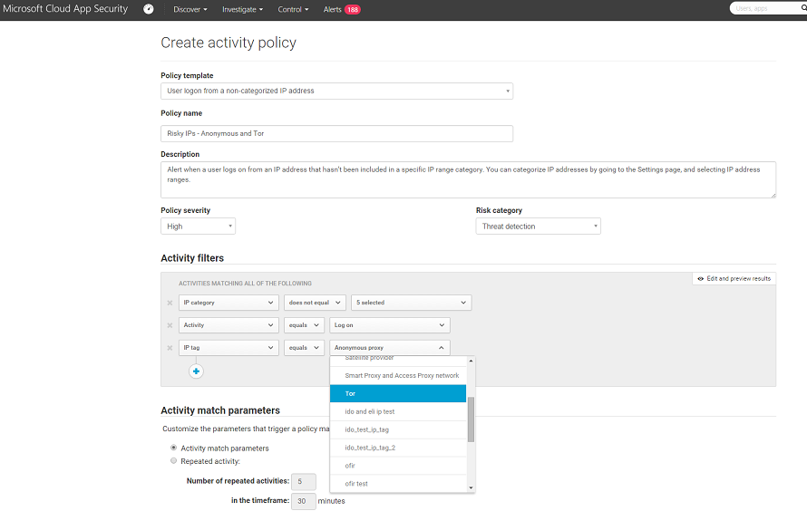

# Investigate cloud app risks and suspicious activity

After Microsoft Defender for Cloud Apps runs in your cloud environment, you'll need a stage of learning and investigating. Learn to use the Microsoft Defender for Cloud Apps tools to gain a deeper understanding of what's happening in your cloud environment. Based on your particular environment and how it's being used, you can identify the requirements for protecting your organization from risk. This article describes how to do an investigation to get a better understanding of your cloud environment.

## Tag apps as sanctioned or unsanctioned

An important step to understanding your cloud is to tag apps as sanctioned or unsanctioned. After you sanction an app, you can filter for apps that aren't sanctioned and start migration to sanctioned apps of the same type.

- In the Microsoft Defender Portal, under **Cloud Apps**, go to the **Cloud app catalog** or **Cloud discovery** - > **Discovered apps**.

- In the list of apps, on the row in which the app you want to tag as sanctioned appears, choose the three dots at the end of the row  and choose **Sanctioned**.

    

## Use the investigation tools

1. In the Microsoft Defender Portal, under **Cloud Apps**, go to the **Activity log** and filter by a specific app. Check the following items:

    - Who is accessing your cloud environment?

    - From what IP ranges?

    - What is the admin activity?

    - From what locations are admins connecting?

    - Are any outdated devices connecting to your cloud environment?

    - Are failed logins coming from expected IP addresses?

2. In the Microsoft Defender Portal, under **Cloud Apps**, go to **Files**, and check the following items:

    - How many files are shared publicly so that anyone can access them without a link?

    - With which partners are you sharing files (outbound sharing)?

    - Do any files have a sensitive name?

    - Are any of the files being shared with someone's personal account?

3. In the Microsoft Defender Portal, go to **Identities**, and check the following items:

    - Have any accounts been inactive in a particular service for a long time? Maybe you can revoke the license for that user to that service.

    - Do you want to know which users have a specific role?

    - Was someone fired but they still have access to an app and can use that access to steal information?

    - Do you want to revoke a user's permission to a specific app or require a specific user to use multi-factor authentication?

    - You can drill down into the user's account by selecting the three dots at the end of the user's account row and selecting an action to take. Take an action such as **Suspend user** or **Remove user's collaborations**. If the user was imported from Microsoft Entra ID, you can also select **Microsoft Entra account settings** to get easy access to advanced user management features. Examples of management features include group management, MFA, details about the user's sign ins, and the ability to block sign in.

4. In the Microsoft Defender Portal, select **Settings**. Then choose **Cloud Apps**. Under **Connected Apps**, select **App connectors**, then select an app. The app dashboard opens and gives you information and insights. You can use the tabs across the top to check:

    - What kind of devices are your users using to connect to the app?

    - What types of files are they saving in the cloud?

    - What activity is happening in the app right now?

    - Are there any connected third-party apps to your environment?

    - Are you familiar with these apps?

    - Are they authorized for the level of access they're permitted?

    - How many users have deployed them? How common are these apps in general?

    

5. In the Microsoft Defender Portal, under **Cloud Apps**, go to **Cloud Discovery**. Select the **Dashboard** tab and check the following items:

    - What cloud apps are being used, to what extent, and by which users?

    - For what purposes are they being used?

    - How much data is being uploaded to these cloud apps?

    - In which categories do you have sanctioned cloud apps, and yet, users are using alternative solutions?

    - For the alternative solutions, do you want to unsanction any cloud apps in your organization?

    - Are there cloud apps that are used but not in compliance with your organization's policy?

## Sample investigation

Let's say that you assume you don't have any access to your cloud environment by risky IP addresses. As an example, let's say Tor. But you create a policy for risk IPs just to make sure:

1. In the Microsoft Defender Portal, under **Cloud Apps**, go to **Policies** -> **Policy templates**.

2. Choose the **Activity policy** for the **Type**.

3. At the end of the **Logon from a risky IP address** row, choose the plus sign (**+**) to create a new policy.

4. Change the policy name so you can identify it.

5. Under **Activities matching all of the following**, choose **+** to add a filter. Scroll down to **IP tag**, and then choose **Tor**.

    

Now that you have the policy in place, you discover to see that you have an alert that the policy was violated.

1. In the Microsoft Defender Portal, go to **Incidents & alerts** -> **Alerts** and view the alert about the policy violation.

2. If you see that it looks like a real violation, you want to contain risk or remediate it.

    To contain risk, you can send the user a notification to ask if the violation was intentional and if the user was aware of it.

    You can also drill down into the alert and suspend the user until you can figure out what needs to be done.

3. If it's an allowed event that isn't likely to recur, you can dismiss the alert.

    If it's allowed and you expect it to recur, you can change the policy so that this type of event won't be considered a violation in the future.

## Next steps

- [Governing connected apps](governance-actions.md)

[!INCLUDE [Open support ticket](includes/support.md)].
