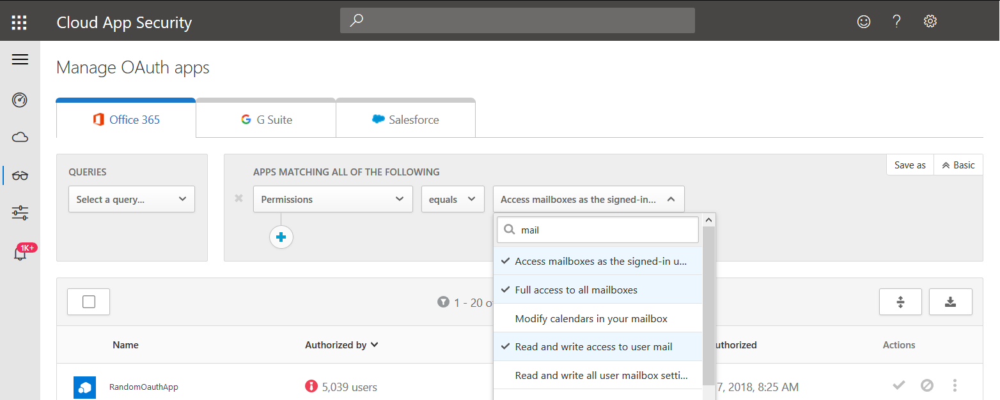
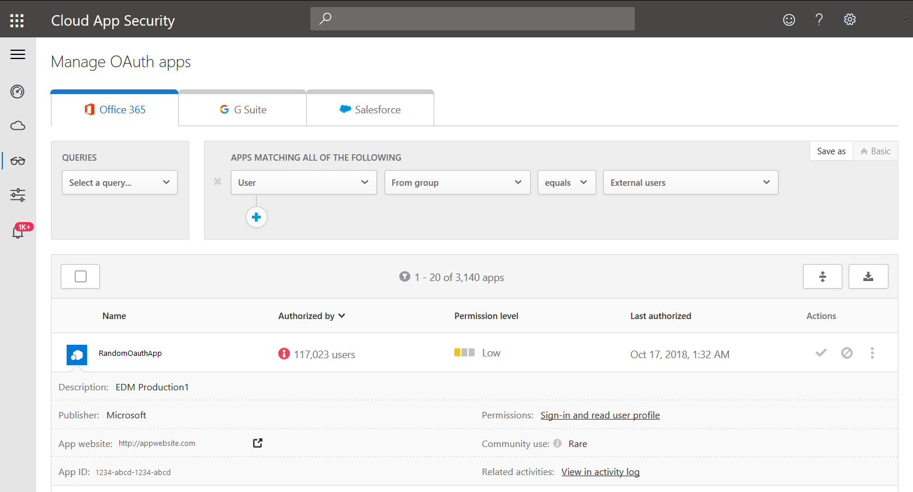

---
# required metadata

title: Investigate risky OAuth apps - Cloud App Security | Microsoft Docs
description: This article provides information on how to investigate risky OAuth apps in Cloud App Security.
keywords:
author: rkarlin
ms.author: rkarlin
manager: barbkess
ms.date: 3/17/2019
ms.topic: tutorial
ms.collection: M365-security-compliance
ms.prod:
ms.service: cloud-app-security
ms.technology:
ms.assetid: 4118681e-362f-4b10-aa08-39691aa7800a

# optional metadata

#ROBOTS:
#audience:
#ms.devlang:
ms.reviewer: reutam
ms.suite: ems
#ms.tgt_pltfrm:
ms.custom: seodec18

---
# Investigate risky OAuth apps

*Applies to: Microsoft Cloud App Security*

OAuth is an open standard for token-based authentication and authorization. OAuth enables a user's account information to be used by third-party services, without exposing the user's password. OAuth acts as an intermediary on behalf of the user, providing the service with an access token that authorizes specific account information to be shared.

Many third-party apps that might be installed by business users in your organization, request permission to access user information and data and sign in on behalf of the user in other cloud apps. When users install these apps, they often click **accept** without closely reviewing the details in the prompt, including granting permissions to the app.

Accepting third-party app permissions is a potential security risk to your organization, therefore, Microsoft Cloud App Security provides you with the ability to investigate and monitor the app permissions your users granted. This article is dedicated to helping you investigate the OAuth apps in your organization, and focus on the apps that are more likely to be suspicious. 

Our recommended approach is to investigate the apps by using the abilities and information provided in the Cloud App Security portal to filter out apps with a low chance of being risky, and focus on the suspicious apps. 

## How to investigate 

1.	In the portal, go to **Investigate** and then **OAuth apps**. We recommend that you query using one of the following filters: 
    - Select **Permission level** high severity and **Community use** not common. Using this filter, you can focus on apps with a high-risk potential, in which the users may have misunderstood the risk. 
    - Under **Permissions** select all the options that are particularly risky in a specific context, for example you can select all the filters that provide permissions to email access, for example **Full access to all mailboxes** and then review the list of apps to make sure that they are all apps that actually need mail-related access. This can help you investigate within a specific context, and find apps that seem legit but contain irrelevant permissions. Those apps are more likely to be malicious. 
     
    - Use the **Query** that lets you see **Apps authorized by external users**. Using this filter you can find apps that might not be aligned with your company’s security standards. 
2.	After you filter your apps, you can focus on the apps in the queries that seem legitimate but might actually be malicious, such as: 
    - Apps that are **Authorized by** a low number of users. If you focus on these apps, you can look for malicious apps that were authorized by a compromised user. 
    - Apps that have permissions that don’t match the app’s purpose, for example, a clock app with full access to all mailboxes. 
    - Click on each app to open the app drawer and check to see if the app has a suspicious name, publisher, or website.  
    - Look at the list of apps and target apps that have a date under **Last authorized** that isn't recent. These apps may no longer be required. 
     
 
3. Click on the app to open the app drawer and click the link under **Related activities**. This opens the Activity log page filtered for activities performed by the app. Keep in mind that some apps perform activities that are registered as having been performed by a user. These activities are automatically filtered out of the results in the Activity log. For further investigation using the activity log, see [Activity log](activity-filters.md). 
4. If an app seems suspicions, we recommended that you investigate the app’s name and publisher in different app stores. Focus on following apps, which might be suspicions: 
    - Apps with a low number of downloads.
    - Apps with a low rating or score or bad comments.
    - Apps with a suspicious publisher or website.
    - Apps wuhose last update is not recent. This might indicate an app that is no longer supported. 
    - Apps that have irrelevant permissions. This might indicate that an app is malicious. 
5. If the app is still suspicious, you can research the app name, publisher, and URL online. 

 
## Next steps
[Daily activities to protect your cloud environment](daily-activities-to-protect-your-cloud-environment.md) 

[Premier customers can also create a new support request directly in the Premier Portal.](https://premier.microsoft.com/) 
 
