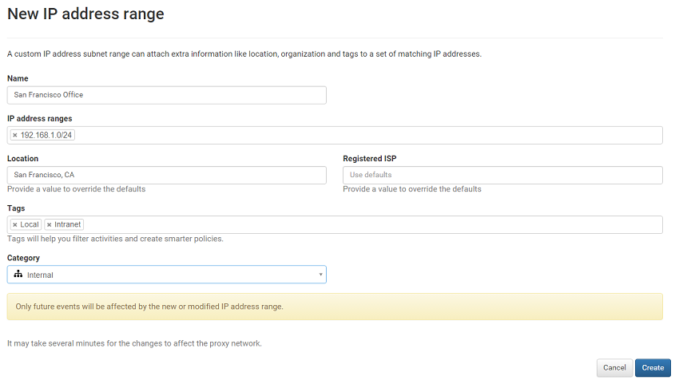

---
# required metadata

title: Set IP ranges and tags - Cloud App Security | Microsoft Docs
description: This article provides instructions for working with IP tags and IP categories.
keywords:
author: rkarlin
ms.author: rkarlin
manager: angrobe
ms.date: 12/16/2018
ms.topic: conceptual
ms.collection: M365-security-compliance
ms.prod:
ms.service: cloud-app-security
ms.technology:
ms.assetid: bbf54f66-4ce2-428c-afc8-b5a64277014f

# optional metadata

#ROBOTS:
#audience:
#ms.devlang:
ms.reviewer: reutam
ms.suite: ems
#ms.tgt_pltfrm:
ms.custom: seodec18
---
#   Working with IP ranges and tags

*Applies to: Microsoft Cloud App Security*

To easily identify known IP addresses, such as your physical office IP addresses, you need to set IP address ranges. IP address ranges allow you to tag, categorize, and customize the way logs and alerts are displayed and investigated. Each group of IP ranges can be categorized based on a preset list of IP categories. You're also able to create custom IP tags for your IP ranges. Additionally, you can override public geo-location information based on your internal network knowledge. Both IPv4 and IPv6 are supported. 

Cloud App Security comes preconfigured with built-in IP ranges for popular cloud providers such as Azure and Office 365. Additionally, we have built-in tagging based on Microsoft threat intelligence including anonymous proxy, Botnet, and Tor. You can see the full list in the drop-down on the IP address ranges page.

> [!NOTE]
> - To use these built-in tags as part of a search, refer to their ID in the Cloud App Security API documentation. 
> - You can add IP ranges in bulk by creating a script using the **IP address ranges API**. 
> - To view the API documentation, in the Cloud App Security portal menu bar, click the question mark then **API documentation**.

Built-in IP address tags and custom IP tags are considered hierarchically. Custom IP tags take precedence over built-in IP tags. For instance, if an IP address is tagged as **Risky** based on threat intelligence but there's a custom IP tag that identifies it as **Corporate**, the custom category and tags take precedence.

>[!NOTE]
> When an IP address is tagged as corporate, it is reflected in the portal, and the IP addresses are excluded from triggering specific detections (for example, impossible travel) because these IP addresses are considered trusted.
>

## Create an IP address range 

In the menu bar, click the settings icon. Select **IP address ranges**. Click the plus sign to add IP address ranges and set the following fields:  

  
1. **Name** your IP range. The name doesn't appear in the activities log, it's only used to manage your IP range.  
  
     To include the IP range in an IP category, select a category from the drop-down menu.  
  
2. Enter the **IP address range** you wish to configure and then click on the "+" button. You can add as many IP addresses and subnets as you want using network prefix notation (also known as CIDR notation), for example 192.168.1.0/32.  
  
3. **Categories** are used to easily recognize activities from interesting IP addresses. Categories are available in the portal. However, they typically require user configuration to determine which IP addresses are included in each category. The exception to this configuration is the "Risky" category, which includes two IP tags - Anonymous proxy and Tor.  
  
     The following IP categories are available:  
  
    - **Administrative**: These IPs should be all the IP addresses of your admins.  
  
    - **Cloud provider**: These IPs should be the IP addresses used by your cloud provider.
  
    - **Corporate**: These IPs should be all the IP addresses of your internal network, your branch offices, and your Wi-Fi roaming addresses.  
  
    - **Risky**: These IPs should be any IP addresses that you consider risky. They can include suspicious IP addresses you've seen in the past, IP addresses in your competitors' networks, and so on.  
  
    - **VPN**: These IPs should be any IP addresses you use for remote workers.
  
4. To **Tag** the activities from these IP addresses enter a tag. Entering a word into the box creates the tag. After you already have a configured tag, you can easily add it to additional IP ranges by choosing it from the list. You can add as many IP tags as you want for each range. IP tags can be used when building policies.  Along with IP tags you configure, Cloud App Security has built-in tags that aren't configurable. You can see the list of tags under the [IP tags filter](activity-filters.md).  
    > [!NOTE]  
    > - The Location and Registered ISP override defaults.
    > - IP tags are added to the activity without overriding data.

5. To **Override the Location** or Organization (ISP) fields for these addresses, enter new value. For example, say you have an IP address that is considered publicly to be in Ireland. However, you know the IP is in the US. You'll override the location for that IP address range.  
  
6. Enter a **Registered ISP**. This setting overrides the data in your activities.  
 
7. When you're done, click **Create**.  
  
       

## Next steps
[Set up Cloud Discovery](set-up-cloud-discovery.md)   

[Premier customers can also create a new support request directly in the Premier Portal.](https://premier.microsoft.com/)  
  
  
