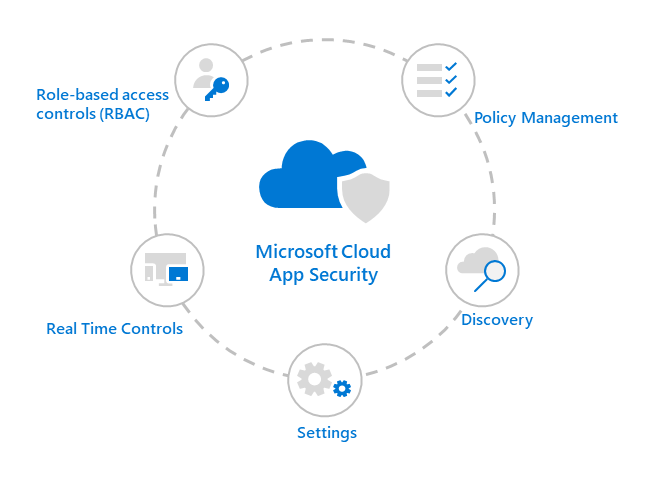

# Lifecycle management strategy in Defender for Cloud Apps

[!INCLUDE [Banner for top of topics](includes/banner.md)]

By using a lifecycle management strategy, you can ensure your configurations, exclusions, and policies for Microsoft Defender for Cloud Apps remain up to date and are reviewed on an established cadence.

>[!NOTE]
>Remember to also check [What's New in Defender for Cloud Apps](release-notes.md) to stay current with new features and releases.

To best maintain Defender for Cloud Apps posture, regularly follow the recommendations below:

## Role-based access controls

- [Review any users that have access to the Defender for Cloud Apps portal and verify role need](manage-admins.md)
- [Inventory external users with access to your environment and determine validity](manage-admins.md#invite-external-admins)

## Real-time controls

- [Add applications for additional control and visibility](enable-instant-visibility-protection-and-governance-actions-for-your-apps.md)
- [Remove old user/group exclusions from Conditional Access policy](/azure/active-directory/governance/conditional-access-exclusion)
- Update [SAML certificate for third-party identity provider](troubleshooting-proxy-end-users.md#not-able-to-access-app-from-a-non-microsoft-identity-provider) annually
- [Verify app onboarding members](proxy-deployment-any-app.md#add-admins-to-the-app-onboardingmaintenance-list)

## Policy management

- [Remove unneeded custom policies](control-cloud-apps-with-policies.md)
- [Review new policy templates](control-cloud-apps-with-policies.md#create-a-policy)
- Enhance policy strategy to determine what can be a [saved query](activity-filters-queries.md#activity-queries) versus what requires an [alert](/microsoft-365/security/defender/investigate-alerts)
- Ensure [labeling strategy](azip-integration.md) is in line with current Security and Compliance configuration

## Discovery

- [Upgrade log collector](log-collector-advanced-management.md)
- Remove old [data sources](set-up-cloud-discovery.md)
- [Add/Disable App Connectors](enable-instant-visibility-protection-and-governance-actions-for-your-apps.md)

## Settings

- Review [managed domains](general-setup.md)
- Verify current [IP ranges](ip-tags.md) for Corporate and VPN
- [Verify App Tag strategy and add/remove as needed](discovered-app-queries.md#creating-and-managing-custom-app-tags)
- Check rights on [admin quarantine folder](use-case-admin-quarantine.md)
- Adjust [score metrics](risk-score.md) based on industry best practices
- Review members allowed to view [private activities](activity-privacy.md)
- Verify integrations are enabled:
  - [Microsoft Purview Information Protection](tutorial-dlp.md#phase-2-classify-sensitive-information)
  - [Microsoft Defender for Endpoint](mde-integration.md)

## Next steps

> [!div class="nextstepaction"]
> [Defender for Cloud Apps best practices](best-practices.md)

[!INCLUDE [Open support ticket](includes/support.md)]
