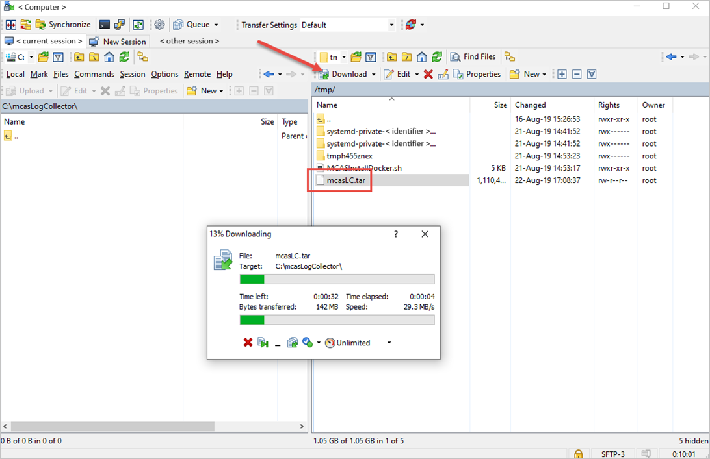
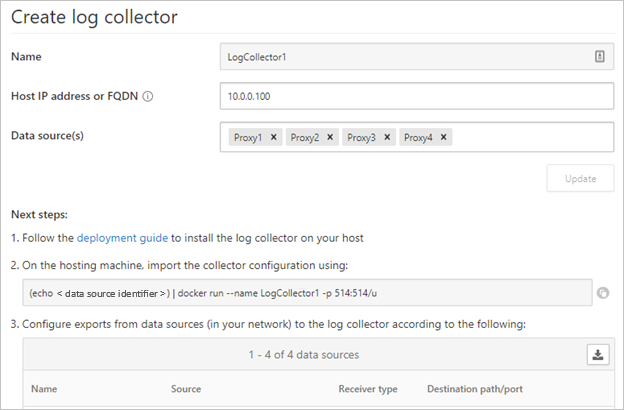
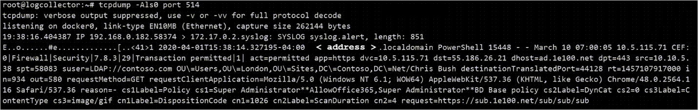
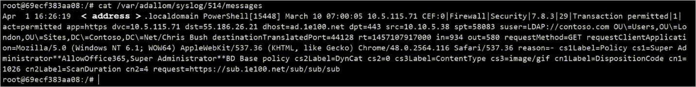

# Advanced log collector management

[!INCLUDE [Banner for top of topics](includes/banner.md)]

This article provides information about the following advanced configuration options for Defender for Cloud Apps Cloud Discovery log collectors:

- [Modify the log collector FTP configuration](#modify-the-log-collector-ftp-configuration)
- [Enable the log collector behind a proxy](#enable-the-log-collector-behind-a-proxy)
- [Move the log collector to a different data partition on Linux](#move-the-log-collector-to-a-different-data-partition-on-linux)
- [Inspect the log collector disk usage on Linux](#inspect-the-log-collector-disk-usage-on-linux)
- [Move the log collector to an accessible host](#move-the-log-collector-to-an-accessible-host)
- [Define custom ports for Syslog and FTP receivers for log collectors on Linux](#define-custom-ports-for-syslog-and-ftp-receivers-for-log-collectors-on-linux)
- [Validate the traffic and log format received by log collector on Linux](#validate-the-traffic-and-log-format-received-by-log-collector-on-linux)

## Modify the log collector FTP configuration

Use these steps to modify the configuration for your Defender for Cloud Apps Cloud Discovery Docker.

### Docker deployment

You might need to modify the configuration for the Defender for Cloud Apps Cloud Discovery Docker.

#### Changing the FTP password

1. Connect to the log collector host.

1. Run `docker exec -it <collector name> pure-pw passwd <ftp user>`

    1. Enter the new password.
    1. Enter the new password again for confirmation.

1. Run `docker exec -it <collector name> pure-pw mkdb` to apply the change.

    

#### Customize certificate files

Follow this procedure to customize the certificate files you use for secure connections to the Cloud Discovery Docker.

1. Open an FTP client and connect to the log collector.

    

1. Navigate to the `ssl_update` directory.
1. Upload new certificate files to the `ssl_update` directory (the names are mandatory).

    

    The following files are required:

    | Receiver type | Required files |
    | --- | --- |
    | **FTP** |- **pure-ftpd.pem**: Includes the key and certificate data |
    | **Syslog** |- **ca.pem**: Defines the certificate authority for the client certificate<br><br> **server-key.pem** and **server-cert.pem**: The collectors certificate and key |

    If any of the files are missing, the update won't take place.

1. In a terminal window run: `docker exec -t <collector name> update_certs`. The command should produce a similar output to what's seen in the following screenshot.

    

1. In a terminal window run: `docker exec <collector name> chmod -R 700 /etc/ssl/private/`.

## Enable the log collector behind a proxy

After you configured the log collector, if you are running behind a proxy, the log collector might have trouble sending data to Defender for Cloud Apps. This may happen because the log collector doesn't trust the proxy's root certificate authority and is not able to connect to Microsoft Defender for Cloud Apps to retrieve its configuration or upload the received logs.

Use these steps to enable your log collector behind a proxy.

>[!NOTE]
> For information on how to change the certificates used by the log collector for Syslog or FTP, and to resolve connectivity issues from the firewalls and proxies to the log collector, see [Modify the log collector FTP configuration](#modify-the-log-collector-ftp-configuration).
>

### Set up the log collector behind a proxy

Make sure you performed the necessary steps run Docker on a Windows or Linux machine and successfully download the Defender for Cloud Apps Docker image on the machine. For more information, see [Configure automatic log upload for continuous reports](discovery-docker.md).

#### Validate Docker log collector container creation

In the shell, verify that the container was created and is running using the following command:

```bash
docker ps
```


#### Copy proxy root CA certificate to the container

From your virtual machine, copy the CA certificate to the Defender for Cloud Apps container. In the following example, the container is named *Ubuntu-LogCollector* and the CA certificate is named *Proxy-CA.crt*.
Run the command on the Ubuntu host. It copies the certificate to a folder in the running container:

```bash
docker cp Proxy-CA.crt Ubuntu-LogCollector:/var/adallom/ftp/discovery
```

#### Set the configuration to work with the CA certificate

1. Go into the container, using the following command. It will open bash in the log collector container:

    ```bash
    docker exec -it Ubuntu-LogCollector /bin/bash
    ```

1. From a bash window inside the container, go to the Java `jre` folder. To avoid a version-related path error, use this command:

    ```bash
    cd "$(find /opt/jdk/*/jre -name "bin" -printf '%h' -quit)"
    cd bin
    ```

1. Import the root certificate that you copied earlier, from the *discovery* folder into the Java KeyStore and define a password. The default password is "changeit". For information about changing the password, see [How to change the Java KeyStore password](#how-to-change-the-java-keystore-password).

    ```bash
    ./keytool --import --noprompt --trustcacerts --alias SelfSignedCert --file /var/adallom/ftp/discovery/Proxy-CA.crt --keystore ../lib/security/cacerts --storepass <password>
    ```

1. Validate that the certificate was imported correctly into the CA keystore, by using the following command to search for the alias you provided during the import (*SelfSignedCert*):

    ```bash
    ./keytool --list --keystore ../lib/security/cacerts | grep self
    ```

    

You should see your imported proxy CA certificate.

#### Restrict IP addresses sending syslog messages to the log collector on Linux

To secure the docker image and ensure that only one IP address is allowed to send the syslog messages to the log collector, an IP table rule can be created on the host machine to allow input traffic over (TCP/601 or UDP/514 depending on the deployment) and drop the traffic coming over those ports.

This is an example of an IP table rule that can be added to the host machine to allow IP address 1.2.3.4 to connect to the log collector container over TCP port 601 and drop all other connections coming from other IP addresses over that port:

```bash
iptables -I DOCKER-USER \! --src 1.2.3.4 -m tcp -p tcp --dport 601 -j DROP
```

#### Set the log collector to run with the new configuration

The container is now ready.

Run the **collector_config** command using the API token that you used during the creation of your log collector:


When you run the command, specify your own API token:

```bash
collector_config abcd1234abcd1234abcd1234abcd1234 ${CONSOLE} ${COLLECTOR}
```


The log collector is now able to communicate with Defender for Cloud Apps. After sending data to it, the status will change from **Healthy** to **Connected** in the Defender for Cloud Apps portal.


>[!NOTE]
> If you have to update the configuration of the log collector, to add or remove a data source for example, you normally have to **delete** the container and perform the previous steps again. To avoid this, you can re-run the *collector_config* tool with the new API token generated in the Defender for Cloud Apps portal.

### How to change the Java KeyStore password

1. Stop the Java KeyStore server.
1. Open a bash shell inside the container and go to the *appdata/conf* folder.
1. Change the server KeyStore password by using this command:

    ```bash
    keytool -storepasswd -new newStorePassword -keystore server.keystore
    -storepass changeit
    ```

    > [!NOTE]
    > The default server password is *changeit*.

1. Change the certificate password by using this command:

    ```bash
    keytool -keypasswd -alias server -keypass changeit -new newKeyPassword -keystore server.keystore -storepass newStorePassword
    ```

    > [!NOTE]
    > The default server alias is *server*.

1. In a text editor, open the *server-install\conf\server\secured-installed.properties* file, and then add the following lines of code, and then save the changes:
    1. Specify the new Java KeyStore password for the server: `server.keystore.password=newStorePassword`
    1. Specify the new Certificate password for the server: `server.key.password=newKeyPassword`
1. Start the server.

## Move the log collector to a different data partition on Linux

Many companies have the requirement to move data to a separate partition. Use these steps to move your Defender for Cloud Apps Docker log collector images to a data partition on your Linux host.

The following steps describe moving data to a partition called *datastore* and assumes you have already mounted the partition.

> [!NOTE]
> Adding and configuring a new partition on your Linux host is not in the scope of this guide.


1. Stop the Docker service by using this command:

    ```bash
    service docker stop
    ```

1. Move the log collector data to the new partition by using this command:

    ```bash
    mv /var/lib/docker /datastore/docker
    ```

1. Remove the old Docker storage directory (/var/lib/docker) and create a symbolic link to the new directory (/datastore/docker).

    ```bash
    rm -rf /var/lib/docker && ln -s /datastore/docker /var/lib/
    ```

1. Start the Docker service by using this command:

    ```bash
    service docker start
    ```

1. Optionally verify the status of your log collector by using this command:

    ```bash
    docker ps
    ```

## Inspect the log collector disk usage on Linux

Use these steps to review your log collector disk usage and location.

1. Identify the path to the directory where the log collector data is stored by using this command:

    ```bash
    docker inspect <collector_name> | grep WorkDir
    ```

    

1. Get the size on disk of the log collector using the identified path without the "/work" suffix:

    ```bash
    du -sh /var/lib/docker/overlay2/<log_collector_id>/
    ```

    

    > [!NOTE]
    > If you only need to know the size on disk, you can use this command: `docker ps -s`

## Move the log collector to an accessible host

In regulated environments, access to Docker Hubs where the log collector image is hosted may be blocked. This prevents Defender for Cloud Apps from importing the data from the log collector and can be resolved my moving the log collector image to an accessible host.

Use these steps to download the log collector image using a computer that has access to Docker Hub and import it to your destination host.

> [!NOTE]
>
> - The downloaded image can be imported either in your private repository or directly on your host. The following steps guide you through downloading your log collector image to your Windows computer and then uses WinSCP to move the log collector to your destination host.
> - To install Docker on your host, download the desired operating system:
>   - <https://download.docker.com/linux/ubuntu>
>   - <https://download.docker.com/linux/centos/>
>   - <https://download.docker.com/linux/rhel/>
>
> After the download, use the [offline installation guide](https://docs.docker.com/engine/install/binaries/) to install your operating system.

Start the process by [exporting the log collector image](#export-the-log-collector-image-from-your-docker-hub) and then [import the image to your destination host](#import-and-load-the-log-collector-image-to-your-destination-host).

### Export the log collector image from your Docker Hub

Use the steps relevant to the operating system of the Docker Hub where the log collector image is located.

#### Exporting the image on Linux

1. On a Linux computer that has access to the Docker Hub, run the following command. This will install Docker and download the log collector image.

    ```bash
    curl -o /tmp/MCASInstallDocker.sh https://adaprodconsole.blob.core.windows.net/public-files/MCASInstallDocker.sh && chmod +x /tmp/MCASInstallDocker.sh; /tmp/MCASInstallDocker.sh
    ```

1. Export the log collector image.

    ```bash
    docker save --output /tmp/mcasLC.targ mcr.microsoft.com/mcas/logcollector
    chmod +r /tmp/mcasLC.tar
    ```

    > [!NOTE]
    > It's important to use the **output** parameter to write to a file, instead of *STDOUT*.

1. Download the log collector image to your Windows computer under `C:\mcasLogCollector\` using WinSCP.

    

#### Exporting the image on Windows

1. On a Windows 10 computer that has access to the Docker Hub, install [Docker Desktop](https://docs.docker.com/docker-for-windows/install/).

1. Download the log collector image.

    ```cmd
    docker login -u caslogcollector -p C0llector3nthusiast
    docker pull mcr.microsoft/mcas/logcollector
    ```

1. Export the log collector image.

    ```cmd
    docker save --output C:\mcasLogCollector\mcasLC.targ mcr.microsoft.com/mcas/logcollector
    ```

    > [!NOTE]
    > It's important to use the **output** parameter to write to a file, instead of *STDOUT*.

### Import and load the log collector image to your destination host

Use these steps to transfer the exported image to your destination host.

1. Upload the log collector image to your destination host under `/tmp/`.

    

1. On the destination host, import the log collector image to the Docker images repository by using this command:

    ```bash
    docker load --input /tmp/mcasLC.tar
    ```

    

1. Optionally, verify that the import completed successfully by using this command:

    ```bash
    docker image ls
    ```

    

    You can now proceed to [create your log collector](discovery-docker.md) using the image from the destination host.

## Define custom ports for Syslog and FTP receivers for log collectors on Linux

Some organizations have a requirement to define custom ports for Syslog and FTP services.
When adding a data source, Defender for Cloud Apps log collectors uses specific port numbers to listen for traffic logs from one or more data sources.

The following table lists of the default listening ports for receivers:

| Receiver type | Ports |
| --- | --- |
| Syslog | \* UDP/514 - UDP/51x<br />\* TCP/601 - TCP/60x |
| FTP | \* TCP/21 |

Use these steps to define custom ports.

1. In the Microsoft 365 Defender portal, select **Settings**. Then choose **Cloud Apps**.
1. Under **Cloud Discovery**, select **Automatic log upload**. Then select the **Log collectors** tab.

1. On the **Log collectors** tab, add or edit a log collector and after updating the data sources, copy the run command from the dialog.

    

    > [!NOTE]
    > If used as provided, the following wizard provided command configures the log collector to use ports 514/udp and 515/udp.
    >
    > ```bash
    > (echo <credentials>) | docker run --name LogCollector1 -p 514:514/udp -p 515:515/udp -p 21:21 -p 20000-20099:20000-20099 -e "PUBLICIP='10.0.0.100'" -e "PROXY=" -e "SYSLOG=true" -e "CONSOLE=machine.us2.portal.cloudappsecurity.com" -e "COLLECTOR=LogCollector1" --security-opt apparmor:unconfined --cap-add=SYS_ADMIN --restart unless-stopped -a stdin -i mcr.microsoft.com/mcas/logcollector starter
    > ```
    >
    > 

1. Before using the command on your host machine, modify the command to use your custom ports. For example, to configure the log collector to use UDP ports 414 and 415, change the command as follows:

    ```bash
    (echo <credentials>) | docker run --name LogCollector1 -p 414:514/udp -p 415:515/udp -p 21:21 -p 20000-20099:20000-20099 -e "PUBLICIP='10.0.0.100'" -e "PROXY=" -e "SYSLOG=true" -e "CONSOLE=machine.us2.portal.cloudappsecurity.com" -e "COLLECTOR=LogCollector1" --security-opt apparmor:unconfined --cap-add=SYS_ADMIN --restart unless-stopped -a stdin -i mcr.microsoft.com/mcas/logcollector starter
    ```

    

    > [!NOTE]
    > Only the Docker mapping is modified. The internally assigned ports are not changed enabling you to choose any listening port on the host.

## Validate the traffic and log format received by log collector on Linux

Occasionally, you may need to investigate issues such as the following:

- **Log collectors are receiving data**: Validate that log collectors are receiving Syslog messages from your appliances and are not blocked by firewalls.
- **Received data is in the correct log format**: Validate the log format to help you troubleshoot parsing errors by comparing the log format expected by Defender for Cloud Apps and the one sent by your appliance.

Use these steps to validate the traffic received by log collectors.

1. Sign in to your server hosting the Docker container.

1. Validate that the log collector is receiving Syslog messages using any of the following methods:

    - By using *tcpdump*, or similar command to analyze network traffic on port 514:

        ```bash
        tcpdump -Als0 port 514
        ```

        If everything is correctly configured, you should see network traffic from your appliances.

        

    - By using *netcat*, or similar command to analyze network traffic on the host machine:

        1. Install *netcat* and *wget*.

        1. Download, and if required unzip, a sample log, as follows:
            1. In the Microsoft 365 Defender portal, under **Cloud Apps**, choose **Cloud Discovery**. Then select the **Actions** menu in the top right corner and choose **Create Cloud Discovery snapshot report**.
            1. Select the **Data source** from which you want to upload the log files.
            1. Click **View and verify** then right-click **Download sample log** and copy the URL address link.
            1. Click **Close**.
            1. Click **Cancel**.

        ```bash
        wget <URL_address_to_sample_log>
        ```

        1. Run `netcat` to stream the data to the log-collector.

        ```bash
        cat <path_to_downloaded_sample_log>.log | nc -w 0 localhost <datasource_port>
        ```

        If the collector is correctly configured, the log data will be present in the messages file and shortly after that it will be uploaded to the Defender for Cloud Apps portal.

    - By inspecting relevant files within the Defender for Cloud Apps Docker container:
        1. Log in to the container by using this command:

        ```bash
        docker exec -it <Container Name> bash
        ```

        1. Determine if Syslog messages are being written to the messages file by using this command:

        ```bash
        cat /var/adallom/syslog/<your_log_collector_port>/messages
        ```

        If everything is correctly configured, you should see network traffic from your appliances.

        > [!NOTE]
        > This file will continue to be written to until it reaches 40 KB in size.

        

1. Review logs that have been uploaded to Defender for Cloud Apps in the `/var/adallom/discoverylogsbackup` directory.

    

1. Validate the log format received by the log collector by comparing the messages stored in `/var/adallom/discoverylogsbackup` to the sample log format provided in the Defender for Cloud Apps **Create log collector** wizard.

> [!NOTE]
> If you want to use your own sample log but don't have access to the appliance, use the following commands to write the output of the *messages* file (located in the og collector's syslog directory) to a local file on the host.
>
> ```bash
> docker exec CustomerLogCollectorName tail -f -q /var/adallom/syslog/<datasource_port>/messages > /tmp/log.log
> ```
>
> Compare the output file (`/tmp/log.log`) to the messages stored in `/var/adallom/discoverylogsbackup`.

## Next steps

> [!div class="nextstepaction"]
> [Deploy Cloud Discovery](set-up-cloud-discovery.md)

> [!div class="nextstepaction"]
> [User activity policies](user-activity-policies.md)

[!INCLUDE [Open support ticket](includes/support.md)]
