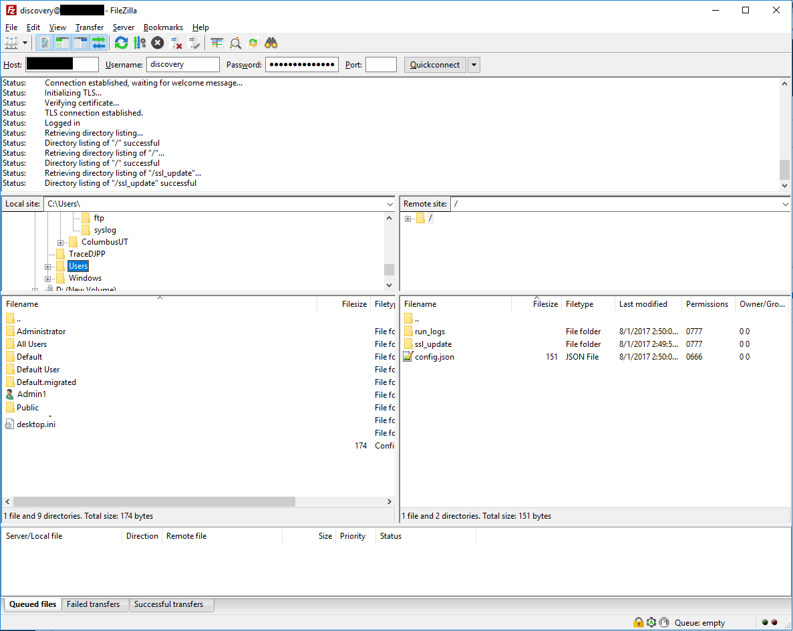
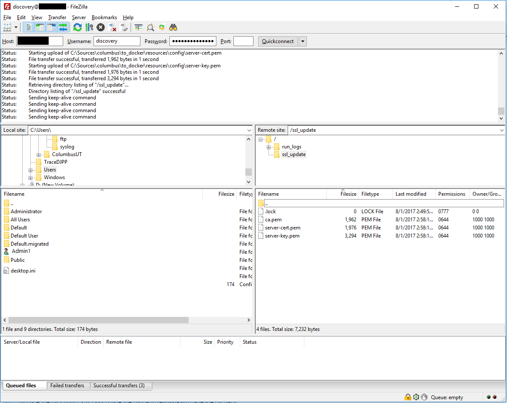
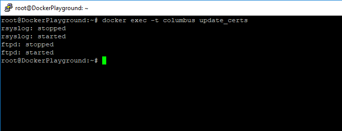

---
# required metadata

title: Log collector FTP configuration
description: This article describes the process for modifying configuration for the Cloud App Security Cloud Discovery docker.
keywords:
author: shsagir
ms.author: shsagir
manager: shsagir
ms.date: 8/7/2019
ms.topic: conceptual
ms.collection: M365-security-compliance
ms.prod:
ms.service: cloud-app-security
ms.technology:
ms.assetid: 776e834f-3c20-4d5f-9fab-4c5b975edb06

# optional metadata

#ROBOTS:
#audience:
#ms.devlang:
ms.reviewer: reutam
ms.suite: ems
#ms.tgt_pltfrm:
ms.custom: seodec18

---
# Log collector FTP configuration

*Applies to: Microsoft Cloud App Security*

This article describes how to modify the configuration for the Cloud App Security Cloud Discovery docker.

## Docker deployment

You might need to modify the configuration for the Cloud App Security Cloud Discovery docker.

### Changing the FTP password

1. Connect to the log collector host.

2. Run `docker exec -it <collector name> pure-pw passwd <ftp user>`

    1. Enter the new password.
    2. Enter the new password again for confirmation.

3. Run `docker exec -it <collector name> pure-pw mkdb` to apply the change.

  

### Customize certificate files

Follow this procedure to customize the certificate files you use for secure connections to the Cloud Discovery docker.

1. Open an FTP client and connect to the log collector.

   

2. Navigate to the `ssl_update` directory.
3. Upload new certificate files to the `ssl_update` directory (the names are mandatory).

    

    - **For FTP:** Only one file is required. The file has the key and certificate data, in that order, and is named **pure-ftpd.pem**.
    - **For Syslog:** Three files are required: **ca.pem**, **server-key.pem, and **server-cert.pem**. If any of the files are missing, the update won't take place.

4. In a terminal run: `docker exec -t <collector name> update_certs`. The command should produce a similar output to what's seen in the following screenshot.

    

## Next steps

[Deploy Cloud Discovery](set-up-cloud-discovery.md)

[Premier customers can also choose Cloud App Security directly from the Premier Portal](https://premier.microsoft.com/)