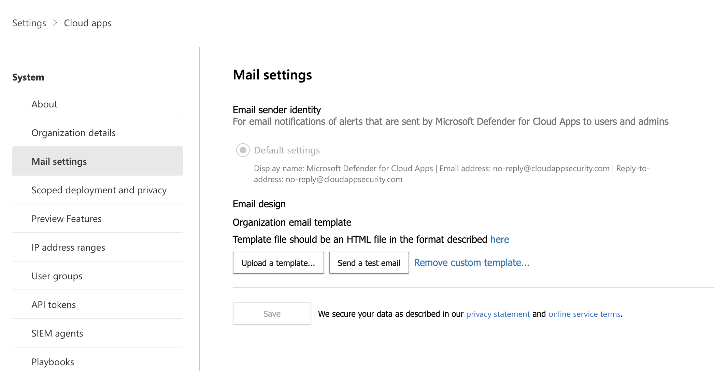

# Configure user notifications


This article provides information about how to personalize the email notifications sent by Defender for Cloud Apps to your users when a breach is detected.

> [!NOTE]
> This customization only affects the notifications sent to your end users, not the notifications sent to Defender for Cloud Apps administrators.

## Set email notification preferences

> [!NOTE]
> Custom mail settings aren't available for US Government offering customers.

 Microsoft Defender for Cloud Apps enables you to customize the email notifications sent to end users involved in breaches. To set parameters for email notifications, follow this procedure. For information about the Microsoft Defender for Cloud Apps email server IP address that you should allow in your anti-spam service, see [Network requirements](network-requirements.md).

1. In the Microsoft Defender Portal, select **Settings** > **Cloud Apps** > **System** > **Mail settings**.

    
    
    The **Default settings** option is always selected for the **Email sender identity**, and Defender for Cloud Apps always sends notifications using the default settings.


1. For the **Email design**, you can use an html file to customize and design the email messages sent from the system. The html file used for your template should include the following things:

    - All template CSS files should be inline in the template.

    - The template should have three uneditable placeholders:

        - **%%logo%%** - URL to your company's logo that was uploaded in the General setting page.

        - **%%title%%** - Placeholder for the title of the email, as set by the policy.

        - **%%content%%** - Placeholder for the content that will be included for end users, as set by the policy.

1. Select **Upload a template...** and select the file you created.
1. Select **Save**.
1. Select **Send a test email** to email yourself an example of the template you created. The email will be sent to the account you used to log into the portal. In the test email, you'll see and verify the following items:
    - The metadata fields
    - The template
    - The email subject
    - The title in the email body
    - The content

## Additional notes

The following types of notifications use the custom email templates:

- Failed to import the file you tried to upload, it may be corrupt.
- Security notification
- Data Loss Prevention
- File ownership report
- Activity policy match notification
- App removal notification
- App removed
- OAuth app revoked
- File sharing report
- Cloud App Security Test Email [this is for testing purposes]

- Ownership of items transferred to you

> [!NOTE]
> There are some types of notifications that are sent to admins only. In such a case, the default template is used, instead of the custom template.

## Sample email template

Below is a sample email template:

```html
<!DOCTYPE html PUBLIC "-//W3C//DTD XHTML 1.0 Transitional//EN" "https://www.w3.org/TR/xhtml1/DTD/xhtml1-transitional.dtd">
  <html>
       <head>
            <meta http-equiv="Content-Type" content="text/html; charset=UTF-8"/>
            <meta name="viewport" content="width=device-width, initial-scale=1.0"/>
          </head>
          <body class="end-user">
          <table border="0" cellpadding="20%" cellspacing="0" width="100%" id="background-table">
            <tr>
              <td align="center">
                <!--[if (gte mso 9)|(IE)]>
                <table width="600" align="center" cellpadding="0" cellspacing="0" border="0">
                  <tr>
                    <td>
                <![endif]-->
                <table bgcolor="#ffffff" align="center" border="0" cellpadding="0" cellspacing="0" style="padding-bottom: 40px;" id="container-table">
                  <tr>
                    <td align="right" id="header-table-cell">
                      
                    </td>
                  </tr>
                  <tr>
                    <td style="padding-top: 58px;" align="center" valign="top">
                      <table width="100%" cellpadding="12">
                        <tr>
                          <td align="center" class="round-title">
                            %%title%%
                          </td>
                        </tr>
                      </table>
                    </td>
                  </tr>
                  <tr>
                    <td style="padding: 0 40px 79px 40px;" class="content-table-cell" align="left" valign="top">
                        %%content%%
                    </td>
                  </tr>
                  <tr>
                    <td class="last-row"></td>
                  </tr>
                </table>
                <!--[if (gte mso 9)|(IE)]>
                </td>
                </tr>
                </table>
                  <![endif]-->
              </td>
              </tr>
          </table>
            </body>
          </html>
```

## Next steps

> [!div class="nextstepaction"]
> [Set up cloud discovery](set-up-cloud-discovery.md)

[!INCLUDE [Open support ticket](includes/support.md)]

