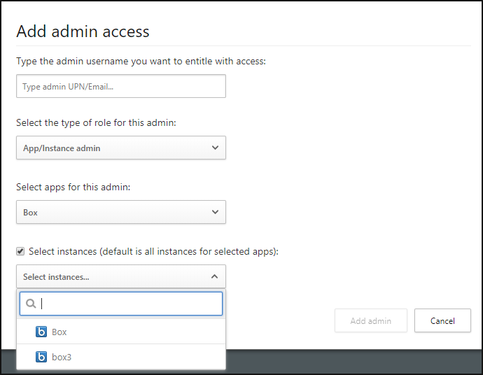

# Configure admin access

Microsoft Defender for Cloud Apps supports role-based access control. This article provides instructions for setting access to Defender for Cloud Apps for your admins. For more information about assigning administrator roles, see the articles for [Microsoft Entra ID](/azure/active-directory/roles/permissions-reference) and [Microsoft 365](/microsoft-365/admin/add-users/assign-admin-roles).

## Microsoft 365 and Microsoft Entra roles with access to Defender for Cloud Apps

> [!NOTE]
>
> - Microsoft 365 and Microsoft Entra roles aren't listed in the Defender for Cloud Apps **Manage admin access** page. To assign roles in Microsoft 365 or Microsoft Entra ID, go to the relevant RBAC settings for that service.
> - Defender for Cloud Apps uses Microsoft Entra ID to determine the user's [directory level inactivity timeout setting](/azure/azure-portal/set-preferences#change-the-directory-timeout-setting-admin). If a user is configured in Microsoft Entra ID to never sign out when inactive, the same setting will apply in Defender for Cloud Apps as well.

By default, the following Microsoft 365 and [Microsoft Entra ID](/azure/active-directory/roles/permissions-reference) admin roles have access to Defender for Cloud Apps:

|Role name  |Description  |
|---------|---------|
|**Global administrator and Security administrator**     |  Administrators with **Full access** have full permissions in Defender for Cloud Apps. They can add admins, add policies and settings, upload logs and perform governance actions, access and manage SIEM agents.       |
|**Cloud App Security administrator**     | Allows full access and permissions in Defender for Cloud Apps. This role grants full permissions to Defender for Cloud Apps, like the Microsoft Entra ID **Global administrator** role. However, this role is scoped to Defender for Cloud Apps and won't grant full permissions across other Microsoft security products.        |
|**Compliance administrator**     |  Has read-only permissions and can manage alerts. Can't access Security recommendations for cloud platforms. Can create and modify file policies, allow file governance actions, and view all the built-in reports under Data Management.       |
|**Compliance data administrator**     |   Has read-only permissions, can create and modify file policies, allow file governance actions, and view all discovery reports. Can't access Security recommendations for cloud platforms.      |
|**Security operator**     |  Has read-only permissions and can manage alerts. These admins are restricted from doing the following actions: <ul><li>Create policies or edit and change existing ones<li> Performing any governance actions<li>Uploading discovery logs<li> Banning or approving third-party apps<li> Accessing and viewing the IP address range settings page<li> Accessing and viewing any system settings pages<li> Accessing and viewing the Discovery settings<li> Accessing and viewing the App connectors page<li> Accessing and viewing the Governance log<li>Accessing and viewing the Manage snapshot reports page     </ul>  |
|**Security reader**     |   Has read-only permissions and can create API access tokens. These admins are restricted from doing the following actions: <ul></li>Create policies or edit and change existing ones<li>Performing any governance actions<li>Uploading discovery logs<li>Banning or approving third-party apps<li> Accessing and viewing the IP address range settings page<li> Accessing and viewing any system settings pages<li> Accessing and viewing the Discovery settings<li> Accessing and viewing the App connectors page<li> Accessing and viewing the Governance log<li>Accessing and viewing the Manage snapshot reports page   </ul>   |
|**Global reader**     |  Has full read-only access to all aspects of Defender for Cloud Apps. Can't change any settings or take any actions.       |

> [!IMPORTANT]
> Microsoft recommends that you use roles with the fewest permissions. This helps improve security for your organization. Global Administrator is a highly privileged role that should be limited to emergency scenarios when you can't use an existing role.

> [!NOTE]
> App governance features are controlled by Microsoft Entra ID roles only. For more information, see [App governance roles](app-governance-get-started.md#roles).

### Roles and permissions

| Permissions                                                  | Global  Admin | Security  Admin | Compliance  Admin | Compliance  Data Admin | Security  Operator | Security  Reader | Global  Reader | PBI Admin | Cloud App Security admin |
| ------------------------------------------------------------ | ------------- | --------------- | ----------------- | ---------------------- | ------------------ | ---------------- | -------------- | --------- | ------------------- |
| Read alerts                                                  | ✔             | ✔               | ✔                 | ✔                      | ✔                  | ✔                | ✔              | ✔         | ✔                      |
| Manage alerts                                                | ✔             | ✔               | ✔                 | ✔                      | ✔                  |                  |                | ✔         | ✔                      |
| Read OAuth applications                                      | ✔             | ✔               | ✔                 | ✔                      | ✔                  | ✔                | ✔              | ✔         | ✔                      |
| Perform OAuth application actions                            | ✔             | ✔               |                   |                        |                    |                  |                | ✔         | ✔                      |
| Access discovered apps, the cloud app catalog, and other cloud discovery data | ✔             | ✔               | ✔                 | ✔                      | ✔                  | ✔                | ✔              |           | ✔                      |
| Configure API connectors | ✔             | ✔               |                   |                        | ✔                  |                  |                |           | ✔                      |
| Perform cloud discovery actions                              | ✔             | ✔               |                   |                        |                    |                  |                |           | ✔                      |
| Access files data and file policies                          | ✔             | ✔               | ✔                 | ✔                      | ✔                  | ✔                | ✔              | ✔         | ✔                      |
| Perform file actions                                         | ✔             | ✔               |                   |                        |                    |                  |                | ✔         | ✔                      |
| Access governance log                                        | ✔             | ✔               | ✔                 | ✔                      | ✔                  | ✔                | ✔              | ✔         | ✔                      |
| Perform governance log actions                               | ✔             | ✔               |                   |                        |                    |                  |                | ✔         | ✔                      |
| Access scoped discovery governance log                       | ✔             | ✔               |                   |                        |                    |                  |                |           | ✔                      |
| Read policies                                                | ✔             | ✔               | ✔                 | ✔                      | ✔                  | ✔                | ✔              | ✔         | ✔                      |
| Perform all policy actions                                   | ✔             | ✔               |                   |                        |                    |                  |                | ✔         | ✔                      |
| Perform file policy actions                                  | ✔             | ✔               | ✔                 | ✔                      |                    |                  |                |           | ✔                      |
| Perform OAuth policy actions                                 | ✔             | ✔               |                   |                        |                    |                  |                | ✔         | ✔                      |
| View manage admin access                                     | ✔             | ✔               | ✔                 | ✔                      | ✔                  | ✔                | ✔              |           | ✔                      |
| Manage admins and activity privacy                           | ✔             | ✔               |                   |                        |                    |                  |                |           | ✔                      |

## Built-in admin roles in Defender for Cloud Apps

The following specific admin roles can be configured in the Microsoft Defender portal, in the **Permissions > Cloud Apps > Roles** area:

|Role name  |Description  |
|---------|---------|
|**Global administrator**     | Has **Full access** similar to the Microsoft Entra Global Administrator role but only to Defender for Cloud Apps.        |
|**Compliance administrator**     |  Grants the same permissions as the Microsoft Entra Compliance administrator role but only to Defender for Cloud Apps.       |
|**Security reader**     |  Grants the same permissions as the Microsoft Entra Security reader role but only to Defender for Cloud Apps.       |
|**Security operator**     |  Grants the same permissions as the Microsoft Entra Security operator role but only to Defender for Cloud Apps.       |
|**App/instance admin**     |  Has full or read-only permissions to all of the data in Defender for Cloud Apps that deals exclusively with the specific app or instance of an app selected.   For example, you give a user admin permission to your Box European instance. The admin will see only data that relates to the Box European instance, whether it's files, activities, policies, or alerts: <ul><li>Activities page - Only activities about the specific app<li> Alerts - Only alerts relating to the specific app. In some cases, alert data related to another app if the data is correlated with the specific app. Visibility to alert data related to another app is limited, and there is no access to drill down for more details<li>Policies - Can view all policies and if assigned full permissions can edit or create only policies that deal exclusively with the app/instance<li>Accounts page - Only accounts for the specific app/instance<li> App permissions - Only permissions for the specific app/instance<li> Files page - Only files from the specific app/instance<li>Conditional access app control - No permissions<li> Cloud discovery activity - No permissions<li> Security extensions - Only permissions for API token with user permissions<li>Governance actions - Only for the specific app/instance<li> Security recommendations for cloud platforms - No permissions<li>IP ranges - No permissions   </ul>    |
|**User group admin**     | Has full or read-only permissions to all of the data in Defender for Cloud Apps that deals exclusively with the specific groups assigned to them. For example, if you assign a user admin permissions to the group "Germany - all users", the admin can view and edit information in Defender for Cloud Apps only for that user group. The User group admin has the following access:    <ul><li>Activities page - Only activities about the users in the group<li>Alerts - Only alerts relating to the users in the group. In some cases, alert data related to another user if the data is correlated with the users in the group. Visibility to alert data related to another users is limited, and there is no access to drill down for more details.<li>Policies - Can view all policies and if assigned full permissions can edit or create only policies that deal exclusively with users in the group<li>Accounts page - Only accounts for the specific users in the group<li>App permissions – No permissions<li>Files page – No permissions<li> Conditional access app control - No permissions<li> Cloud discovery activity - No permissions<li>Security extensions - Only permissions for API token with users in the group<li> Governance actions - Only for the specific users in the group<li>Security recommendations for cloud platforms - No permissions<li>IP ranges - No permissions   </ul>   **Notes**: <ul><li>To assign groups to user group admins, you must first [import user groups](user-groups.md) from connected apps. <li>You can only assign user group admins permissions to imported Microsoft Entra groups.</ul>   |
|**Cloud Discovery global admin**     | Has permission to view and edit all cloud discovery settings and data. The Global Discovery admin has the following access:   <ul><li>Settings: System settings - View only; Cloud Discovery settings - View and edit all (anonymization permissions depend on whether it was allowed during role assignment) <li> Cloud discovery activity - full permissions<li>Alerts - view and manage only alerts related to the relevant cloud discovery report<li> Policies - Can view all policies and can edit or create only cloud discovery policies <li> Activities page - No permissions<li>Accounts page - No permissions<li> App permissions – No permissions<li> Files page – No permissions<li> Conditional access app control - No permissions<li> Security extensions - Creating and deleting their own API tokens<li> Governance actions - Only Cloud Discovery related actions<li> Security recommendations for cloud platforms - No permissions<li> IP ranges - No permissions</ul>        |
|**Cloud Discovery report admin**     |  <ul><li> Settings: System settings - View only; Cloud discovery settings - View all (anonymization permissions depend on whether it was allowed during role assignment)<li>Cloud discovery activity - read permissions only<li> Alerts – view only alerts related to the relevant cloud discovery report<li>Policies - Can view all policies and can create only cloud discovery policies, without the possibility to govern application (tagging, sanction and unsanctioned)<li> Activities page - No permissions<li> Accounts page - No permissions<li>App permissions – No permissions<li>Files page – No permissions<li> Conditional access app control - No permissions<li> Security extensions - Creating and deleting their own API tokens<li>Governance actions – view only actions related to the relevant cloud discovery report<li>Security recommendations for cloud platforms - No permissions<li>IP ranges - No permissions     |

> [!IMPORTANT]
> Microsoft recommends that you use roles with the fewest permissions. This helps improve security for your organization. Global Administrator is a highly privileged role that should be limited to emergency scenarios when you can't use an existing role.
>
> The built-in Defender for Cloud Apps admin roles only provide access permissions to Defender for Cloud Apps.

## Override admin permissions

If you want to override an administrator's permission from Microsoft Entra ID or Microsoft 365, you can do so by manually adding the user to Defender for Cloud Apps and assigning the user permissions. For example, if you want to assign Stephanie, who is a Security reader in Microsoft Entra ID to have **Full access** in Defender for Cloud Apps, you can add her manually to Defender for Cloud Apps and assign her **Full access** to override her role and allow her the necessary permissions in Defender for Cloud Apps. Note that it isn't possible to override Microsoft Entra roles that grant Full access (Global administrator, Security administrator, and Cloud App Security administrator).

> [!IMPORTANT]
> Microsoft recommends that you use roles with the fewest permissions. This helps improve security for your organization. Global Administrator is a highly privileged role that should be limited to emergency scenarios when you can't use an existing role.

## Add additional admins

You can add additional admins to Defender for Cloud Apps without adding users to Microsoft Entra administrative roles. To add additional admins, perform the following steps:

> [!IMPORTANT]
>
> - Access to the **Manage admin access** page is available to members of the Global Administrators, Security Administrators, Compliance Administrators, Compliance Data Administrators, Security Operators, Security Readers and Global Readers groups.
> - To edit the **Manage admin access** page and grant other users access to Defender for Cloud Apps, you must have at least a Security Administrator role.
>
> Microsoft recommends that you use roles with the fewest permissions. This helps improve security for your organization. Global Administrator is a highly privileged role that should be limited to emergency scenarios when you can't use an existing role.

1. In the Microsoft Defender Portal, in the left-hand menu, select **Permissions**.

1. Under **Cloud Apps**, choose **Roles**.

  :::image type="content" source="media/permissions-menu.png" alt-text="Permissions menu.":::

1. Select **+Add user** to add the admins who should have access to Defender for Cloud Apps. Provide an email address of a user from inside your organization.

    > [!NOTE]
    > If you want to add external Managed Security Service Providers (MSSPs) as administrators for Defender for Cloud Apps, make sure you first [invite them as a guest](#invite-external-admins) to your organization.

    

1. Next, select the drop-down to set what type of role the admin has. If you select **App/Instance admin**, select the app and instance for the admin to have permissions for.

    >[!NOTE]
    > Any admin, whose access is limited, that attempts to access a restricted page or perform a restricted action will receive an error that they don't have permission to access the page or perform the action.

1. Select **Add admin**.

## Invite external admins

Defender for Cloud Apps enables you to invite external admins (MSSPs) as administrators of your organization's (MSSP customer) Defender for Cloud Apps service. To add MSSPs, make sure Defender for Cloud Apps is enabled on the MSSPs tenant, and then add them as [Microsoft Entra B2B collaboration users](/azure/active-directory/external-identities/add-users-administrator) in the MSSPs customers Azure portal. Once added, MSSPs can be configured as administrators and assigned any of the roles available in Defender for Cloud Apps.

### To add MSSPs to the MSSP customer Defender for Cloud Apps service

1. Add MSSPs as a guest in the MSSP customer directory using the steps under [Add guest users to the directory](/azure/active-directory/external-identities/add-users-administrator#add-guest-users-to-the-directory).
1. Add MSSPs and assign an administrator role in the MSSP customer Defender for Cloud Apps portal using the steps under [Add additional admins](#add-additional-admins). Provide the same external email address used when adding them as guests in the MSSP customer directory.

### Access for MSSPs to the MSSP customer Defender for Cloud Apps service

By default, MSSPs access their Defender for Cloud Apps tenant through the following URL: `https://security.microsoft.com`.

MSSPs however, will need to access the MSSP customer Microsoft Defender Portal using a tenant-specific URL in the following format: `https://security.microsoft.com/?tid=<tenant_id>`.

MSSPs can use the following steps to obtain the MSSP customer portal tenant ID and then use the ID to access the tenant-specific URL:

1. As an MSSP, sign in to Microsoft Entra ID with your credentials.

1. Switch directory to the MSSP customer's tenant.
1. Select **Microsoft Entra ID** > **Properties**. You'll find the MSSP customer tenant ID in the **Tenant ID** field.
1. Access the MSSP customer portal by replacing the `customer_tenant_id` value in the following URL: `https://security.microsoft.com/?tid=<tenant_id>`.

## Admin activity auditing

Defender for Cloud Apps lets you export a log of admin sign-in activities and an audit of views of a specific user or alerts carried out as part of an investigation.

To export a log, perform the following steps:

1. In the Microsoft Defender Portal, in the left-hand menu, select **Permissions**.

1. Under **Cloud Apps**, choose **Roles**.

1. In the **Admin roles** page, in the top-right corner, select **Export admin activities**.

1. Specify the required time range.

1. Select **Export**.

## Next steps

> [!div class="nextstepaction"]
> [Set up cloud discovery](set-up-cloud-discovery.md)
