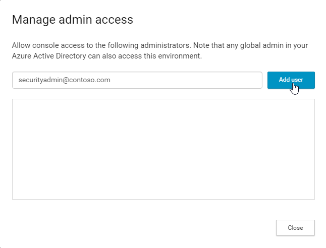
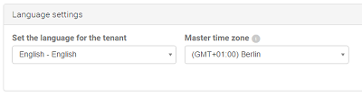
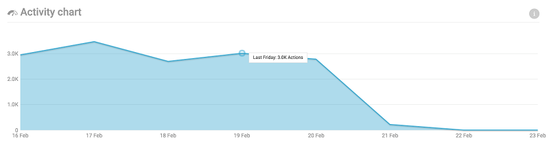
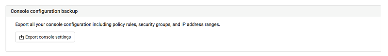
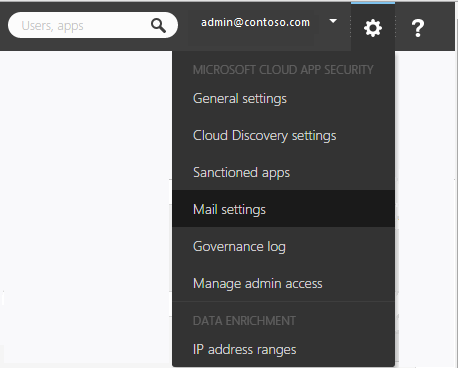
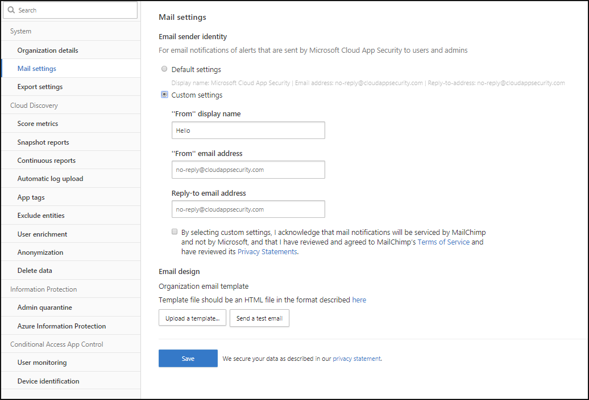

---
# required metadata

title: Manage admin access to the Cloud App Security portal | Microsoft Docs
description: This topic provides instructions for setting access to the Cloud App Security portal for your admins.
keywords:
author: rkarlin
ms.author: rkarlin
manager: mbaldwin
ms.date: 5/7/2017
ms.topic: get-started-article
ms.prod:
ms.service: cloud-app-security
ms.technology:
ms.assetid: b718edad-350c-4d90-b045-92529d701dc5

# optional metadata

#ROBOTS:
#audience:
#ms.devlang:
ms.reviewer: reutam
ms.suite: ems
#ms.tgt_pltfrm:
#ms.custom:

---

## Managing admin access

Cloud App Security supports the following admin roles:

- Global administrator: Global admins have **Full access**: Admins with full access will have full permissions in Cloud App Security to add admins, add policies and settings, upload logs and perform governance actions.
- Security administrator: Security admins have **Full access**: Admins with full access will have full permissions in Cloud App Security to add admins, add policies and settings, upload logs and perform governance actions.
- Security reader:The Security reader  has read-only permissions and can manage alerts. The Security reader is restricted from performing the following:
      - Create policies or edit and change existing ones 
      - Performing any governance actions 
      - Uploading discovery logs
      - Banning or approving third party apps
      - Accessing and viewing the IP address range settings page
      - Accessing and viewing any settings pages 
      - Acccessing and viewing the Discovery settings 
      - Accessing and vieweing the App connectors page
      - Accessing and viewing the Governance log 
      - Accessing and viewing the Manage snapshot reports page 

Admins with these roles in Azure Active Directory or Office 365 will have the same roles in Cloud App Security. For more information on administrator roles see [Assigning administrator roles in Azure Active Directory](https://docs.microsoft.com/en-us/azure/active-directory/active-directory-assign-admin-roles).

To add additional admins to Cloud App Security:

1. Click the settings cog  and then **Manage admin access**. 

2. Add the admins who should have access to Cloud App Security.
  
      
3. Next, click the drop down to set what type of access the admin will have, **Full access** or **Security reader**.

     >[!NOTE]
      >Any **Security reader** who attempts to access a restricted page or perform a restricted action will receive an error that they don't have permission to access the page or perform the action.

4. Click **Close**.  

   >[!NOTE]
    >Any non-invited user (with a proper role - Global, Security, Compliance Admin), can invite other users to Cloud App Security.
  
   

**To override admin permissions:**

If you want to override an administrator's permission from Azure Active Directory or Office 365, you can do so by manually adding the user to Cloud App Security and assigning the user a role.
For example, if you want to assign Stephanie, who is a Security reader in Azure Active Directory to have Full access in Cloud App Security, you can add her manually to Cloud App Security and assign her Full access to override her role and allow her the desired permissions in Cloud App Security. 


##  <a name="Adminsettings"></a> Customize your admin settings  
To set up your preferences as an admin of Cloud App Security, click your name in the portal menu bar, and select **User settings** to set the following:  
  
1.  Click **Account settings**. Here you can customize the portal language for your own viewing. You can set it to display the portal in either the default language or you can set a different language for yourself.  
  
       
  
2.  Click **Notifications** and set email and text notification preferences for emails you receive from the system.  You can set the severity for which alerts and violations you want to receive emails - the severity is set per policy, so when violations are triggered, you will receive email notification depending on the setting here and the Severity setting in the policy that was violated. Emails will be sent to the alias associated with the administrator user account you used to log into Cloud App Security. Enter a phone number to enable Cloud App Security to send you text messages when alerts and notifications are sent, and set the severity level for which you want to receive notifications via text message.  
  
   > [!NOTE] 
   > The maximum number of alerts that will be sent via text message is 10 per phone number per day. Note that the day is calculated according to the UTC timezone. 
  
    
  
3. When you are done, click **Save**.  


## Region and Language settings  
  
1. Set the default **Language** to be used for the portal. To modify the language for a specific administrator, go to **User settings** > **Account settings**.  
  
     
  
2. Set the **Master time zone**. Cloud App Security continuously analyzes and aggregates your data. By default, the time zone for the Cloud App Security portal is set to UTC. It is important to set the master time zone, which enables Cloud App Security to accurately date incidents in your system. For example, in the Activity chart, the data is organized by date - these dates are impacted by the time zone of your system, so if you did not modify the default time zone, your data will be organized into 24 hour days according to the UTC time zone, which may skew your data by many hours.  
  
       
  
## Back up portal settings

If at any point you want to back up your portal settings, this screen enables you to do that. Click Export portal settings to create a json file of all your portal settings, including policy rules, user groups and IP address ranges.  
  
  
  
##  <a name="mailsettings"></a> Personalize your experience  
In the menu bar, click the settings icon  and select **Mail settings**, to set parameters for email notifications sent from Cloud App Security to administrators requesting alerts, and notifications sent to end users about breaches in which they are involved.  
  
  
  
Configure the following:  
  
1.  **From email address**: The email account you want to use to send the notification.  
  
     **From display name**: The name you want to be displayed in the **From** field of the email message.  
  
     **Reply-to email address**: The email account to be used for replies to the message.  
  
       
  
2.  You can use an html file to customize and design the email messages sent from the system. The html file used for your template should include the following:  
  
    -   All template CSS should be inline in the template.  
  
    -   The template should have three un-editable placeholders:  
  
         %%logo%% - a URL to your company's logo that was uploaded in the General setting page  
  
         %%title%% - a placeholder for the title of the email, as set by the policy.  
  
         %%content%% - a placeholder for the content that will be included for end users, as set by the policy.  
  
     The following is a sample email template: 
```html
<!DOCTYPE html PUBLIC "-//W3C//DTD XHTML 1.0 Transitional//EN" "http://www.w3.org/TR/xhtml1/DTD/xhtml1-transitional.dtd">
  <html>  
       <head>  
            <meta http-equiv="Content-Type" content="text/html; charset=UTF-8"/>  
            <meta name="viewport" content="width=device-width, initial-scale=1.0"/>  
          </head>  
          <body class="end-user">  
          <table border="0" cellpadding="20%" cellspacing="0" width="100%" id="background-table">  
            <tr>  
              <td align="center">  
                <!--[if (gte mso 9)|(IE)]>  
                <table width="600" align="center" cellpadding="0" cellspacing="0" border="0">  
                  <tr>  
                    <td>  
                <![endif]-->  
                <table bgcolor="#ffffff" align="center" border="0" cellpadding="0" cellspacing="0" style="padding-bottom: 40px;" id="container-table">  
                  <tr>  
                    <td align="right" id="header-table-cell">  
                        
                    </td>  
                  </tr>  
                  <tr>  
                    <td style="padding-top: 58px;" align="center" valign="top">  
                      <table width="100%" cellpadding="12">  
                        <tr>  
                          <td align="center" class="round-title">  
                            %%title%%  
                          </td>  
                        </tr>  
                      </table>  
                    </td>  
                  </tr>  
                  <tr>  
                    <td style="padding: 0 40px 79px 40px;" class="content-table-cell" align="left" valign="top">  
                        %%content%%  
                    </td>  
                  </tr>  
                  <tr>  
                    <td class="last-row"></td>  
                  </tr>  
                </table>  
                <!--[if (gte mso 9)|(IE)]>  
                </td>  
                </tr>  
                </table>  
                  <![endif]-->  
              </td>  
              </tr>  
          </table>  
            </body>  
          </html>  
    ```

  
3.  Click **Upload a template...** and select the file you created.  
  
     Then, click **Send a test email** to send yourself a test email to see an example of the template you created.  
     The email will be sent to the account you used to log into the portal. In the test email you will be able to see the metadata fields, the template, the email subject, the title in the email body and the content.  
  
## Single sign-on  
Cloud App Security is coupled with Azure Active Directory for authentication, provisioning, and licensing related activities. For information on how to manage single sign-on, see [Azure Active Directory federation compatibility list: third-party identity providers that can be used to implement single sign-on](https://msdn.microsoft.com/library/azure/jj679342.aspx).  


> [!NOTE] 
> If you use ExpressRoute, Cloud App Security is deployed in Azure and fully integrated with [ExpressRoute](https://azure.microsoft.com/documentation/articles/expressroute-introduction/). All interactions with the Cloud App Security apps and traffic sent to Cloud App Security, including upload of discovery logs, is routed via ExpressRoute **public peering** for improved latency, performance and security. There are no configuration steps required from the customer side.  
    For more information about  Public Peering, see [ExpressRoute circuits and routing domains](https://azure.microsoft.com/documentation/articles/expressroute-circuit-peerings/).  
    
## See Also  
[Set up Cloud Discovery](set-up-cloud-discovery.md)   
[For technical support, please visit the Cloud App Security assisted support page.](http://support.microsoft.com/oas/default.aspx?prid=16031)   
[Premier customers can also choose Cloud App Security directly from the Premier Portal.](https://premier.microsoft.com/)  
  
  