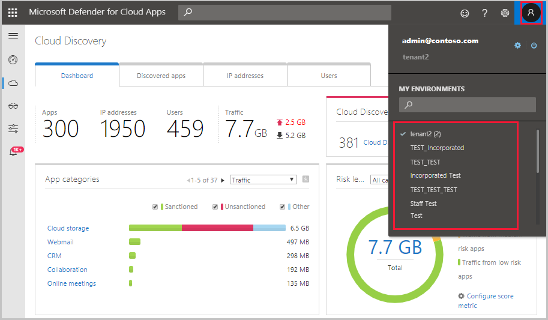

---
# required metadata

title: Manage admin access to the Cloud App Security portal
description: This article provides instructions for setting access to the Cloud App Security portal for your admins.
keywords:
author: rkarlin
ms.author: rkarlin
manager: barbkess
ms.date: 04/04/2019
ms.topic: conceptual
ms.collection: M365-security-compliance
ms.prod:
ms.service: cloud-app-security
ms.technology:
ms.assetid: b718edad-350c-4d90-b045-92529d701dc5

# optional metadata

#ROBOTS:
#audience:
#ms.devlang:
ms.reviewer: reutam
ms.suite: ems
#ms.tgt_pltfrm:
ms.custom: seodec18

---
# Manage admin access

*Applies to: Microsoft Cloud App Security*

Microsoft Cloud App Security supports role-based access control. This article provides instructions for setting access to the Cloud App Security portal for your admins. For more information about assigning administrator roles, see the articles for [Azure Active Directory](https://docs.microsoft.com/azure/active-directory/active-directory-assign-admin-roles) and [Office 365 ](https://docs.microsoft.com/office365/admin/add-users/assign-admin-roles).

## Office 365 and Azure AD roles with access to Cloud App Security

By default, the following Office 365 and [Azure Active Directory (Azure AD)](https://docs.microsoft.com/azure/active-directory/users-groups-roles/directory-assign-admin-roles) admin roles have access to Microsoft Cloud App Security:

- **Global administrator and Security administrator:** Admins with **Full access** have full permissions in Cloud App Security. They can add admins, add policies and settings, upload logs and perform governance actions.

- **Compliance administrator:** Has read-only permissions and can manage alerts. Can create and modify file policies, allow file governance actions, and view all the built-in reports under Data Management. 

- **Security reader:** Has read-only permissions and can manage alerts. The Security reader is restricted from doing the following actions:

  - Create policies or edit and change existing ones 
  - Performing any governance actions 
  - Uploading discovery logs
  - Banning or approving third-party apps
  - Accessing and viewing the IP address range settings page
  - Accessing and viewing any settings pages 
  - Accessing and viewing the Discovery settings 
  - Accessing and viewing the App connectors page
  - Accessing and viewing the Governance log 
  - Accessing and viewing the Manage snapshot reports page 

- **App/instance admin:** Has permissions to all of the data in Microsoft Cloud App Security that deals exclusively with the specific app or instance of an app selected. For example, you give a user admin permission to your Box European instance. The admin will see only data that relates to the Box European instance, whether it's files, activities, policies, or alerts:

  - Activities page - Only activities about the specific app
  - Alerts - Only alerts relating to the specific app
  - Policies - Can view all policies and can edit or create only policies that deal exclusively with the app/instance
  - Accounts page - Only accounts for the specific app/instance
  - App permissions - Only permissions for the specific app/instance
  - Files page - Only files from the specific app/instance
  - Conditional Access App Control - No permissions
  - Cloud Discovery activity - No permissions
  - Security extensions - Permissions only for API token with user permissions
  - Governance actions - Only for the specific app/instance 

- **User group admin:** Has permissions to all of the data in Microsoft Cloud App Security that deals exclusively with the specific group selected here. For example, if you give a user admin permission to the group "Germany - all users", the admin can view and modify information in Microsoft Cloud App Security only for that user group:

  - Activities page - Only activities about the users in the group
  - Alerts - Only alerts relating to the users in the group
  - Policies - Can view all policies and can edit or create only policies that deal exclusively with users in the group
  - Accounts page - Only accounts for the specific users in the group
  - App permissions – No permissions
  - Files page – No permissions
  - Conditional Access App Control - No permissions
  - Cloud Discovery activity - No permissions
  - Security extensions - Permissions only for API token with users in the group
  - Governance actions - Only for the specific users in the group

- **Cloud Discovery global admin:**  Has permission to view and edit all Cloud Discovery settings and data. The Global Discovery admin has access as follows:

  - Settings - 
     -  System settings - View only
     - Cloud Discovery settings - View and edit all (anonymization permissions depend on whether it was allowed during role assignment)
  - Cloud Discovery activity - full permissions
  - Alerts - only alerts related to Cloud Discovery data
  - Policies - Can view all policies and can edit or create only Cloud Discovery policies
  - Activities page - No permissions
  - Accounts page - No permissions
  - App permissions – No permissions
  - Files page – No permissions
  - Conditional Access App Control - No permissions
  - Security extensions - No permissions
  - Governance actions - Only Cloud Discovery related actions

- **Cloud Discovery report admin:** Has permissions to view all the data in Microsoft Cloud App Security that deals exclusively with the specific Cloud Discovery reports selected. For example, you can give someone admin permission to the continuous report from Windows Defender ATP. The Discovery admin will see only the Cloud Discovery data that relates to that data source and to the app catalog.
This admin will not have access to the **Activities** or **Files** pages and limited access to policies.

- **Global reader:** Has full read-only access to all aspects of Microsoft Cloud App Security. Cannot change any settings or take any actions.
 
## Override admin permissions

If you want to override an administrator's permission from Azure Active Directory or Office 365, you can do so by manually adding the user to Cloud App Security and assigning the user permissions.
For example, if you want to assign Stephanie, who is a Security reader in Azure Active Directory to have **Full access** in Cloud App Security, you can add her manually to Cloud App Security and assign her **Full access** to override her role and allow her the necessary permissions in Cloud App Security. 

## Add additional admins

You can add additional admins to Cloud App Security without adding users to Azure Active Directory administrative roles. To add additional admins, perform the following steps:

   >[!IMPORTANT]
   > Only Global administrators or Security administrators can grant access to other users to Cloud App Security.

1. Click the settings cog  and then **Manage admin access**. 

2. Click the plus to add the admins who should have access to Cloud App Security. You can type an internal or external email address to enable administrators from inside your organization or external Managed Security Service Providers (MSSPs) to administer your security alerts.
  
   

3. Next, click the drop-down to set what type of role the admin has, **Global admin**, **Security reader**, **Compliance admin**, or **App/Instance admin**. If you select **App/Instance admin**, select the app and instance for the admin to have permissions for.

     >[!NOTE]
      >Any admin, whose access is limited, that attempts to access a restricted page or perform a restricted action will receive an error that they don't have permission to access the page or perform the action.

4. Click **Add admin**.  

## Invite external admins

Microsoft Cloud App Security enables you to invite external Managed Security Service Providers (MSSPs) as administrators of your Microsoft Cloud App Security portal. External users can now be configured as administrators and assigned any of the roles available in Microsoft Cloud App Security. Additionally, to enable MSSPs to provide services across multiple customer tenants, Administrators who have access rights to more than one tenant can now easily switch tenants within the portal. 

To switch between tenants, after you have permissions to multiple tenants, click the user icon. You will see a list of the tenants for which you have permissions. Select the tenant you want to manage.

## Next steps  
[Set up Cloud Discovery](set-up-cloud-discovery.md)   
  
  
  
