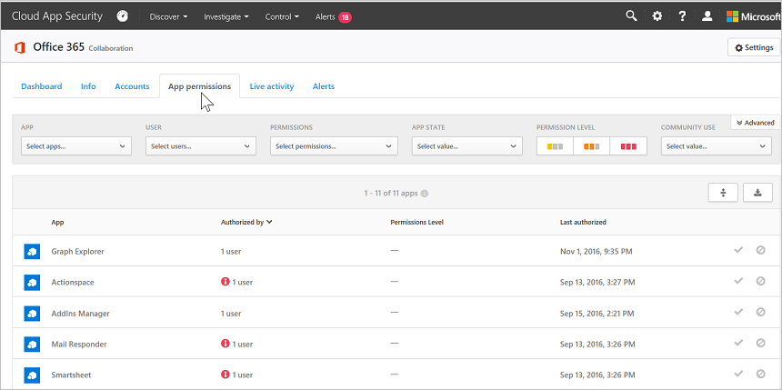
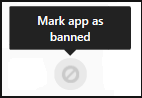
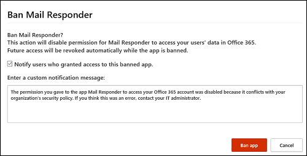
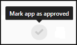
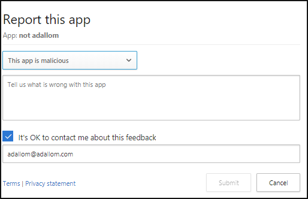

# Manage OAuth apps

[!INCLUDE [Banner for top of topics](includes/banner.md)]

Many third-party productivity apps that might be installed by business users in your organization request permission to access user information and data and sign in on behalf of the user in other cloud apps, such as Microsoft 365, Google Workspace and Salesforce. When users install these apps, they often click accept without closely reviewing the details in the prompt, including granting permissions to the app. This problem is compounded by the fact that IT may not have enough insight to weigh the security risk of an application against the productivity benefit that it provides. Because accepting third-party app permissions is a potential security risk to your organization, monitoring the app permissions your users' grant gives you the necessary visibility and control to protect your users and your applications.

The Microsoft Defender for Cloud Apps app permissions enable you to see which user-installed OAuth applications have access to Microsoft 365 data, Google Workspace data, and Salesforce data. Defender for Cloud Apps tells you what permissions the apps have and which users granted these apps access to their Microsoft 365, Google Workspace, and Salesforce accounts. App permissions help you decide which apps you allow your users to access and which ones you want to ban.

For more information on investigating OAuth apps, see [Investigate risky OAuth apps](investigate-risky-oauth.md).

> [!NOTE]
>
> - App Governance is a set of security and policy management capabilities designed for OAuth-enabled apps registered on Azure Active Directory (Azure AD), Google, and Salesforce. For more information, see [App governance add-on to Defender for Cloud Apps in Microsoft 365 Defender](app-governance-manage-app-governance.md).
> 
> - Defender for Cloud Apps only identifies apps that request "Delegated" permissions. For more information, see [Client app permissions](/azure/active-directory/develop/developer-glossary#permissions).
>
> - OAuth app management is available only after connecting one or more of the supported platforms - Microsoft 365, Google Workspace, or Salesforce. Once connected, the **OAuth apps** menu option will appear under **Investigate**.

## Working with the OAuth apps page

The **OAuth** page displays information about app permissions in your connected apps.

To access the OAuth tab:

In the Microsoft 365 Defender portal, under **Cloud Apps** select **OAuth apps**.

The OAuth apps page provides the following information about each OAuth app that was granted permissions:

|Item|What it means|Applies to|
|-------|-------|-------|
|Basic icon in the app query bar  |Switch to query in the basic view.|Microsoft 365, Google Workspace, Salesforce|
|Advanced icon in the app query bar  |Switch to query in the Advanced view.|Microsoft 365, Google Workspace, Salesforce|
|Open or close all details icon in the app list  |View more or less details about each app.|
|Export icon in the app list  |Export a CSV file that contains a list of apps, number of users for each app, permissions associated with the app, permissions level, app state, and community use level.|Microsoft 365, Google Workspace, Salesforce|
|App|Name of the app. Select the name to view more information, including the description, publisher (for Microsoft 365), app website, and ID.|Microsoft 365, Google Workspace, Salesforce|
|Authorized by|The number of users who authorized this app to access their app's account, and granted the app permissions. Select the number to view more information, including a list of user emails and whether an admin has consented the app previously.|Microsoft 365, Google Workspace, Salesforce|
|Permissions Level  |The permissions level icon and text indicating either High, Medium, or Low. The level indicates how much access this app has to app's data. For example, Low might indicate that the app only accesses user profile and name. Select the level to view more information, including permissions granted to the app, community use, or related activity in the [Governance log](governance-actions.md).|Microsoft 365, Google Workspace|
|App state|An admin can mark an app as approved, banned, or leave is as undetermined.|Microsoft 365, Google Workspace, Salesforce|
|Community use|Shows you how popular the app is across all your users (common, uncommon, rare)|Microsoft 365, Google Workspace, Salesforce|
|Last authorized|The most recent date on which a user granted permissions to this app.|Microsoft 365, Salesforce|
|Publisher|The name of the vendor who provides the app.   Publisher verification - Publisher verification helps admins and end users understand the authenticity of application developers integrating with the Microsoft identity platform. For more information, see [Publisher verification](/azure/active-directory/develop/publisher-verification-overview). |Microsoft 365|
|Last used|The most recent date on which this app was used by anyone in your organization.|Salesforce|

## Ban or approve an app

1. On the **Google** or **Salesforce** tabs on the **App governance** page, select the app to open the **App drawer** to view more information about the app and the permissions it was granted.

    - Select **Permissions** to view a full list of permissions that were granted to the app.
    - Under **Community use**, you can view how common the app is in other organizations.
    - Select **App activity** to view the activities that are listed in the activity log related to this app.

2. To ban the app, select the ban icon at the end of the app row in the table.

    

    - You can choose if you want to tell users the app they installed and authorized has been banned. The notification lets users know the app will be disabled and they won't have access to the connected app. If you don't want them to know, unselect **Notify users who granted access to this banned app** in the dialog.
    - It's recommended that you let the app users know their app is about to be banned from use.

    

3. Type the message you want to send to the app users in the Enter a custom notification message box. Select **Ban app** to send the mail, and ban the app from your connected app users.

4. To approve the app, select the approve icon at the end of the row in the table.

    

    - The icon turns green, and the app is approved for all your connected app users.
    - When you mark an app as approved, there's no effect on the end user. This color change is meant to help you see the apps that you've approved to separate them from ones that you haven't reviewed yet.

## Query OAuth apps

You can query OAuth apps in either the **Basic** view or the **Advanced** view. select values from one or multiple drop-downs to display the specific apps in the Basic view. In the advanced view, use the **Select a filter** drop-down to narrow your search. Add operators, equals, or doesn't equal, to a selected value to complete your query.

- Choose the **Add a filter** icon to add additional filters to further refine your query. The filters are applied automatically and the apps list is updated.

- Choose the **Remove a filter** icon  next to the filter to remove the filters.

## OAuth app auditing

Defender for Cloud Apps audits all OAuth authorization activities to provide you with comprehensive monitoring and investigation of activities performed. You can also export the details of users that authorized a specific OAuth app, providing you with additional information on the users, which you can then use for further analysis.

To export the log, perform the following steps:

1. On the **Google** or **Salesforce** tabs on the **App governance** page, on the row where the relevant app appears, under **Authorized by**, select the link showing the number of users that authorized the app.

1. In the pop-up, select **Export**.

    

## Send feedback

If there's an OAuth app discovered in your organization that seems malicious, you can send the Defender for Cloud Apps team feedback to let us know. This feature enables you to be part of our security community and enhance OAuth app risk score and analysis.

1. On the **Google** or **Salesforce** tabs on the **App governance** page, select the three dots at the end of the app row and select **Report app**.

    
2. In the **Report this app** screen, you can select whether to report the app as malicious or to report another issue with the way Defender for Cloud Apps perceives the app. For example, you could use **Incorrect publisher**, **Incorrect permissions**, or **Other**. The data you submit will be used to update the app's risk score and other analytics about the app.

## Next steps

> [!div class="nextstepaction"]
> [Control cloud apps with policies](control-cloud-apps-with-policies.md)

[!INCLUDE [Open support ticket](includes/support.md)]
