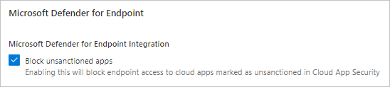
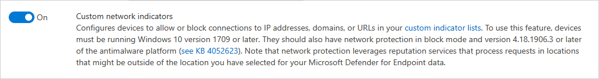
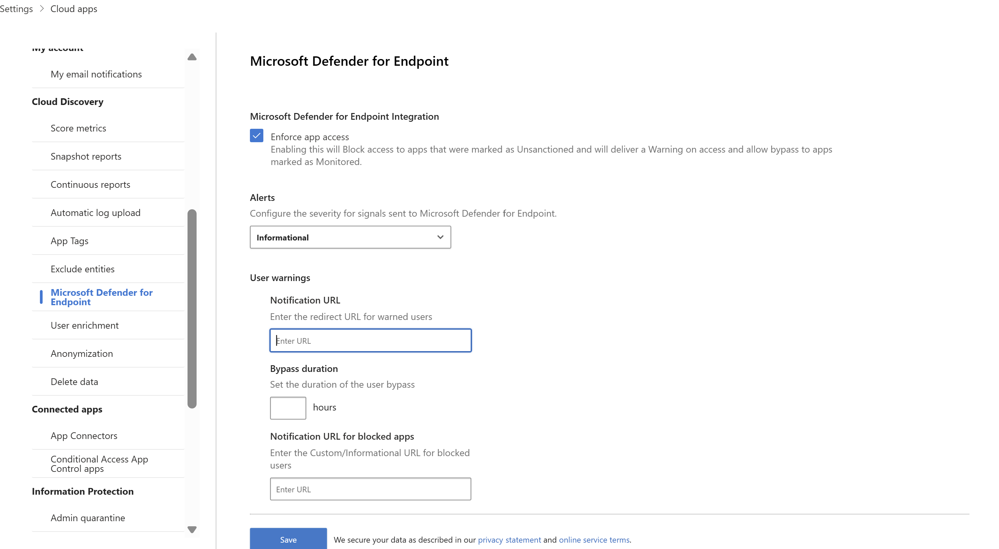
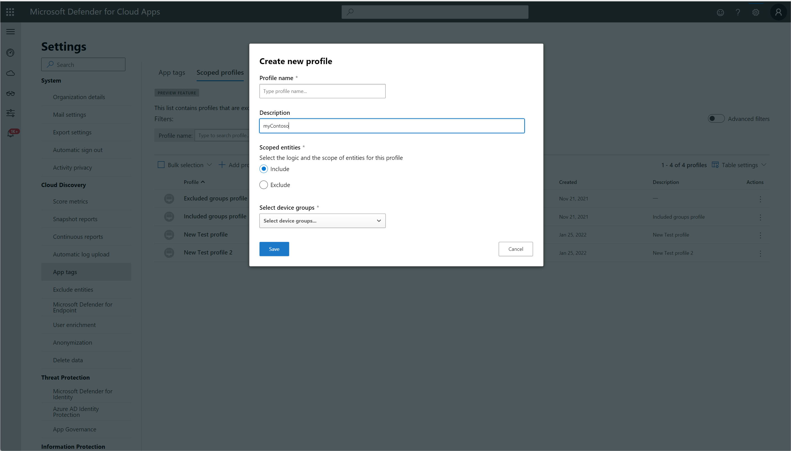
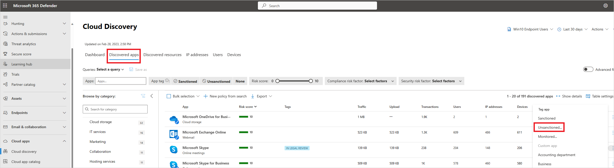
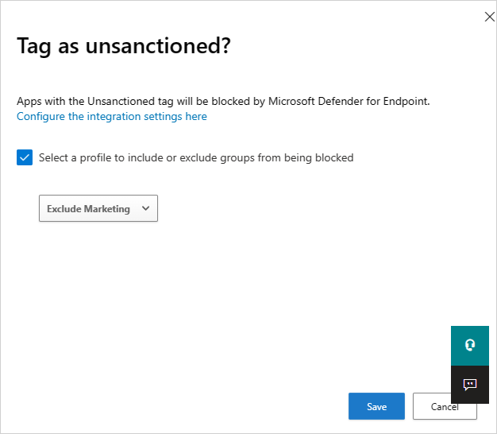
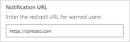

# Govern discovered apps using Microsoft Defender for Endpoint

The Microsoft Defender for Cloud Apps [integration with Microsoft Defender for Endpoint](mde-integration.md) provides a seamless Shadow IT visibility and control solution. Our integration enables Defender for Cloud Apps administrators to block access of end users to cloud apps, by natively integrating Defender for Cloud Apps app governance controls with Microsoft Defender for Endpoint's network protection. Alternatively, administrators can take a gentler approach of warning users when they access risky cloud apps.

Defender for Cloud Apps uses the built-in [**Unsanctioned**](governance-discovery.md#sanctioningunsanctioning-an-app) app tag to mark cloud apps as prohibited for use, available in both the **Cloud Discovery** and **Cloud App Catalog** pages. By enabling the integration with Defender for Endpoint, you can seamlessly block access to unsanctioned apps with a single click in the Defender for Cloud Apps portal.

Apps marked as **Unsanctioned** in Defender for Cloud Apps are automatically synced to Defender for Endpoint. More specifically, the domains used by these unsanctioned apps are propagated to endpoint devices to be blocked by Microsoft Defender Antivirus within the Network Protection SLA.

> [!NOTE]
> The time latency to block an app via Defender for Endpoint is up to three hours from the moment you mark the app as unsanctioned in Defender for Cloud Apps to the moment the app is blocked in the device. This is due to up to one hour of synchronization of Defender for Cloud Apps sanctioned/unsanctioned apps to Defender for Endpoint, and up to two hours to push the policy to the devices in order to block the app once the indicator was created in Defender for Endpoint.

## Prerequisites

- One of the following licenses:

  - Defender for Cloud Apps (E5, AAD-P1m CAS-D) and Microsoft Defender for Endpoint [Plan 2](/microsoft-365/security/defender-endpoint/defender-endpoint-plan-1-2), with endpoints onboarded to Defender for Endpoint
  - Microsoft 365 E5

- Microsoft Defender Antivirus. For more information, see:

  - [Real-time protection enabled](/microsoft-365/security/defender-endpoint/configure-real-time-protection-microsoft-defender-antivirus)
  - [Cloud-delivered protection enabled](/microsoft-365/security/defender-endpoint/enable-cloud-protection-microsoft-defender-antivirus)
  - [Network protection enabled and configured to block mode](/microsoft-365/security/defender-endpoint/enable-network-protection)

- One of the following supported operating systems:

   - Windows: Windows versions 10 18.09 (RS5) OS Build 1776.3, 11, and higher
   - Android: minimum version 8.0: For more information see: [Microsoft Defender for Endpoint on Android](/microsoft-365/security/defender-endpoint/microsoft-defender-endpoint-android#system-requirements)
   - iOS: minimum version 14.0: For more information see: [Microsoft Defender for Endpoint on iOS](/microsoft-365/security/defender-endpoint/microsoft-defender-endpoint-ios#prerequisites)
   - macOS: minimum version 11: For more information see:  [Network protection for macOS](/microsoft-365/security/defender-endpoint/network-protection-macos)
   - [Linux system requirements](/microsoft-365/security/defender-endpoint/microsoft-defender-endpoint-linux): For more information see: [Network protection for Linux](/microsoft-365/security/defender-endpoint/network-protection-linux)

- Microsoft Defender for Endpoint onboarded. For more information, see [Onboard Defender for Cloud Apps with Defender for Endpoint](mde-integration.md#how-to-integrate-microsoft-defender-for-endpoint-with-defender-for-cloud-apps).

- Administrator access to make changes in Defender for Cloud Apps. For more information, see [Manage admin access](manage-admins.md).

## Enable cloud app blocking with Defender for Endpoint

Use the following steps to enable access control for cloud apps:

1. In the Microsoft Defender Portal, select **Settings**. Then choose **Cloud Apps**. Under **Cloud Discovery**, select **Microsoft Defender for Endpoint**, and then select **Enforce app access**.

    
   
    > [!NOTE]
    > It can take up to 30 minutes for this setting to take effect.

1. In Microsoft Defender XDR, go to **Settings** > **Endpoints** > **Advanced features**, and then select **Custom network indicators**. For information about network indicators, see [Create indicators for IPs and URLs/domains](/microsoft-365/security/defender-endpoint/indicator-ip-domain).

    This allows you to leverage Microsoft Defender Antivirus network protection capabilities to block access to a predefined set of URLs using Defender for Cloud Apps, either by manually assigning [app tags](governance-discovery.md#sanctioningunsanctioning-an-app) to specific apps or automatically using an [app discovery policy](cloud-discovery-policies.md#creating-an-app-discovery-policy).

    
   
## Educate users when accessing blocked apps & customize the block page

Admins can now configure and embed a support/help URL for block pages. With this configuration, admins can educate users when they access blocked apps. Users are prompted with a custom redirect link to a company page listing apps blocked for use and necessary steps to be followed to secure an exception on block pages. End users will be redirected to this URL that is configured by admin when they click on "Visit the Support page” on the block page.

Defender for Cloud Apps uses the built-in **Unsanctioned** app tag to mark cloud apps as blocked for use. The tag is available on both the **Cloud Discovery** and **Cloud App Catalog** pages. By enabling the integration with Defender for Endpoint, you can seamlessly educate users on apps blocked for use and steps to secure an exception with a single click in the Defender for Cloud Apps portal.

Apps marked as **Unsanctioned** are automatically synced to Defender for Endpoint's custom URL indicators, usually within a few minutes. More specifically, the domains used by blocked apps are propagated to endpoint devices to provide a message by Microsoft Defender Antivirus within the Network Protection SLA.

### Setting up the custom redirect URL for the block page

Use the following steps to configure a custom help/support URL pointing to a company web page or a sharepoint link where you can educate employees on why they've been blocked from accessing the application and provide a list of steps to secure an exception or share the corporate access policy to adhere to your organization's risk acceptance.

1. In the Microsoft Defender portal, select **Settings** > **Cloud Apps** > **Cloud Discovery** > **Microsoft Defender for Endpoint**.
1. In the **Alerts** dropdown, select **Informational**.
1. Under **User warnings** > **Notification URL for blocked apps**, enter your URL. For example:

## Block apps for specific device groups

To block usage for specific device groups, do the following steps:

1. In the Microsoft Defender Portal, select **Settings**. Then choose **Cloud Apps**.  Then under **Cloud discovery**, select **Apps tags** and go to the **Scoped profiles** tab.

1. Select **Add profile**. The profile sets the entities scoped for blocking/unblocking apps.

1. Provide a descriptive profile name and description.

1. Choose whether the profile should be an **Include** or **Exclude** profile.

    - **Include**: only the included set of entities will be affected by the access enforcement. For example, the profile *myContoso* has **Include** for device groups A and B. Blocking app Y with the profile *myContoso* will block app access only for groups A and B.

    - **Exclude**: The excluded set of entities won't be affected by the access enforcement. For example, the profile *myContoso* has **Exclude** for device groups A and B. Blocking app Y with the profile *myContoso* will block app access for the entire organization except for groups A and B.

1. Select the relevant device groups for the profile. Device groups listed are pulled from Microsoft Defender for Endpoint. For more information, see [Create a device group](/microsoft-365/security/defender-endpoint/machine-groups#create-a-device-group).

1. Select **Save**.

    
   
To block an app, do the following steps:

1. In the Microsoft Defender Portal, under **Cloud Apps**, go to **Cloud Discovery** and go to the **Discovered apps** tab.

1. Select the app that should be blocked.

1. Tag the app as **Unsanctioned**.

    
   
1. To block all the devices in your organization, in the **Tag as unsanctioned?** dialog, select **Save**. To block specific device groups in your organizations, select **Select a profile to include or exclude groups from being blocked**. Then choose the profile for which the app will be blocked, and select **Save**.

    
   
    The **Tag as unsanctioned?** dialog appears only when your tenant has cloud app blocking with Defender for Endpoint enabled and if you have admin access to make changes.

> [!NOTE]
>
> - The enforcement ability is based on Defender for Endpoint’s custom URL indicators.
> - Any organizational scoping that was set manually on indicators that were created by Defender for Cloud Apps before the release of this feature will be overridden by Defender for Cloud Apps. The required scoping should be set from the Defender for Cloud Apps experience using the scoped profiles experience.
> - To remove a selected scoping profile from an unsanctioned app, remove the unsanctioned tag and then tag the app again with the required scoped profile.
> - It can take up to two hours for app domains to propagate and be updated in the endpoint devices once they're marked with the relevant tag or/and scoping.
> - When an app is tagged as *Monitored*, the option to apply a scoped profile shows only if the built-in *Win10 Endpoint Users* data source has consistently recieved data during the past 30 days.

## Educate users when accessing risky apps

Admins have the option to warn users when they access risky apps. Rather than blocking users, they're prompted with a message providing a custom redirect link to a company page listing apps approved for use. The prompt provides options for users to bypass the warning and continue to the app. Admins are also able to monitor the number of users that bypass the warning message.

Defender for Cloud Apps uses the built-in **Monitored** app tag to mark cloud apps as risky for use. The tag is available on both the **Cloud Discovery** and **Cloud App Catalog** pages. By enabling the integration with Defender for Endpoint, you can seamlessly warn users on access to monitored apps with a single click in the Defender for Cloud Apps portal.

Apps marked as **Monitored** are automatically synced to Defender for Endpoint's custom URL indicators, usually within a few minutes. More specifically, the domains used by monitored apps are propagated to endpoint devices to provide a warning message by Microsoft Defender Antivirus within the Network Protection SLA.

### Setting up the custom redirect URL for the warn message

Use the following steps to configure a custom URL pointing to a company web page where you can educate employees on why they've been warned and provide a list of alternative approved apps that adhere to your organization's risk acceptance or are already managed by the organization.

1. In the Microsoft Defender Portal, select **Settings**. Then choose **Cloud Apps**. Under **Cloud Discovery**, select **Microsoft Defender for Endpoint**.
1. In the **Notification URL** box, enter your URL.

    
   
### Setting up user bypass duration

Since users can bypass the warning message, you can use the following steps to configure the duration of the bypass apply. Once the duration has elapsed, users are prompted with the warning message the next time they access the monitored app.

1. In the Microsoft Defender Portal, select **Settings**. Then choose **Cloud Apps**. Under **Cloud Discovery**, select **Microsoft Defender for Endpoint**.
1. In the **Bypass duration** box, enter the duration (hours) of the user bypass.

    
   
### Monitor applied app controls

Once controls are applied, you can monitor app usage patterns by the applied controls (access, block, bypass) using the following steps.

1. In the Microsoft Defender Portal, under **Cloud Apps**, go to **Cloud Discovery** and then go to the **Discovered apps** tab. Use the [filters](discovered-app-queries.md) to find the relevant monitored app.
1. Select the app's name to view applied app controls on the app's overview page.

## Next steps

> [!div class="nextstepaction"]
> [Investigate apps discovered by Microsoft Defender for Endpoint](mde-investigation.md)

> [!div class="nextstepaction"]
> [Control cloud apps with policies](control-cloud-apps-with-policies.md)

## Related videos

> [!div class="nextstepaction"]
> [Discover and block Shadow IT using Defender for Endpoint](https://www.youtube.com/watch?v=MsHkTOoqSQo)

> [!div class="nextstepaction"]
> [Shadow IT discovery beyond the corporate network](https://www.youtube.com/watch?v=f8hbvbY1Hnc)

[!INCLUDE [Open support ticket](includes/support.md)]
