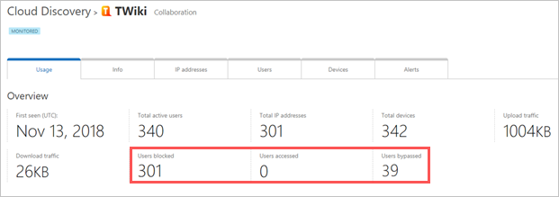

# Govern discovered apps using Microsoft Defender for Endpoint

[!INCLUDE [Banner for top of topics](includes/banner.md)]

Microsoft Cloud App Security's [integration with Microsoft Defender for Endpoint](mde-integration.md) provides a seamless Shadow IT visibility and control solution. Our integration enable Cloud App Security administrators to block access of end users to cloud apps, by natively integrating Cloud App Security app governance controls with Microsoft Defender for Endpoints' network protection. Alternatively, administrators can take a gentler approach of warning users when they access risky cloud apps.

## Prerequisites

- Microsoft Cloud App Security license
- Microsoft Defender for Endpoint license
- Windows 10 version 1709 (OS Build 16299.1085 with KB4493441), Windows 10 version 1803 (OS Build 17134.704 with KB4493464), Windows 10 version 1809 (OS Build 17763.379 with KB4489899) or later Windows 10 and Windows 11 versions
- Microsoft Defender Antivirus
  - [real-time protection enabled](/windows/security/threat-protection/windows-defender-antivirus/configure-real-time-protection-windows-defender-antivirus)
  - [cloud-delivered protection enabled](/windows/security/threat-protection/windows-defender-antivirus/enable-cloud-protection-windows-defender-antivirus)
  - [Network protection enabled and configured to block mode](/windows/security/threat-protection/microsoft-defender-atp/enable-network-protection)

## Block access to unsanctioned cloud apps

Cloud App Security uses the built-in [**Unsanctioned**](governance-discovery.md#BKMK_SanctionApp) app tag to mark cloud apps as prohibited for use, available in both the Cloud Discovery and Cloud app catalog pages. By enabling the integration with Defender for Endpoint, you can seamlessly block access to unsanctioned apps with a single click in the Cloud App Security portal.

### How blocking works

Apps marked as **Unsanctioned** in Cloud App Security are automatically synced to Defender for Endpoint, usually within a few minutes. More specifically, the domains used by these unsanctioned apps are propagated to endpoint devices to be blocked by Microsoft Defender Antivirus within the Network Protection SLA.

### How to enable cloud app blocking with Defender for Endpoint

Use the following steps to enable access control for cloud apps:

1. In Cloud App Security, under the settings cog, select **Settings**, under **Cloud Discovery** select **Microsoft Defender for Endpoint**, and then select **Block unsanctioned apps**.

    

1. In Microsoft 365 Defender, go to **Settings** > **Endpoints** > **Advanced features**, and then select **Custom network indicators**. For information about network indicators, see [Create indicators for IPs and URLs/domains]((/microsoft-365/security/defender-endpoint/indicator-ip-domain).

    This allows you to leverage Microsoft Defender Antivirus network protection capabilities to block access to a predefined set of URLs using Cloud App Security, either by manually assigning [app tags](governance-discovery.md#BKMK_SanctionApp) to specific apps or automatically using an [app discovery policy](cloud-discovery-policies.md#creating-an-app-discovery-policy).

    

## Educate users when accessing risky apps

>[!NOTE]
> **Prerequisite**: Opt in to the public preview feature in Microsoft Defender for Endpoint. For more information, see [Microsoft Defender for Endpoint preview features](/microsoft-365/security/defender-endpoint/preview).

Admins have the option to warn users when they access risky apps. Rather than blocking users, they are prompted with a message providing a custom redirect link to a company page listing apps approved for use. The prompt provides options for users to bypass the warning and continue to the app. Admins are also able to monitor the number of users that bypass the warning message.

### How does it work

Cloud App Security uses the built-in **Monitored** app tag to mark cloud apps as risky for use. The tag is available on both the Cloud Discovery and Cloud App Catalog pages. By enabling the integration with Defender for Endpoint, you can seamlessly warn users on access to monitored apps with a single click in the Cloud App Security portal.

Apps marked as **Monitored** are automatically synced to Defender for Endpoint's custom URL indicators, usually within a few minutes. More specifically, the domains used by monitored apps are propagated to endpoint devices to provide a warning message by Microsoft Defender Antivirus within the Network Protection SLA.

### Setting up the custom redirect URL for the warn message

Use the following steps to configure a custom URL pointing to a company web page where you can educate employees on why they have been warned and provide a list of alternative approved apps that adhere to your organization's risk acceptance or are already managed by the organization.

1. In Cloud App Security, under the settings cog, select **Settings**, and under **Cloud Discovery** select **Microsoft Defender for Endpoint**.
1. In the **Notification URL** box, enter your URL.

    

### Setting up user bypass duration

Since users can bypass the warning message, you can use the following steps to configure the duration of the bypass apply. Once the duration has elapsed, users are prompted with the warning message the next time they access the monitored app.

1. In Cloud App Security, under the settings cog, select **Settings**, and under **Cloud Discovery** select **Microsoft Defender for Endpoint**.
1. In the **Bypass duration** box, enter the duration (hours) of the user bypass.

    

### Monitor applied app controls

Once controls are applied, you can monitor app usage patterns by the applied controls (access, block, bypass) using the following steps.

1. In Cloud App Security, under **Discovery** > **Discovered apps**, use the [filters](discovered-app-queries.md) to find the relevant monitored app.
1. Select the app's name to view applied app controls on the app's overview page.

    

## Next steps

> [!div class="nextstepaction"]
> [Investigate apps discovered by Microsoft Defender for Endpoint](mde-investigation.md)

> [!div class="nextstepaction"]
> [Control cloud apps with policies](control-cloud-apps-with-policies.md)

## Related videos

> [!div class="nextstepaction"]
> [Discover and block Shadow IT using Defender for Endpoint](https://www.youtube.com/watch?v=MsHkTOoqSQo)

> [!div class="nextstepaction"]
> [Shadow IT discovery beyond the corporate network](https://www.youtube.com/watch?v=f8hbvbY1Hnc)

[!INCLUDE [Open support ticket](includes/support.md)]
