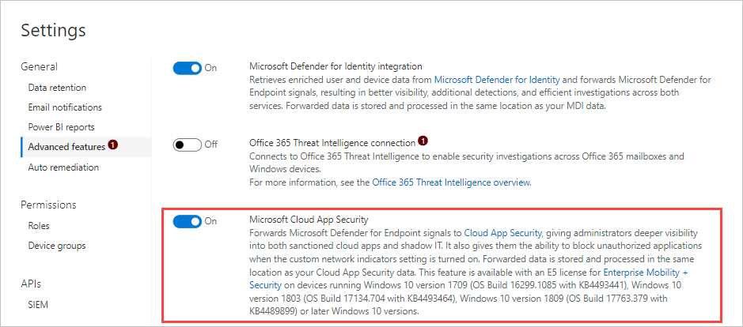
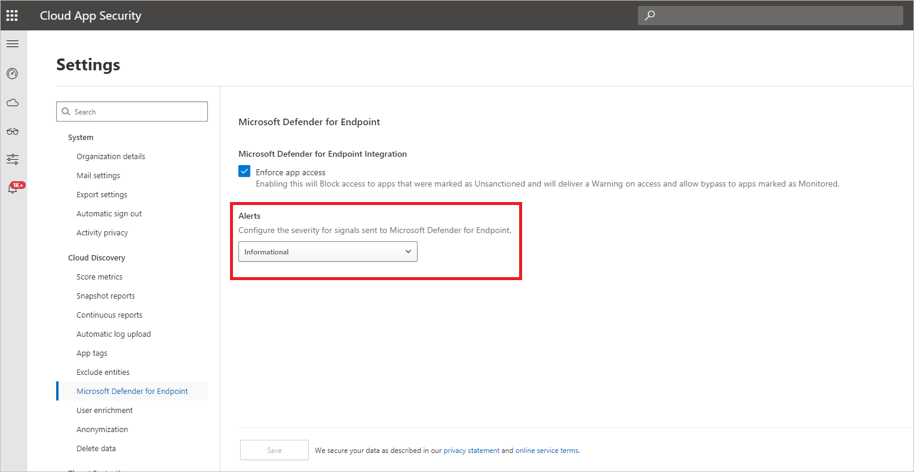

# Integrate Microsoft Defender for Endpoint with Microsoft Defender for Cloud Apps

[!INCLUDE [Banner for top of topics](includes/banner.md)]

> [!IMPORTANT]
> This document focuses on shadow IT discovery capabilities from Defender for Endpoint logs. For more information on shadow IT governing capabilities via Defender for Endpoint, see [Govern discovered apps using Microsoft Defender for Endpoint](mde-govern.md).

Microsoft Defender for Cloud Apps integrates with Microsoft Defender for Endpoint natively. The integration simplifies roll out of Cloud Discovery, and enables device-based investigation. [Microsoft Defender for Endpoint](/microsoft-365/security/defender-endpoint/microsoft-defender-endpoint) is a security platform for intelligent protection, detection, investigation, and response. Defender for Endpoint protects endpoints from cyber threats, detects advanced attacks and data breaches, automates security incidents, and improves security posture.

Defender for Cloud Apps uses the traffic information collected by Defender for Endpoint about the cloud apps and services being accessed from IT-managed devices specified in the prerequisites below.

The integration doesn't require any additional deployment and can be enabled directly from the settings in Defender for Endpoint and Microsoft 365 Defender. You don't need to route or mirror traffic from your endpoints or do complex integration steps. Logs from your endpoints sent to Defender for Cloud Apps provide user and device information for traffic activities. Pairing device context with the username provides a full picture across your network enabling you to determine which user did which activity from which device.

Additionally, when you identify a risky user, you can check all the devices the user accessed to detect potential risks. If you identify a risky device, check all the users who used it to detect further potential risks.

Once traffic information is collected, you're ready to [deep dive into cloud app use](discovered-apps.md#deep-dive-into-discovered-apps) in your organization. Defender for Cloud Apps takes advantage of Defender for Endpoint Network Protection capabilities to block endpoint device access to cloud apps. For more information about governing the discovered apps, see [Govern discovered apps using Microsoft Defender for Endpoint](mde-govern.md).

## Prerequisites

- Microsoft Defender for Cloud Apps license
- One of the following:

    - [Microsoft Defender for Endpoint with Plan 2](/microsoft-365/security/defender-endpoint/defender-endpoint-plan-1-2) 

    - [Microsoft Defender for Business with a premium license](/microsoft-365/security/defender-endpoint/defender-endpoint-plan-1-2) or [Microsoft Defender for Business with a standalone license](/microsoft-365/security/defender-endpoint/defender-endpoint-plan-1-2)
- Windows 10 version 1709 (OS Build 16299.1085 with KB4493441), Windows 10 version 1803 (OS Build 17134.704 with KB4493464), Windows 10 version 1809 (OS Build 17763.379 with KB4489899) or later Windows 10 and Windows 11 versions
- Enable Microsoft Defender Antivirus:
  - **[Real-time protection enabled](/microsoft-365/security/defender-endpoint/configure-real-time-protection-microsoft-defender-antivirus)**
  - **[Cloud-delivered protection enabled](/microsoft-365/security/defender-endpoint/enable-cloud-protection-microsoft-defender-antivirus)**
  - **[Network protection enabled and configured to block mode](/microsoft-365/security/defender-endpoint/enable-network-protection)**

> [!NOTE]
> Microsoft Defender Antivirus is highly recommended for Discovery but not mandatory; some Discovery data is still available when Defender Antivirus is disabled.

## How it works

On its own, Defender for Cloud Apps collects logs from your endpoints using either [logs you upload](create-snapshot-cloud-discovery-reports.md) or by [configuring automatic log upload](discovery-docker.md). Native integration enables you to take advantage of the logs Defender for Endpoint's agent creates when it runs on Windows and monitors network transactions. Use this information for Shadow IT discovery across the Windows devices on your network.

[Watch our videos](#related-videos) showing the benefits of using Defender for Endpoint with Defender for Cloud Apps.

## How to integrate Microsoft Defender for Endpoint with Defender for Cloud Apps

To enable Defender for Endpoint integration with Defender for Cloud Apps:

1. In [Microsoft 365 Defender](https://security.microsoft.com), from the navigation pane, select **Settings**.
1. Select **Endpoints**.
1. Under **General**, select **Advanced features**.
1. Toggle the **Microsoft Defender for Cloud Apps** to **On**.
1. Select **Apply**.

    >[!NOTE]
    > It takes up to two hours after you enable the integration for the data to show up in Defender for Cloud Apps.
    >

    

To configure the severity for alerts sent to Microsoft Defender for Endpoint:

1. In the Microsoft 365 Defender portal, select **Settings**. Then choose **Cloud Apps**. Under **Cloud Discovery**, select **Microsoft Defender for Endpoint**.
1. Under **Alerts**, select the global severity level for alerts.
1. Select **Save**.

    

## Next steps

> [!div class="nextstepaction"]
> [Investigate apps discovered by Microsoft Defender for Endpoint](mde-investigation.md)

> [!div class="nextstepaction"]
> [Govern apps discovered by Microsoft Defender for Endpoint](mde-govern.md)

## Related videos

> [!div class="nextstepaction"]
> [Discover and block Shadow IT using Defender for Endpoint](https://www.youtube.com/watch?v=MsHkTOoqSQo)

> [!div class="nextstepaction"]
> [Shadow IT discovery beyond the corporate network](https://www.youtube.com/watch?v=f8hbvbY1Hnc)

[!INCLUDE [Open support ticket](includes/support.md)]
