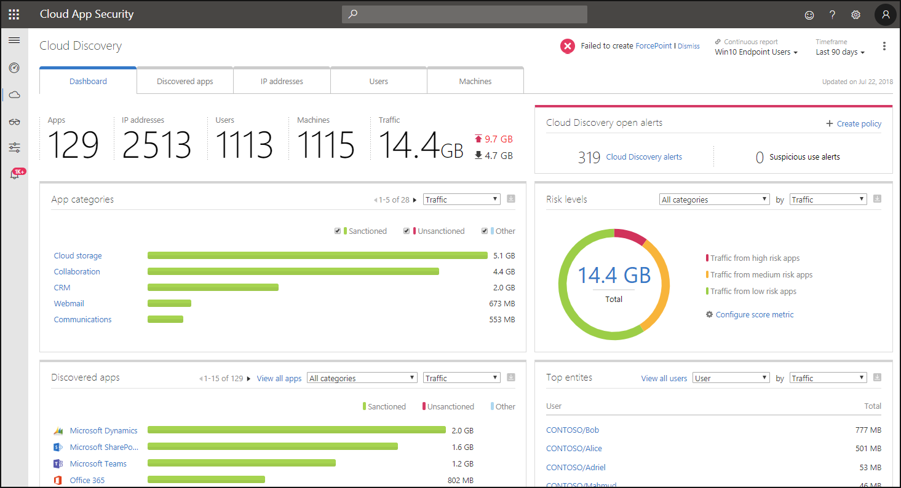
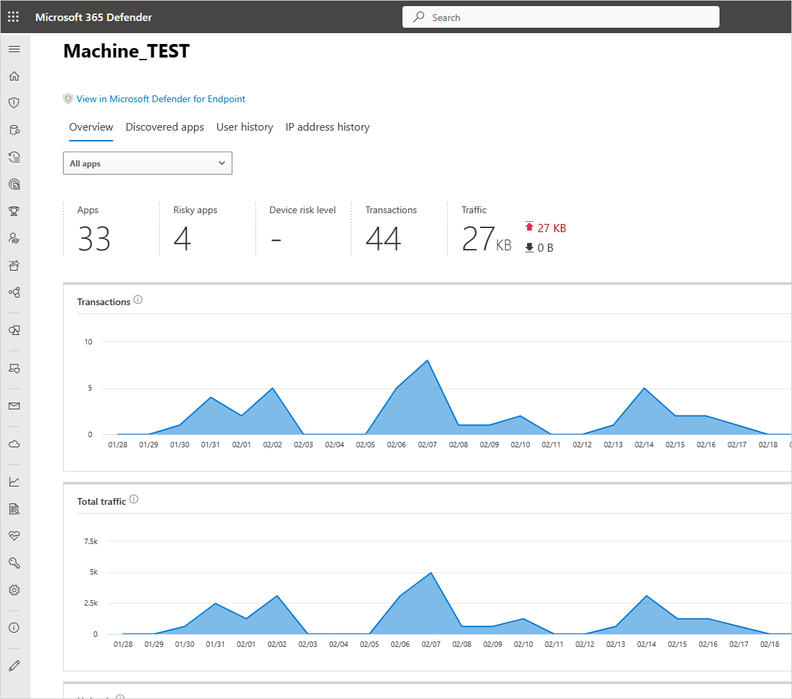
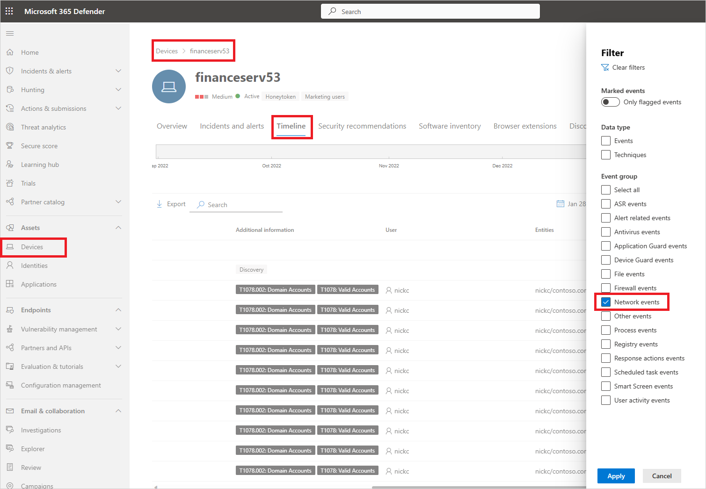
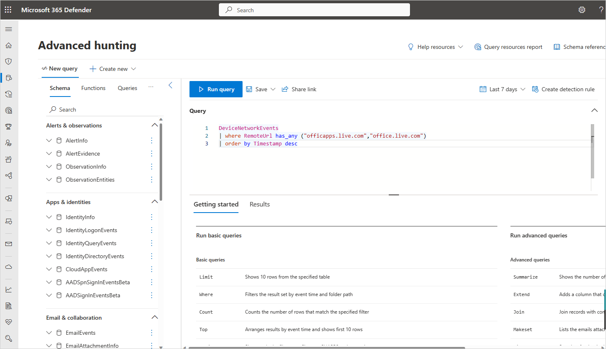
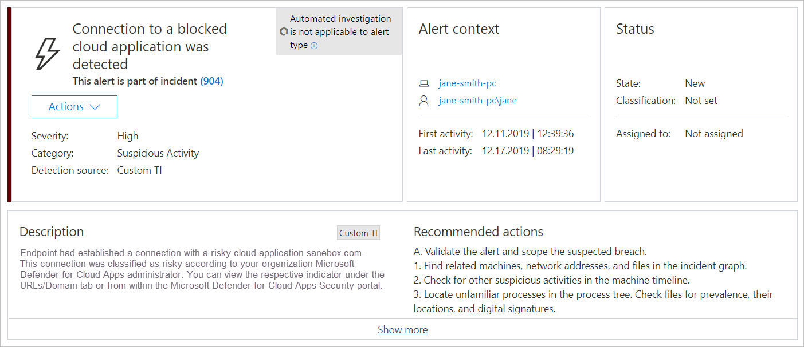

# Investigate apps discovered by Microsoft Defender for Endpoint

[!INCLUDE [Banner for top of topics](includes/banner.md)]

The Microsoft Defender for Cloud Apps [integration with Microsoft Defender for Endpoint](mde-integration.md) provides a seamless Shadow IT visibility and control solution. Our integration enables Defender for Cloud Apps administrators to investigate discovered devices, network events, and app usage.

## Investigate discovered devices in Defender for Cloud Apps

After you integrate Defender for Endpoint with Defender for Cloud Apps, you can investigate discovered device data in the Cloud Discovery dashboard.

1. In the Microsoft 365 Defender portal, under **Cloud Apps**, select **Cloud Discovery**. Then select the **Dashboard** tab.
2. In the top-right corner, select **Win10 endpoint users**.
  
  This stream contains data from the operating systems mentioned in the [prerequisites](mde-integration.md#prerequisites)
3. Across the top, you'll see the number of discovered devices added after the integration.
4. Select the **Devices** tab.
5. You can drill down into each device that's listed, and use the tabs to view the investigation data. Find correlations between the devices, the users, IP addresses, and apps that were involved in incidents:

    - **Overview**
        - **Device risk level**: Shows how risky the device's profile is relative to other devices in your organization, as indicated by the severity (high, medium, low, informational). Defender for Cloud Apps uses device profiles from Defender for Endpoint for each device based on advanced analytics. Activity that is anomalous to a device's baseline is evaluated and determines the device's risk level. Use the device risk level to determine which devices to investigate first.
        - **Transactions**: Information about the number of transactions that took place on the device over the selected period of time.
        - **Total traffic**: Information about the total amount of traffic (in MB) over the selected period of time.
        - Uploads: Information about the total amount of traffic (in MB) uploaded by the device over the selected period of time.
        - **Downloads**: Information about the total amount of traffic (in MB) downloaded by the device over the selected period of time.
    - **Discovered apps**  
    Lists all the discovered apps that were accessed by the device.
    - **User history**  
    Lists all the users who signed in to the device.
    - **IP address history**  
    Lists all the IP addresses that were assigned to the device.
 

As with any other Cloud Discovery source, you can export the data from the Win10 endpoint users report for further investigation.

> [!NOTE]
>
> - Defender for Endpoint forwards data to Defender for Cloud Apps in chunks of ~4 MB (~4000 endpoint transactions)
> - If the 4 MB limit isn't reached within 1 hour, Defender for Endpoint reports all the transactions performed over the last hour.
> - If the endpoint device is behind a forward proxy, traffic data will not be visible to Defender for Endpoint and hence will not be included in Cloud Discovery reports. We recommend to routing the forward proxy's logs to Defender for Cloud Apps using the **Automated log upload** in order to get complete visibility. For an alternative way to view this traffic and investigate accessed URLs by devices, see [Monitoring network connection behind forward proxy](https://techcommunity.microsoft.com/t5/microsoft-defender-for-endpoint/mdatp-monitoring-network-connection-behind-forward-proxy-public/ba-p/758274).

## Investigate device network events in Microsoft 365 Defender

>[!NOTE]
>Network events should be used to investigate discovered apps and not used to debug missing data.

Use the following steps to gain more granular visibility on device's network activity in Microsoft Defender for Endpoint:

1. In the Microsoft 365 Defender portal, under **Cloud Apps**, select **Cloud Discovery**. Then select the **Devices** tab.
1. Select the machine you want to investigate and then in the top-left select **View in Microsoft Defender for Endpoint**.
1. In Microsoft 365 Defender, under **Assets** -> **Devices** > {selected device}, select **Timeline**.
1. Under **Filters**, select **Network events**.
1. Investigate the device's network events as required.



## Investigate app usage in Microsoft 365 Defender with advanced hunting

Use the following steps to gain more granular visibility on app-related network events in Defender for Endpoint:

1. In the Microsoft 365 Defender portal, under **Cloud Apps**, select **Cloud Discovery**. Then select the **Discovered apps** tab.
1. Select the app you want to investigate to open its drawer.
1. Select the app's **Domain** list and then copy the list of domains.
1. In Microsoft 365 Defender, under **Hunting**, select **Advanced hunting**.
1. Paste the following query and replace `<DOMAIN_LIST>` with the list of domains you copied earlier.

    ```kusto
    DeviceNetworkEvents
    | where RemoteUrl has_any ("<DOMAIN_LIST>")
    | order by Timestamp desc
    ```

1. Run the query and investigate network events for this app.

    

## Investigate unsanctioned apps in Microsoft 365 Defender

Every attempt to access an unsanctioned app triggers an alert in Microsoft 365 Defender with in-depth details about the entire session. This enables you to perform deeper investigations into attempts to access unsanctioned apps, as well as providing additional relevant information for use in endpoint device investigation.

Sometimes, access to an unsanctioned app isn't blocked, either because the endpoint device isn't configured correctly or if the enforcement policy hasn't yet propagated to the endpoint. In this instance, Defender for Endpoint administrators will receive an alert in Microsoft 365 Defender that the unsanctioned app wasn't blocked.



> [!NOTE]
>
> - It takes up to two hours after you tag an app as **Unsanctioned** for app domains to propagate to endpoint devices.
> - By default, apps and domains marked as **Unsanctioned** in Defender for Cloud Apps, will be blocked for all endpoint devices in the organization.
> - Currently, full URLs are not supported for unsanctioned apps. Therefore, when unsanctioning apps configured with full URLs, they are not propagated to Defender for Endpoint and will not be blocked. For example, `google.com/drive` is not supported, while `drive.google.com` is supported.
> - In-browser notifications may vary between different browsers.

## Next steps

> [!div class="nextstepaction"]
> [Govern apps discovered by Microsoft Defender for Endpoint](mde-govern.md)

> [!div class="nextstepaction"]
> [Control cloud apps with policies](control-cloud-apps-with-policies.md)

## Related videos

- [Hunting with Microsoft Cloud App Security data](https://www.microsoft.com/videoplayer/embed/RWFISa)

- [Discover and block Shadow IT using Defender for Endpoint](https://www.youtube.com/watch?v=MsHkTOoqSQo)

- [Shadow IT discovery beyond the corporate network](https://www.youtube.com/watch?v=f8hbvbY1Hnc)

[!INCLUDE [Open support ticket](includes/support.md)]
