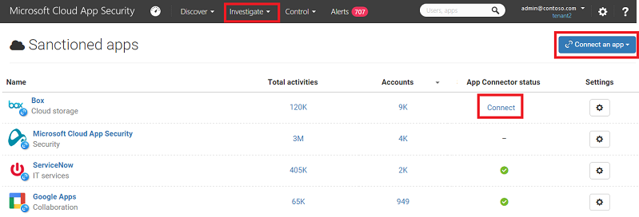

# Connect Box to Microsoft Cloud App Security
  This section provides instructions for connecting [!INCLUDE[Adallom](../migration/includes/adallom_md.md)] to your existing Box account using the App Connector APIs.  
  
## How to connect Box to Cloud App Security  
  
> [!NOTE]  
>  Deploying with an account that is not an Admin account will lead to a failure in the API test and will not allow [!INCLUDE[Adallom](../migration/includes/adallom_md.md)] to scan all of the files in Box. If this is a problem for you, you can deploy with a Co-Admin that has all of the privileges checked, but the API test will continue to fail and files owned by other admins in Box will not be scanned.  
  
1.  If you restrict application permission access, follow this step. Otherwise, skip to step 2.  
  
    -   In the Box Admin console, click the settings icon followed by **Business settings**.  
  
           
  
    -   Click on the **Apps** tab.  
  
           
  
    -   If **Unpublished Applications** is selected, in the **Except for** text box, add the Cloud App Security app serial number: `nduj1o3yavu30dii7e03c3n7p49cj2qh` and click **Save**.  
  
           
  
    > [!NOTE]  
    >  If you are an existing Adallom customer, and your console URL is for Adallom and not [!INCLUDE[Adallom](../migration/includes/adallom_md.md)], use this app serial number: bwahmilhdlpbqy2ongkl119o3lrkoshc.  
  
2.  In the [!INCLUDE[Adallom](../migration/includes/adallom_md.md)] portal, click **Investigate** and then **Sanctioned apps**.  
  
3.  In the Box row, click **Connect** in the **App Connector status** column, or click the **Connect an App** button and select **Box**.  
  
       
  
4.  In the **Box settings** page, on the **API** tab, click **Follow this link**.  
  
5.  This opens the Box logon page. Enter your credentials to allow [!INCLUDE[Adallom](../migration/includes/adallom_md.md)] access to your team's Box app.  
  
6.  Box will ask you if you want to allow [!INCLUDE[Adallom](../migration/includes/adallom_md.md)] access to your team information and activity log and perform any activity as any team member. To proceed, click **Allow**.  
  
7.  Back in the [!INCLUDE[Adallom](../migration/includes/adallom_md.md)] portal, you should receive a message saying that Box was successfully connected.  
  
8.  Make sure the connection succeeded by clicking **Test API**.  
  
     Testing may take a couple of minutes. After receiving a success notice, click **Close**.  
  
 Box is now connected to Cloud App Security.  
 
 After connecting Box, you will receive events for 60 days prior to connection.
  
  After connecting Box, Cloud App Security performs a full scan. Depending on how many files and users you have, completing the full scan can take awhile. To enable near real time scanning, files on which activity is detected are moved to the beginning of the scan queue, for example a file that is edited, updated, or shared is scanned right away and doesn't wait until it is reached by regular scan process. This does not apply to files that are not inherently modified, for example files that are viewed, previewed, printed or exported.
  
## See Also  
 [Control cloud apps with policies](../migration/control-cloud-apps-with-policies.md)   
 [For technical support, please visit the Cloud App Security assisted support page.](http://support.microsoft.com/oas/default.aspx?prid=16031)   
 [Premier customers can also choose Cloud App Security directly from the Premier Portal.](https://premier.microsoft.com/)  
  
  