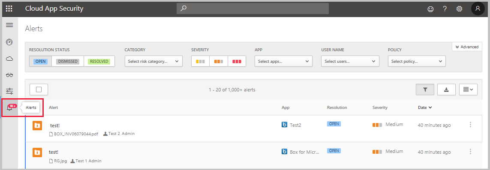

---
# required metadata

title: Monitor alerts raised in Cloud App Security 
description: This article provides a list and description of all alerts.
keywords:
author: rkarlin
ms.author: rkarlin
manager: angrobe
ms.date: 12/10/2018
ms.topic: conceptual
ms.collection: M365-security-compliance
ms.prod:
ms.service: cloud-app-security
ms.technology:
ms.assetid: f118a3bf-1663-46ba-884f-b1b03a84ab66

# optional metadata

#ROBOTS:
#audience:
#ms.devlang:
ms.reviewer: reutam
ms.suite: ems
#ms.tgt_pltfrm:
ms.custom: seodec18

---
# Monitor alerts in Cloud App Security

*Applies to: Microsoft Cloud App Security*

Alerts are the entry points to understanding your cloud environment more deeply. This article provides a list and description of all alerts.

## Monitoring your alerts

It's a good idea to review all of your alerts. Understanding why an alert is occurring allows you to use them as tools for modifying your policies. 

**To view alerts:** In the Microsoft Cloud App Security portal, click on **Alerts**.

 - **Dismiss** an alert after you look at it and determine it's not interesting. 
     - Enter a **comment** to explain why you dismissed the alert 
     - **Send us feedback about this alert** to be reviewed by our security research team for improving the alerts.

- **Resolve** the alert if you investigate it and mitigate the risk. 

     - The alert will no longer show up in the alerts table.
     - **Mark as unread** if you started investigating an issue but you want to make sure you remember to continue. 
     -  **Adjust the policy** that matched the alert to improve future alert matches. 
     - Resolving an alert gives you the option to enter a comment and **Send feedback to the Cloud App Security team**.
 
## Built-in alerts

The following alerts types will be displayed. 

|Alert name|AlertID|Description|
|----|----|----|
|New location|ALERT_GEOLOCATION_NEW_COUNTRY|A new location was detected since the scan began (up to 6 months). This alert only shows up once for each country for your entire organization. |
|New admin user|ALERT_ADMIN_USER|A new admin was detected for a specific app. This admin can be someone who is an admin in one application and is now an admin for another application. This alert relates to the specific admin type, so it will show up each time the type of admin changes. If a user lost admin privileges and then got them again, this alert will be displayed.|
|Inactive account|ALERT_ZOMBIE_USER|If a user is inactive for 60 days per application – for example, if someone is active in Box but hasn't touched G Suite for 60 days, the user will be considered inactive in G Suite. A tag is added to these users so you can search for inactive accounts.|
|Unexpected admin location|ALERT_NEW_ADMIN_LOCATION|A new location was detected for administrators since the scan began (up to 6 months). This alert only shows up once for each country for any admin across your organization. |
|Compromised account|ALERT_COMPROMISED_ACCOUNT|If there was a breach in an application and the list of breached accounts is published, Cloud App Security downloads the list and compares it to your list of users. The user list includes internal users, external users, and personal accounts. |

## Custom Alerts

The following alerts types will be displayed. 

|Alert name|AlertID|Description|
|----|----|----|
|Suspicious activity alert|ALERT_SUSPICIOUS_ACTIVITY|Suspicious activities are scored according to how suspicious the anomalous activity is (Is there an inactive account involved? Is it from a new location?) These criteria are all calculated together to provide a risk score based on the following risk factors:  User is administrator  Strictly remote user Anonymous proxy  Entire session is failed logins Numerous failed logins New (admin) IP/ISP/country/user-agent for user/tenant  IP/ISP/country/user-agent used only by (admin) user First (admin) user activity in a while First time this particular administrative activity is performed in a while This particular administrative activity isn't common / was never performed before This IP had only failed logins in the past Impossible travel|
|Suspicious cloud use alert|ALERT_DISCOVERY_ANOMALY_DETECTION|Cloud Discovery anomaly detection checks the pattern of regular behavior and looks for users or apps that are used in an unusual way. |
|Activity policy violation|ALERT_CABINET_EVENT_MATCH_AUDIT|This alert lets you know when a policy match was detected.|
|File policy violation|ALERT_CABINET_EVENT_MATCH_FILE|This alert lets you know when a policy match was detected.|
|Proxy policy violation|ALERT_CABINET_INLINE_EVENT_MATCH|This alert lets you know when a policy match was detected.|
|Field policy violation|ALERT_CABINET_EVENT_MATCH_OBJECT|This alert lets you know when a policy match was detected.|
|New service discovered|ALERT_CABINET_DISCOVERY_NEW_SERVICE|A new app was discovered.|
|Use of personal account|ALERT_PERSONAL_USER_SAGE|Based on file shares and user names, the detection engine searches for personal accounts. |

## Next steps 

[Daily activities to protect your cloud environment](daily-activities-to-protect-your-cloud-environment.md)

[Premier customers can also create a new support request directly in the Premier Portal.](https://premier.microsoft.com/)  
