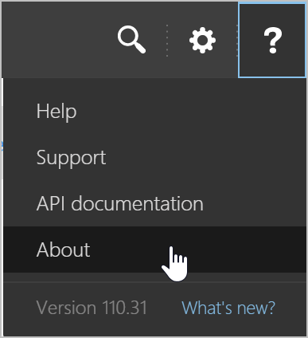
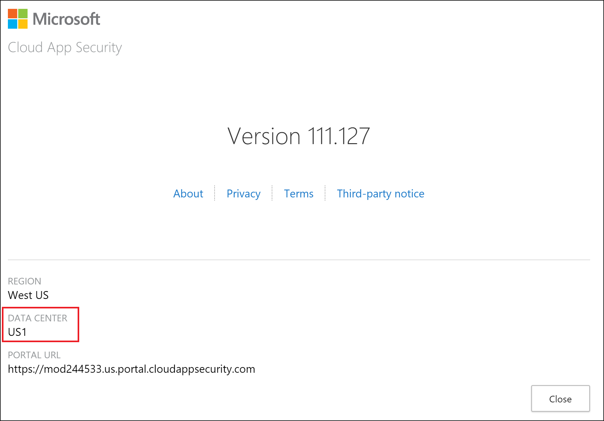

---
# required metadata

title: Network requirements - Cloud App Security | Microsoft Docs
description: This article describes the IP addresses and ports you need to open to work with Cloud App Security.
keywords:
author: shsagir
ms.author: shsagir
manager: shsagir
ms.date: 11/01/2019
ms.topic: conceptual
ms.collection: M365-security-compliance
ms.prod:
ms.service: cloud-app-security
ms.technology:

# optional metadata

#ROBOTS:
#audience:
ms.suite: ems
ms.custom: seodec18

---
# Network requirements

*Applies to: Microsoft Cloud App Security*

This article provides a list of ports and IP addresses you need to allow and allow list to work with Microsoft Cloud App Security.

## View your data center

Some of the requirements below depend on which data center you're connected to.

To see which data center you're connecting to, do the following steps:

1. In the Cloud App Security portal, click the **question mark icon** in the menu bar. Then, select **About**.

    

2. In the Cloud App Security version screen, you can see the region and the data center.

    

## Portal access

For access to the Cloud App Security portal, add **outbound port 443** for the following IP addresses and DNS names to your firewall's allow list:

    portal.cloudappsecurity.com
    *.portal.cloudappsecurity.com
    cdn.cloudappsecurity.com
    https://adaproddiscovery.azureedge.net
    *.s-microsoft.com
    *.msecnd.net
    dev.virtualearth.net
    *.cloudappsecurity.com
    flow.microsoft.com
    static2.sharepointonline.com
    dc.services.visualstudio.com
    *.blob.core.windows.net

For US Government GCC High customers, it's also necessary to add the following DNS names to your firewall's allow list to provide access for the Cloud App Security GCC High portal:

    portal.cloudappsecurity.us
    *.portal.cloudappsecurity.us
    cdn.cloudappsecurity.com

Additionally, the following items should be whitelisted, depending on which data center you use:
> [!div class="mx-tableFixed"]
>
> |Data center|IP addresses|DNS name|
> |----|----|----|
> |US1|13.64.26.88 13.64.29.32 13.80.125.22 13.91.91.243 40.74.1.235 40.74.6.204 51.143.58.207 52.137.89.147 52.183.75.62|\*.us.portal.cloudappsecurity.com|
> |US2|13.80.125.22 20.36.222.59 20.36.222.60 40.74.1.235 40.74.6.204 51.143.58.207 52.137.89.147 52.183.75.62 52.184.165.82|\*.us2.portal.cloudappsecurity.com|
> |US3|13.80.125.22 40.74.1.235 40.74.6.204 40.90.218.196 40.90.218.198 51.143.58.207 52.137.89.147 52.183.75.62|*.us3.portal.cloudappsecurity.com|
> |EU1|13.80.125.22 40.119.154.72 40.74.1.235 40.74.6.204 51.143.58.207 52.137.89.147 52.157.238.58 52.174.56.180 52.183.75.62|\*.eu.portal.cloudappsecurity.com<|
> |EU2|13.80.125.22 40.74.1.235 40.74.6.204 40.81.156.154 40.81.156.156 51.143.58.207 52.137.89.147 52.183.75.62|*.eu2.portal.cloudappsecurity.com|
> |Gov US1|13.72.19.4 52.227.143.223|*.us1.portal.cloudappsecurity.us|

> [!NOTE]
> Instead of a wildcard (\*) you can open only your specific tenant URL, for example, based on the screenshot above you can open: mod244533.us.portal.cloudappsecurity.com

## Access and session controls

To enable Cloud App Security reverse proxy, add **outbound port 443** for the following IP addresses and DNS names to your firewall's allow list:

    *.cas.ms

Additionally, the following items should be whitelisted, depending on which data center you use:

> [!div class="mx-tableFixed"]
>
> |Data center|IP addresses|||DNS name|
> |----|----|----|----|----|
> |US1|40.81.63.1 40.81.63.4 52.142.112.145 52.142.116.135 51.105.163.8 51.105.163.43 40.66.60.118 40.66.60.200 40.65.169.97 40.65.169.236 40.81.121.111 40.81.120.187 40.91.114.46 40.91.114.47 40.81.63.5 40.81.63.2 20.40.163.133 20.40.163.97 52.142.116.174 52.142.117.183 52.142.121.75 52.142.121.6 51.105.166.102 51.105.165.116|51.105.165.37 51.105.165.31 40.66.60.207 40.66.60.208 40.66.62.78 20.40.134.94 40.65.169.46 40.65.169.196 52.148.116.37 52.148.115.238 40.81.127.140 40.81.121.107 51.137.136.14 51.137.136.13 40.91.114.49 40.91.114.44 51.143.111.58 40.91.127.44 40.81.63.8 40.81.62.255 52.142.112.146 52.142.116.250 51.105.166.103 51.105.164.8|40.66.60.180 40.66.60.206 40.119.215.167 40.65.170.17 40.81.121.127 40.81.121.108 40.91.114.48 40.91.114.45 20.40.161.119 20.40.161.135 52.156.197.254 52.156.198.196 51.105.166.106 51.105.165.63 40.66.60.185 40.66.59.41 20.184.63.216 20.184.63.232 40.81.122.76 40.81.123.124 40.90.220.37 40.91.126.157|\*.us1.cas.ms \*.us1.access-control.cas.ms \*.us1.saml.cas.ms|
> |US2|40.81.63.7 40.81.59.90 40.67.251.0 52.156.206.47 40.66.60.209 40.66.60.216 40.65.170.137 40.65.170.26 40.81.127.139 40.81.127.25 104.45.170.184 104.45.170.185 40.81.58.184 40.81.58.180 20.40.163.96 20.40.163.88 52.156.205.222 52.156.204.99 52.155.166.50 52.142.127.127 40.66.60.219 40.66.60.215 40.66.63.148 20.40.132.195|40.65.170.125 40.65.170.123 52.139.245.40 52.139.245.48 40.81.121.140 40.81.121.135 51.137.137.121 51.137.137.118 104.45.170.196 104.45.170.182 52.151.238.5 52.151.237.243 40.81.58.193 40.81.59.93 52.156.197.208 52.156.206.46 40.66.60.210 40.66.60.217 40.65.170.128 40.65.170.133 40.81.127.230 40.81.127.141 104.45.170.188 104.45.170.194|20.40.161.141 20.40.161.140 52.156.205.226 52.156.206.45 40.66.62.130 40.66.56.158 40.119.207.131 40.119.207.144 40.81.124.185 40.81.122.62 52.191.238.65 52.191.237.188 191.235.123.242 191.235.122.224 191.235.117.31 191.235.120.17 191.235.123.114 191.235.121.164 191.235.122.101 191.235.119.253 191.235.122.60 191.235.121.69|\*.us2.cas.ms \*.us2.access-control.cas.ms \*.us2.saml.cas.ms|
> |US3|40.81.62.224 40.81.62.220 40.82.186.168 40.82.186.169 52.155.180.210 52.155.179.84 40.66.59.196 40.66.60.224 40.65.170.80 40.65.170.83 40.81.127.229 40.81.121.66 104.45.170.191 104.45.170.183 40.91.114.40 40.91.114.42 40.81.62.179 40.81.62.223 20.40.162.86 20.40.162.200 40.82.186.182 40.82.186.177 52.139.21.70 52.139.16.105 52.155.177.13 52.155.180.208 52.155.164.131 52.155.167.231 40.66.60.226 40.66.59.193|40.66.61.193 40.66.61.158 40.65.170.113 40.65.170.82 52.139.245.1 52.139.245.21 40.81.120.192 40.81.127.239 51.137.136.34 51.137.137.69 104.45.170.70 104.45.170.180 52.224.190.225 52.224.191.62 40.91.114.41 40.91.78.105 52.148.161.45 52.148.161.53 40.81.62.193 40.81.62.162 40.82.186.166 40.82.186.176 52.155.180.209 52.155.178.247 40.66.59.246 40.66.59.195 40.65.170.81 40.65.170.112 40.81.120.191 40.81.123.157|104.45.170.186 104.45.170.178 40.91.114.43 40.91.74.37 20.40.161.160 20.40.161.161 52.139.2.0 52.139.1.156 52.155.180.211 52.155.182.138 40.66.62.7 40.66.62.9 20.184.63.158 20.184.61.253 20.40.106.51 20.40.107.84 52.224.202.86 52.224.202.91 51.143.122.59 51.143.122.60 40.82.186.168 40.82.186.169 52.139.2.0 52.139.1.156 40.82.186.182 40.82.186.177 52.139.21.70 52.139.16.105 52.139.9.176 52.139.9.198|\*.us3.cas.ms \*.us3.access-control.cas.ms \*.us3.saml.cas.ms|
> |EU1|40.81.57.138 40.81.57.157 52.156.204.139 52.156.205.182 52.157.232.147 52.157.235.144 40.119.207.200 40.119.207.174 40.81.120.13 40.81.120.25 104.45.168.114 104.45.168.103 40.80.222.197 40.80.220.215 40.81.57.169 40.81.57.144 20.40.163.178 20.40.163.179 52.156.204.24 52.156.204.51 52.155.161.88 52.155.161.91 52.157.233.205 52.157.234.160|51.145.181.214 51.145.181.195 40.119.207.193 40.119.207.164 52.148.115.188 52.148.115.194 40.81.121.78 40.81.122.203 51.137.137.237 51.137.137.200 104.45.168.106 104.45.168.104 52.151.247.27 52.151.244.65 40.80.219.49 40.80.222.91 52.153.240.107 20.188.72.248 40.81.57.164 40.81.57.141 52.156.203.22 52.156.205.137 52.157.237.213 52.157.237.107|40.119.207.182 40.119.207.166 40.81.121.76 40.81.120.24 104.45.168.111 104.45.168.108 40.80.220.246 40.80.221.77 20.40.161.132 20.40.161.131 52.156.203.199 40.67.254.233 52.157.218.232 52.157.218.219 52.139.251.219 52.139.252.105 40.81.122.63 20.40.106.50 52.224.201.216 52.224.201.223 52.249.25.165 52.249.25.160|\*.eu1.cas.ms \*.eu1.access-control.cas.ms \*.eu1.saml.cas.ms|
> |EU2|40.81.62.222 40.81.62.212 52.155.182.49 52.155.181.181 52.157.234.222 52.157.236.195 40.66.60.221 40.66.60.101 40.119.203.98 40.119.203.208 104.45.170.174 104.45.170.127 40.81.62.221 40.81.62.206 20.40.160.184 20.40.163.130 52.155.181.183 52.155.168.45 52.156.202.7 52.142.124.23|52.157.233.49 52.157.235.27 51.105.164.234 51.105.164.241 40.66.60.232 40.66.60.222 20.40.134.79 40.66.57.203 40.119.203.158 40.119.203.209 20.184.61.67 20.184.60.77 104.45.170.173 104.45.170.176 52.224.188.157 52.224.188.168 40.81.62.209 40.81.62.199 52.155.181.180 52.155.182.50|52.157.237.255 52.157.239.132 40.66.60.225 40.66.60.220 40.119.203.159 40.119.203.99 104.45.170.161 104.45.170.175 20.40.161.142 20.40.161.143 52.155.181.182 52.155.182.48 40.119.145.130 40.119.147.102 40.66.62.154 40.66.62.225 20.184.58.46 40.90.191.153 52.190.31.62 52.190.26.220|\*.eu2.cas.ms \*.eu2.access-control.cas.ms \*.eu2.saml.cas.ms|

## SIEM agent connection

To enable Cloud App Security to connect to your SIEM, add **outbound port 443** for the following IP addresses to your firewall's allow list:

> [!div class="mx-tableFixed"]
>
> |Data center|IP addresses|
> |----|----|
> |US1|13.64.26.88 13.64.29.32 13.80.125.22 13.91.91.243 40.74.1.235 40.74.6.204 51.143.58.207 52.137.89.147 52.183.75.62|
> |US2|13.80.125.22 20.36.222.59 20.36.222.60 40.74.1.235 40.74.6.204 51.143.58.207 52.137.89.147 52.183.75.62 52.184.165.82|
> |US3|13.80.125.22 40.74.1.235 40.74.6.204 40.90.218.196 40.90.218.198 51.143.58.207 52.137.89.147 52.183.75.62|
> |EU1|13.80.125.22 40.119.154.72 40.74.1.235 40.74.6.204 51.143.58.207 52.137.89.147 52.157.238.58 52.174.56.180 52.183.75.62|
> |EU2|13.80.125.22 40.74.1.235 40.74.6.204 40.81.156.154 40.81.156.156 51.143.58.207 52.137.89.147 52.183.75.62|
> |Gov US1|13.72.19.4 52.227.143.223|

> [!NOTE]
> If you didn't specify a proxy when you set up the Cloud App Security SIEM agent, you need to allow http connections to http://ocsp.msocsp.com/ and ocsp.digicert.com on port 80. This is used for checking certificate revocation status when you connect to the Cloud App Security portal.

## App connector

For some third-party apps to be accessed by Cloud App Security, these IP addresses may be used. The IP addresses enable Cloud App Security to collect logs and provide access for the Cloud App Security console.

> [!NOTE]
>You may see these IP addresses in activity logs from the vendor because Cloud App Security performs governance actions and scans from these IP addresses.

To connect to third-party apps, enable Cloud App Security to connect from these IP addresses:

> [!div class="mx-tableFixed"]
>
> |Data center|IP addresses||
> |----|----|----|
> |US1|13.64.196.27 13.64.198.19 13.64.198.97 13.64.199.41 13.64.26.88 13.64.29.32 13.64.30.117 13.64.30.118 13.64.30.76 13.64.31.116 13.68.76.47|13.86.176.189 13.86.176.211 13.91.61.249 13.91.91.243 13.91.98.185 13.93.216.68 13.93.233.42 40.118.211.172 104.42.54.148 104.209.35.177  |
> |US2|13.68.76.47 20.36.222.59 20.36.222.60 40.67.152.91 40.67.154.160 40.67.155.146 40.67.159.55 40.84.2.83 40.84.4.119 40.84.4.93|52.184.165.82 52.232.224.227 52.232.225.84 104.46.116.211 104.46.116.211 104.46.121.72 104.46.121.72 104.46.122.189 104.42.54.148 104.46.122.189 |
> |US3|13.68.76.47 40.90.218.196 40.90.218.197 40.90.218.198 40.90.218.203 40.90.220.190 40.90.220.196 51.143.120.236 51.143.120.242 104.42.54.148||
> |EU1|13.80.22.71 13.95.29.177 13.95.30.46 40.114.217.8 40.114.217.8 40.115.24.65 40.115.24.65 40.115.25.50 40.115.25.50 40.119.154.72|40.67.219.133 51.105.55.62 51.105.179.157 51.137.200.32 52.157.232.110 52.157.233.133 52.157.233.92 52.157.238.58 52.157.239.110 52.174.56.180|
> |EU2|40.81.152.171 40.81.152.172 40.81.156.153 40.81.156.154 40.81.156.155 40.81.156.156 51.105.55.62 51.137.200.32 51.145.108.227 51.145.108.250|
> |Gov US1|52.227.138.248 52.227.142.192 52.227.143.223|

## Third-party DLP integration

To enable Cloud App Security to send data through your stunnel to your ICAP server, open your DMZ firewall to these IP addresses with a dynamic source port number.

1. **Source addresses** - These addresses should be whitelisted as listed above for API connector third-party apps
2. **Source TCP port** - Dynamic
3. **Destination address(es)** - One or two IP address of the stunnel connected to the external ICAP server
4. **Destination TCP port** - As defined in your network

> [!NOTE]
>
> - By default the stunnel port number is set to 11344. You can change it to another port if necessary, but be sure to make note of the new port number.
> - You may see these IP addresses in activity logs from the vendor because Cloud App Security performs governance actions and scans from these IP addresses.

To connect to third-party apps and integrate with external DLP solutions, enable Cloud App Security to connect from these IP addresses:

> [!div class="mx-tableFixed"]
>
> |Data center|IP addresses||
> |----|----|----|
> |US1|13.64.196.27 13.64.198.19 13.64.198.97 13.64.199.41 13.64.26.88 13.64.29.32 13.64.30.117 13.64.30.118 13.64.30.76 13.64.31.116|13.86.176.189 13.86.176.211 13.91.61.249 13.91.91.243 13.91.98.185 13.93.216.68 13.93.233.42 40.118.211.172 104.209.35.177  |
> |US2|20.36.222.59 20.36.222.60 40.67.152.91 40.67.154.160 40.67.155.146 40.67.159.55 40.84.2.83 40.84.4.119 40.84.4.93|52.184.165.82 52.232.224.227 52.232.225.84 104.46.116.211 104.46.116.211 104.46.121.72 104.46.121.72 104.46.122.189 104.46.122.189|
> |US3|40.90.218.196 40.90.218.197 40.90.218.198 40.90.218.203 40.90.220.190 40.90.220.196 51.143.120.236 51.143.120.242||
> |EU1|13.80.22.71 13.95.29.177 13.95.30.46 40.67.219.133 40.114.217.8 40.114.217.8 40.115.24.65 40.115.24.65 40.115.25.50|40.119.154.72 51.105.179.157 52.157.232.110 52.157.233.133 52.157.233.92 52.157.238.58 52.157.239.110 52.174.56.180  |
> |EU2|40.81.152.171 40.81.152.172 40.81.156.153 40.81.156.154 40.81.156.155 40.81.156.156 51.145.108.227 51.145.108.250||

## Mail server

To enable notifications to be sent from the default template and settings, add these IP addresses to your anti-spam allow list. The Cloud App Security dedicated email IP addresses are:

- 65.55.234.192/26
- 207.46.200.0/27
- 65.55.52.224/27
- 94.245.112.0/27
- 111.221.26.0/27
- 207.46.50.192/26

If you want to customize the email sender identity, Microsoft Cloud App Security enables customization by using MailChimp®, a third-party email service. To make it work, in the Microsoft Cloud App Security portal, go to **Settings**. Select **Mail settings** and review MailChimp’s Terms of Service and Privacy Statement. Then, give Microsoft permission to use MailChimp on your behalf.

If you don’t customize the sender identity, your email notifications will be sent using all the default settings.

To work with MailChimp, add this IP address to your anti-spam allow list to enable notifications to be sent: 198.2.134.139 (mail1.cloudappsecurity.com)

## Log collector

To enable Cloud Discovery features using a log collector and detect Shadow IT in your organization, open the following items:

- Allow the log collector to receive inbound FTP and Syslog traffic.
- Allow the log collector to initiate outbound traffic to the portal (for example contoso.cloudappsecurity.com) on port 443.
- Allow the log collector to initiate outbound traffic to the Azure blob storage on port 443:

  | Data center |                        URL                                 |
  |-------------|------------------------------------------------------------|
  |     US1     | https:\//adaprodconsole.blob.core.windows.net/             |
  |     US2     | https:\//prod03use2console1.blob.core.windows.net/         |
  |     US3     | https:\//prod5usw2console1.blob.core.windows.net/          |
  |     EU1     | https:\//prod02euwconsole1.blob.core.windows.net/          |
  |     EU2     | https:\//prod4uksconsole1.blob.core.windows.net/           |
  |   Gov US1   | https:\//gprd1usgvconsole1.blob.core.usgovcloudapi.net/    |

> [!NOTE]
>
> - If your firewall requires a static IP address access list and does not support whitelisting based on URL, allow the log collector to initiate outbound traffic to the [Microsoft Azure datacenter IP ranges](https://www.microsoft.com/download/details.aspx?id=41653) on port 443.
>- Allow the log collector to initiate outbound traffic to the Cloud App Security portal.
>- If you didn't specify a proxy when you set up the log collector, you need to allow http connections to http://ocsp.msocsp.com/ and ocsp.digicert.com on port 80. This is used for checking certificate revocation status when you connect to the Cloud App Security portal.

## Next steps

> [!div class="nextstepaction"]
> [Daily activities to protect your cloud environment](daily-activities-to-protect-your-cloud-environment.md)

[!INCLUDE [Open support ticket](includes/support.md)]
