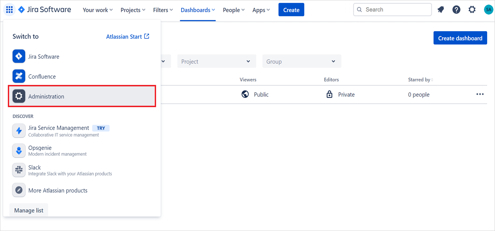
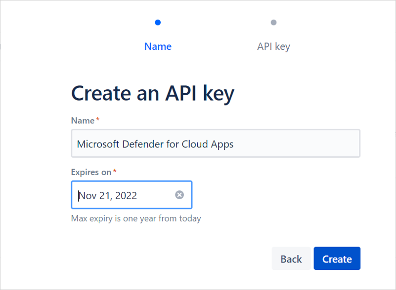
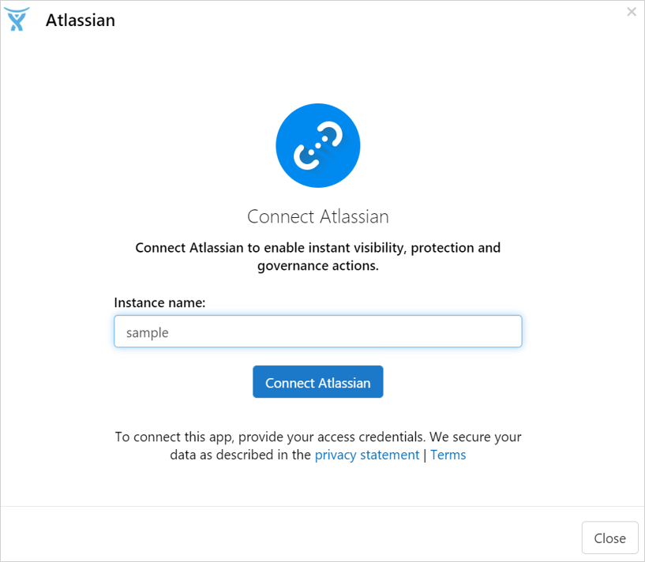
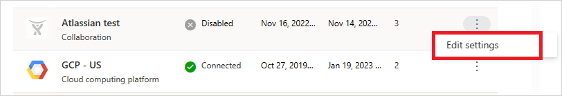

# How Defender for Cloud Apps helps protect your Atlassian environment

Atlassian is an online collaborative and software development platform (including Confluence, Jira and Bitbucket). Along with the benefits of effective collaboration in the cloud, your organization's most critical assets may be exposed to threats. Exposed assets include posts, tasks, and files with potentially sensitive information, collaboration, and partnership details, and more. Preventing exposure of this data requires continuous monitoring to prevent any malicious actors or security-unaware insiders from exfiltrating sensitive information.

Connecting Atlassian to Defender for Cloud Apps gives you improved insights into your users' activities and provides threat detection for anomalous behavior. The connector will cover all users in your organization that use the Atlassian platform, and will show activities from Confluence, Jira, and specific Bitbucket activities.

Main threats include:

- Compromised accounts and insider threats

- Insufficient security awareness

- Unmanaged bring your own device (BYOD)

## Control Atlassian with policies

| **Type**                           | **Name**                                                     |
| ---------------------------------- | ------------------------------------------------------------ |
| Built-in  anomaly detection policy | [Activity from   anonymous IP addresses](anomaly-detection-policy.md#activity-from-anonymous-ip-addresses)    [Activity from   infrequent country](anomaly-detection-policy.md#activity-from-infrequent-country)   [Activity from   suspicious IP addresses](anomaly-detection-policy.md#activity-from-suspicious-ip-addresses)    [Impossible travel](anomaly-detection-policy.md#impossible-travel)    [Multiple failed login attempts](anomaly-detection-policy.md#multiple-failed-login-attempts)  [Unusual administrative activities](anomaly-detection-policy.md#unusual-activities-by-user)  [Unusual impersonated activities](anomaly-detection-policy.md#unusual-activities-by-user) |
| Activity  policy                   | Built a customized policy by the Atlassian [activities](https://support.atlassian.com/security-and-access-policies/docs/track-organization-activities-from-the-audit-log/#Auditlogging-Accessauditlogactivities). |

For more information about creating policies, see [Create a policy](control-cloud-apps-with-policies.md#create-a-policy).

## Automate governance controls

In addition to monitoring for potential threats, you can apply and automate the following Atlassian governance actions to remediate detected threats:

| **Type**        | **Action**                                                   |
| --------------- | ------------------------------------------------------------ |
| User governance | Notify user on  alert (via Microsoft Entra ID)   Require user to sign in again (via Microsoft Entra ID)     Suspend user (via Microsoft Entra ID) |

For more information about remediating threats from apps, see [Governing connected apps](governance-actions.md).

## Protect Atlassian in real time

Review our best practices for [securing and collaborating with external users](best-practices.md#secure-collaboration-with-external-users-by-enforcing-real-time-session-controls) and [blocking and protecting the download of sensitive data to unmanaged or risky devices](best-practices.md#block-and-protect-download-of-sensitive-data-to-unmanaged-or-risky-devices).

## SaaS security posture management

[Connect Atlassian](#connect-atlassian-to-microsoft-defender-for-cloud-apps) to get security posture recommendations for Atlassian in Microsoft Secure Score. To see security recommendations for Atlassian in Microsoft Secure Score:

1. Refresh your policies by opening and saving each policy in the Atlassian portal.
1. In Microsoft Secure Score, select **Recommended actions** and filter by **Product** = **Atlassian**. 

For example, recommendations for Atlassian include: 

- *Enable multi-factor authentication*
- *Enable session timeout for web users*
- *Enhance password requirements*
- *Atlassian mobile app security*
- *App data protection*

For more information, see:

- [Security posture management for SaaS apps](security-saas.md)
- [Microsoft Secure Score](/microsoft-365/security/defender/microsoft-secure-score)

## Connect Atlassian to Microsoft Defender for Cloud Apps

This section provides instructions for connecting Microsoft Defender for Cloud Apps to your existing Atlassian products using the App Connector APIs. This connection gives you visibility into and control over your organization's Atlassian use.

>[!NOTE]
>The connector will cover all users in your organization that use the Atlassian platform, and will show activities from Confluence, Jira, and specific Bitbucket activities. For more information about Atlassian activities, see [Atlassian audit log activities](https://support.atlassian.com/security-and-access-policies/docs/track-organization-activities-from-the-audit-log/#Auditlogging-Accessauditlogactivities).

### Prerequisites

- The [Atlassian Access](https://www.atlassian.com/software/access#about-atlassian-access) plan is required.
- You must be signed as an Organization admin to Atlassian.

### Configure Atlassian

1. Sign in to the Atlassian Admin portal with an admin account.

    

1. Go to **Settings -> API keys** and then **Create API key**. (Atlassian documentation for creating API keys can also be found [here](https://support.atlassian.com/organization-administration/docs/manage-an-organization-with-the-admin-apis/)).

    

1. Give the following values to the API key:

    - **Name:** You can give any name. The recommended name is *Microsoft Defender for Cloud Apps* so you can be aware for this integration.
    - **Expires on:** Set the expiration date as one year from the date of creation (this is the Atlassian maximum time for the expiration date).

        >[!NOTE]
        >According to Atlassian API requirements, you'll need to create every year an API key for this integration.

        

1. After selecting **Create**, copy the **Organization ID** and the **API key**. You'll need it later.

    >[!NOTE]
    >Verify your domain: To see your Atlassian users and their activities in Defender for Cloud Apps, you need to verify your domain. In Atlassian, domains are used to     determine which user accounts can be managed by your organization. You won't see users and their activities if their domains aren't verified in the Atlassian configuration.
    >To verify domains in Atlassian see [Verify a domain to manage accounts](https://support.atlassian.com/user-management/docs/verify-a-domain-to-manage-accounts/).

### Configure Defender for Cloud Apps

1. In the Microsoft Defender Portal, select **Settings**. Then choose **Cloud Apps**. Under **Connected apps**, select **App Connectors**.

1. In the **App connectors** page, select **+Connect an app**, followed by **Atlassian**.

1. In the next window, give the instance a descriptive name, and select **Next**.

    

1. In the next page, enter the **Organization ID** and **API key** you saved before.

>[!NOTE]
>
> - The first connection can take up to four hours to get all users and their activities.
> - The activities that will display are the activities that were generated from the moment the connector is connected.
> - Activities from the "Atlassian Access" audit log are fetched by Defender for Cloud apps. Other activities aren't fetched currently. See [Product Audit Logs](https://support.atlassian.com/security-and-access-policies/docs/track-organization-activities-from-the-audit-log/).
> - After the connector’s **Status** is marked as **Connected**, the connector is live and works.

### Revoke and renew API keys

1. Microsoft recommends using short lived keys or tokens for connecting apps as a security best practice.
1. We recommend refreshing the Atlassian API key every 6 months as a best practice. To refresh the key, revoke the existing API key and generate a new key.
1. To revoke API key, navigate to **admin.atlassian.com** > **Settings** > **API keys**, determine the API key used for integration and select **Revoke**.
1. Recreate an API key in the Atlassian admin portal with the steps described above.
1. Afterwards, go to the **App Connectors** page in the Microsoft Defender Portal and edit the connector:

    

1. Enter the new generated new **API key** and select **Connect Atlassian**.
1. In the Microsoft Defender Portal, select **Settings**. Then choose **Cloud Apps**. Under **Connected apps**, select **App Connectors**. Make sure the status of the connected App Connector is **Connected**.

>[!NOTE]
>
> By default, the API key is valid for 1 year and expires automatically after a year.

## Related content

- [Secure collaboration with external users by enforcing real-time session controls](best-practices.md#secure-collaboration-with-external-users-by-enforcing-real-time-session-controls)

- [Detect cloud threats, compromised accounts, and malicious insiders](best-practices.md#detect-cloud-threats-compromised-accounts-malicious-insiders-and-ransomware)

- [Use the audit trail of activities for forensic investigations](best-practices.md#use-the-audit-trail-of-activities-for-forensic-investigations)

## Rate limits and limitations

- **Rate limits** include 1000 requests per minute (per API key/connector instance).

    For more information about the Atlassian API limitation, see [Atlassian admin REST APIs](https://developer.atlassian.com/cloud/admin/about/#about-the-cloud-admin-rest-apis).

- **Limitations** include:

    - Activities will be shown in Defender for Cloud Apps only for users with a verified domain.

    - The API key has a maximum expiration period of one year. After one year, you'll need to create another API key from the Atlassian Admin portal and replace it for the old API Key in the Defender for Cloud Apps console.

    - You won't be able to see in Defender for Cloud Apps whether a user is an admin or not.

    - System activities are shown with the **Atlassian Internal System** account name.

## Next steps

> [!div class="nextstepaction"]
> [Control cloud apps with policies](control-cloud-apps-with-policies.md)

[!INCLUDE [Open support ticket](includes/support.md)]
