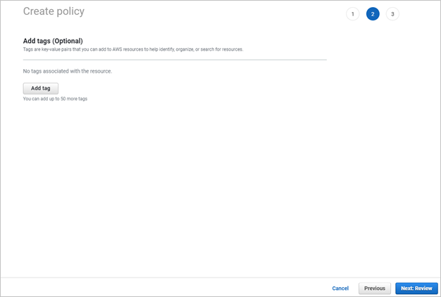
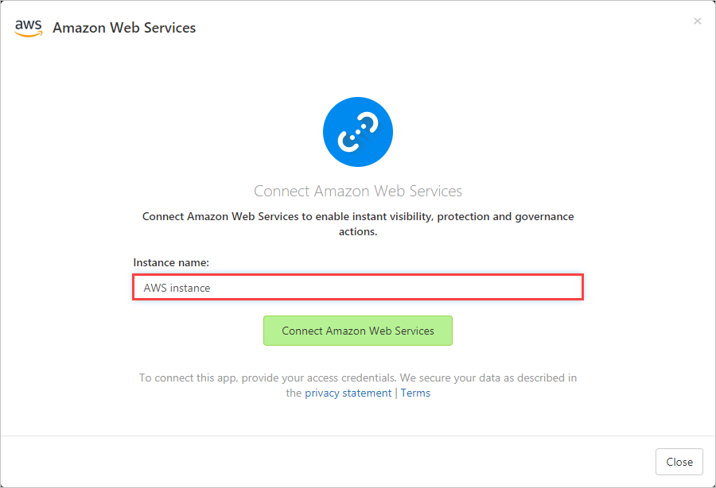
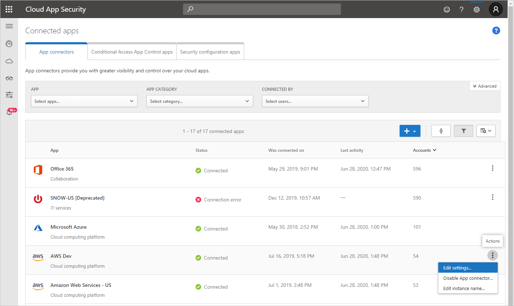

# How Defender for Cloud Apps helps protect your Amazon Web Services (AWS) environment


Amazon Web Services is an IaaS provider that enables your organization to host and manage their entire workloads in the cloud. Along with the benefits of leveraging infrastructure in the cloud, your organization's most critical assets may be exposed to threats. Exposed assets include storage instances with potentially sensitive information, compute resources that operate some of your most critical applications, ports, and virtual private networks that enable access to your organization.

Connecting AWS to Defender for Cloud Apps helps you secure your assets and detect potential threats by monitoring administrative and sign-in activities, notifying on possible brute force attacks, malicious use of a privileged user account, unusual deletions of VMs, and publicly exposed storage buckets.

## Main threats

- Abuse of cloud resources
- Compromised accounts and insider threats
- Data leakage
- Resource misconfiguration and insufficient access control

## How Defender for Cloud Apps helps to protect your environment

- [Detect cloud threats, compromised accounts, and malicious insiders](best-practices.md#detect-cloud-threats-compromised-accounts-malicious-insiders-and-ransomware)
- [Limit exposure of shared data and enforce collaboration policies](best-practices.md#limit-exposure-of-shared-data-and-enforce-collaboration-policies)
- [Use the audit trail of activities for forensic investigations](best-practices.md#use-the-audit-trail-of-activities-for-forensic-investigations)

## Control AWS with built-in policies and policy templates

You can use the following built-in policy templates to detect and notify you about potential threats:

| Type | Name |
| ---- | ---- |
| Activity policy template | Admin console sign-in failures<br />CloudTrail configuration changes<br />EC2 instance configuration changes<br />IAM policy changes<br />Logon from a risky IP address<br />Network access control list (ACL) changes<br />Network gateway changes<br />S3 Bucket Activity<br />Security group configuration changes<br />Virtual private network changes |
| Built-in anomaly detection policy | [Activity from anonymous IP addresses](anomaly-detection-policy.md#activity-from-anonymous-ip-addresses)<br />[Activity from infrequent country](anomaly-detection-policy.md#activity-from-infrequent-country)<br />[Activity from suspicious IP addresses](anomaly-detection-policy.md#activity-from-suspicious-ip-addresses)<br />[Impossible travel](anomaly-detection-policy.md#impossible-travel)<br />[Activity performed by terminated user](anomaly-detection-policy.md#activity-performed-by-terminated-user) (requires Microsoft Entra ID as IdP)<br />[Multiple failed login attempts](anomaly-detection-policy.md#multiple-failed-login-attempts)<br />[Unusual administrative activities](anomaly-detection-policy.md#unusual-activities-by-user)<br />[Unusual multiple storage deletion activities](anomaly-detection-policy.md#unusual-activities-by-user) (preview)<br />[Multiple delete VM activities](anomaly-detection-policy.md#multiple-delete-vm-activities)<br />[Unusual multiple VM creation activities](anomaly-detection-policy.md#unusual-activities-by-user) (preview)<br />[Unusual region for cloud resource](anomaly-detection-policy.md#unusual-activities-by-user) (preview) |
| File policy template | S3 bucket is publicly accessible |

For more information about creating policies, see [Create a policy](control-cloud-apps-with-policies.md#create-a-policy).

## Automate governance controls

In addition to monitoring for potential threats, you can apply and automate the following AWS governance actions to remediate detected threats:

| Type | Action |
| ---- | ---- |
| User governance | - Notify user on alert (via Microsoft Entra ID)<br />- Require user to sign in again (via Microsoft Entra ID)<br />- Suspend user (via Microsoft Entra ID) |
| Data governance | - Make an S3 bucket private<br />- Remove a collaborator for an S3 bucket |

For more information about remediating threats from apps, see [Governing connected apps](governance-actions.md).

## Protect AWS in real time

Review our best practices for [blocking and protecting the download of sensitive data to unmanaged or risky devices](best-practices.md#block-and-protect-download-of-sensitive-data-to-unmanaged-or-risky-devices).

## Connect Amazon Web Services to Microsoft Defender for Cloud Apps

This section provides instructions for connecting your existing Amazon Web Services (AWS) account to Microsoft Defender for Cloud Apps using the connector APIs. For information about how Defender for Cloud Apps protects AWS, see [Protect AWS](protect-aws.md).

You can connect AWS **Security auditing** to Defender for Cloud Apps connections to gain visibility into and control over AWS app use.

### Step 1: Configure Amazon Web Services auditing

1. In your [Amazon Web Services console](https://aws.amazon.com/console/), under **Security, Identity & Compliance**, select **IAM**.

    
   
1. Select **Users** and then select **Add user**.

    
   
1. In the **Details** step, provide a new user name for Defender for Cloud Apps. Make sure that under **Access type** you select **Programmatic access** and select **Next Permissions**.

    
   
1. Select **Attach existing policies directly**, and then **Create policy**.

    
   
1. Select the **JSON** tab:

    
   
1. Paste the following script into the provided area:

    ```json
    {
      "Version" : "2012-10-17",
      "Statement" : [{
          "Action" : [
            "cloudtrail:DescribeTrails",
            "cloudtrail:LookupEvents",
            "cloudtrail:GetTrailStatus",
            "cloudwatch:Describe*",
            "cloudwatch:Get*",
            "cloudwatch:List*",
            "iam:List*",
            "iam:Get*",
            "s3:ListAllMyBuckets",
            "s3:PutBucketAcl",
            "s3:GetBucketAcl",
            "s3:GetBucketLocation"
          ],
          "Effect" : "Allow",
          "Resource" : "*"
        }
      ]
     }
    ```

1. Select **Next: Tags**

     
   
1. Select **Next: Review**.

    
   
1. Provide a **Name** and select **Create policy**.

    
   
1. Back in the **Add user** screen, refresh the list if necessary, and select the user you created, and select **Next: Tags**.

    
   
1. Select **Next: Review**.

1. If all the details are correct, select **Create user**.

    
   
1. When you get the success message, select **Download .csv** to save a copy of the new user's credentials. You'll need these later.

    
   
   > [!NOTE]
    > After connecting AWS, you'll receive events for seven days prior to connection. If you just enabled CloudTrail, you'll receive events from the time you enabled CloudTrail.

### Step 2: Connect Amazon Web Services auditing to Defender for Cloud Apps

1. In the Microsoft Defender Portal, select **Settings**. Then choose **Cloud Apps**. Under **Connected apps**, select **App Connectors**.

1. In the **App connectors** page, to provide the AWS connector credentials, do one of the following:

    **For a new connector**  

   1. Select the **+Connect an app**, followed by **Amazon Web Services**.
   
       
      
    1. In the next window, provide a name for the connector, and then select **Next**.

        

    1. On the **Connect Amazon Web Services** page, select **Security auditing**, and then select **Next**.

    1. On the **Security auditing page**, paste the **Access key** and **Secret key** from the .csv file into the relevant fields, and select **Next**.

        

    **For an existing connector**

   1. In the list of connectors, on the row in which the AWS connector appears, select **Edit settings**.
   
       
      
   1. On the **Instance name** and **Connect Amazon Web Services** pages, select **Next**. On the **Security auditing page**, paste the **Access key** and **Secret key** from the .csv file into the relevant fields, and select **Next**.
   
       
      
1. In the Microsoft Defender Portal, select **Settings**. Then choose **Cloud Apps**. Under **Connected apps**, select **App Connectors**. Make sure the status of the connected App Connector is **Connected**.

## Next steps

> [!div class="nextstepaction"]
> [Control cloud apps with policies](control-cloud-apps-with-policies.md)

[!INCLUDE [Open support ticket](includes/support.md)]

