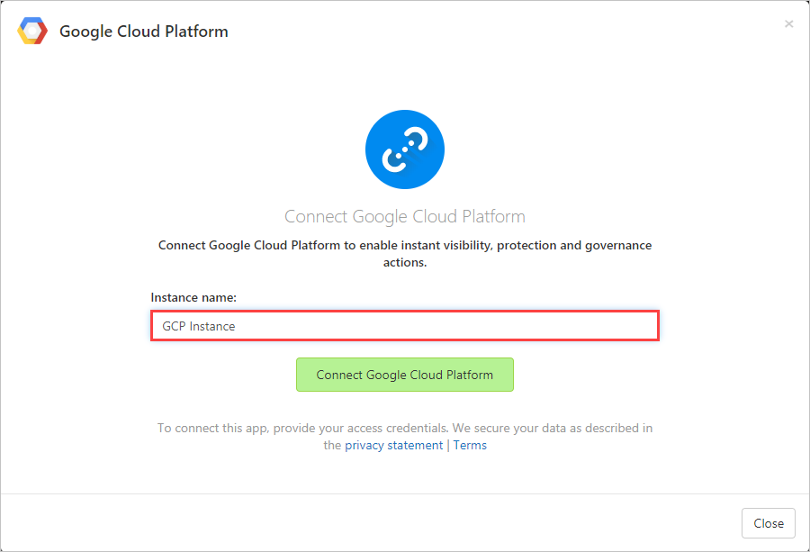
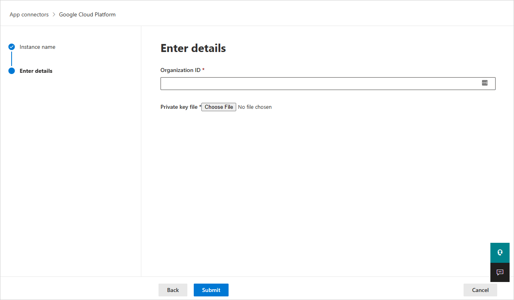
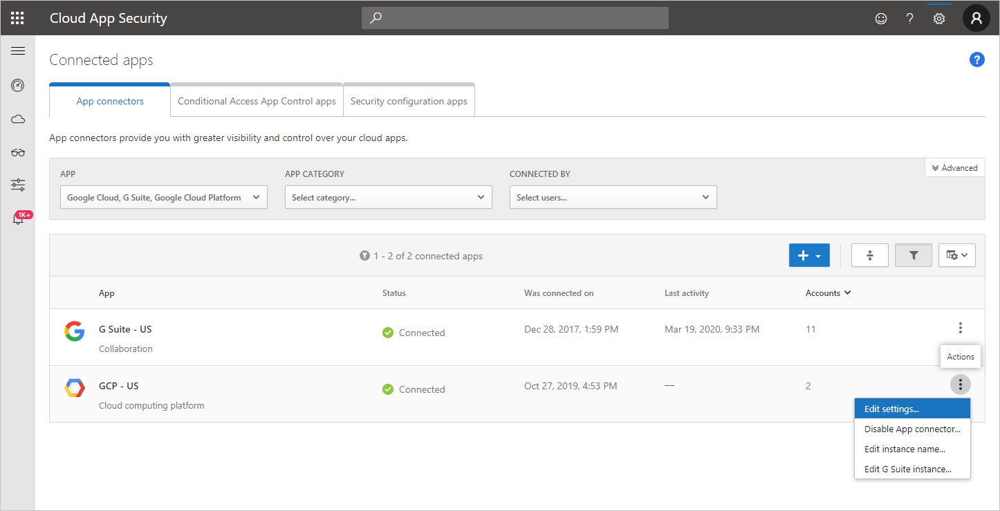

# How Defender for Cloud Apps helps protect your Google Cloud Platform (GCP) environment

Google Cloud Platform is an IaaS provider that enables your organization to host and manage their entire workloads in the cloud. Along with the benefits of leveraging infrastructure in the cloud, your organization's most critical assets may be exposed to threats. Exposed assets include storage instances with potentially sensitive information, compute resources that operate some of your most critical applications, ports, and virtual private networks that enable access to your organization.

Connecting GCP to Defender for Cloud Apps helps you secure your assets and detect potential threats by monitoring administrative and sign-in activities, notifying on possible brute force attacks, malicious use of a privileged user account, and unusual deletions of VMs.

## Main threats

- Abuse of cloud resources
- Compromised accounts and insider threats
- Data leakage
- Resource misconfiguration and insufficient access control

## How Defender for Cloud Apps helps to protect your environment

- [Detect cloud threats, compromised accounts, and malicious insiders](best-practices.md#detect-cloud-threats-compromised-accounts-malicious-insiders-and-ransomware)
- [Use the audit trail of activities for forensic investigations](best-practices.md#use-the-audit-trail-of-activities-for-forensic-investigations)

## Control GCP with built-in policies and policy templates

You can use the following built-in policy templates to detect and notify you about potential threats:

| Type | Name |
| ---- | ---- |
| Built-in anomaly detection policy | [Activity from anonymous IP addresses](anomaly-detection-policy.md#activity-from-anonymous-ip-addresses) [Activity from infrequent country](anomaly-detection-policy.md#activity-from-infrequent-country) [Activity from suspicious IP addresses](anomaly-detection-policy.md#activity-from-suspicious-ip-addresses) [Impossible travel](anomaly-detection-policy.md#impossible-travel) [Activity performed by terminated user](anomaly-detection-policy.md#activity-performed-by-terminated-user) (requires Microsoft Entra ID as IdP) [Multiple failed login attempts](anomaly-detection-policy.md#multiple-failed-login-attempts) [Unusual administrative activities](anomaly-detection-policy.md#unusual-activities-by-user) [Multiple delete VM activities](anomaly-detection-policy.md#multiple-delete-vm-activities) [Unusual multiple VM creation activities](anomaly-detection-policy.md#unusual-activities-by-user) (preview) |
| Activity policy template | Changes to compute engine resources Changes to StackDriver configuration Changes to storage resources Changes to Virtual Private Network Logon from a risky IP address |

For more information about creating policies, see [Create a policy](control-cloud-apps-with-policies.md#create-a-policy).

## Automate governance controls

In addition to monitoring for potential threats, you can apply and automate the following GCP governance actions to remediate detected threats:

| Type | Action |
| ---- | ---- |
| User governance | - Require user to reset password to Google (requires connected linked Google Workspace instance) - Suspend user (requires connected linked Google Workspace instance) - Notify user on alert (via Microsoft Entra ID) - Require user to sign in again (via Microsoft Entra ID) - Suspend user (via Microsoft Entra ID) |

For more information about remediating threats from apps, see [Governing connected apps](governance-actions.md).

## Protect GCP in real time

Review our best practices for [securing and collaborating with external users](best-practices.md#secure-collaboration-with-external-users-by-enforcing-real-time-session-controls) and [blocking and protecting the download of sensitive data to unmanaged or risky devices](best-practices.md#block-and-protect-download-of-sensitive-data-to-unmanaged-or-risky-devices).

## Connect Google Cloud Platform to Microsoft Defender for Cloud Apps

This section provides instructions for connecting Microsoft Defender for Cloud Apps to your existing Google Cloud Platform (GCP) account using the connector APIs. This connection gives you visibility into and control over GCP use. For information about how Defender for Cloud Apps protects GCP, see [Protect GCP](protect-gcp.md).

We recommend that you use a dedicated project for the integration and restrict access to the project to maintain stable integration and prevent deletions/modifications of the setup process.

> [!NOTE]
> The instructions for connecting your GCP environment for auditing follow [Google's recommendations](https://cloud.google.com/blog/products/it-ops/best-practices-for-working-with-google-cloud-audit-logging) for consuming aggregated logs. The integration leverages Google StackDriver and will consume additional resources that might impact your billing. The consumed resources are:
>
> - [Aggregated export sink – Organization level](https://cloud.google.com/logging/docs/export/aggregated_sinks#concept)
> - [Pub/Sub topic – GCP project level](https://cloud.google.com/logging/docs/export/using_exported_logs#pubsub-overview)
> - [Pub/Sub subscription – GCP project level](https://cloud.google.com/logging/docs/export/using_exported_logs#pubsub-overview)
>
> The Defender for Cloud Apps auditing connection only imports Admin Activity audit logs; Data Access and System Event audit logs are not imported. For more information about GCP logs, see [Cloud Audit Logs](https://go.microsoft.com/fwlink/?linkid=2109230).

### Prerequisites

The integrating GCP user must have the following permissions:

- **IAM and Admin edit** – Organization level
- **Project creation and edit**

You can connect GCP **Security auditing** to your Defender for Cloud Apps connections to gain visibility into and control over GCP app use.

### Configure Google Cloud Platform

#### Create a dedicated project

Create a dedicated project in GCP under your organization to enable integration isolation and stability

1. Sign in to your GCP portal using your integrating GCP user account.
1. Select **Create Project** to start a new project.
1. In the **New project** screen, name your project and select **Create**.

    

#### Enable required APIs

1. Switch to the dedicated project.
1. Go to the **Library** tab.
1. Search for and select **Cloud Logging API**, and then on the API page, select **ENABLE**.
1. Search for and select **Cloud Pub/Sub API**, and then on the API page, select **ENABLE**.

    > [!NOTE]
    > Make sure that you do not select **Pub/Sub Lite API**.

#### Create a dedicated service account for the security auditing integration

1. Under **IAM & admin**, select **Service accounts**.
1. Select **CREATE SERVICE ACCOUNT** to create a dedicated service account.
1. Enter an account name, and then select **Create**.
1. Specify the **Role** as **Pub/Sub Admin** and then select **Save**.

    

1. Copy the **Email** value, you'll need this later.

    

1. Under **IAM & admin**, select **IAM**.

    1. Switch to organization level.
    1. Select **ADD**.
    1. In the **New members** box, paste the **Email** value you copied earlier.
    1. Specify the **Role** as **Logs Configuration Writer** and then select **Save**.

        

#### Create a private key for the dedicated service account

1. Switch to project level.
1. Under **IAM & admin**, select **Service accounts**.
1. Open the dedicated service account and select **Edit**.
1. Select **CREATE KEY**.
1. In the **Create private key** screen, select **JSON**, and then select **CREATE**.

    

    > [!NOTE]
    > You'll need the JSON file that is downloaded to your device later.

#### Retrieve your Organization ID

Make a note of your **Organization ID**, you'll need this later. For more information, see [Getting your organization ID](https://cloud.google.com/resource-manager/docs/creating-managing-organization#retrieving_your_organization_id).

### Connect Google Cloud Platform auditing to Defender for Cloud Apps

This procedure describes how to add the GCP connection details to connect Google Cloud Platform auditing to Defender for Cloud Apps.

1. In the Microsoft Defender Portal, select **Settings**. Then choose **Cloud Apps**. Under **Connected apps**, select **App Connectors**.

1. In the **App connectors** page, to provide the GCP connector credentials, do one of the following:

    > [!NOTE]
    > We recommended that you connect your Google Workspace instance to get unified user management and governance. This is the recommended even if you do not use any Google Workspace products and the GCP users are managed via the Google Workspace user management system.

    **For a new connector**

    1. Select **+Connect an app**, followed by **Google Cloud Platform**.

        

    1. In the next window, provide a name for the connector, and then select **Next**.

        

    1. In the **Enter details** page, do the following, and then select **Submit**.
        1. In the **Organization ID** box, enter the organization you made a note of earlier.
        1. In the **Private key file** box, browse to the JSON file you downloaded earlier.

        

    **For an existing connector**

    1. In the list of connectors, on the row in which the GCP connector appears, select **Edit settings**.

        

    1. In the **Enter details** page, do the following, and then select **Submit**.
        1. In the **Organization ID** box, enter the organization you made a note of earlier.
        1. In the **Private key file** box, browse to the JSON file you downloaded earlier.

        

1. In the Microsoft Defender Portal, select **Settings**. Then choose **Cloud Apps**. Under **Connected apps**, select **App Connectors**. Make sure the status of the connected App Connector is **Connected**.

    > [!NOTE]
    > Defender for Cloud Apps will create an aggregated export sink (organization level), a Pub/Sub topic and Pub/Sub subscription using the integration service account in the integration project.
    >
    > Aggregated export sink is used to aggregate logs across the GCP organization and the Pub/Sub topic created is used as the destination. Defender for Cloud Apps subscribes to this topic through the Pub/Sub subscription created to retrieve the admin activity logs across the GCP organization.

If you have any problems connecting the app, see [Troubleshooting App Connectors](troubleshooting-api-connectors-using-error-messages.md).

## Next steps

> [!div class="nextstepaction"]
> [Control cloud apps with policies](control-cloud-apps-with-policies.md)

[!INCLUDE [Open support ticket](includes/support.md)]
