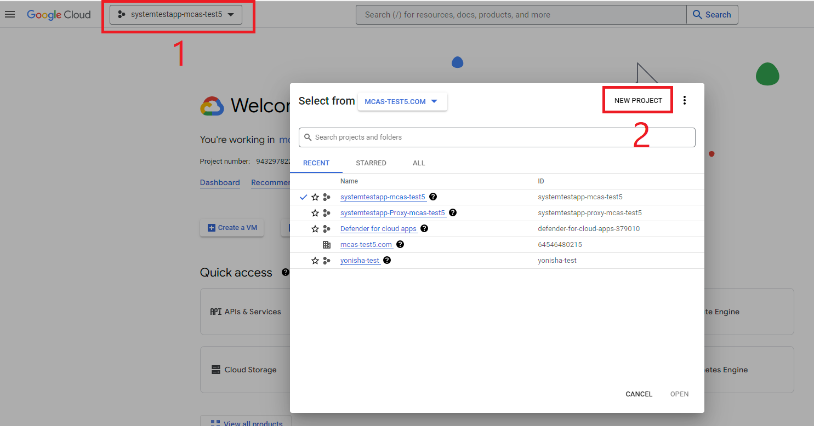
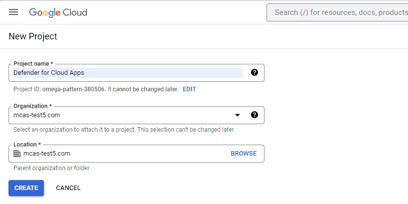
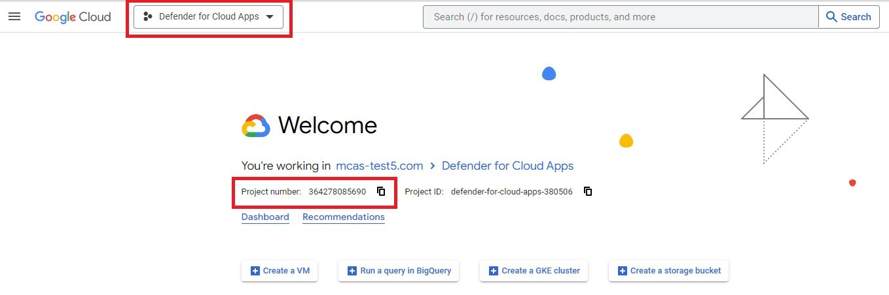
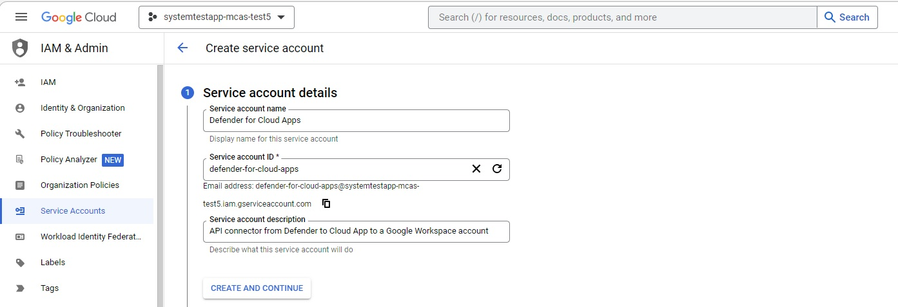
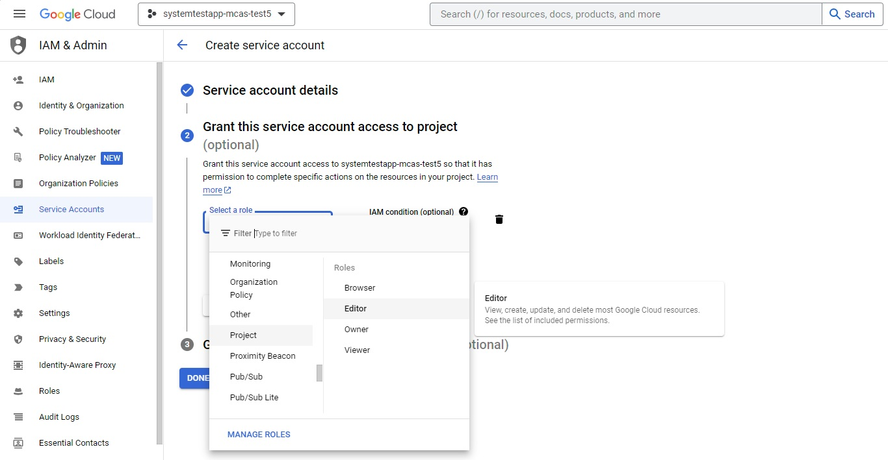
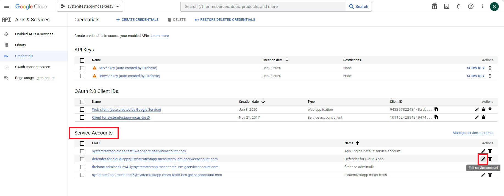
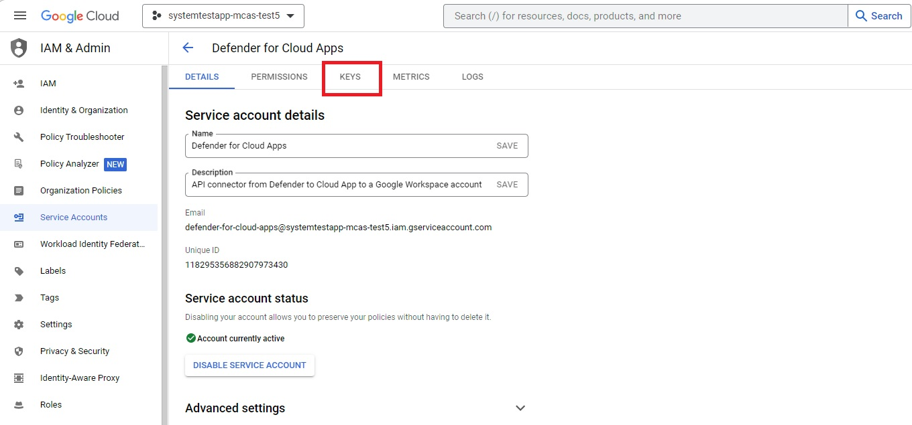
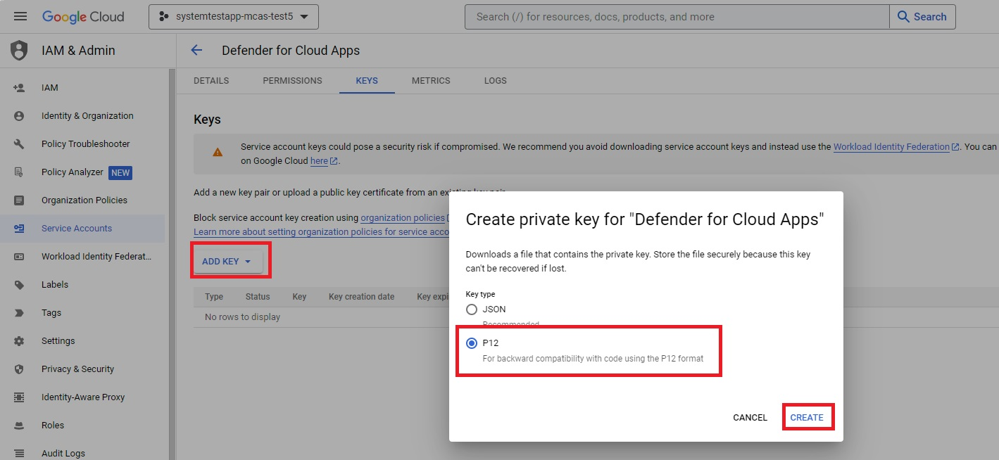
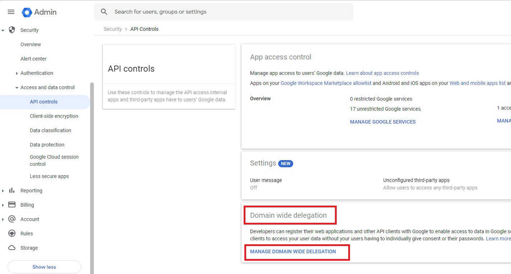
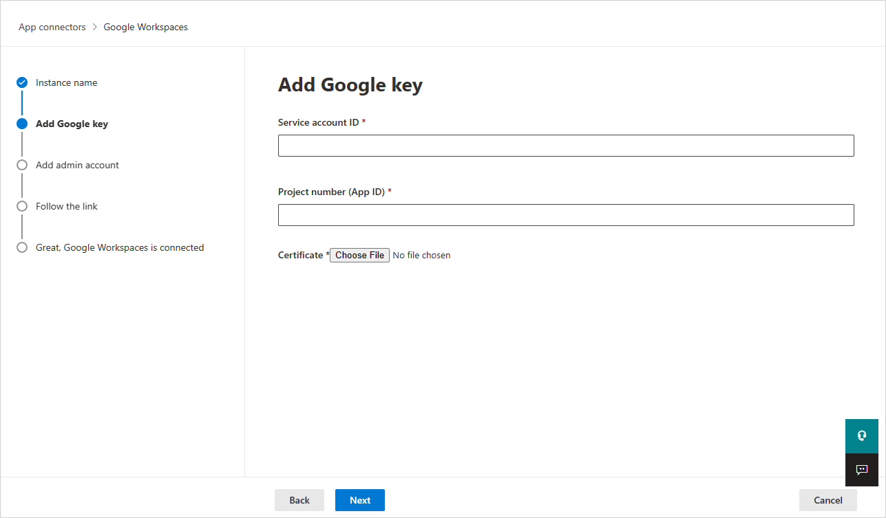

# How Defender for Cloud Apps helps protect your Google Workspace environment


As a cloud file storage and collaboration tool, Google Workspace enables your users to share their documents across your organization and partners in a streamlined and efficient way. Using Google Workspace may expose your sensitive data not only internally, but also to external collaborators, or even worse make it publicly available via a shared link. Such incidents can be caused by malicious actors, or by unaware employees. Google Workspace also provides a large third-party app eco-system to help boost productivity. Using these apps can expose your organization to the risk of malicious apps or use of apps with excessive permissions.

Connecting Google Workspace to Defender for Cloud Apps gives you improved insights into your users' activities, provides threat detection using machine learning based anomaly detections, information protection detections (such as detecting external information sharing), enables automated remediation controls, and detects threats from enabled third-party apps in your organization.

## Main threats

- Compromised accounts and insider threats
- Data leakage
- Insufficient security awareness
- Malicious third-party apps and Google add-ons
- Malware
- Ransomware
- Unmanaged bring your own device (BYOD)

## How Defender for Cloud Apps helps to protect your environment

- [Detect cloud threats, compromised accounts, and malicious insiders](best-practices.md#detect-cloud-threats-compromised-accounts-malicious-insiders-and-ransomware)
- [Discover, classify, label, and protect regulated and sensitive data stored in the cloud](best-practices.md#discover-classify-label-and-protect-regulated-and-sensitive-data-stored-in-the-cloud)
- [Discover and manage OAuth apps that have access to your environment](manage-app-permissions.md)
- [Enforce DLP and compliance policies for data stored in the cloud](best-practices.md#enforce-dlp-and-compliance-policies-for-data-stored-in-the-cloud)
- [Limit exposure of shared data and enforce collaboration policies](best-practices.md#limit-exposure-of-shared-data-and-enforce-collaboration-policies)
- [Use the audit trail of activities for forensic investigations](best-practices.md#use-the-audit-trail-of-activities-for-forensic-investigations)

## SaaS security posture management

[Connect Google Workspace](#connect-google-workspace-to-microsoft-defender-for-cloud-apps) to automatically get security recommendations in Microsoft Secure Score. In Secure Score, select **Recommended actions** and filter by **Product** = **Google Workspace**.

Google Workspace supports security recommendations to *Enable MFA enforcement*.

For more information, see:

-	[Security posture management for SaaS apps](security-saas.md)
-	[Microsoft Secure Score](/microsoft-365/security/defender/microsoft-secure-score)

## Control Google Workspace with built-in policies and policy templates

You can use the following built-in policy templates to detect and notify you about potential threats:

| Type | Name |
| ---- | ---- |
| Built-in anomaly detection policy | [Activity from anonymous IP addresses](anomaly-detection-policy.md#activity-from-anonymous-ip-addresses)<br />[Activity from infrequent country](anomaly-detection-policy.md#activity-from-infrequent-country)<br />[Activity from suspicious IP addresses](anomaly-detection-policy.md#activity-from-suspicious-ip-addresses)<br />[Impossible travel](anomaly-detection-policy.md#impossible-travel)<br />[Activity performed by terminated user](anomaly-detection-policy.md#activity-performed-by-terminated-user) (requires Microsoft Entra ID as IdP)<br />[Malware detection](anomaly-detection-policy.md#malware-detection)<br />[Multiple failed login attempts](anomaly-detection-policy.md#multiple-failed-login-attempts)<br />[Unusual administrative activities](anomaly-detection-policy.md#unusual-activities-by-user)<br /> |
| Activity policy template | Logon from a risky IP address<br /> |
| File policy template | Detect a file shared with an unauthorized domain<br />Detect a file shared with personal email addresses<br />Detect files with PII/PCI/PHI |

For more information about creating policies, see [Create a policy](control-cloud-apps-with-policies.md#create-a-policy).

## Automate governance controls

In addition to monitoring for potential threats, you can apply and automate the following Google Workspace governance actions to remediate detected threats:

| Type | Action |
| ---- | ---- |
| Data governance | - Apply Microsoft Purview Information Protection sensitivity label<br />- Grant read permission to domain<br />- Make a file/folder in Google Drive private<br />- Reduce public access to file/folder<br />- Remove a collaborator from a file<br />- Remove Microsoft Purview Information Protection sensitivity label<br />- Remove external collaborators on file/folder<br />- Remove file editor's ability to share<br />- Remove public access to file/folder<br />- Require user to reset password to Google<br />- Send DLP violation digest to file owners<br />- Send DLP violation to last file editor<br />- Transfer file ownership<br />- Trash file |
| User governance | - Suspend user<br />- Notify user on alert (via Microsoft Entra ID)<br />- Require user to sign in again (via Microsoft Entra ID)<br />- Suspend user (via Microsoft Entra ID) |
| OAuth app governance | - Revoke OAuth app permission |

For more information about remediating threats from apps, see [Governing connected apps](governance-actions.md).

## Protect Google Workspace in real time

Review our best practices for [securing and collaborating with external users](best-practices.md#secure-collaboration-with-external-users-by-enforcing-real-time-session-controls) and [blocking and protecting the download of sensitive data to unmanaged or risky devices](best-practices.md#block-and-protect-download-of-sensitive-data-to-unmanaged-or-risky-devices).

## Connect Google Workspace to Microsoft Defender for Cloud Apps

This section provides instructions for connecting Microsoft Defender for Cloud Apps to your existing Google Workspace account using the connector APIs. This connection gives you visibility into and control over Google Workspace use. For information about how Defender for Cloud Apps protects Google Workspace, see [Protect Google Workspace](protect-google-workspace.md).

> [!NOTE]
> File download activities for Google Workspace aren't displayed in Defender for Cloud Apps.

### Configure Google Workspace

1. As a Google Workspace Super Admin, sign in to <https://console.cloud.google.com>.

1. Select the project dropdown in the top ribbon and then select **New Project** to start a new project.

   

1. In the **New project** page, name your project as follows: **Defender for Cloud Apps** and select **Create**.

   

1. After the project is created, select the created project from the top ribbon. Copy the **Project number**, you'll need it later.

   

1. In the navigation menu, go to **APIs & Services** > **Library**.
    Enable the following APIs (use the search bar if the API isn't listed):

    - Admin SDK API
    - Google Drive API

1. In the navigation menu, go to **APIs & Services** > **Credentials** and do the following steps:

   1. Select **CREATE CREDENTIALS**.

       

   1. Select **Service Account**.

   1. **Service account details**: Provide the name as *Defender for Cloud Apps* and description as *API connector from Defender for Cloud Apps to a Google workspace account*.

       

   1. Select **CREATE AND CONTINUE**.

   1. Under **Grant this service account access to project**, for **Role** select **Project > Editor**, and then select **Done**.

       

   1. In the navigation menu, return to **APIs & Services** > **Credentials**.

   1. Under **Service Accounts**, locate and edit the service account you created earlier by selecting the pencil icon.

       

   1. Copy the email address. You'll need it later.

   1. Navigate to **KEYS** from the top ribbon.

       

   1. From the **ADD KEY** menu, select **Create new key**.

   1. Select **P12**, and then select **CREATE**. Save the downloaded file and the password required to use the file.

       

1. In the navigation menu, go to **IAM & Admin** > **Service accounts**. Copy the **Client ID** assigned to the service account you have just created - you'll need it later.

     

1. Go to [admin.google.com](https://admin.google.com/) and in the navigation menu, go to **Security** > **Access and data control** > **API Controls**. Then do the following:

1. Under **Domain wide delegation**, select **MANAGE DOMAIN WIDE DELEGATION**.

   

1. Select **Add new**.

    1. In the **Client ID** box, enter the **Client ID** that you copied earlier.
    1. In the **OAuth Scopes** box, enter the following list of required scopes (copy the text and paste it in the box):

        ```txt
        https://www.googleapis.com/auth/admin.reports.audit.readonly,https://www.googleapis.com/auth/admin.reports.usage.readonly,https://www.googleapis.com/auth/drive,https://www.googleapis.com/auth/drive.appdata,https://www.googleapis.com/auth/drive.apps.readonly,https://www.googleapis.com/auth/drive.file,https://www.googleapis.com/auth/drive.metadata.readonly,https://www.googleapis.com/auth/drive.readonly,https://www.googleapis.com/auth/drive.scripts,https://www.googleapis.com/auth/admin.directory.user.readonly,https://www.googleapis.com/auth/admin.directory.user.security,https://www.googleapis.com/auth/admin.directory.user.alias,https://www.googleapis.com/auth/admin.directory.orgunit,https://www.googleapis.com/auth/admin.directory.notifications,https://www.googleapis.com/auth/admin.directory.group.member,https://www.googleapis.com/auth/admin.directory.group,https://www.googleapis.com/auth/admin.directory.device.mobile.action,https://www.googleapis.com/auth/admin.directory.device.mobile,https://www.googleapis.com/auth/admin.directory.user
        ```

1. Select **AUTHORIZE**.

    

### Configure Defender for Cloud Apps

1. In the Microsoft Defender Portal, select **Settings**. Then choose **Cloud Apps**. Under **Connected apps**, select **App Connectors**.

1. To provide the Google Workspace connection details, under **App connectors**, do one of the following:

    **For a Google Workspace organization that already has a connected GCP instance**

    - In the list of connectors, at the end of row in which the GCP instance appears, select the three dots and then select **Connect Google Workspace instance**.

    **For a Google Workspace organization that does not already have a connected GCP instance**

    - In the **Connected apps** page, select **+Connect an app**, and then select **Google Workspace**.

1. In the **Instance name** window, give your connector a name. Then select **Next**.
1. In the **Add Google key**, fill in the following information:

    

    1. Enter the **Service account ID**, the **Email** that you copied earlier.

    1. Enter the **Project number (App ID)** that you copied earlier.

    1. Upload the P12 **Certificate** file that you saved earlier.

    1. Enter one **admin account email** of your Google Workspace admin.

    1. If you have a Google Workspace Business or Enterprise account, select the check box. For information about which features are available in Defender for Cloud Apps for Google Workspace Business or Enterprise, see [Enable instant visibility, protection, and governance actions for your apps](enable-instant-visibility-protection-and-governance-actions-for-your-apps.md).

    1. Select **Connect Google Workspaces**.

1. In the Microsoft Defender Portal, select **Settings**. Then choose **Cloud Apps**. Under **Connected apps**, select **App Connectors**. Make sure the status of the connected App Connector is **Connected**.

After connecting Google Workspace, you'll receive events for seven days prior to connection.

After connecting Google Workspace, Defender for Cloud Apps performs a full scan. Depending on how many files and users you have, completing the full scan can take a while. To enable near real-time scanning, files on which activity is detected are moved to the beginning of the scan queue. For example, a file that is edited, updated, or shared is scanned right away. This doesn't apply to files that aren't inherently modified. For example, files that are viewed, previewed, printed, or exported are scanned during the regular scan.

SaaS Security Posture Management (SSPM) data (Preview) is shown in the Microsoft Defender Portal on the **Secure Score** page. For more information, see [Security posture management for SaaS apps](/defender-cloud-apps/security-saas).

If you have any problems connecting the app, see [Troubleshooting App Connectors](troubleshooting-api-connectors-using-error-messages.md).

## Next steps

> [!div class="nextstepaction"]
> [Control cloud apps with policies](control-cloud-apps-with-policies.md)

[!INCLUDE [Open support ticket](includes/support.md)]
