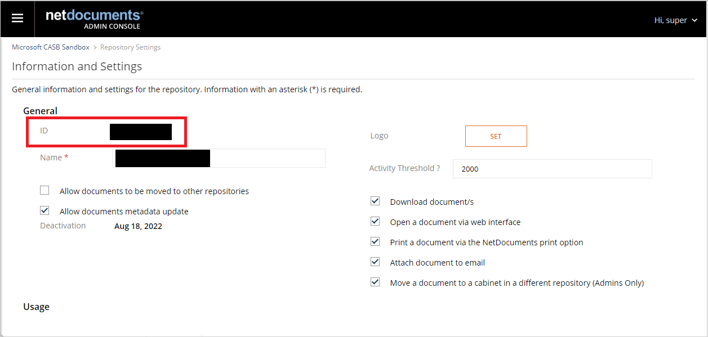
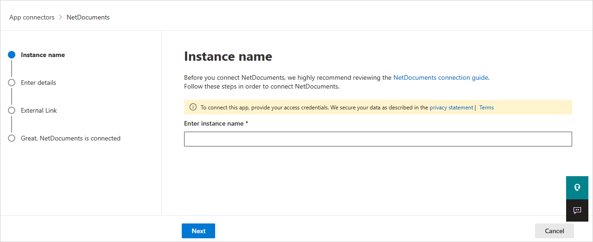

# How Defender for Cloud Apps helps protect your NetDocuments environment

As a productivity and collaboration cloud solution, NetDocuments holds sensitive information to your organization. Any abuse of NetDocuments by a malicious actor or any human error may expose your most critical assets and services to potential attacks.

Connecting NetDocuments to Defender for Cloud Apps gives you improved insights into your NetDocuments activities and provides threat detection for anomalous behavior.

## Main threats

- Compromised accounts and insider threats

- Data leakage

- Insufficient security awareness

- Unmanaged bring your own device (BYOD)

## How Defender for Cloud Apps helps to protect your environment

- [Detect cloud threats, compromised accounts, and malicious insiders](best-practices.md#detect-cloud-threats-compromised-accounts-malicious-insiders-and-ransomware)

- [Use the audit trail of activities for forensic investigations](best-practices.md#use-the-audit-trail-of-activities-for-forensic-investigations)

## Control NetDocuments with policies

| **Type**                           | **Name**                                                     |
| ---------------------------------- | ------------------------------------------------------------ |
| Built-in  anomaly detection policy | [Activity from   anonymous IP addresses](anomaly-detection-policy.md#activity-from-anonymous-ip-addresses)    [Activity from   infrequent country](anomaly-detection-policy.md#activity-from-infrequent-country)   [Activity from   suspicious IP addresses](anomaly-detection-policy.md#activity-from-suspicious-ip-addresses)    [Impossible travel](anomaly-detection-policy.md#impossible-travel)    [Activity   performed by terminated user](anomaly-detection-policy.md#activity-performed-by-terminated-user) (requires Microsoft Entra ID as IdP)   [Unusual file share activities](anomaly-detection-policy.md#unusual-activities-by-user)    [Unusual file deletion activities](anomaly-detection-policy.md#unusual-activities-by-user)   [Unusual   administrative activities](anomaly-detection-policy.md#unusual-activities-by-user)    [Unusual multiple file download activities](anomaly-detection-policy.md#unusual-activities-by-user)  |
| Activity  policy                   | Built a customized policy by the NetDocuments [Audit Log](https://support.netdocuments.com/hc/en-us/articles/205220260-Consolidated-Activity-Log) activities |

>[!NOTE]
>Login/Logouts activities are not supported by NetDocuments.

For more information about creating policies, see [Create a policy](control-cloud-apps-with-policies.md#create-a-policy)
.

## Automate governance controls

In addition to monitoring for potential threats, you can apply and automate the following NetDocuments governance actions to remediate detected threats:

| **Type**        | **Action**                                                   |
| --------------- | ------------------------------------------------------------ |
| User governance | Notify user on  alert (via Microsoft Entra ID)   Require user to sign in again (via Microsoft Entra ID)     Suspend user (via Microsoft Entra ID) |

For more information about remediating threats from apps, see [Governing connected apps](governance-actions.md).

## Protect NetDocuments in real time

Review our best practices for [securing and collaborating with external users](best-practices.md#secure-collaboration-with-external-users-by-enforcing-real-time-session-controls) and [blocking and protecting the download of sensitive data to unmanaged or risky devices](best-practices.md#block-and-protect-download-of-sensitive-data-to-unmanaged-or-risky-devices).

## SaaS security posture management (Preview)

[Connect NetDocument](#connect-netdocuments-to-microsoft-defender-for-cloud-apps) to automatically get security posture recommendations for NetDocument in Microsoft Secure Score. In Secure Score, select **Recommended actions** and filter by **Product** = **NetDocument**. NetDocument supports security recommendations to *Adopt SSO (Single sign on) in NetDocument*.

For more information, see:

- [Security posture management for SaaS apps](security-saas.md)
- [Microsoft Secure Score](/microsoft-365/security/defender/microsoft-secure-score)

## Connect NetDocuments to Microsoft Defender for Cloud Apps

This section provides instructions for connecting Microsoft Defender for Cloud Apps to your existing NetDocuments using the App Connector APIs. This connection gives you visibility into and control over your organization's NetDocuments use.

### Prerequisites

- The NetDocuments user used for logging into NetDocuments must be a Full NetDocuments Repository Admin user.

### Configure NetDocuments

1. Sign in to your NetDocuments account with a Full NetDocuments Repository Admin user.

1. Enter the **Information and Settings** section from the top-left corner.

    

1. In this page, you can find your repository ID. Copy and save it. You'll need it later.

    

1. Record the URL of your account (it should be one of URLs in the following list). You'll need this information later.

    | Location       |              URL            |
    | -------------- | --------------------------- |
    | United Kingdom | <https://eu.netdocuments.com> |
    | Australia     | <https://au.netdocuments.com> |
    | Germany        | <https://de.netdocuments.com> |
    | United States or any other location  |   <https://vault.netvoyage.com> |

### Configure Defender for Cloud Apps

1. In the Microsoft Defender Portal, select **Settings**. Then choose **Cloud Apps**. Under **Connected apps**, select **App Connectors**.

1. In the **App connectors** page, select **+Connect an app**, followed by **NetDocuments**.

1. In the next window, give the connector a descriptive name, and press **Next**.

    

1. In the **Enter details** screen, enter the following fields:

    - **Repository ID**: the app repository ID that you saved.
    - **Application URL**: the URL that you saved.

1. Select **Next**.
1. Select **Connect NetDocuments**.
1. In the Microsoft Defender Portal, select **Settings**. Then choose **Cloud Apps**. Under **Connected apps**, select **App Connectors**. Make sure the status of the connected App Connector is **Connected**.

## Rate limits and limitations

- The default rate limit is 100,000 requests per minute.
- Login/Logouts activities are not supported by NetDocuments.

## Next steps

> [!div class="nextstepaction"]
> [Control cloud apps with policies](control-cloud-apps-with-policies.md)

[!INCLUDE [Open support ticket](includes/support.md)]
