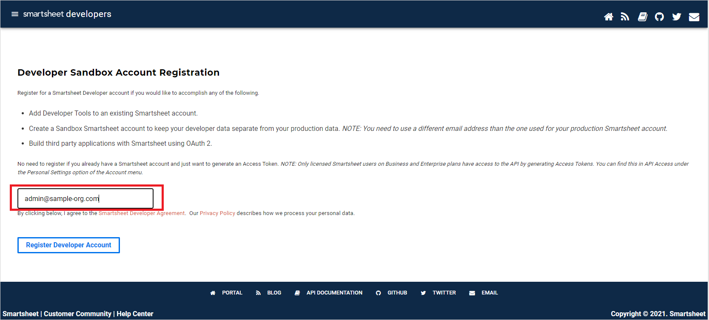
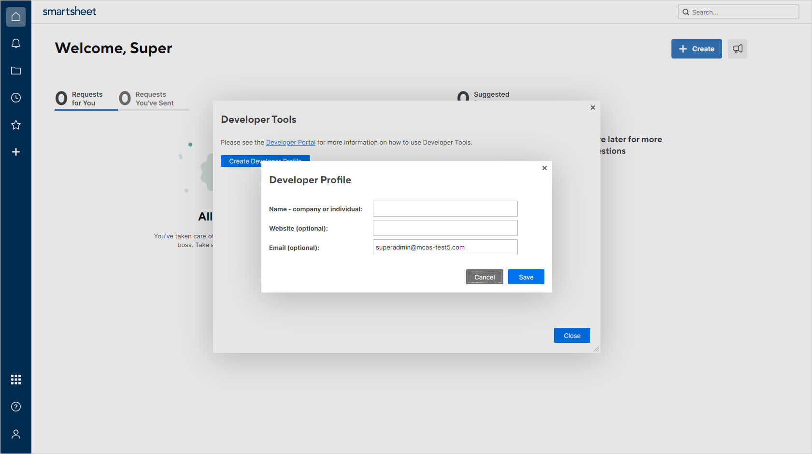
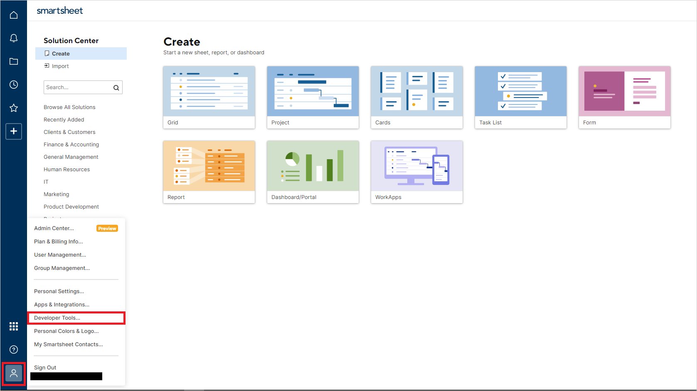
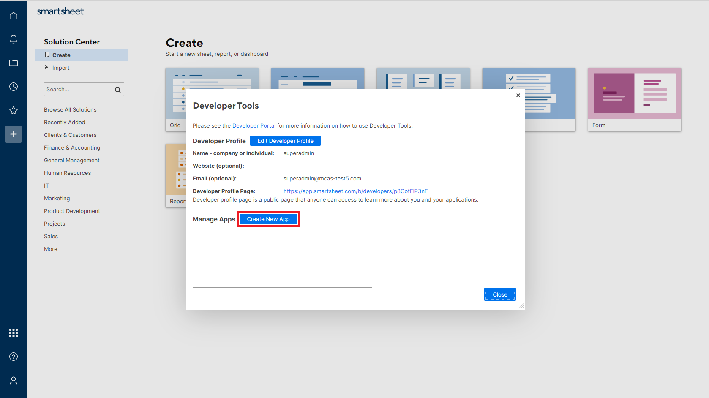

# How Defender for Cloud Apps helps protect your Smartsheet

As a productivity and collaboration cloud solution, Smartsheet holds sensitive information to your organization. Any abuse of Smartsheet by a malicious actor or any human error may expose your most critical assets and services to potential attacks.

Connecting Smartsheet to Defender for Cloud Apps gives you improved insights into your Smartsheet activities and provides threat detection for anomalous behavior.

## Main threats

- Compromised accounts and insider threats

- Data leakage

- Insufficient security awareness

- Unmanaged bring your own device (BYOD)

## How Defender for Cloud Apps helps to protect your environment

- [Detect cloud threats, compromised accounts, and malicious insiders](best-practices.md#detect-cloud-threats-compromised-accounts-malicious-insiders-and-ransomware)

- [Use the audit trail of activities for forensic investigations](best-practices.md#use-the-audit-trail-of-activities-for-forensic-investigations)

## Control Smartsheet with policies

| **Type**                           | **Name**                                                     |
| ---------------------------------- | ------------------------------------------------------------ |
| Built-in  anomaly detection policy | [Unusual file share activities](anomaly-detection-policy.md#unusual-activities-by-user)    [Unusual file deletion activities](anomaly-detection-policy.md#unusual-activities-by-user)   [Unusual   administrative activities](anomaly-detection-policy.md#unusual-activities-by-user)    [Unusual multiple file download activities](anomaly-detection-policy.md#unusual-activities-by-user)  |
| Activity  policy                   | Build a customized policy by the Smartsheet [Audit Log](https://smartsheet.redoc.ly/tag/eventsObjects) activities |

>[!NOTE]
>
>- Login/Logouts activities are not supported by Smartsheet.
>- Smartsheet activities does not contain IP addresses.

For more information about creating policies, see [Create a policy](control-cloud-apps-with-policies.md#create-a-policy).

## Automate governance controls

In addition to monitoring for potential threats, you can apply and automate the following Smartsheet governance actions to remediate detected threats:

| **Type**        | **Action**                                                   |
| --------------- | ------------------------------------------------------------ |
| User governance | Notify user on  alert (via Microsoft Entra ID)   Require user to sign in again (via Microsoft Entra ID)     Suspend user (via Microsoft Entra ID) |

For more information about remediating threats from apps, see [Governing connected apps](governance-actions.md).

## Protect Smartsheet in real time

Review our best practices for [securing and collaborating with external users](best-practices.md#secure-collaboration-with-external-users-by-enforcing-real-time-session-controls) and [blocking and protecting the download of sensitive data to unmanaged or risky devices](best-practices.md#block-and-protect-download-of-sensitive-data-to-unmanaged-or-risky-devices).

## Connect Smartsheet to Microsoft Defender for Cloud Apps

This section describes how to connect Microsoft Defender for Cloud Apps to your existing Smartsheet via the App Connector APIs. The resulting connection gives you visibility into and control over your organization's use of Smartsheet.

### Prerequisites

- The Smartsheet user used to log in to Smartsheet must be a System Admin.
- Event Reporting must be enabled by Smartsheet, either through standalone purchase or via an Enterprise plan with the Advance Platinum package.

### Configure Smartsheet

>[!NOTE]
>The Smartsheet license must be an Enterprise plan with the Platinum package.
>
>Smartsheet accounts hosted in the EU region (the .eu domain suffix) aren't currently supported.

1. Register to add Developer Tools to your existing Smartsheet account:
    1. Go to the [Developer Sandbox Account Registration](https://developers.smartsheet.com/register/) page.

    1. Enter your Smartsheet email address in the text box:

        

    1. An activation mail will appear in your mailbox. Activate Developer Tools by using the activation mail.

    1. In Smartsheet, select **Create Developer Profile**. Enter your name and email address. Select **Save** and then **Close**:

       

2. In Smartsheet, select **Developer Tools**:

   

3. In the **Developer Tools** dialog, select **Create New App**:

   

4. In the **Create New App** dialog, provide the following values:
    - **App name**: For example, **Microsoft Defender for Cloud Apps**.
    - **App description**: For example, **Microsoft Defender for Cloud Apps connects to Smartsheet via its API and detects threats within users' activity.**
    - **App URL**: `https://portal.cloudappsecurity.com`
    - **App contact/support**: `https://learn.microsoft.com/cloud-app-security/support-and-ts`
    - **App redirect URL**: `https://portal.cloudappsecurity.com/api/oauth/saga`

      > [!NOTE]
      >
      > - For US Government GCC customers, enter the following value: `https://portal.cloudappsecuritygov.com/api/oauth/saga`
      > - For US Government GCC High customers, enter the following value: `https://portal.cloudappsecurity.us/api/oauth/saga`

    - **Publish App?**: Select.
    - **Logo**: Leave blank.

      

5. Select **Save**. Copy the **App client id** and the **App secret** that are generated. You'll need them in the following steps.

### Configure Defender for Cloud Apps

>[!NOTE]
>The Smartsheet user configuring the integration must always remain a Smartsheet admin, even after the connector is installed.

1. In the Microsoft Defender Portal, select **Settings**. Then choose **Cloud Apps**. Under **Connected apps**, select **App Connectors**.

1. On the **App connectors** tab, select **+Connect an app**, and then select **Smartsheet**.

1. In the next window, give the connector a descriptive name, and then select **Next**.

    

1. On the **Enter details** screen, enter these values and select **Next**:

    - **Client ID**: The app client ID that you saved earlier.
    - **Client Secret**: The app secret that you saved earlier.

1. On the **External Link** page, select **Connect Smartsheet**.
1. In the Microsoft Defender Portal, select **Settings**. Then choose **Cloud Apps**. Under **Connected apps**, select **App Connectors**. Make sure the status of the connected App Connector is **Connected**.
1. The first connection can take up to four hours to get all users and their activities in the seven days before the connection.
1. After the connector's **Status** is marked as **Connected**, the connector is live and works.

## Rate limits and limitations

The default rate limit is 300 requests per minute. For more information, see the [Smartsheet documentation](https://smartsheet.redoc.ly/#section/Work-at-Scale/Rate-Limiting).

Limitations include:

- Log in and log out activities aren't supported by Smartsheet.
- Smartsheet activities don't contain IP addresses.
- System activities are shown with the Smartsheet account name.

## Next steps

> [!div class="nextstepaction"]
> [Control cloud apps by using policies](control-cloud-apps-with-policies.md)

[!INCLUDE [Open support ticket](includes/support.md)]
