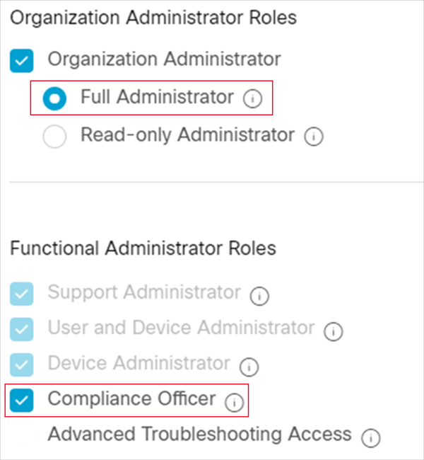
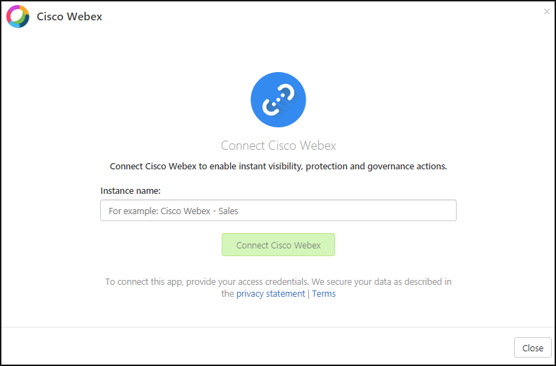

# How Defender for Cloud Apps helps protect your Cisco Webex environment

As a communication and collaboration platform, Cisco Webex enables streamlined communication and collaboration across your organization. Using Cisco Webex for your data and assets exchange may expose your sensitive organizational information to external users, for example, in chat rooms where they may also be participating in a conversation with your employees.

Connecting Cisco Webex to Defender for Cloud Apps gives you improved insights into your users' activities, provides information protection detections, and enables automated governance controls.

## Main threats

- Compromised accounts and insider threats
- Data leakage
- Insufficient security awareness
- Ransomware
- Unmanaged bring your own device (BYOD)

## How Defender for Cloud Apps helps to protect your environment

- [Enforce DLP and compliance policies for data stored in the cloud](best-practices.md#enforce-dlp-and-compliance-policies-for-data-stored-in-the-cloud)
- [Limit exposure of shared data and enforce collaboration policies](best-practices.md#limit-exposure-of-shared-data-and-enforce-collaboration-policies)
- [Use the audit trail of activities for forensic investigations](best-practices.md#use-the-audit-trail-of-activities-for-forensic-investigations)

## Control Cisco Webex with built-in policies and policy templates

You can use the following built-in policy templates to detect and notify you about potential threats:

| Type | Name |
| ---- | ---- |
| Built-in anomaly detection policy | [Activity performed by terminated user](anomaly-detection-policy.md#activity-performed-by-terminated-user) (requires Microsoft Entra ID as IdP) [Ransomware detection](anomaly-detection-policy.md#ransomware-activity) [Unusual file deletion activities](anomaly-detection-policy.md#unusual-activities-by-user) [Unusual file share activities](anomaly-detection-policy.md#unusual-activities-by-user) [Unusual multiple file download activities](anomaly-detection-policy.md#unusual-activities-by-user) |
| File policy template | Detect a file shared with an unauthorized domain Detect a file shared with personal email addresses |
| Activity policy template | Mass download by a single user Potential ransomware activity |

> [!NOTE]
> After connecting Cisco Webex, and when using Webex Meetings, attachments are ingested to Defender for Cloud Apps only when they're shared in chats. Attachments shared in meetings aren't ingested.

For more information about creating policies, see [Create a policy](control-cloud-apps-with-policies.md#create-a-policy).

## Automate governance controls

In addition to monitoring for potential threats, you can apply and automate the following Cisco Webex governance actions to remediate detected threats:

| Type | Action |
| ---- | ---- |
| User governance | - Notify user on alert (via Microsoft Entra ID) - Require user to sign in again (via Microsoft Entra ID) - Suspend user (via Microsoft Entra ID) |
| Data governance | - Trash file |

For more information about remediating threats from apps, see [Governing connected apps](governance-actions.md).

## Protect Cisco Webex in real time

Review our best practices for [securing and collaborating with external users](best-practices.md#secure-collaboration-with-external-users-by-enforcing-real-time-session-controls) and [blocking and protecting the download of sensitive data to unmanaged or risky devices](best-practices.md#block-and-protect-download-of-sensitive-data-to-unmanaged-or-risky-devices).

## Connect Cisco Webex to Microsoft Defender for Cloud Apps

This section provides instructions for connecting Microsoft Defender for Cloud Apps to your existing Cisco Webex account using the connector APIs. This connection gives you visibility into and control over Webex users, activities, and files. For information about how Defender for Cloud Apps protects Cisco Webex, see [Protect Cisco Webex](protect-webex.md).

**Prerequisites**:

- We suggest that you create a dedicated service account for the connection. This enables you to see that governance actions performed in Webex as being performed from this account, such as delete messages sent in Webex. Otherwise, the name of the admin who connected Defender for Cloud Apps to Webex will appear as the user who performed the actions.
- You must have Full Administrator **and** Compliance Officer roles in Webex (under **Roles and Security** > **Administrator Roles**).

    

**To connect Webex to Defender for Cloud Apps**:

1. In the Microsoft Defender Portal, select **Settings**. Then choose **Cloud Apps**. Under **Connected apps**, select **App Connectors**.

1. In the **App connectors** page, click **+Connect an app**, followed by **Cisco Webex**.

1. In the next window, give the connector a name and select **Next**.

    

1. In the **Follow the link** page, select **Connect Cisco Webex**. The Webex sign in page opens. Enter your credentials to allow Defender for Cloud Apps access to your team's Webex instance.

1. Webex asks you if you want to allow Defender for Cloud Apps access to your team information, activity log, and perform activities as a team member. To proceed, click **Allow**.

1. Back in the Defender for Cloud Apps console, you should receive a message that Webex was successfully connected.

1. In the Microsoft Defender Portal, select **Settings**. Then choose **Cloud Apps**. Under **Connected apps**, select **App Connectors**. Make sure the status of the connected App Connector is **Connected**.

After connecting Webex, you'll receive events for 7 days prior to connection. Defender for Cloud Apps scans events over the past three months. To increase this, you must have a Cisco Webex pro license and open a ticket with Defender for Cloud Apps support.

If you have any problems connecting the app, see [Troubleshooting App Connectors](troubleshooting-api-connectors-using-error-messages.md).

## Next steps

> [!div class="nextstepaction"]
> [Control cloud apps with policies](control-cloud-apps-with-policies.md)

[!INCLUDE [Open support ticket](includes/support.md)]
