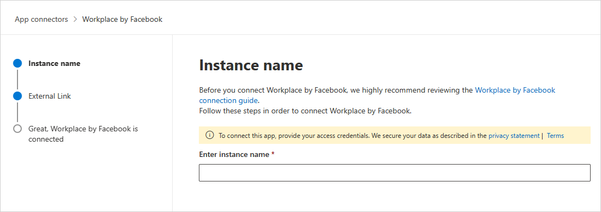
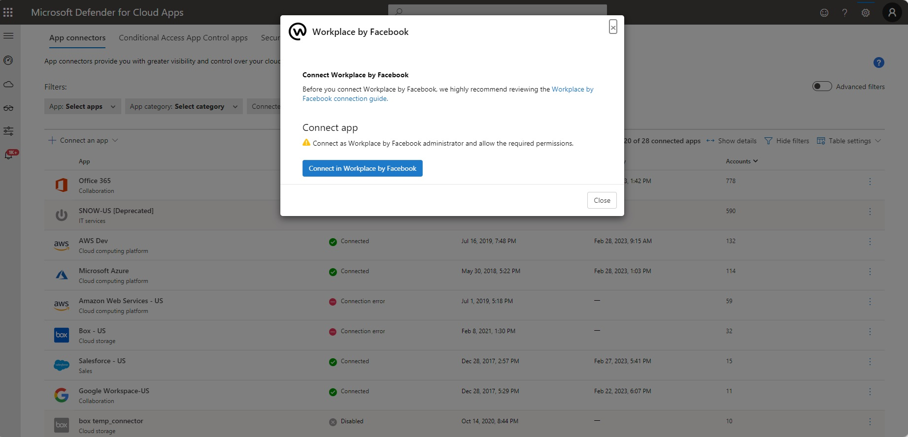

# How Defender for Cloud Apps helps protect your Workplace environment (Preview)

Workplace by Meta is an online collaboration software tool developed by Meta that facilitates online groupwork, instant messaging, video conferencing, and news sharing in one place. Along with the benefits of effective collaboration in the cloud, your organization's most critical assets may be exposed to threats. Exposed assets include messages, posts, and files with potentially sensitive information, collaboration, partnership details, and more. Preventing exposure of this data requires continuous monitoring to prevent any malicious actors or security-unaware insiders from exfiltrating sensitive information.

Connecting Workplace by Meta to Defender for Cloud Apps gives you improved insights into your users' activities and provides threat detection for anomalous behavior.

## Main threats

- Compromised accounts and insider threats
- Insufficient security awareness
- Unmanaged bring your own device (BYOD)

## How Defender for Cloud Apps helps to protect your environment

- [Detect cloud threats, compromised accounts, and malicious insiders](best-practices.md#detect-cloud-threats-compromised-accounts-malicious-insiders-and-ransomware)
- [Use the audit trail of activities for forensic investigations](best-practices.md#use-the-audit-trail-of-activities-for-forensic-investigations)

## Control Workplace by Meta with policies

| Type | Name |
| ---- | ---- |
| Built-in  anomaly detection policy | [Activity from   anonymous IP addresses](anomaly-detection-policy.md#activity-from-anonymous-ip-addresses)   [Activity from infrequent country/region](anomaly-detection-policy.md#activity-from-infrequent-country)  [Activity from   suspicious IP addresses](anomaly-detection-policy.md#activity-from-suspicious-ip-addresses)   [Impossible travel](anomaly-detection-policy.md#impossible-travel)   [Activity   performed by terminated user](anomaly-detection-policy.md#activity-performed-by-terminated-user) (requires Microsoft Entra ID as IdP)   [Multiple failed login attempts](anomaly-detection-policy.md#multiple-failed-login-attempts)   [Unusual   administrative activities](anomaly-detection-policy.md#unusual-activities-by-user)   [Unusual impersonated activities](anomaly-detection-policy.md#unusual-activities-by-user) |
| Activity  policy                   | Built a customized policy by the Workplace by Meta activities|

For more information about creating policies, see [Create a policy](control-cloud-apps-with-policies.md#create-a-policy).

## Automate governance controls

In addition to monitoring for potential threats, you can apply and automate the following Workplace governance actions to remediate detected threats:

| Type | Action |
| ---- | ---- |
| User governance | Notify user on  alert (via Microsoft Entra ID)  Require user to sign in again (via Microsoft Entra ID)    Suspend user (via Microsoft Entra ID) |

For more information about remediating threats from apps, see [Governing connected apps](governance-actions.md).

## Protect Workplace by Meta in real time

Review our best practices for [securing and collaborating with external users](best-practices.md#secure-collaboration-with-external-users-by-enforcing-real-time-session-controls) and [blocking and protecting the download of sensitive data to unmanaged or risky devices](best-practices.md#block-and-protect-download-of-sensitive-data-to-unmanaged-or-risky-devices).

## SaaS security posture management (Preview)

[Connect Workplace](#connect-workplace-to-microsoft-defender-for-cloud-apps) to automatically get security posture recommendations for Workplace in Microsoft Secure Score. In Secure Score, select **Recommended actions** and filter by **Product** = **Workplace**. Workplace supports security recommendations to *Adopt SSO (Single sign on) in Workplace by Meta*.

For more information, see:

- [Security posture management for SaaS apps](security-saas.md)
- [Microsoft Secure Score](/microsoft-365/security/defender/microsoft-secure-score)

## Connect Workplace to Microsoft Defender for Cloud Apps

This section provides instructions for connecting Microsoft Defender for Cloud Apps to your existing Workplace account using the App Connector APIs. This connection gives you visibility into and control over your organization's Workplace use.

   > [!NOTE]
   > The Workplace API connector is rolling out gradually. If you don't see the connector yet in your environment and want to onboard soon, please fill the [Workplace API connector intake form](https://forms.microsoft.com/r/euj3pEmiM4).

**Prerequisites**:

- You must be signed-in as a system admin to Workplace by Meta.

   > [!NOTE]
   > A Workplace account can be connected to a single instance of Defender for Cloud Apps. Please make sure that your Workplace account is not connected to any other Defender for Cloud Apps instance.

**To connect Workplace to Defender for Cloud Apps**:

1. In the Microsoft Defender Portal, select **Settings**. Then choose **Cloud Apps**. Under **Connected apps**, select **App Connectors**.
1. In the **App connectors** page, select **+Connect an app**, by **Workplace by Meta**.
1. In the pop-up, give the connector a descriptive name, and select **Next**.
   

1. In the **External Link** page, select **Connect Workplace by Meta**:
   

1. You'll be redirected to Workplace by Meta page.

   >[!NOTE]
   >Make sure you are logged into Workplace as System admin.

1. On the Workplace authorization page, make sure to choose the correct organization from the dropdown.

1. In the app consent page, make sure to choose **All groups** and then select **Add to Workplace.**
1. In the Microsoft Defender Portal, select **Settings**. Then choose **Cloud Apps**. Under **Connected apps**, select **App Connectors**. Make sure the status of the connected App Connector is **Connected**.

   > [!NOTE]
   >
   > - The first connection can take up to 4 hours to get all users and their activities.
   > - The activities that will show are the activities that were generated from the moment the connector is connected.
   > - After the connector's **Status** is marked as **Connected**, the connector is live and works.

## Next steps

> [!div class="nextstepaction"]
> [Control cloud apps with policies](control-cloud-apps-with-policies.md)

[!INCLUDE [Open support ticket](includes/support.md)]
