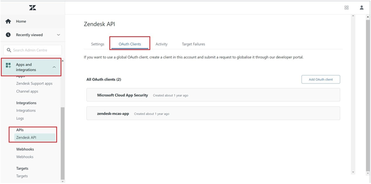
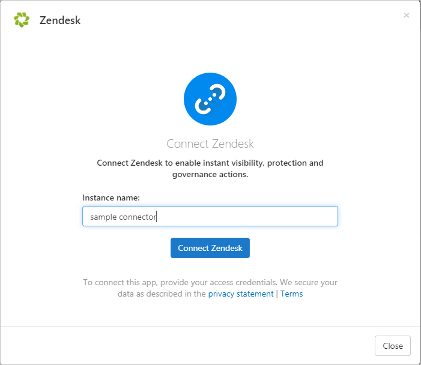

# How Defender for Cloud Apps helps protect your Zendesk

As a customer service software solution, Zendesk holds the sensitive information to your organization. Any abuse of Zendesk by a malicious actor or any human error may expose your most critical assets and services to potential attacks.

Connecting Zendesk to Defender for Cloud Apps gives you improved insights into your Zendesk admin activities and provides threat detection for anomalous behavior.

## Main threats

- Compromised accounts and insider threats

- Data leakage

- Insufficient security awareness

- Unmanaged bring your own device (BYOD)

## How Defender for Cloud Apps helps to protect your environment

- [Detect cloud threats, compromised accounts, and malicious insiders](best-practices.md#detect-cloud-threats-compromised-accounts-malicious-insiders-and-ransomware)

- [Use the audit trail of activities for forensic investigations](best-practices.md#use-the-audit-trail-of-activities-for-forensic-investigations)

## Control Zendesk with policies

| **Type**                           | **Name**                                                     |

| ---------------------------------- | ------------------------------------------------------------ |
| Built-in  anomaly detection policy | [Activity from   anonymous IP addresses](anomaly-detection-policy.md#activity-from-anonymous-ip-addresses)    [Activity from   infrequent country](anomaly-detection-policy.md#activity-from-infrequent-country)   [Activity from   suspicious IP addresses](anomaly-detection-policy.md#activity-from-suspicious-ip-addresses)    [Impossible travel](anomaly-detection-policy.md#impossible-travel)    [Activity   performed by terminated user](anomaly-detection-policy.md#activity-performed-by-terminated-user) (requires Microsoft Entra ID as IdP)    [Multiple failed   login attempts](anomaly-detection-policy.md#multiple-failed-login-attempts)    [Unusual   administrative activities](anomaly-detection-policy.md#unusual-activities-by-user)    [Unusual impersonated activities](anomaly-detection-policy.md#unusual-activities-by-user) |
| Activity  policy                   | Built a customized policy by the Zendesk audit log |

For more information about creating policies, see [Create a policy](control-cloud-apps-with-policies.md#create-a-policy).

## Automate governance controls

In addition to monitoring for potential threats, you can apply and automate the following Zendesk governance actions to remediate detected threats:

| **Type**        | **Action**                                                   |
| --------------- | ------------------------------------------------------------ |
| User governance | Notify user on  alert (via Microsoft Entra ID)   Require user to sign in again (via Microsoft Entra ID)     Suspend user (via Microsoft Entra ID) |

For more information about remediating threats from apps, see [Governing connected apps](governance-actions.md).

## Protect Zendesk in real time

Review our best practices for [securing and collaborating with external users](best-practices.md#secure-collaboration-with-external-users-by-enforcing-real-time-session-controls) and [blocking and protecting the download of sensitive data to unmanaged or risky devices](best-practices.md#block-and-protect-download-of-sensitive-data-to-unmanaged-or-risky-devices).

## SaaS security posture management

[Connect Zendesk](#connect-zendesk-to-microsoft-defender-for-cloud-apps) to automatically get security posture recommendations for Zendesk in Microsoft Secure Score. In Secure Score, select **Recommended actions** and filter by **Product** = **Zendesk**. For example, recommendations for Zendesk include:

- *Enable multi-factor authentication (MFA)*
- *Enable session timeout for users*
- *Enable IP restrictions*
- *Block admins to set passwords.*

For more information, see:

- [Security posture management for SaaS apps](security-saas.md)
- [Microsoft Secure Score](/microsoft-365/security/defender/microsoft-secure-score)

## Connect Zendesk to Microsoft Defender for Cloud Apps

This section provides instructions for connecting Microsoft Defender for Cloud Apps to your existing Zendesk using the App Connector APIs. This connection gives you visibility into and control over your organization's Zendesk use.

### Prerequisites

- The Zendesk user used for logging into Zendesk must be an admin.
- Supported Zendesk licenses:
  - Enterprise
  - Enterprise Plus

 >[!NOTE]
> Connecting Zendesk to Defender for Cloud Apps with a Zendesk user that is not an admin will result in a connection error.

### Configure Zendesk

1. Navigate to **Admin** -> **Apps and integrations** -> **APIs** -> **Zendesk API** -> **OAuth Client** and select **Add OAuth client**.

    

1. Select **New Credential**.
1. Fill out the following fields:

    - Client name: **Microsoft Defender for Cloud Apps** (you can also choose another name).
    - Description: **Microsoft Defender for Cloud Apps API Connector** (you can also choose another description).
    - Company: **Microsoft Defender for Cloud Apps** (you can also choose another company).
    - Unique identifier: **microsoft_cloud_app_security** (you can also choose another unique identifier).
    - Client Kind: **Confidential**
    - Redirect URL: `https://portal.cloudappsecurity.com/api/oauth/saga`

      > [!NOTE]
      >
      > - For US Government GCC customers, enter the following value: `https://portal.cloudappsecuritygov.com/api/oauth/saga`
      > - For US Government GCC High customers, enter the following value: `https://portal.cloudappsecurity.us/api/oauth/saga`

1. Select **Save**, and then select **OK**.

1. Copy the **Secret** that was generated. You'll need it in the upcoming steps.

### Configure Defender for Cloud Apps

>[!NOTE]
>The Zendesk user that is configuring the integration must always remain a Zendesk admin, even after the connector is installed.

1. In the Microsoft Defender Portal, select **Settings**. Then choose **Cloud Apps**. Under **Connected apps**, select **App Connectors**.

1. In the **App connectors** page, select **+Connect an app**, followed by **Zendesk**.

1. In the next window, give the connector a descriptive name, and select **Next**.

    

1. In the **Enter details** page, enter the following fields and then select **Next**.

    - **Client ID**: the Unique identifier you used when you created the OAuth app in the Zendesk admin portal.
    - **Client Secret**: your saved secret.
    - **Client endpoint**: Zendesk URL. It should be `<account_name>.zendesk.com`.

1. In the **External link** page, select **Connect Zendesk**.
1. In the Microsoft Defender Portal, select **Settings**. Then choose **Cloud Apps**. Under **Connected apps**, select **App Connectors**. Make sure the status of the connected App Connector is **Connected**.
1. The first connection can take up to four hours to get all users and their activities in the seven days before the connection.
1. After the connector's **Status** is marked as **Connected**, the connector is live and works.

>[!NOTE]
>Microsoft recommends using a short lived access token. Zendesk doesn't currently support short lived tokens. We recommend our customers refresh the token every 6 months as a security best practice. To refresh the access token, revoke the old token by following [Revoke Token](https://developer.zendesk.com/api-reference/ticketing/oauth/oauth_tokens/#revoke-token). Once the old token is revoked, create a new secret and reconnect the Zendesk connector as documented above.

>[!NOTE]
>System activities will be shown with the **Zendesk** account name.

## Rate limits

The default rate limit is 200 requests per minute. To increase the rate limit, [open a support ticket](support-and-ts.md).

>[!NOTE]
>The maximum rate limit for every subscription is described [here](https://developer.zendesk.com/api-reference/ticketing/account-configuration/usage_limits/#zendesk-support-plan-limits).

## Next steps

> [!div class="nextstepaction"]
> [Control cloud apps with policies](control-cloud-apps-with-policies.md)

[!INCLUDE [Open support ticket](includes/support.md)]
