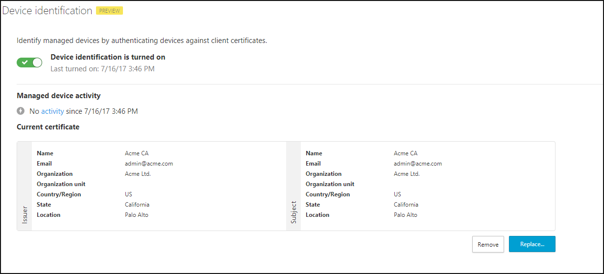

---
# required metadata

title: Creating policies to control cloud app use with Cloud App Security Proxy | Microsoft Docs
description: This topic provides information about how to create policies to control cloud app use with Cloud App Security Proxy.
keywords:
author: rkarlin
ms.author: rkarlin
manager: mbaldwin
ms.date: 7/16/2017
ms.topic: article
ms.prod:
ms.service: cloud-app-security
ms.technology:
ms.assetid: b419aff0-3f50-4917-9ee2-9ecf7539a5d7

# optional metadata

#ROBOTS:
#audience:
#ms.devlang:
ms.reviewer: reutam
ms.suite: ems
#ms.tgt_pltfrm:
#ms.custom:

---

# Controlling app use with Proxy control

After deploying the Proxy, you can control access and sessions in your organization’s cloud by creating policies to block unwanted access and behavior.

## Create access control policies in Cloud App Security

To create access control policies:

1.  Under **Control,** select **Policies**.

2.  Under **Create policy**, choose **Proxy policy** and then, as the **Activity type**, select **Single sign-on log on**.

3.  Then, choose the relevant app and filters and choose the mitigating option you prefer.

>[!NOTE]
> In the filters, you can choose **Device tag** and set it to be equal or not equal to **Managed device**. See below for more information about [Managed devices](#_Managed_devices).

Also, note that in the **Mitigating actions,** you can choose to **Log** or **Block access**, or choose to **Route to Cloud App Security** which will allow you to monitor and create policies on the session. This will be further explained in [Creating session control policies in Cloud App Security](#_Creating_session_control).

## Create session control policies in Cloud App Security 

After deploying the Proxy, you can add Session Control capabilities by defining session policies in the Cloud App Security portal.

We recommend that you start by enabling session control for a small group of users before deploying it across your organization. In addition, we do not recommend enabling session control for all the sessions or for the majority of the sessions. Since session control is based on an agentless deployment that has its limitations, it is designed to cover cases in which you have limited or no control over the device and the app.

To create session control policies:

1.  Create an [access policy](#working-with-proxy-control-features) and then, as the mitigating action, choose **Route to Cloud App Security**.

2.  Under **Control**, go to **Policies** and under **Create policy** choose **Proxy policy.**

3.  Then as the **Activity type,** choose either **Download file** or **Export report**. Choose the relevant app and filters and choose the mitigating as needed.

## Enabling managed/unmanaged device control

### STEP 1: Deploy certificates

For Cloud App Security to identify which devices connecting to your cloud are managed or unmanaged, you must deploy client certificates. This can be performed in various ways, usually by leveraging the certificates of an existing Mobile Device Management solution or by using the Active Directory group policies.

### STEP 2: Upload the root certificate to Cloud App Security

To enable identification of managed devices in the Cloud App Security portal, you first need to upload the certificate authority root certificate:

1.  Click on the Settings cog and choose **Managed devices.**

2.  Enable **Device identification**.

3. Upload the root certificate.

### STEP 3: Create managed device policies

After the root certificate is uploaded, use the filter **Device tag** equals or not equal **Managed device** to create proxy policies or to search for events in the Activity log.

When using client certificates as a way to identify managed devices, we recommend starting in monitoring mode before attempting to block or monitor the session. This means that you define an access policy with a **Managed device** filter in which the mitigating action is **Log only**. After you gain some experience with your users, you can add other mitigation actions such as blocking access or monitoring the session.

## See Also  
[Working with the Cloud App Security Proxy](proxy-intro.md)   
[For technical support, please visit the Cloud App Security assisted support page.](http://support.microsoft.com/oas/default.aspx?prid=16031)   
[Premier customers can also choose Cloud App Security directly from the Premier Portal.](https://premier.microsoft.com/)  
  