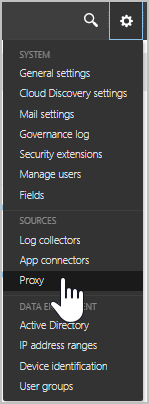
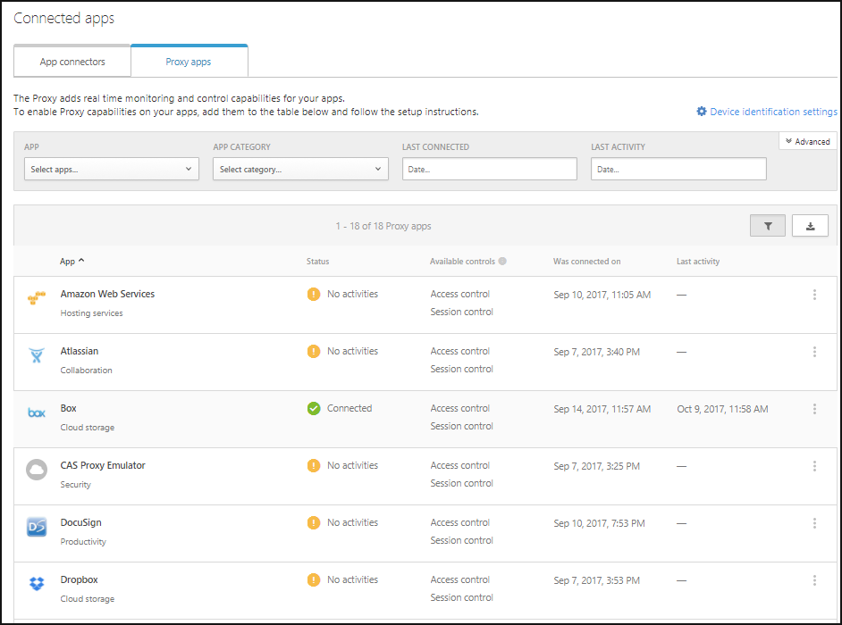
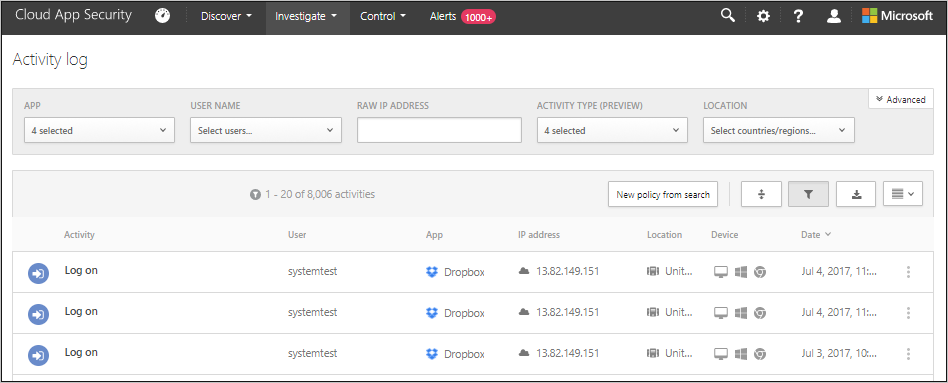

---
# required metadata

title: Deploying the Cloud App Security Proxy for Azure AD apps| Microsoft Docs
description: This topic provides information about how to deploy the Cloud App Security Proxy for Azure AD apps.
keywords:
author: rkarlin
ms.author: rkarlin
manager: mbaldwin
ms.date: 10/8/2017
ms.topic: article
ms.prod:
ms.service: cloud-app-security
ms.technology:
ms.assetid: 2490c5e5-e723-4fc2-a5e0-d0a3a7d01fc2

# optional metadata

#ROBOTS:
#audience:
#ms.devlang:
ms.reviewer: reutam
ms.suite: ems
#ms.tgt_pltfrm:
#ms.custom:

---

# Deploying the Cloud App Security proxy for Azure AD apps

> [!NOTE]
> It is recommended that you try the installation in a sandbox or testing environment before installing it in a production environment.

Follow these steps to configure Azure AD apps to be controlled by the Cloud App Security proxy.

## Step 1: Add Azure AD apps in Cloud App Security  

1. Create an Azure AD conditional access TEST policy.

    1. In Azure Active Directory, under **Security**, click on **Conditional access**.

     

    2. Click **New policy** and create a new policy making sure that under **Session** you select **Use proxy enforced restrictions**.

    3. In the TEST policy, under **Users**, assign a test user or user that can be used for an initial sign-on.
    
    4. In the TEST policy, under **Cloud app**, assign the apps you want to control with the proxy. 

2. Log in to the app you are adding with the credentials set in the conditional access policy.  

3. Repeat this process for each app you want to control with the proxy.

4. In the Cloud App Security portal, go to the settings cog and choose **Proxy**. 
 
 

5. The apps you logged in to should now appear in the table. 

 

6. For each app, click the three dots in the right corner of the table row and click **Continue setup**. 

7. In the proxy wizard, click **Finish**. Within a few minutes, all login requests to your app is routed through the Cloud App Security proxy. 

## Step 2: Test the configuration 

1. Try to log in to the app. If the login fails, make sure you completed all the proxy wizard steps properly. 
2. In the Cloud App Security portal, under **Investigate**, select Activity log, and make sure there are single sign-on logon events captured by the proxy. 

 

## See Also  
[Working with the Cloud App Security proxy](proxy-intro.md)   
[For technical support, visit the Cloud App Security assisted support page.](http://support.microsoft.com/oas/default.aspx?prid=16031)   
[Premier customers can also choose Cloud App Security directly from the Premier Portal.](https://premier.microsoft.com/)  
  