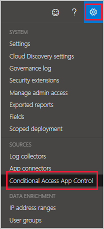
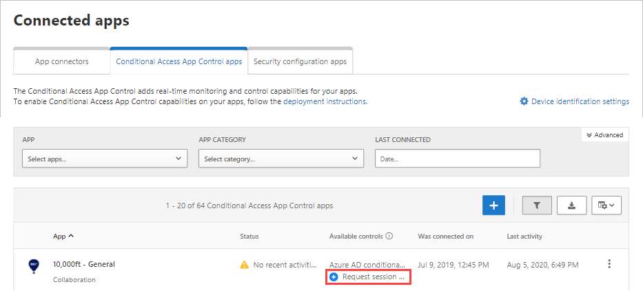
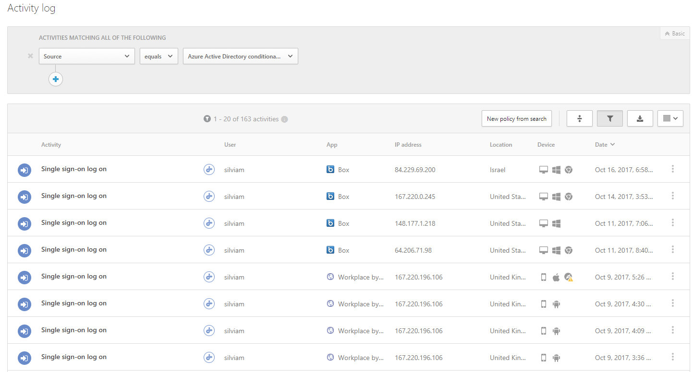

---
# required metadata

title: Deploy Cloud App Security Conditional Access App Control for Azure AD apps
description: This article provides information about how to deploy the Microsoft Cloud App Security Conditional Access App Control reverse proxy features for Azure AD apps.
keywords:
author: ShlomoSagir-MS
ms.author: shsagir
manager: ShlomoSagir-MS
ms.date: 7/2/2019
ms.topic: conceptual
ms.collection: M365-security-compliance
ms.prod:
ms.service: cloud-app-security
ms.technology:
ms.assetid: 2490c5e5-e723-4fc2-a5e0-d0a3a7d01fc2

# optional metadata

#ROBOTS:
#audience:
#ms.devlang:
ms.reviewer: reutam
ms.suite: ems
#ms.tgt_pltfrm:
ms.custom: seodec18

---
# Deploy Conditional Access App Control for featured apps

*Applies to: Microsoft Cloud App Security*

>[!div class="step-by-step"]
[« Previous: Introduction to Conditional Access App Control](proxy-intro-aad.md) 
[Next: How to create a session policy »](session-policy-aad.md)

Follow these steps to configure featured apps to be controlled by Microsoft Cloud App Security Conditional Access App Control.

**Step 1: [Go to the Azure AD portal and create a conditional access policy for the apps and route the session to Cloud App Security](#add-azure-ad).**

**Step 2: [Sign in to each app using a user scoped to the policy](#sign-in-scoped).**

**Step 3: If you did not select a built-in Cloud App Security policy in Azure AD or if you want to apply the policy to a any app, [go to the Cloud App Security portal](#portal)**

[**Step 4: Test the deployment**](#test)

> [!NOTE]
> To deploy Conditional Access App Control for Azure AD apps, you need a valid [license for Azure AD Premium P1](https://docs.microsoft.com/azure/active-directory/license-users-groups) as well as a Cloud App Security license.

## Step 1: Create an Azure AD conditional access test policy   

1. In Azure Active Directory, under **Security**, click **Conditional Access**.

2. Click **New policy** and create a new policy.

3. In the TEST policy, under **Users**, assign a test user or user that can be used for an initial sign-on and verification.

4. In the TEST policy, under **Cloud app**, assign the apps you want to control with Conditional Access App Control. 

5. Under **Session**, set the policy to use either of the built-in policies, **Monitor only** or **Block downloads**. Or select **Use custom policy** to set an advanced policy in the Cloud App Security portal. 

6. Add any applicable **Condition assignments** or **Grant controls** (optional).

   

      > [!NOTE]
      >Conditional Access App Control supports any SAML or Open ID Connect app that is configured with single sign-on in Azure AD, including these featured apps. Non-featured apps can be configured with access control in the Cloud App Security portal by making a request to onboarded them with session control. 

7. Click **Enable** and **Save**.

## Step 2: Sign in to each app using a user scoped to the policy

After you've created the policy, sign in to each app configured in that policy. Make sure you sign in using a user configured in the policy. Make sure to first sign out of existing sessions.

Cloud App Security will sync your policy details to its servers for each new app you sign in to.  This may take up to one minute.

## Step 3: Configure advanced controls and any apps in the Cloud App Security portal

The instructions above helped you create a built-in Cloud App Security policy for featured apps directly in Azure AD.

To configure an advanced policy, create an [access policy](access-policy-aad.md) or a [session policy](session-policy-aad.md) in Cloud App Security.

To apply the policy to a any app, follow the instructions to [self-onboard a any app for use with Conditional Access App Control](proxy-deployment-any-app.md).

To request support for a any app:

1. In the Cloud App Security portal, go to the settings cog and choose **Conditional Access App Control**. You should see a message letting you know that new Azure AD apps were discovered by Conditional Access App Control.

    

2. Click **View new apps**.

    

3. In the screen that opens, you can see all the apps that you logged into in the previous step. For each app, click on the + sign, and then click **Add**.

   > [!NOTE]
   > If an app does not appear in the Cloud App Security app catalog, it will appear in the dialog under unidentified apps along with the login URL. When you click the + sign for these apps, you can onboard the application as a custom app.

   

4. In the Conditional Access App Control apps table, look at the **Available controls** column and verify that both **Azure AD conditional access** and **Session control** appear.

   > [!NOTE]
   > If Session control doesn't appear for an app, it's not yet available for that specific app. You'll see the **Request session control** link instead.

     

5. Click **Request session control** to request that the app be onboarded to session control. The onboarding process will be performed with you by the Microsoft Cloud App Security team.

6. To configure a policy to leverage device management via client certificates:
    1. Go to the settings cog and choose **Device identification**.
    2. Upload one or more root or intermediate certificates.
    3. After the certificate is uploaded, you can create access policies and session policies based on **Device tag** and **Valid client certificate**.

       

> [!NOTE]
> A certificate is only requested from a user if the session matches a policy that uses the valid client certificate filter.

## Step 4: Test the deployment

1. First sign out of any existing sessions. Then, try to sign in to each app that was successfully deployed. Sign in using a user that matches the policy configured in Azure AD.

2. In the Cloud App Security portal, under **Investigate**, select **Activity log**, and make sure the login activities are captured for each app.

3. You can filter by clicking on **Advanced**, and then filtering using **Source equals Access control**.

    

4. It's recommended that you sign into mobile and desktop apps from managed and unmanaged devices. This is to make sure that the activities are properly captured in the activity log. 
To verify that the activity is properly captured, click on a single sign-on log on activity so that it opens the activity drawer. Make sure the **User agent tag** properly reflects whether the device is a native client (meaning either a mobile or desktop app) or the device is a managed device (compliant, domain joined, or valid client certificate).

> [!NOTE]
> After it is deployed, you can't remove an app from the Conditional Access App Control page. As long as you don't set a session or access policy on the app, the Conditional Access App Control won't change any behavior for the app.

>[!div class="step-by-step"]
[« Previous: Introduction to Conditional Access App Control](proxy-intro-aad.md) [Next: Onboard and deploy Conditional Access App Control for any app »](proxy-deployment-any-app.md)

## Next steps 
[Working with the Cloud App Security Conditional Access App Control](proxy-intro-aad.md)

[Premier customers can also create a new support request directly in the Premier Portal.](https://premier.microsoft.com/)