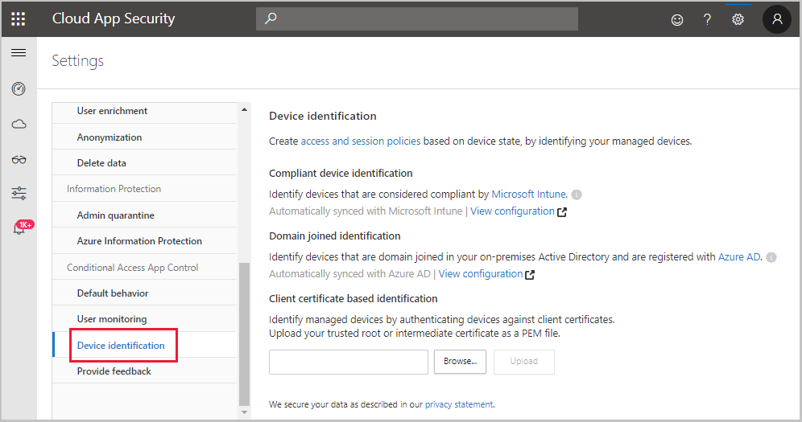
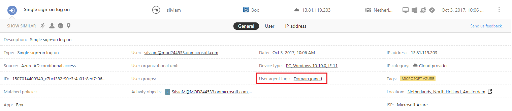

---
# required metadata

title: Deploy Microsoft Cloud App Security Conditional Access App Control for Azure AD apps| Microsoft Docs
description: This topic provides information about how to deploy the Microsoft Cloud App Security Conditional Access App Control reverse proxy features for Azure AD apps.
keywords:
author: rkarlin
ms.author: rkarlin
manager: mbaldwin
ms.date: 8/5/2018
ms.topic: conceptual
ms.prod:
ms.service: cloud-app-security
ms.technology:
ms.assetid: 2490c5e5-e723-4fc2-a5e0-d0a3a7d01fc2

# optional metadata

#ROBOTS:
#audience:
#ms.devlang:
ms.reviewer: reutam
ms.suite: ems
#ms.tgt_pltfrm:
#ms.custom:

---
*Applies to: Microsoft Cloud App Security*

# Deploy Conditional Access App Control for Azure AD apps

>[!div class="step-by-step"]
[« Previous: Introduction to Conditional Access App Control](proxy-intro-aad.md) 
[Next: How to create a session policy »](session-policy-aad.md)

Follow these steps to configure Azure AD apps to be controlled by Microsoft Cloud App Security Conditional Access App Control.

**Step 1: [Go to the Azure AD portal and create a conditional access policy for the apps and route the session to Cloud App Security](#add-azure-ad).**

**Step 2: [Sign in with a user scoped to the policy in the apps](#sign-in-scoped).**

**Step 3: [Return to the Cloud App Security portal and select the banner notification to add the apps](#banner-notification).**

**Step 4: [Create an access policy](access-policy-aad.md) or [create a session policy](session-policy-aad.md) for the apps in Cloud App Security.**

> [!NOTE]
> To deploy the Conditional Access App Control for Azure AD apps, you need a valid [license for Azure AD Premium P1](https://docs.microsoft.com/azure/active-directory/license-users-groups).

## Step 1: Add Azure AD apps in Cloud App Security   

1. Create an Azure AD conditional access TEST policy.

   1. In Azure Active Directory, under **Security**, click on **Conditional access**.

      

   2. Click **New policy** and create a new policy making sure that under **Session** you select **Use Conditional Access App Control enforced restrictions**.

      

   3. In the TEST policy, under **Users**, assign a test user or user that can be used for an initial sign-on.
    
   4. In the TEST policy, under **Cloud app**, assign the apps you want to control with Conditional Access App Control. 

      > [!NOTE]
      >Make sure that you choose apps that are supported by Conditional Access App Control. Conditional Access App Control supports apps that are configured with SAML single sign-on in Azure AD. For example, Office 365 applications are not configured with SAML so they are not currently supported.

## Step 2: Sign in with a user scoped to the policy in the apps 

After you created the policy, log in to each app configured in the policy with a user configured in the policy. Make sure to first log out of existing sessions.

## Step 3: Return to the Cloud App Security portal and select the banner notification to add the apps 

1. In the Cloud App Security portal, go to the settings cog and choose **Conditional Access App Control**. 
    
     

2. You should see a message letting you know that new Azure AD apps were discovered by Conditional Access App Control. Click on the **View new apps** link.

   

3. In the dialog that opens, you can see all the apps that you logged into in the previous step. For each app, click on the + sign, and then click **Add**.

   

   > [!NOTE]
   > If an app does not appear in the Cloud App Security app catalog, it will appear in the dialog under unidentified apps along with the login URL. When clicking on the + sign for these apps, you will be able to suggest adding the app to the catalog. After the app is in the catalog, perform the steps again to deploy the app. 

4. In the Conditional Access App Control apps table, look at the **Available controls** column and verify that both Azure AD conditional access and Session control appear.   If Session control does not appear for an app, that means it's not yet available for that specific app and you will see the **Request session control** link instead. Click on it to open a dialog and request the onboarding of the app to session control. In this scenario, the onboarding process will be performed together with you by the Microsoft Cloud App Security team.
  
   

5. Optional - Identify devices using client certificates:

   1. Go to the settings cog and choose **Device identification**.

   2. Upload a root certificate.

      
 
      After the certificate is uploaded, you can create access policies and session policies based on **Device tag** equals or not equals, **Valid client certificate**.
 
      > [!NOTE]
      >A certificate will only be requested from a user if the session matches a policy that uses the valid client certificate filter. 

## Test the deployment

1. First log out of any existing sessions. Then, try to log in to each app that was successfully deployed, using a user that matches the policy configured in Azure AD. 

2. In the Cloud App Security portal, under **Investigate**, select **Activity log**, and make sure the login activities are captured for each app.

3. You can filter by clicking on **Advanced**, and then filtering using **Source equals Azure Active Directory conditional access**.

    

4. It is recommended that you log into mobile and desktop apps from managed and unmanaged devices to make sure that the activities are properly captured in the activity log.  
   To verify that the activity is properly captured, click on a single sign-on log on activity so that it opens the activity drawer and make sure the **User agent tag** properly reflects whether the device is a native client (meaning either a mobile or desktop app) or the device is a managed device (compliant, domain joined, or valid client certificate).
 
   

You are now ready to create [access policies](access-policy-aad.md) and [session policies](session-policy-aad.md) to control your Conditional Access App Control apps.

>[!div class="step-by-step"]
[« Previous: Introduction to Conditional Access App Control](proxy-intro-aad.md) 
[Next: How to create a session policy »](session-policy-aad.md)

## See Also  
[Working with the Cloud App Security Conditional Access App Control](proxy-intro-aad.md)   

[Premier customers can also choose Cloud App Security directly from the Premier Portal.](https://premier.microsoft.com/)  
  