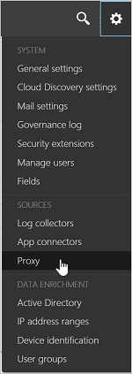
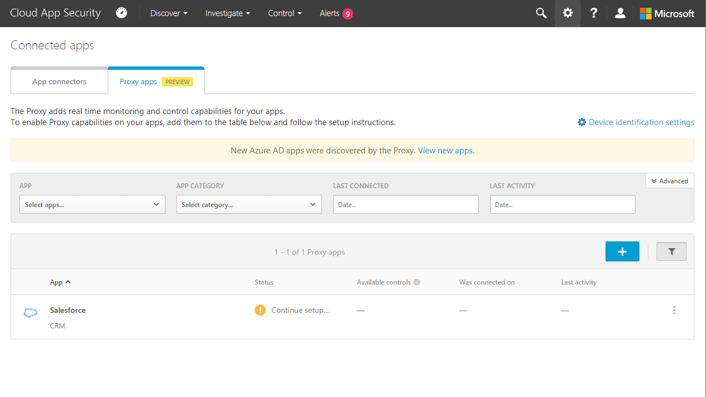
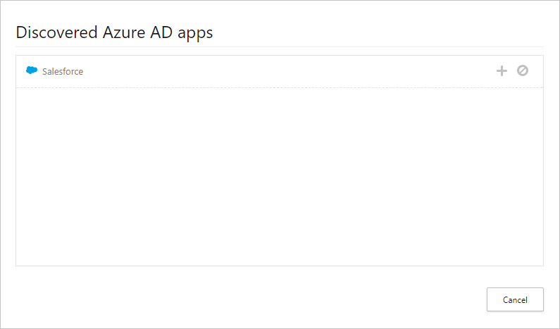
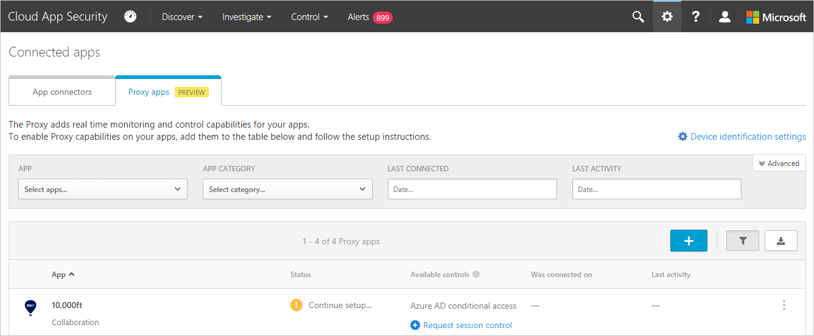

---
# required metadata

title: Deploy the Cloud App Security Proxy for Azure AD apps| Microsoft Docs
description: This topic provides information about how to deploy the Cloud App Security Proxy for Azure AD apps.
keywords:
author: rkarlin
ms.author: rkarlin
manager: mbaldwin
ms.date: 10/22/2017
ms.topic: article
ms.prod:
ms.service: cloud-app-security
ms.technology:
ms.assetid: 2490c5e5-e723-4fc2-a5e0-d0a3a7d01fc2

# optional metadata

#ROBOTS:
#audience:
#ms.devlang:
ms.reviewer: reutam
ms.suite: ems
#ms.tgt_pltfrm:
#ms.custom:

---

# Deploy proxy for Azure AD apps

> [!NOTE]
> To deploy the Cloud App Security proxy for Azure AD apps, you need a license for Azure AD Premium P2.

Follow these steps to configure Azure AD apps to be controlled by the Cloud App Security proxy.

## Step 1: Add Azure AD apps in Cloud App Security  

1. Create an Azure AD conditional access TEST policy.

    1. In Azure Active Directory, under **Security**, click on **Conditional access**.

     

    2. Click **New policy** and create a new policy making sure that under **Session** you select **Use proxy enforced restrictions**.

     

    3. In the TEST policy, under **Users**, assign a test user or user that can be used for an initial sign-on.
    
    4. In the TEST policy, under **Cloud app**, assign the apps you want to control with the proxy. 

     > [!NOTE]
     >Make sure that you choose apps that are supported by the proxy. The proxy supports apps that are configured with SAML single sign-on in Azure AD. For example, Office 365 applications are not configured with SAML so they are not currently supported.

2.	After you created the policy, log in to each app configured in the policy with a user configured in the policy. Make sure to first log out of existing sessions.

3.	In the Cloud App Security portal, go to the settings cog and choose **Proxy**. 
    
      

4.	You should see a message letting you know that new Azure AD apps were discovered by the proxy. Click on the **View new apps** link.

 

5.	In the dialog that opens, you can see all the apps that you logged into in the previous step. For each app, click on the + sign, and then click **Add**.

 

 > [!NOTE]
 > If an app does not appear in the Cloud App Security app catalog, it will appear in the dialog under unidentified apps along with the login URL. When clicking on the + sign for these apps, you will be able to suggest adding the app to the catalog. After the app is in the catalog, perform the steps again to deploy the app. 

6.	In the proxy apps table, look at the **Available controls** column and verify that both Azure AD conditional access and Session control appear.   If Session control does not appear for an app, that means it's not yet available for that specific app and you will see the **Request session control** link instead. Click on it to open a dialog and request the onboarding of the app to session control. During the Proxy public preview period, the onboarding process will be performed together with you by the Cloud App Security team.
  
 

 
## Step 2: Test the deployment

1. First log out of any existing sessions. Then, try to log in to each app that was successfully deployed, using a user that matches the policy configured in Azure AD. 

2.	In the Cloud App Security portal, under **Investigate**, select **Activity log**, and make sure the login activities are captured for each app.

3.	You can filter by clicking on **Advanced**, and then filtering using **Source equals Azure Active Directory conditional access**.

     
  
You are now ready to create [session policies](session-policy-aad.md) to control your proxy apps.

## See Also  
[Working with the Cloud App Security proxy](proxy-intro-aad.md)   
[For technical support, visit the Cloud App Security assisted support page.](http://support.microsoft.com/oas/default.aspx?prid=16031)   
[Premier customers can also choose Cloud App Security directly from the Premier Portal.](https://premier.microsoft.com/)  
  