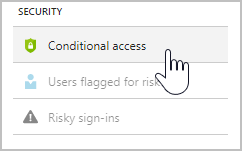

---
# required metadata

title: Deploying the Cloud App Security Proxy for Azure AD apps| Microsoft Docs
description: This topic provides information about how to deploy the Cloud App Security Proxy for Azure AD apps.
keywords:
author: rkarlin
ms.author: rkarlin
manager: mbaldwin
ms.date: 8/10/2017
ms.topic: article
ms.prod:
ms.service: cloud-app-security
ms.technology:
ms.assetid: 2490c5e5-e723-4fc2-a5e0-d0a3a7d01fc2

# optional metadata

#ROBOTS:
#audience:
#ms.devlang:
ms.reviewer: reutam
ms.suite: ems
#ms.tgt_pltfrm:
#ms.custom:

---

# Deploying the Cloud App Security Proxy for Azure AD apps

> [!NOTE]
> It is strongly recommended to try the installation in a sandbox or testing environment before installing it in a production environment.

The steps described below must be taken to deploy the Cloud App Security Proxy and enable both access control and session control.

## Step 1: Create an Azure AD conditional access policy

1. In Azure Active Directory, under **Security**, click on **Conditional access**.

 

2. Click **New policy** and create a new policy making sure that under **Session** you select **Use proxy enforced restrictions**.

## Step 2: Log on to each app

Use your credentials to log into each app you want to control with the Proxy.

## Step 3: Add the apps in Cloud App Security

1.  In the Cloud App Security portal, go to the Settings cog and choose **Proxy**.

2. The apps you logged into should now appear in the table. 

3. For each app, click the three dots in the right corner of the table row and click **Continue setup**.

4. In the Proxy wizard, click **Finish**.

Within a few minutes, all log in requests to your app will be routed through the Cloud App Security Proxy. 

## Test the configuration

1.  Try to log in to the app. If the login fails, make sure you completed all the Proxy wizard steps properly. 

2.  In the Cloud App Security portal, under **Investigate**, select **Activity log** and make sure there are **single sign-on log on** events captured by the Proxy.

## See Also  
[Working with the Cloud App Security Proxy](proxy-intro.md)   
[For technical support, please visit the Cloud App Security assisted support page.](http://support.microsoft.com/oas/default.aspx?prid=16031)   
[Premier customers can also choose Cloud App Security directly from the Premier Portal.](https://premier.microsoft.com/)  
  