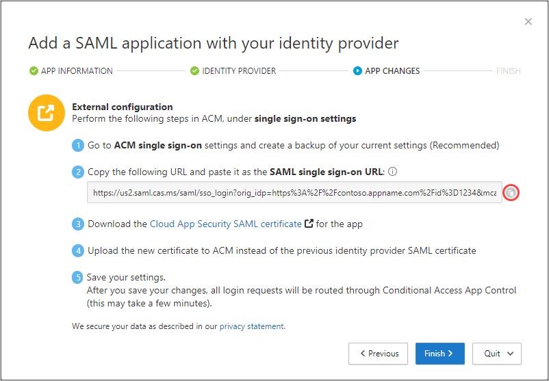

---
# required metadata

title: Deploy Cloud App Security Conditional Access App Control for any apps
description: This article provides information about how to deploy the Microsoft Cloud App Security Conditional Access App Control reverse proxy features for any apps.
keywords:
author: shsagir
ms.author: shsagir
manager: shsagir
ms.date: 03/31/2020
ms.topic: conceptual
ms.collection: M365-security-compliance
ms.prod:
ms.service: cloud-app-security
ms.technology:

# optional metadata

#ROBOTS:
#audience:
ms.suite: ems
---
# Onboard and deploy Conditional Access App Control for any app

*Applies to: Microsoft Cloud App Security*

Session controls in Microsoft Cloud App Security can be configured to work with any web apps. This article describes how to onboard and deploy custom line-of-business apps, non-featured SaaS apps, and on-premise apps hosted via the Azure Active Directory (Azure AD) Application Proxy with session controls.

For a list of apps that are featured by Cloud App Security to work out-of-the-box, see [Protect apps with Cloud App Security Conditional Access App Control](proxy-intro-aad.md#featured-apps).

## Prerequisites

- Your organization must have the following licenses to use Conditional Access App Control:

  - [Azure Active Directory (Azure AD) Premium P1](https://docs.microsoft.com/azure/active-directory/license-users-groups) or higher, or the license required by your identity provider (IdP) solution
  - Microsoft Cloud App Security

- Apps must be configured with single sign-on
- Apps must use one of the following authentication protocols:

    |IdP|Protocols|
    |---|---|
    |Azure AD|SAML 2.0 or OpenID Connect|
    |Other|SAML 2.0|

## To deploy any app

Follow these steps to configure any app to be controlled by Cloud App Security Conditional Access App Control.

**Step 1: [Configure your IdP to work with Cloud App Security](#conf-idp)**

**Step 2: [Configure the users that will deploy the app](#conf-users)**

**Step 3: [Configure the app that you are deploying](#conf-app)**

**Step 4: [Verify that the app is working correctly](#verify-app)**

**Step 5: [Enable the app for use in your organization](#enable-app)**

**Step 6: [Update the Azure AD policy](#update-azure-ad)**

> [!NOTE]
> To deploy Conditional Access App Control for Azure AD apps, you need a valid [license for Azure Active Directory Premium P1 or higher](https://docs.microsoft.com/azure/active-directory/license-users-groups) as well as a Cloud App Security license.

## Step 1:  Configure your IdP to work with Cloud App Security

### Configure integration with Azure AD

Use the following steps to create an Azure AD Conditional Access policy that routes app sessions to Cloud App Security. For other IdP solutions, see [Configure integration with other IdP solutions](#configure-integration-with-other-idp-solutions).

1. In Azure AD, browse to **Security** > **Conditional Access**.

1. On the **Conditional Access** pane, in the toolbar at the top, click **New policy**.

1. On the **New** pane, in the **Name** textbox, enter the policy name.

1. Under **Assignments**, click **Users and groups**, assign the users that will be onboarding (initial sign on and verification) the app, and then click **Done**.

1. Under **Assignments**, click **Cloud apps**, assign the apps you want to control with Conditional Access App Control, and then click **Done**.

1. Under **Access controls**, click **Session**, select **Use Conditional Access App Control** and choose a built-in policies (**Monitor only** or **Block downloads**) or **Use custom policy** to set an advanced policy in Cloud App Security, and then click **Select**.

    

1. Optionally, add conditions and grant controls as required.

1. Set **Enable policy** to **On** and then click **Create**.

### Configure integration with other IdP solutions

Use the following steps to route app sessions from other IdP solutions to Cloud App Security. For Azure AD, see [Configure integration with Azure AD](#configure-integration-with-azure-ad).

1. In Cloud App Security, browse to **Investigate** > **Connected apps** > **Conditional Access App Control apps**.

1. Click the plus sign, and in the pop-up, select the app you want to deploy, and then click **Start Wizard**.
1. On the **APP INFORMATION** page, fill out the form using the information from your app's single sign-on configuration page, and then click **Next**.
    - If your IdP provides a single sign-on metadata file for the selected app, select **Upload metadata file from the app** and upload the metadata file.
    - Or, select **Fill in data manually** and provide the following information:
        - **Assertion consumer service URL**
        - If your app provides a SAML certificate, select **Use <app_name> SAML certificate** and upload the certificate file.

    

1. On the **IDENTITY PROVIDER** page, use the provided steps to set up a new application in your IdP's portal, and then click **Next**.
    1. Go to your IdP's portal and create a new custom SAML app.
    1. Copy the single sign-on configuration of the existing `<app_name>` app to the new custom app.
    1. Assign users to the new custom app.
    1. Copy the apps single sign-on configuration information, you'll need it in the next step.

    

    > [!NOTE]
    > These steps may differ slightly depending on your identity provider. This step is recommended for the following reasons:
    >
    > - Some identity providers do not allow you to change the SAML attributes or URL properties of a gallery app
    > - Configuring a custom app enables you to test this application with access and session controls without changing the existing behavior for your organization.

1. On the next page, fill out the form using the information from your app's single sign-on configuration page, and then click **Next**.
    - If your IdP provides a single sign-on metadata file for the selected app, select **Upload metadata file from the app** and upload the metadata file.
    - Or, select **Fill in data manually** and provide the following information:
        - **Assertion consumer service URL**
        - If your app provides a SAML certificate, select **Use <app_name> SAML certificate** and upload the certificate file.

    

1. On the next page, copy the following information, and then click **Next**. You'll need the information in the next step.

    - Single sign-on URL
    - Attributes and values

    

1. In your IdP's portal, do the following:
    > [!NOTE]
    > The settings are commonly found in IdP portal's custom app settings page

    1. In the single sign-on URL field, enter the single sign-on URL you made a note of earlier.
        > [!NOTE]
        > Some providers may refer to the single sign-on URL as the *Reply URL*.
    1. Add the attributes and values you made a note of earlier to the apps properties.
        > [!NOTE]
        > Some providers may refer to them as *User attributes* or *Claims*.
    1. Verify that the name identifier is in the email address format.
    1. Save your settings.
1. On the **APP CHANGES** page, do the following, and then click **Next**. You'll need the information in the next step.

    - Copy the Single sign-on URL
    - Download the Cloud App Security SAML certificate

    

1. In your app's portal, on the single sign-on settings, do the following:
    1. [Recommended] Create a backup of your current settings.
    1. In the single sign-on URL field, enter the single sign-on URL you made a note of earlier.
    1. Upload the Cloud App Security SAML certificate you made a note of earlier.
    > [!NOTE]
    > After saving your settings, all associated login requests to this app will be routed through Conditional Access App Control.

## Step 2: Configure the users that will deploy the app

1. In Cloud App Security, in the menu bar, click the settings cog  and select **Settings**.

1. Under **Conditional Access App Control**, select **App onboarding/maintenance**.

1. Enter the user principal name or email for the users that will be onboarding the app, and then click **Save**.

    

## Step 3: Configure the app that you are deploying

Go to the app that you are deploying. The page you see depends on whether the app is recognized. Do one of the following:

| App status | Description | Steps |
| --- | --- | --- |
| Not recognized | You will see an app not recognized page prompting you to configure your app. | 1. [Add the app to Conditional Access App Control](#add-app).  2. [Add the domains for the app](#add-domains), and then return to the app and refresh the page.  3. [Install the certificates for the app](#install-certs). |
| Recognized | You will see an onboarding page prompting you to continue the app configuration process. | - [Install the certificates for the app](#install-certs).    **Note:** Make sure the app is configured with all domains required for the app to function correctly. To configure additional domains, proceed to [Add the domains for the app](#add-domains), and then return to the app page. |

### To add a new app

1. In the menu bar, click the settings cog , and then select **Conditional Access App Control**.

1. Click **View new apps**.

    

1. In the screen that opens, you can see a list of new apps. For each app you are onboarding, click on the **+** sign, and then click **Add**.

    > [!NOTE]
    > If an app does not appear in the Cloud App Security app catalog, it will appear in the dialog under unidentified apps along with the login URL. When you click the + sign for these apps, you can onboard the application as a custom app.

    

### To add domains for an app

Associating the correct domains to an app allows Cloud App Security to enforce policies and audit activities.

For example, if you have configured a policy that blocks downloading files for an associated domain, file downloads by the app from that domain will be blocked. However, file downloads by the app from domains not associated with the app will not be blocked and the action will not be audited in the activity log.
> [!NOTE]
> Cloud App Security still adds a suffix to domains not associated with the app to ensure a seamless user experience.

1. From within the app, on the Cloud App Security admin toolbar, click **Discovered domains**.
    > [!NOTE]
    > The admin toolbar is only visible to users with permissions to onboard or maintenance apps.
1. In the Discovered domains panel, make a note of domain names or export the list as a .csv file.
    > [!NOTE]
    > The panel displays a list of discovered domains that are not associated in the app. The domain names are fully qualified.
1. Go to Cloud App Security, in the menu bar, click the settings cog  and select **Conditional Access App Control**.
1. In the list of apps, on the row in which the app you are deploying appears, choose the three dots at the end of the row, and then under **APP DETAILS**, choose **Edit**.
    > [!TIP]
    > To view the list of domains configured in the app, click **View app domains**.
1. In **User-defined domains**, enter all the domains you want to associate with this app, and then click **Save**.
    > [!NOTE]
    > You can use the * wildcard character as a placeholder for any character. When adding domains, decide whether you want to add specific domains (`sub1.contoso.com`,`sub2.contoso.com`) or multiple domains (`*.contoso.com`).

### To install root certificates

1. Repeat the following steps to install the **Current CA** and **Next CA** self-signed root certificates.
    1. Select the certificate.
    1. Click **Open**, and when prompted click **Open** again.
    1. Click **Install certificate**.
    1. Choose either **Current User** or **Local Machine**.
    1. Select **Place all certificates in the following store** and then click **Browse**.
    1. Select **Trusted Root Certificate Authorities** and then click **OK**.
    1. Click **Finish**.

    > [!NOTE]
    > For the certificates to be recognized, once you have installed the certificate, you must restart the browser and go to the same page.<!-- You'll see a check-mark by the certificates links confirmation they are installed.-->

1. Click **Continue**.

## Step 4: Verify that the app is working correctly

1. Verify that the sign in flow works correctly.
    <!--
    > [!NOTE]
    > Some apps issue a nonce hash during authentication that may break the sign-in process. If this happens, see the Troubleshooting Guide to resolve the issue.-->
1. Once you are in the app, perform the following checks:
    1. Visit all pages within the app that are part of a users' work process and verify that the pages render correctly.
    1. Verify that the behavior and functionality of the app is not adversely affected by performing common actions such as downloading and uploading files.
    1. Review the list of domains associated with the app. For more information, see [Add the domains for the app](#add-domains).

## Step 5: Enable the app for use in your organization

Once you are ready to enable the app for use in your organization's production environment, do the following steps.

1. In Cloud App Security, click the settings cog , and then select **Conditional Access App Control**.
1. In the list of apps, on the row in which the app you are deploying appears, choose the three dots at the end of the row, and then choose **Edit app**.
1. Select **Use with Conditional Access App Control** and then click **Save**.

## Step 6: Update the Azure AD policy (Azure AD only)

1. In Azure AD, under **Security**, click **Conditional Access**.
1. Update the policy you created earlier to include the relevant users, groups, and controls you require.
1. Under **Session** > **Use Conditional Access App Control**, if you selected **Use Custom Policy**, go to Cloud App Security and create a corresponding session policy. For more information, see [Session policies](session-policy-aad.md).

## Next steps

> [!div class="nextstepaction"]
> [« PREVIOUS: Deploy Conditional Access App Control for featured apps](proxy-deployment-aad.md)

> [!div class="nextstepaction"]
> [NEXT: How to create a session policy »](session-policy-aad.md)

## See also

> [!div class="nextstepaction"]
> [Introduction to Conditional Access App Control](proxy-intro-aad.md)

[!INCLUDE [Open support ticket](includes/support.md)]
