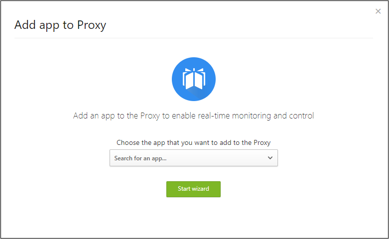
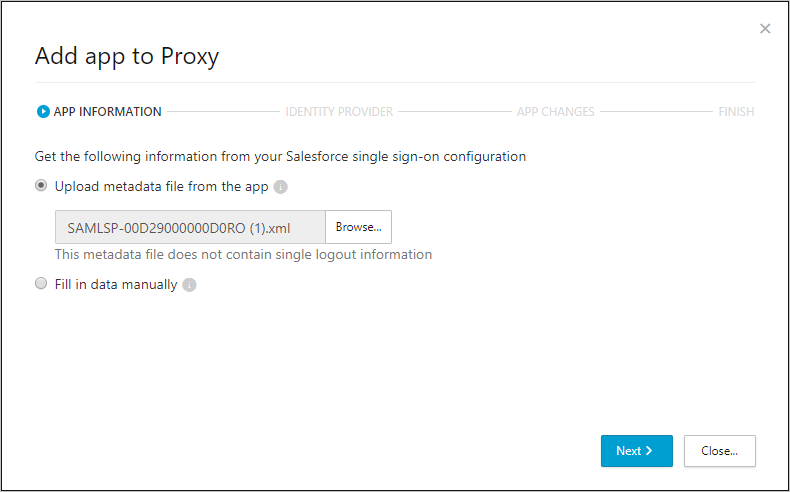
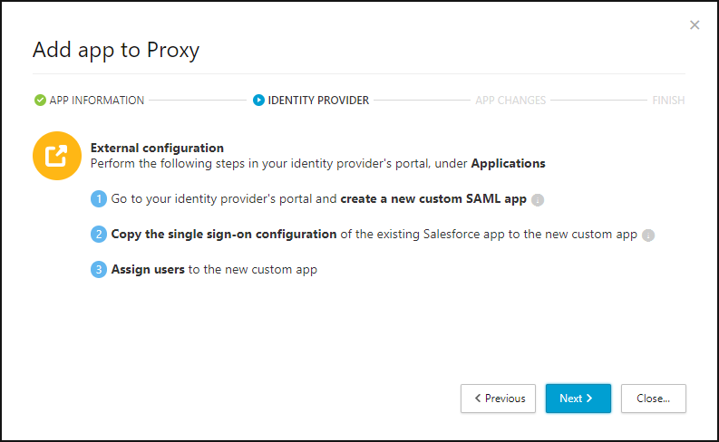
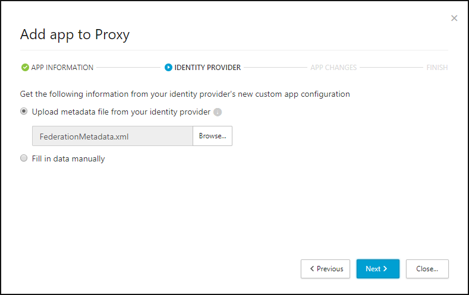
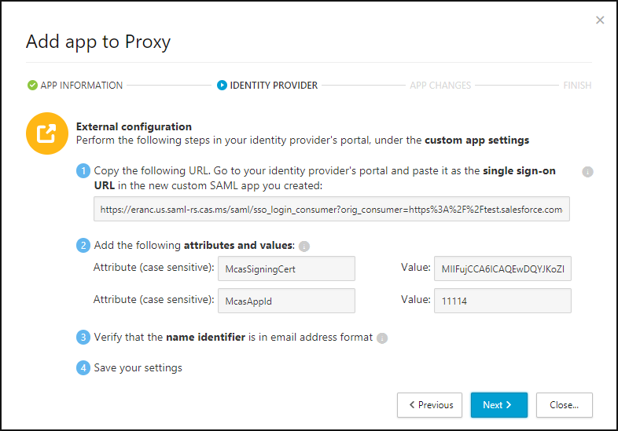

---
# required metadata

title: Deploying the Cloud App Security Proxy | Microsoft Docs
description: This topic provides information about how to deploy the Cloud App Security Proxy.
keywords:
author: rkarlin
ms.author: rkarlin
manager: mbaldwin
ms.date: 7/31/2017
ms.topic: article
ms.prod:
ms.service: cloud-app-security
ms.technology:
ms.assetid: 75094bde-e135-47fb-b5c6-7e1168919771

# optional metadata

#ROBOTS:
#audience:
#ms.devlang:
ms.reviewer: reutam
ms.suite: ems
#ms.tgt_pltfrm:
#ms.custom:

---

# Deploying the Cloud App Security Proxy

> [!NOTE]
> It is strongly recommended to try the installation in a sandbox or testing environment before installing it in a production environment.

The steps described below must be taken to deploy the Cloud App Security Proxy and enable both access control and session control.

## Prerequisites

-   A working environment in which your cloud app is configured with an identity provider. The installation process involves configuration changes in both the app and the identity provider.
- Make sure you have access to the single sign-on settings in your identity provider and the app.

## Deploy the Proxy

If you are installing the Proxy in a production environment, we recommend finding a time when most of the users are not using the app, usually late at night or over the weekend, and communicate to your users that there might be a short app downtime.

Before starting to make configuration changes, check that your current configuration works. After this is verified, perform the following steps.

1.  In the Cloud App Security portal, go to the Settings cog and choose **Proxy**.

2. In the top right corner, click on the plus sign.

3. In **Add app to Proxy** window, select the app you want to add and then click **Start wizard**. 

 

4. Upload the single sign-on metadata file from your app's single sign-on settings. If you don't have a metadata file, click **Fill in data manually** and provide the requested data, according to the wizard. 

 

5. In your identity provider's portal, perform the following steps. In most identity provider portals, this is performed under **Applications**:

    1. Create a new custom SAML app. It is required to create a new custom app because you will have to change URLs and add SAML attributes which may not be possible in gallery apps.
    
    2. Copy the single sign-on configuration from the existing app in the identity provider's list, to the new custom app. Make sure that the **Identifier** (also known as audience or entity ID) in the custom app matches the **Identifier** of the single sign-on settings of the actual app. If your identity provider doesn't enable you to use the same **Identifier** for two different apps, after copying it, change the identifier of the original app.
    
    3. Assign all your users that are currently assigned to the original app to the new custom app.
    
    

5. Upload the single sign-on metadata file from your identity provider. If you don't have a metadata file, click **Fill in data manually** and provide the requested data, according to the wizard.  

 

6. Perform the following external configuration changes in your identity provider's portal and then, in the new custom app you created:

    1. Copy the URL provided in the Wizard. Then, go to your identity provider's portal and paste it as the single sign-on URL (or Reply URL)in the new custom SAML app you created.
    
    2. Copy the attributes and values provided in the Proxy wizard and add them as SAML custom attributes.
    
    3. Make sure that the name identifiers used by your app are in email address format - this is necessary to enable the Cloud App Security Proxy to enforce policies on users.
    
    4. Save the settings for your new custom app and click **Next** in the Proxy wizard.
 

4.  Then, in the app's single sign-on settings page, do the following:
    1. Back up your current app settings.
    
    2. Copy the URL from the Proxy wizard into the app's SAML single sign-on URL.
    
    3. Download the Cloud App Security SAML certificate for the app.
    
    4. In the custom app you created, upload this SAML certificate in place of the original one and save your settings.
   
    5. In the Proxy wizard, click **Finish**.

Within a few minutes, all log in requests to your app will be routed through the Cloud App Security Proxy. 

### Test the configuration

1.  Try to log in to the app. If the login fails, make sure you completed all the Proxy wizard steps properly. 

2.  In the Cloud App Security portal, under **Investigate**, select **Activity log** and make sure there are **single sign-on log on** events captured by the Proxy.

## See Also  
[Working with the Cloud App Security Proxy](proxy-intro.md)   
[For technical support, please visit the Cloud App Security assisted support page.](http://support.microsoft.com/oas/default.aspx?prid=16031)   
[Premier customers can also choose Cloud App Security directly from the Premier Portal.](https://premier.microsoft.com/)  
  