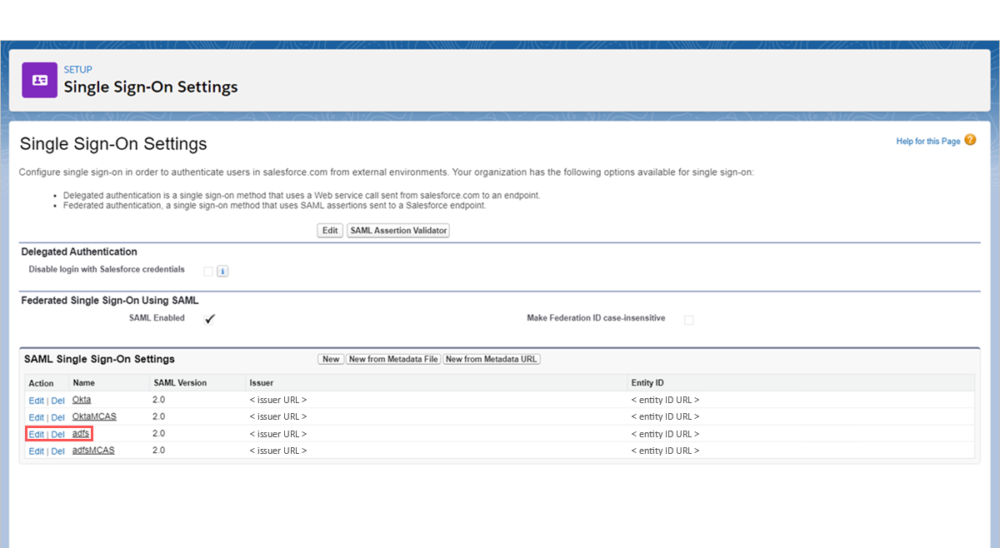
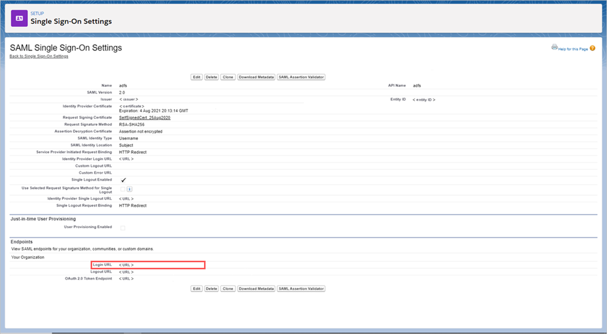
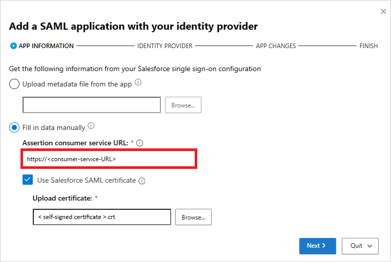
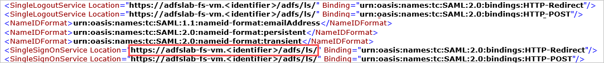
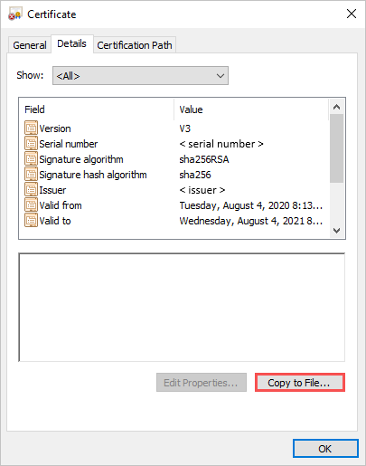
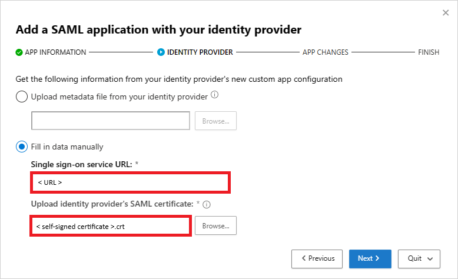
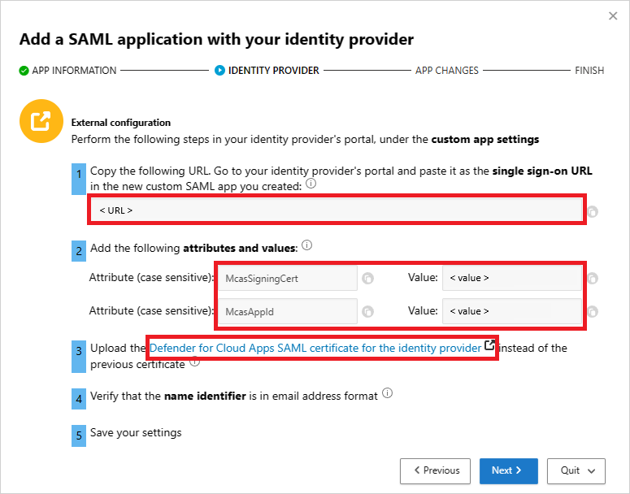
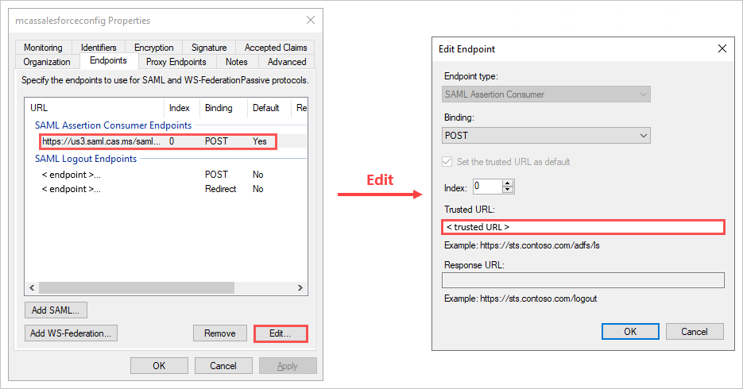
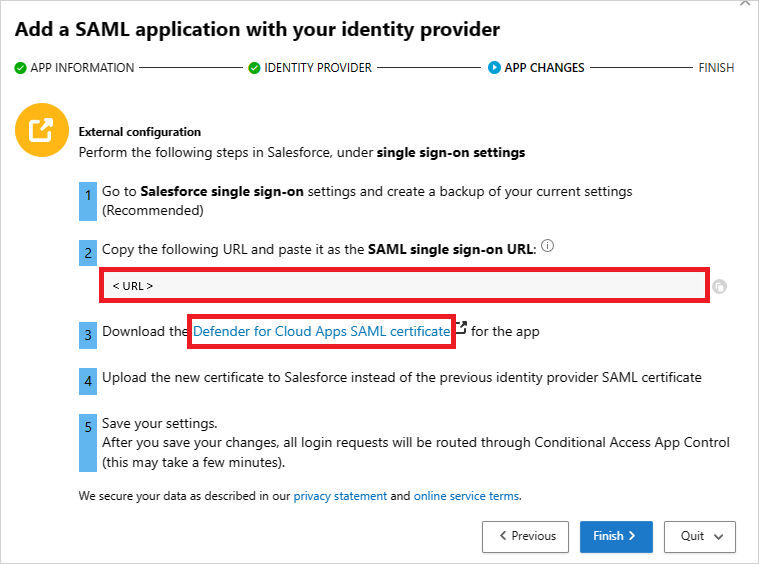

# Deploy conditional access app control for any web app using Active Directory Federation Services (AD FS) as the identity provider (IdP)

You can configure session controls in Microsoft Defender for Cloud Apps to work with any web app and any non-Microsoft IdP. This article describes how to route app sessions from AD FS to Defender for Cloud Apps for real-time session controls.

For this article, we'll use the Salesforce app as an example of a web app being configured to use Defender for Cloud Apps session controls.

## Prerequisites

- Your organization must have the following licenses to use conditional access app control:

  - A pre-configured AD FS environment
  - Microsoft Defender for Cloud Apps

- An existing AD FS single sign-on configuration for the app using the SAML 2.0 authentication protocol

>[!NOTE]
>The steps here apply to all versions of AD FS that run on supported version of Windows Server.

## To configure session controls for your app using AD FS as the IdP

Use the following steps to route your web app sessions from AD FS to Defender for Cloud Apps.

> [!NOTE]
> You can configure the app's SAML single sign-on information provided by AD FS using one of the following methods:
>
> - **Option 1**: Uploading the app's SAML metadata file.
> - **Option 2**: Manually providing the app's SAML data.
>
> In the following steps, we'll use option 2.

**Step 1: [Get your app's SAML single sign-on settings](#idp1-get-your-app-saml-sso-info)**

**Step 2: [Configure Defender for Cloud Apps with your app's SAML information](#idp1-conf-cas-with-your-app-saml-info)**

**Step 3: [Create a new AD FS Relying Party Trust and app single sign-on configuration](#idp1-create-custom-app-adfs)**.

**Step 4: [Configure Defender for Cloud Apps with the AD FS app's information](#idp1-conf-cas-with-adfs-app-info)**

**Step 5: [Complete the configuration of the AD FS Relying Party Trust](#idp1-complete-custom-app-in-adfs)**

**Step 6: [Get the app changes in Defender for Cloud Apps](#idp1-get-app-changes-in-cas)**

**Step 7: [Complete the app changes](#idp1-complete-app-changes)**

**Step 8: [Complete the configuration in Defender for Cloud Apps](#idp1-complete-conf-in-cas)**

## Step 1: Get your app's SAML single sign-on settings

1. In Salesforce, browse to **Setup** > **Settings** > **Identity** > **Single Sign-On Settings**.

1. Under **Single Sign-On Settings**, click on the name of your existing AD FS configuration.

    

1. On the **SAML Single Sign-On Setting** page, make a note of the Salesforce **Login URL**. You'll need this later when configuring Defender for Cloud Apps.

    > [!NOTE]
    > If your app provides a SAML certificate, download the certificate file.

    

## Step 2: Configure Defender for Cloud Apps with your app's SAML information

1. In the Microsoft Defender Portal, select **Settings**. Then choose **Cloud Apps**.
1. Under **Connected apps**, select **Conditional Access App Control apps**.

1. Select **+Add**, and in the pop-up, select the app you want to deploy, and then select **Start Wizard**.

1. On the **APP INFORMATION** page, select **Fill in data manually**, in the **Assertion consumer service URL** enter the Salesforce **Login URL** you noted earlier, and then click **Next**.

    > [!NOTE]
    > If your app provides a SAML certificate, select **Use <app_name> SAML certificate** and upload the certificate file.

    

## Step 3: Create a new AD FS Relying Party Trust and App Single Sign-On configuration

> [!NOTE]
> To limit end-user downtime and preserve your existing known good configuration, we recommend creating a new **Relying Party Trust** and **Single Sign-On configuration**. Where this is not possible, skip the relevant steps. For example, if the app you are configuring does not support creating multiple **Single Sign-On configurations**, then skip the create new single sign-on step.

1. In the **AD FS Management** console, under **Relying Party Trusts**, view the properties of your existing relying party trust for your app, and make note of the settings.

1. Under **Actions**, click **Add Relying Party Trust**. Apart from the **Identifier** value that must be a unique name, configure the new trust using the settings you noted earlier. You'll need this trust later when configuring Defender for Cloud Apps.
1. Open the federation metadata file and make a note of the AD FS **SingleSignOnService Location**. You'll need this later.

    > [!NOTE]
    > You can use the following endpoint to access your federation metadata file: `https://<Your_Domain>/federationmetadata/2007-06/federationmetadata.xml`

    

1. Download the identity provider's Signing Certificate. You'll need this later.
    1. Under **Services** > **Certificates**, right-click on the AD FS signing certificate, and then select **View Certificate**.

        

    1. On the certificate's details tab, click **Copy to File** and follow the steps in the **Certificate Export Wizard** to export your certificate as a *Base-64 encoded X.509 (.CER)* file.

        

1. Back in Salesforce, on the existing AD FS single sign-on settings page, make a note of all the settings.
1. Create a new SAML single sign-on configuration. Apart from the **Entity ID** value that must match the relying party trust **Identifier**, configure the single sign-on using the settings you noted earlier. You'll need this later when configuring Defender for Cloud Apps.

## Step 4: Configure Defender for Cloud Apps with the AD FS app's information

1. Back in the Defender for Cloud Apps **IDENTITY PROVIDER** page, click **Next** to proceed.

1. On the next page, select **Fill in data manually**, do the following, and then click **Next**.
    - For the **Single sign-on service URL**, enter the Salesforce **Login URL** you noted earlier.
    - Select **Upload identity provider's SAML certificate** and upload the certificate file you downloaded earlier.

    

1. On the next page, make a note of the following information, and then click **Next**. You'll need the information later.

    - Defender for Cloud Apps single sign-on URL
    - Defender for Cloud Apps attributes and values

    > [!NOTE]
    > If you see an option to upload the **Defender for Cloud Apps SAML certificate for the identity provider**, click on the link to download the certificate file. You'll need this later.

    

## Step 5: Complete the configuration of the AD FS Relying Party Trust

1. Back in the **AD FS Management** console, right-click on the relying party trust you created earlier, and then select **Edit Claim Issuance Policy**.

    

1. In the **Edit Claim Issuance Policy** dialog box, under **Issuance Transform Rules**, use the provided information in the following table to complete the steps to create custom rules.

    | Claim rule name | Custom rule |
    | --- | --- |
    | McasSigningCert | `=> issue(type="McasSigningCert", value="<value>");` where `<value>` is the **McasSigningCert** value from the Defender for Cloud Apps wizard you noted earlier |
    | McasAppId | `=> issue(type="McasAppId", value="<value>");` is the **McasAppId** value from the Defender for Cloud Apps wizard you noted earlier |

    1. Click **Add Rule**, under **Claim rule template** select **Send Claims Using a Custom Rule**, and then click **Next**.
    1. On the **Configure Rule** page, enter the respective **Claim rule name** and **Custom rule** provided.

    > [!NOTE]
    > These rules are in addition to any claim rules or attributes required by the app you are configuring.

1. Back on the **Relying Party Trust** page, right-click on the relying party trust you created earlier, and then select **Properties**.
1. On the **Endpoints** tab, select **SAML Assertion Consumer Endpoint**, click **Edit** and replace the **Trusted URL** with the Defender for Cloud Apps single sign-on URL you noted earlier, and then click **OK**.

    

1. If you downloaded a **Defender for Cloud Apps SAML certificate for the identity provider**, On the **Signature** tab, click **Add** and upload the certificate file, and then click **OK**.

    

1. Save your settings.

## Step 6: Get the app changes in Defender for Cloud Apps

Back in the Defender for Cloud Apps **APP CHANGES** page, do the following, but **don't click Finish**. You'll need the information later.

- Copy the Defender for Cloud Apps SAML Single sign-on URL
- Download the Defender for Cloud Apps SAML certificate

## Step 7: Complete the app changes

In Salesforce, browse to **Setup** > **Settings** > **Identity** > **Single Sign-On Settings**, and do the following:

1. Recommended: Create a backup of your current settings.
1. Replace the **Identity Provider Login URL** field value with the Defender for Cloud Apps SAML single sign-on URL you noted earlier.
1. Upload the Defender for Cloud Apps SAML certificate you downloaded earlier.
1. Click **Save**.

    > [!NOTE]
    > The Defender for Cloud Apps SAML certificate is valid for one year. After it expires, a new certificate will need to be generated.

## Step 8: Complete the configuration in Defender for Cloud Apps

- Back in the Defender for Cloud Apps **APP CHANGES** page, click **Finish**. After completing the wizard, all associated login requests to this app will be routed through conditional access app control.

## Related content

> [!div class="nextstepaction"]
> [« PREVIOUS: Deploy Conditional Access App Control for any apps](proxy-deployment-any-app.md)

> [!div class="nextstepaction"]
> [Introduction to conditional access app control](proxy-intro-aad.md)

> [!div class="nextstepaction"]
> [Troubleshooting access and session controls](troubleshooting-proxy.md)

[!INCLUDE [Open support ticket](includes/support.md)]
